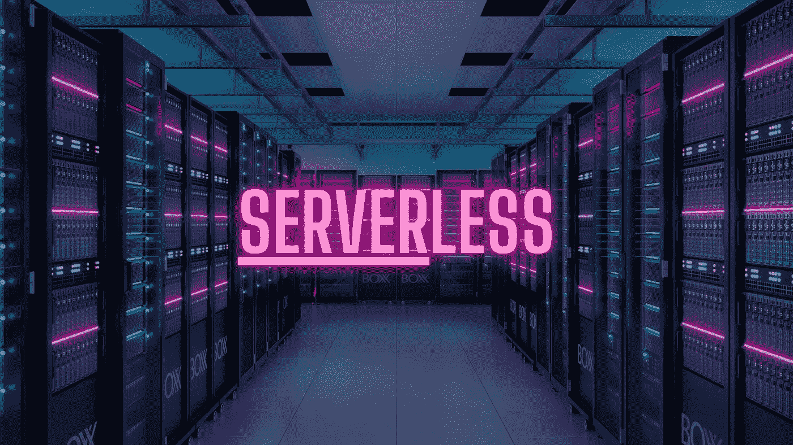
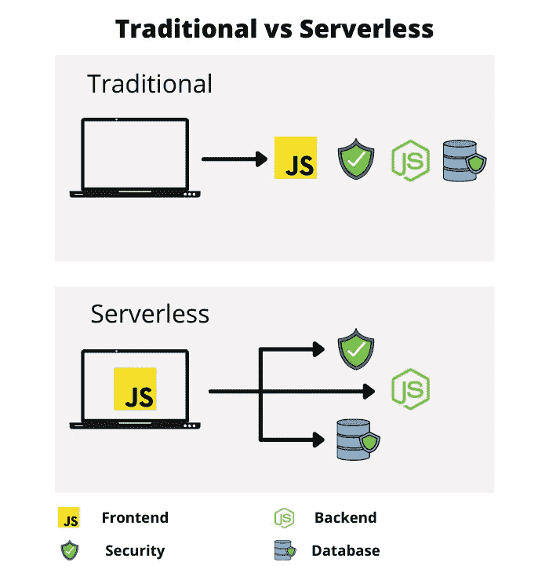
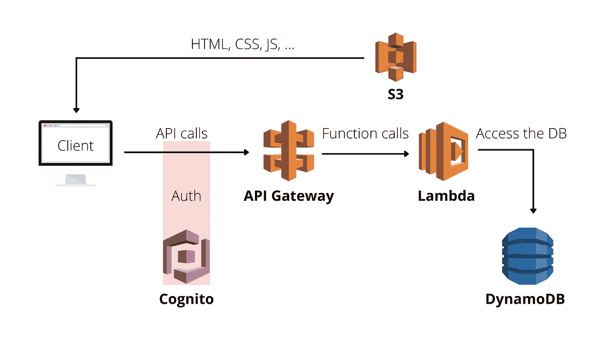
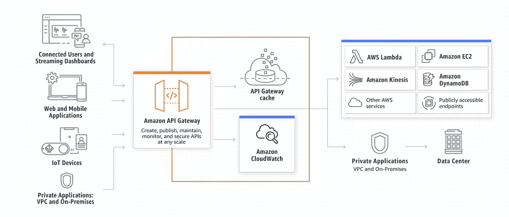
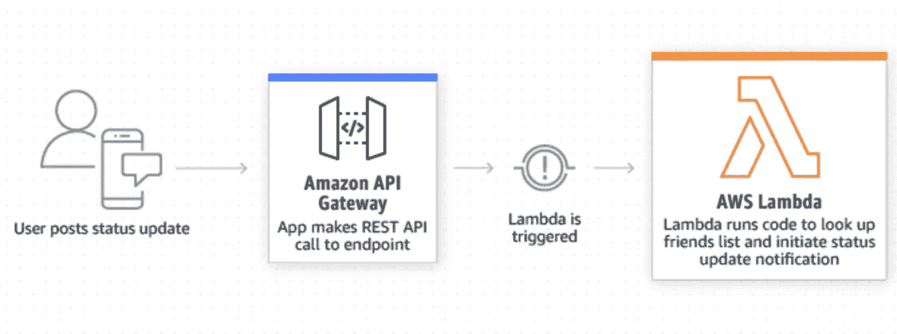
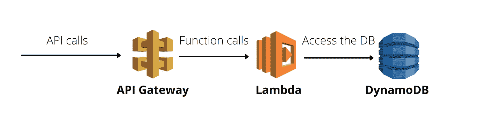
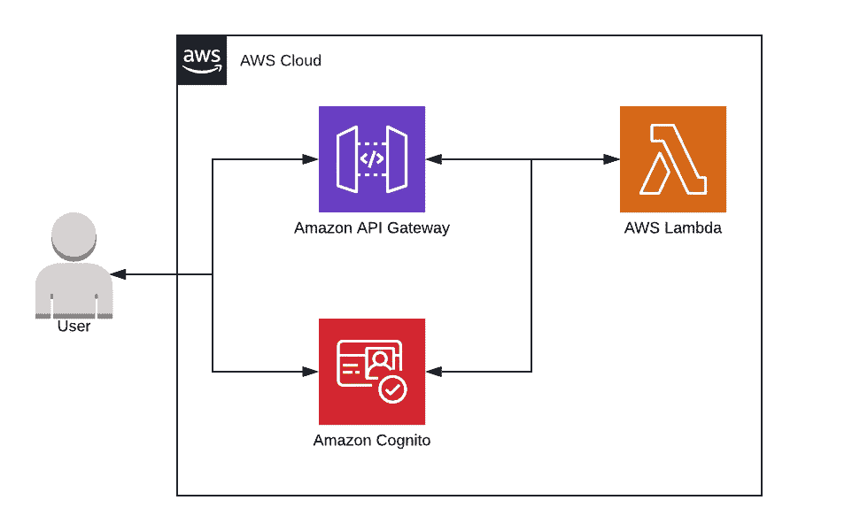
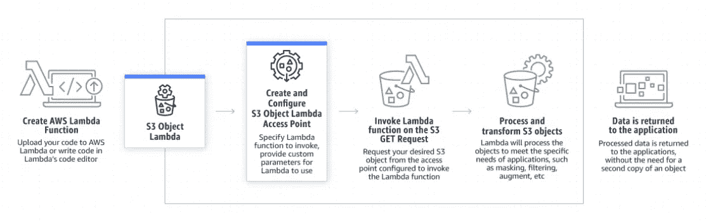
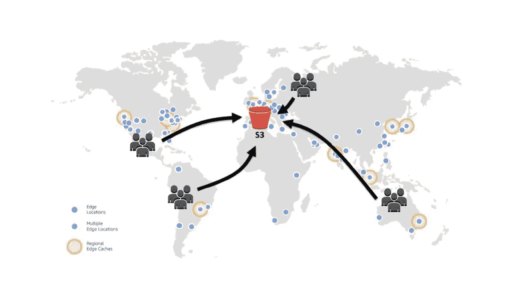
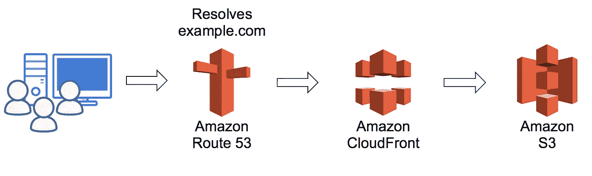

# 通过 7 个核心 AWS 服务实现无服务器化

> 原文：<https://levelup.gitconnected.com/going-serverless-with-7-core-aws-services-fcbd063985cd>

在本文中，您将学习如何使用 AWS 提供的不同服务来构建无服务器应用程序 ***，而不是关注服务的基础设施和供应*** ，而是关注您的代码、主要业务逻辑和核心产品的 ***。***

**但是等等，什么是无服务器？** Serverless 是一个 ***开发模型*** ，它允许我们构建和运行应用程序，而无需管理服务器。仍然有服务器参与其中，但是云提供商([***AWS***](https://aws.amazon.com/)***，***[***Azure***](https://azure.microsoft.com/en-us/)***，或者*** [***谷歌云***](https://cloud.google.com/gcp/?utm_source=google&utm_medium=cpc&utm_campaign=emea-emea-all-en-dr-bkws-all-all-trial-e-gcp-1010042&utm_content=text-ad-LE-any-DEV_c-CRE_502045654264-ADGP_Hybrid%20%7C%20BKWS%20-%20EXA%20%7C%20Txt%20~%20GCP%20~%20General%23v57-KWID_43700061596202457-aud-606988878614%3Akwd-6458750523-userloc_9070053&utm_term=KW_google%20cloud-NET_g-PLAC_&gclid=CjwKCAjww-CGBhALEiwAQzWxOnH1q6Z-x5l40SljDsiTYxQZPAxQz7Cn46I4HQRaxEq-ovfTFc89jBoCfbYQAvD_BwE&gclsrc=aw.ds) ***)***

**无服务器方法的最大优势**是您只需为您使用的计算能力、存储和其他资源 ***付费，无需任何前期承诺。*** 同样，您的应用可以根据需求*。您可以在需要时访问计算和存储资源。*

*尽管有超过 [**200 个 AWS 服务**](https://aws.amazon.com/products/?nc2=h_ql_prod) 可用，但是您只需要 **7 个核心服务**就可以开始构建您的第一个无服务器应用程序。以下是他们的名单:*

1.  ***API 网关** — API，REST API*
2.  ***λ**—逻辑，执行代码*
3.  ***DynamoDB** —数据，存储&检索数据*
4.  ***认知** —授权，认证用户*
5.  ***S3** — App，服务静态 App*
6.  ***CloudFront** (可选)—缓存，通过缓存提高性能*
7.  ***53 号公路** — DNS，翻译网址*

**

*使用无服务器方法，您实际上可以做的不仅仅是托管应用程序的后端。如果你有一个移动应用程序，你肯定不需要托管你的应用程序，因此，你可以跳过最后 3 个服务。然而，如果你正在构建一个 web 应用程序，你甚至可以将它托管在一个可以使用 S3、CloudFront 和 Route53 动态扩展的服务器上。*

## *1.API 网关*

*API Gateway 充当应用程序的**看门人，从后端服务访问功能或数据。把它想象成你 Node.js 应用中的一个 ***路由器*** 。使用 API Gateway，您可以创建 RESTful APIs 和实时 WebSocket APIs。***

*此外，它提供了许多现成的功能，如 ***API 版本管理、CORS 支持、授权、访问控制*** 等，这些都需要在非服务器 API 中手动配置。*

**

*这里有一个关于 API 网关如何工作的概述。它接收传入的请求，并将它们传递给另一个 AWS 服务，通常传递给某个 Lambda 函数，该函数向 API Gateway 返回一个响应，然后 API Gateway 向客户端返回一个响应。*

## *2.希腊字母的第 11 个*

*Lambda 函数是后端 API 的控制器 T21。**与数据库对话并返回响应的主要业务逻辑**就在这里。*

*它允许您上传代码或容器映像，自动分配计算执行能力，并基于传入的请求或事件运行您的代码。*

*AWS Lambda 官方支持这些编程语言— *C#、Go、Java、Node.js、PowerShell、Python、Ruby。**

**

*Lambda 函数从 API Gateway 获取请求，处理它们，并将响应返回给 API Gateway。但是您并不局限于此，您可以设置您的代码来自动触发其他 AWS 服务，或者直接从任何 web 或移动应用程序调用它。*

## *3.DynamoDB*

*DynamoDB 是一个 NoSQL 数据库服务。它是一个 ***键值*** 和 ***文档数据库*** ，内置*安全、备份和内存缓存*，适用于互联网规模的应用。它提供任何规模的低延迟数据访问。您可以为您的应用程序创建一个新表，并让 DynamoDB 处理剩下的部分。*

**

*通常，您将使用 ***Lambda 函数*** 从 DynamoDB 中 ***访问、存储和移除数据。当请求从 API Gateway 到达您的 Lambda 函数时，您可以在这里访问 DynamoDB 数据库，并在返回响应之前进行任何需要的更改。****

## *4.认知*

*AWS Cognito 处理**认证**。它可以让你添加用户 ***注册，登录，*** 和访问控制到你的网络和移动应用。Amazon Cognito 支持登录社交身份提供商，如*苹果、脸书、谷歌和亚马逊。**

*此外，Amazon Cognito 支持静态和传输中数据的 ***多因素认证和加密*** 。*

*它连接到您的前端服务，默认情况下，您有 ***2 个选项来使用 Cognito*** 进行身份验证*

*   ****用户池*** —完全没有认证的完整认证解决方案*
*   ****联合身份*** —允许您连接第三方提供商，如*苹果、脸书、谷歌和亚马逊**

**

*当用户注册/登录时，它创建一个用户并在客户端存储 3 个令牌*

*   *****身份令牌*** —用于在后端验证请求**
*   *****访问令牌*** —用于认证用户**
*   *****刷新令牌*** —用于创建新的身份和访问令牌**

## **5.S3**

**亚马逊 S3 可用于存储一系列用例的数据，如网站和移动应用程序。**

**你可以用亚马逊 S3**托管一个静态网站**。在静态网站上，单个网页包含静态内容。它们也可能包含客户端脚本。**

**相比之下，一个****网站*** 依赖于服务器端处理，包括服务器端脚本。亚马逊 S3 ***不支持*** 服务器端脚本。***

****

## **6.云锋**

**有一件事你可以在你的前端应用程序中优化。你可以使用 CloudFront 来优化你的页面分发方式。**

**让我们看一下地图。你在这里看到的所有圆点都是亚马逊拥有的****(边缘位置)*** 。它使用它们来 ***缓存文件*** (例如静态网站文件)。***

****

**例如，如果您的主要文件位于欧洲的 S3 桶中，但您的用户从美国访问网站。正如你所看到的，一些 cdn 比你的主 S3 桶还要近。而这正是 CloudFront 所做的，它 ***复制你的静态文件，并将它们存储在所有的 cdn 中。*** 因此，如果用户现在访问你的网站，他将自动被 ***重定向*** 到最近的 ***位置。*****

## **7.53 号公路**

**现在你已经上传了你的文件到 S3 桶，你需要一个**域名来访问网站**。原来，AWS 也有这样的服务——Route 53。**

**Route 53 是一个 AWS 域名服务，您可以使用该服务 ***购买和管理域名*** 。在这里，您只需配置，如果您的用户访问`example.com` ，Route 53 会将该域转换为 IP，并在后台使用该 IP 访问您的 S3 发行版。**

****

## ****总结****

**像 AWS 这样的云提供商提供构建模块、全套服务(高度耐用的存储、低成本计算、高性能数据库、管理工具等)，旨在共同构建可扩展的应用 ***。所有这些都不需要预先付费，您只需为您使用的东西付费。这些服务帮助组织以更低的成本更快地迁移。现在，您可以深入研究每项服务，并为自己实现它。*****

## ****资源****

**[https://docs.aws.amazon.com/](https://docs.aws.amazon.com/)，**

**[https://aws.amazon.com/products/developer-tools/?nc2=h_ql_prod_dt_dt](https://aws.amazon.com/products/developer-tools/?nc2=h_ql_prod_dt_dt) ，**

**[https://docs.aws.amazon.com/cloudfront/index.html?nc2=h_ql_doc_cf](https://docs.aws.amazon.com/cloudfront/index.html?nc2=h_ql_doc_cf) ，**

**[https://docs.aws.amazon.com/s3/index.html?nc2=h_ql_doc_s3](https://docs.aws.amazon.com/s3/index.html?nc2=h_ql_doc_s3)，**

**[https://aws.amazon.com/s3/](https://aws.amazon.com/s3/)，**

**[https://aws.amazon.com/cloudfront/](https://aws.amazon.com/cloudfront/)，**

**[https://aws.amazon.com/route53/](https://aws.amazon.com/route53/)，**

**[https://aws.amazon.com/api-gateway/](https://aws.amazon.com/api-gateway/)，**

**https://aws.amazon.com/lambda/[，](https://aws.amazon.com/dynamodb/)**

**【https://aws.amazon.com/dynamodb/】T4，**

**[https://aws.amazon.com/cognito](https://aws.amazon.com/cognito/)**