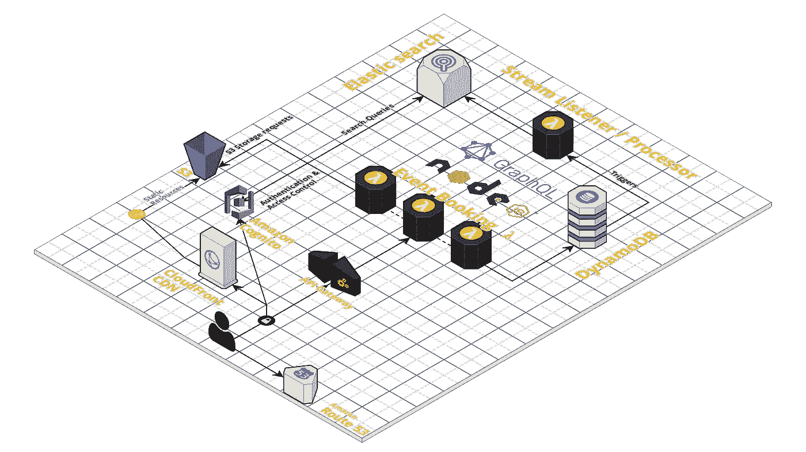

# 使用 NodeJS & GraphQL 实现无服务器(第一部分)——设置无服务器

> 原文：<https://levelup.gitconnected.com/going-serverless-with-nodejs-graphql-5b34f5d280f4>

在过去的几个月里，我对 AWS 上的[无服务器](https://serverless.com/)很感兴趣，它使用云形成模板来提供资源。我决定分享我所学到的和创造的东西，我认为这将有助于其他任何想要在 AWS 上一头扎进[无服务器](https://serverless.com/)/云形成的人:)

第一篇文章(第 1 部分)将展示如何初始化[无服务器](https://serverless.com/)，下一篇文章([第 2 部分](/going-serverless-with-nodejs-graphql-part-ii-1810445028a4))将展示如何在其上实现 GraphQL。

下面你会发现我的初步计划/架构。这对于一般的应用程序很有用，对于我的用例，我将构建一个预订应用程序。

最初，在几个小时的阅读和研究后，我开始在[无服务器](https://serverless.com/)网站上浏览他们的基础知识。我可以把类似上面架构的模板文件放在一起。下面是我的第一个模板文件的要点。

不要担心外部链接的文件(暂时在参考资料中)。这个模板的想法是在 [AWS](https://aws.amazon.com/) 上创建资源，比如可以在[dynamo db](https://aws.amazon.com/dynamodb/)(AWS 提供的 DaaS)上执行动作的 Lambda 函数。

Lambda 函数需要被赋予明确的权限，在这个例子中，我们通过指定它可以对 DynamoDB 执行的可能操作，为它们提供了与 dynamo db 交互的能力。它可以在其上执行这些交互的资源也必须显式声明——在本例中，是一个引用为`EventsGqlDynamoDbTable`的 DynamoDB 表。下面的快照显示了我提到的所有权限。

最后，我们提供了一个函数，该函数基于到 AWS API 网关上特定路径的 HTTP POST 而被触发。在这种情况下，路线是`/events`。这个端点将是我们稍后在教程中连接 GraphQL API 的地方。

然后，我们提供一组我们将实际使用的资源的参考:

其中，引用 DynamoDB 的 YML 为:

一旦这些都设置好了，你就可以开始开发了。您可以从无服务器“入门”部分的基础知识[开始。首先，我们将添加一个名为`handler.js`的文件，它导出一个函数`eventQuery`,因为这是模板在其配置中指定的预期用途。](https://serverless.com/framework/docs/getting-started/)

我用这里描述的东西做了一个样板，做了一些增强和改进。我希望这能帮助你轻松入门。你可以通过这个样板文件上的`readme.md`立即开始。它为您提供了无服务器 yml 模板、GraphQL API、Typescript / webpack 配置、Jest 单元测试功能、无服务器离线、VS-Code 上的调试功能& CI/CD 管道上的调试功能 [git-lab 上的](https://about.gitlab.com/)您可以立即找到以下链接:

 [## 🌩️无服务器节点 js/GraphQL 样板文件

### 🌩AWS 上使用无服务器 yml 模板的 typescript/nodejs 的️样板文件，使用 graphQL 作为由 dynamond &…

dasithkuruppu.github.io](https://dasithkuruppu.github.io/Serverless-GraphQL/)  [## DasithKuruppu/server lesssgraphql

### AWS 上的无服务器/lambda 样板文件，使用 graphQL 作为 API 的云格式…

github.com](https://github.com/DasithKuruppu/serverlessGraphQL) 

> 在下一篇文章中，也就是第二部分，我将会添加一些内容来展示我是如何集成 GraphQL 的。

点击查看[第二部分的 GraphQL 实现。](/going-serverless-with-nodejs-graphql-part-ii-1810445028a4)

 [## 使用 NodeJS & GraphQL 实现无服务器—第二部分

### 在你阅读这篇文章之前，请注意这里有关于云形成模板的第一篇文章。你可以读给…

levelup.gitconnected.com](/going-serverless-with-nodejs-graphql-part-ii-1810445028a4)  [## 了解无服务器计算-最佳无服务器计算教程(2019) | gitconnected

### 7 大无服务器计算教程。课程由开发者提交并投票，使您能够找到最好的…

gitconnected.com](https://gitconnected.com/learn/serverless-computing)