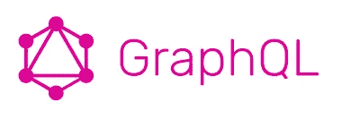
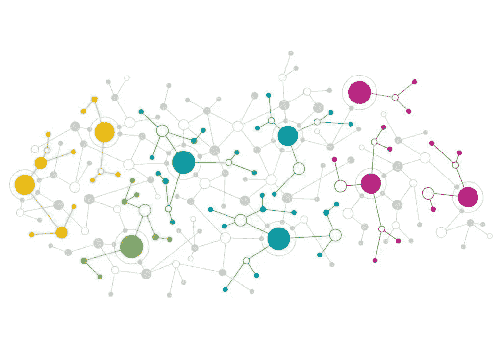
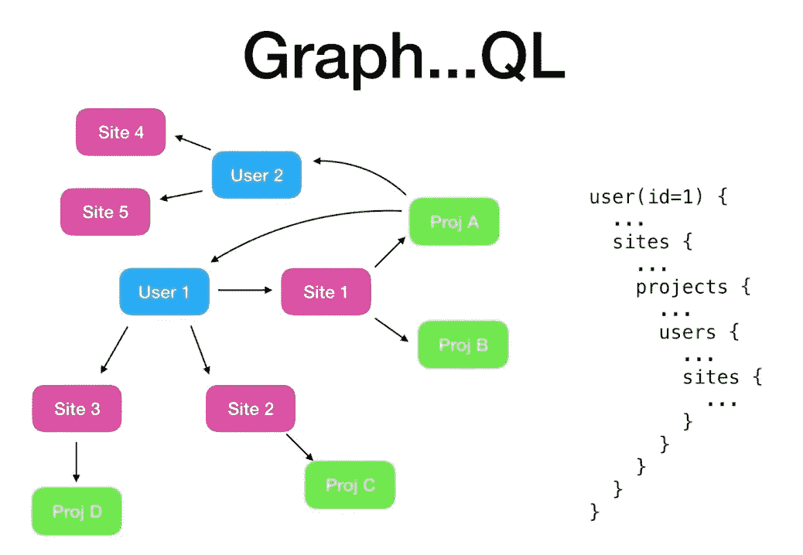
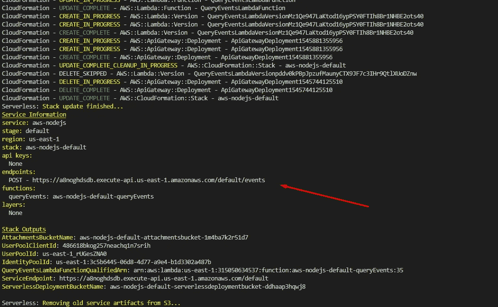
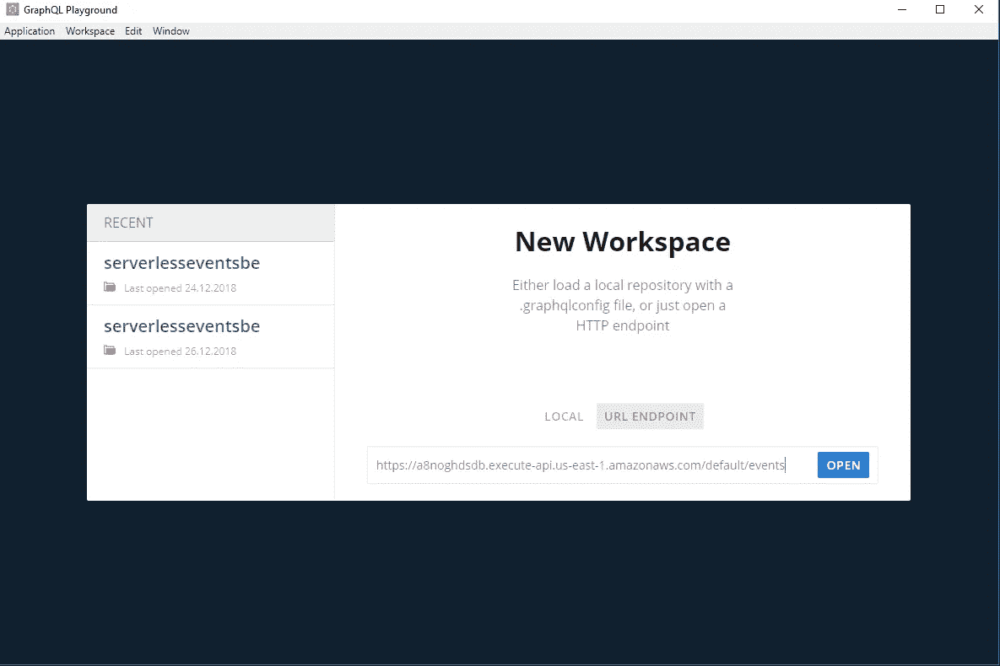
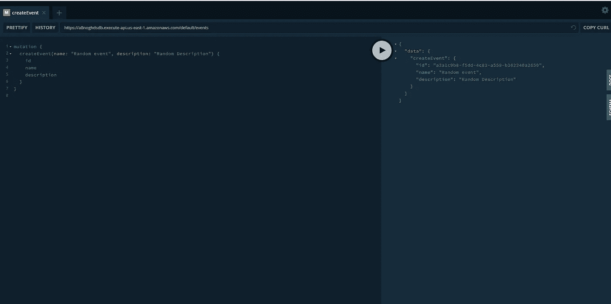

# 使用 NodeJS & GraphQL 实现无服务器(第二部分)——在 AWS Lambda 上实现 GraphQL

> 原文：<https://levelup.gitconnected.com/going-serverless-with-nodejs-graphql-part-ii-1810445028a4>

在你阅读这篇文章之前，请注意这里有第一篇关于云形成模板的文章。

从上一篇[文章](/going-serverless-with-nodejs-graphql-5b34f5d280f4)停止的地方继续。我们将考虑将 GraphQL 集成到我们在云形成模板上创建的 Lambda 函数中。但是首先，让我们了解一下 GraphQL。

> *GraphQL* 是一种查询语言*和*运行时，我们可以使用它来构建和公开 API 作为强类型模式，而不是数百个 REST 端点。您的客户会看到该模式。他们为他们想要的东西写一个查询。他们把它发送过去，并得到他们所要求的数据，仅此而已。{来源: [*简明英语 GraphQL 指南*](https://medium.freecodecamp.org/a-beginners-guide-to-graphql-60e43b0a41f5) *作者:* [*路易斯·阿吉拉尔*](https://medium.freecodecamp.org/@ldiego08?source=post_header_lockup) *}*

来自鸟瞰图的 graph QL:[来源](https://www.youtube.com/watch?v=Tpf9kVE2AY8)

如上图所示，GraphQL 表示从单个端点分支的数据集，带有指向更多相关数据的指针/引用的映射。客户可以根据自己的需要灵活地查询数据。

回到我们的 Lambda 函数——从创建一个`handler.js`开始，或者在我的例子中，我将创建`handler.ts`(类型脚本文件),它将在 [Webpack](https://webpack.js.org/) 和 [Babel 7](https://babeljs.io/docs/en/index.html) 的帮助下编译成`handler.js`。(你可以在这里找到 Webpack 配置和使用的插件[)。`handler.ts`将包含以下功能:](https://gitlab.com/DasithKuruppu/serverlessgraphql/blob/master/webpack.config.js)

这里我们导出一个异步函数`queryEvents`，它可以访问 API 网关提供的标准参数，即`event, context, and callback`，在我们的例子中，我们只需要`event`和`context`。我们将不需要`callback`功能，因为我们将使用`async/await`。

我们总是期待对这个端点/路径的 GraphQL 查询，所以我们将解析`event.body`来将 JSON 转换成 JavaScript 对象。

我们将使用可以通过`npm install graphql`安装的`graphql`包。我们将`graphql`导入到我们的 Lambda 函数中，并用解析后的查询调用它。

GraphQL 需要一个架构。我将使用这样一个简单的模式开始:

上面的模式指定了一些查询和变化。GraphQL 中的查询用于读取数据，而变异用于改变数据，即通常在持久层上。我们还提供了数据将包含的字段以及它将解析的内容。在我们的例子中，resolve 调用一个函数，该函数反过来对数据库(DynamoDb)进行异步调用，以读取或改变数据。例如`viewEvent(args.id)`调用下面的函数

一旦所有这些都设置好了(您可以在这里找到其余的解析器/事件)，您就可以开始在模板中创建资源，并通过运行以下命令将代码部署到 Lamda 函数:

`serverless deploy -v — stage=default`

> 请注意，要实现这一点，您需要遵循步骤[第一部分](/going-serverless-with-nodejs-graphql-5b34f5d280f4)或克隆并遵循[无服务器样板](https://gitlab.com/DasithKuruppu/serverlessgraphql)上的自述文件

这会部署所需的相关资源，并最终给你一个访问 lambda 函数的 URL(见下文)。

现在您可以安装 [GraphQL Playground](https://github.com/prisma/graphql-playground/releases) 并使用它来运行针对该 URL 的查询。

选择`url endpoint`然后从终端粘贴复制的 URL。打开 URL 以查询端点。让我们尝试运行一个 mutate 查询来创建一个事件:

这应该会产生如下所示的输出…

这应该足够让您开始使用 GraphQL 了。下面的存储库/样板将帮助你马上开始。它直接为您提供无服务器 yml 模板、GraphQL API、Typescript / webpack 配置、Jest 单元测试功能、无服务器离线、VS-Code & CI/CD 管道上的调试功能 [git-lab](https://about.gitlab.com/) ！

 [## dasith Kuruppu/server lesssgraphql

### 带有 GraphQL API、JEST for testing、Typescript/Ts-lint & Git-lab CI/CD 的无服务器样板文件。

gitlab.com](https://gitlab.com/DasithKuruppu/serverlessgraphql)  [## DasithKuruppu/server lesssgraphql

### AWS 上的无服务器/lambda 样板文件，使用 graphQL 作为 API 的云格式…

github.com](https://github.com/DasithKuruppu/serverlessGraphQL)  [## 了解 GraphQL —最佳 GraphQL 教程(2019) | gitconnected

### 9 大 GraphQL 教程。课程由开发者提交并投票，让你找到最好的图表

gitconnected.com](https://gitconnected.com/learn/graphql)