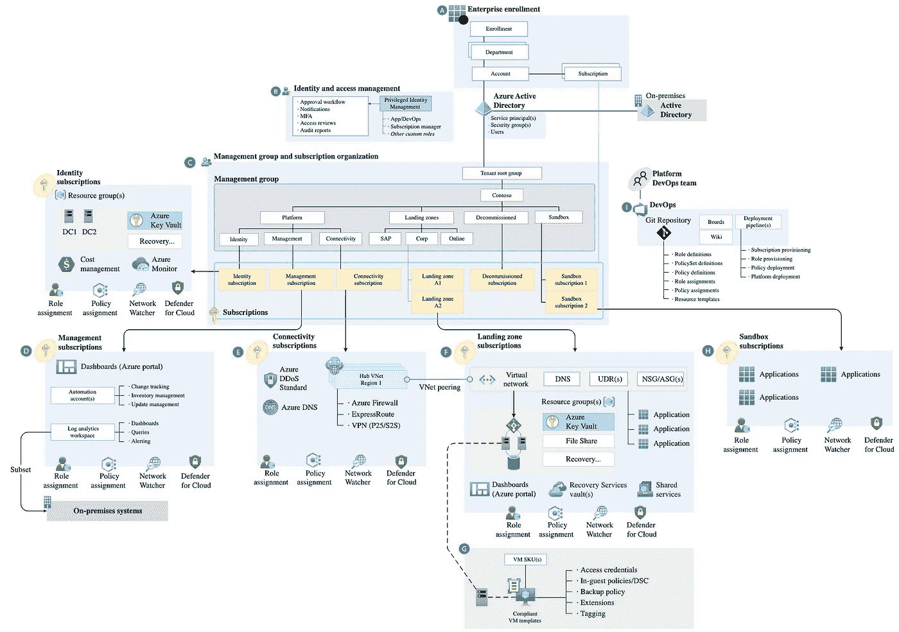

# 上云？从着陆区开始！

> 原文：<https://levelup.gitconnected.com/going-to-the-cloud-start-with-landing-zone-9d88bcac8f1b>

人工智能生成的图像提示:飞机降落在机场像素艺术

许多公司正在考虑将公共云作为许多问题的解决方案。可伸缩性、安全性、全局复制、提高开发过程速度或降低成本是选择云的最受欢迎的原因。一年或两年后，失望来了。公有云更贵，应用性能更弱，安全性不存在。有很多未知的资源，没有人知道它们的真实用途。完全是一片混乱。组织中的许多聪明人开始想知道:哪里出了问题？🤔

答案很简单—他们没有从着陆区和云治理标准开始！好的，但是什么是着陆区？为什么这么重要？让我们试着了解一下！

# 着陆区

在航空领域，着陆区是飞机可以着陆和起飞的预定区域。着陆区必须足够大，以容纳飞机，并有一个清晰的进近和离场路径。

同样的概念也适用于公共云中——在这里，着陆区是一个您可以在完全受控的流程中将应用程序部署到专用空间的地方。这两个领域有许多相似之处。在航空领域，你需要知道哪架飞机将要着陆，与飞行员交谈，区分空中交通，并有必须遵守的安全标准。云计算也是一样。您需要能够基于标记来识别您的资源，为它们分离网络流量，持续监控您的应用程序，在出现问题时采取一些自动操作，并实施安全策略。

在云计算中，着陆区是一个复杂的环境，需要解决几个方面的问题:

*   资源治理
*   建立工作关系网
*   身份
*   安全性
*   监视
*   基础设施
*   成本管理
*   自动化和 CI/CD 流程
*   数据管理和架构(我们可以创建称为数据登录区和数据管理区的子区)。

这些方面中的每一个都有一些不同的元素。例如，在资源治理中，我们需要:

*   计划资源层次结构，
*   命名约定
*   标准化标记
*   构建策略(强制或阻止某些行为)

在网络中，我们必须弄清楚如何:

*   创建混合连接，
*   分配 IP 地址，
*   管理 DNS，
*   创建 PaaS 解决方案网络
*   创建网络架构
*   规划安全的互联网通信

在身份方面，我们必须:

*   计划账户管理
*   创建或使用特定角色
*   如果我们有本地身份提供者，则管理混合身份
*   创建特权身份管理机制(或使用基于云的现有机制)
*   管理我们的资源和应用的服务帐户

在基础设施方面，我们必须:

*   指定我们组织允许的资源
*   为资源选择地理本地化
*   规划灾难恢复机制
*   为资源设计高可用性配置
*   建立扩展机制

为了创建一个完全可操作的云环境，我们需要解决更多不同的方面。我们在开始云计算之旅时需要考虑这些主题中的大部分，尤其是当谈到已经拥有一些本地系统的大型组织时。

MS Azure 的着陆区示例。来源:[https://learn . Microsoft . com/pl-pl/azure/cloud-adoption-framework/ready/landing-zone/](https://learn.microsoft.com/pl-pl/azure/cloud-adoption-framework/ready/landing-zone/)

# 我们一开始需要吗？

让我们想象一下，在我们的组织中，有人有了开始使用云的想法。这个人在网上搜索关于云计算的信息，学习在线课程，可能还会去聚会寻求技术灵感和知识。然后有一个决定—让我们尝试在公共云中做一些事情。此时，您不需要着陆区。您需要试验云，并检查它是否符合您的要求。您可以使用云 web 控制台，尝试创建一些资源，也许还可以做一个简单的 PoC。您需要熟悉公共云的概念以及这种模式的所有优势和风险。

那么什么时候开始考虑着陆区呢？当您想要将您的第一个生产系统放在云中时。此时，您需要构建一个健壮的云环境，而着陆区是实现这一点的绝佳方式。

# 如何建立着陆区？

建造一个合适的着陆区可能是一个挑战。每个云提供商都有描述设计流程的材料和许多在 Terraform 中实现 LZ 的开源代码。

*   Azure LZ 女士:[https://learn . Microsoft . com/en-us/Azure/cloud-adoption-framework/ready/landing-zone/design-principles](https://learn.microsoft.com/en-us/azure/cloud-adoption-framework/ready/landing-zone/design-principles)
*   https://cloud.google.com/architecture/landing-zones GCP LZ:
*   AWS LZ:[https://docs . AWS . Amazon . com/prescriptive-guidance/latest/migration-AWS-environment/understanding-landing-zones . html](https://docs.aws.amazon.com/prescriptive-guidance/latest/migration-aws-environment/understanding-landing-zones.html)

问题是它们很笼统。

让我们回到航空领域。每个机场都是不同的，正因为如此，每个机场的着陆区都是不同的，并且完全是为这个特定的机场定制的。云计算也是同样的情况。每个组织都有不同的文化、技术堆栈和人员，那么为什么他们应该有相同的着陆区呢？为了充分利用云计算，您必须为您的组织定制一个登陆区。为此，最好使用外部顾问——他在这方面已经有经验。他们将帮助您，并在云采用过程中成为您的向导。这个人专门从事这项工作，并与许多不同的公司合作。顾问已经看到了其他公司的工作方法，并且能够指出在这个过程中你需要注意的最重要的事情。

# 创建着陆区的过程应该是怎样的？

我知道每个顾问可能有不同的方法，但在这里我想和你分享一个，根据我的经验，是最有效的。它包括三个阶段:知识共享、收集见解、创建 LZ 架构，以及最后一个阶段—实现。

# 在您的组织中建立关于云计算的基础知识。

它始终是我们云之旅的第一步。要创建一个全面运行的着陆区，您需要了解公共云概念的忠诚人员。他们需要知道存在哪些云服务，以及如何使用它们。这里有必要建立 T 型技能模型。

“T”中的竖线代表一个人在特定领域的知识深度和专长。这可能是一个特定的主题领域，如网络、数据工程、软件开发等。“T”中的横条代表关于云计算模型的一般知识。了解 PaaS、SaaS 和 IaaS 服务如何在云中工作，以及何时应该使用它们。熟悉云成本模型、监控和可观察性以及访问控制。

很多一开始的公司都试图跳过这一步，但是你做了，以后就有后果了。云是复杂的，开始时的错误可能会在未来付出高昂的代价。你需要有一个具备良好云技能的团队。

# 从研讨会开始，您将能够收集所有要求并创建着陆区的架构。

在这个阶段，当我们的员工理解了云的具体概念，我们就可以开始收集见解和需求。我总是以工作坊的形式来做这件事。

对于每个主题，我们都会安排 2-4 小时的研讨会。

车间列表:

*   资源治理
*   建立工作关系网
*   身份
*   安全性
*   监视
*   基础设施
*   成本管理
*   自动化和 CI/CD 流程
*   数据管理和架构(我们可以创建称为数据登录区和数据管理区的子区)。

在这一点上，我们为每个方面创建高级架构，并致力于标准化。

每个研讨会都需要您组织中的特定专家来分享他们对特定主题的见解。

# 基于研讨会结果创建包含云治理标准的文档。

研讨会结束后，您需要记录着陆区架构和云治理标准。你必须在这个阶段为我们的着陆区从高层到低层架构。在这个阶段，您还需要为您的云环境创建标准化和治理策略。

# 在 IaC 进近中实施你的着陆区。

最后一个阶段是最简单的—您需要实现 IaC 方法中的所有东西。要做到这一点，您需要使用着陆区低级架构和云治理标准作为输入。基于您正在使用的云，您可以选择一种 IaC 技术。

基础设施即代码(IaC)是一种实践，涉及使用代码和配置文件管理基础设施，而不是通过基于 web 的界面或使用手动流程手动配置资源。此流程使您的组织能够自动化基础架构资源调配、配置和管理，从而更容易部署和管理复杂的环境。

在实现阶段之前，您应该决定使用哪种工具。我将列出其中几个，在我看来，是值得考虑的:

*   Terraform 是一种工具，它使用户能够使用一种称为 HashiCorp 配置语言(HCL)的声明性配置语言，将基础设施定义为代码并进行管理。它支持许多基础设施提供商，可以跨公共云(AWS、GCP、MS Azure)、内部和混合环境管理基础设施。目前，它是 IaC 最流行的工具，因此有许多关于它的出版物、视频和在线课程。你也可以很容易地找到精通 it 的云工程师。
*   **Pulumi** :是一个云原生基础设施即代码(IaC)平台，支持用户使用熟悉的编程语言定义、部署和管理基础设施，比如 JavaScript、TypeScript、Python 和 Go。它允许用户跨许多云和内部平台创建和管理资源，包括亚马逊网络服务(AWS)、微软 Azure、谷歌云平台(GCP)和 Kubernetes。使用 Pulumi，用户可以使用高级的声明性语法将基础设施定义为代码，然后将代码翻译成目标平台的适当 API 调用。这使用户能够以版本控制、可重用和可维护的方式定义和管理他们的基础设施，从而更容易部署和管理复杂的环境。
*   **Kubernetes 操作符:** Kubernetes 操作符是定制控制器，它扩展了 Kubernetes API 来创建、配置和管理 Kubernetes 集群中复杂的有状态应用程序的实例。操作员使用 Kubernetes API 来监视和响应集群中的事件，例如新资源的创建或应用程序的扩展，并可用于自动管理复杂的工作负载。虽然 Kubernetes 运营商最初是为了管理单个 Kubernetes 集群中的应用程序和资源而设计的，但也可以使用运营商来控制公共云环境中的资源，如亚马逊网络服务(AWS)、微软 Azure 和谷歌云平台(GCP)。要使用 Kubernetes 操作员来控制公共云资源，您需要在您的 Kubernetes 集群中安装和配置操作员。这通常包括为操作员创建自定义资源定义(CRD ),并将操作员代码和任何必要的依赖项部署到集群。一旦安装和配置了操作员，您就可以使用它来创建、配置和管理公共云资源，方法是创建和修改操作员自定义资源的实例。例如，您可以创建一个自定义资源来定义一个 Amazon EC2 实例，并使用操作符在集群中创建和管理该实例。当您的大部分工作负载将处于云原生模式时，K8 运营商的 IaC 方法可能是您的最佳解决方案。
*   **Azure Bicep** 是一种特定领域语言(DSL)，用于以声明的方式将 Azure 基础设施定义为代码(IaC)。它允许您以简单直观的方式编写可重用、可维护和可测试的基础设施部署模板。Bicep 被设计成易于学习和使用，特别是对于那些熟悉 Azure 和熟悉 JSON 或 YAML 语法的人。它为定义 Azure 资源提供了更简洁和用户友好的语法，以及一组用于扩展和定制基础设施部署模板的内置函数和指令。
*   使用 Bicep，您可以定义部署 Azure 解决方案所需的所有资源及其依赖关系，然后使用 Azure 资源管理器(ARM)模板部署解决方案。Bicep 将您的 Bicep 文件编译成 ARM 模板，然后使用 Azure CLI 或 Azure PowerShell 将其部署到 Azure。
*   **AWS Cloud Formation** 是一项帮助您自动创建和管理 AWS 资源的服务。它使您能够使用模板以可预测和可重复的方式定义和部署您的基础架构。CloudFormation 模板是用 JSON 或 YAML 编写的，使用声明性语法来指定想要创建的 AWS 资源及其属性。这些模板可用于创建、更新和删除 AWS 资源栈，例如 Amazon EC2 实例、Amazon RDS 数据库和 Amazon S3 存储桶。CloudFormation 提供了一组可以在模板中使用的内置资源类型，以及使用 AWS Lambda 函数创建自定义资源类型的能力。您还可以使用 CloudFormation 来自动化其他 AWS 服务的供应和管理，例如 Amazon ECS、Amazon EKS 和 Amazon DynamoDB。

选择特定工具后，您可以开始基于底层架构和云治理标准实现您的着陆区。

如果您决定使用 K8s 操作符，您必须在 Terraform 中创建一个种子代码，以便为网络架构和混合连接创建您的第一个管理集群和基本基础设施。

# 你应该投资着陆区！

登陆区是云采用之旅的重要组成部分。是的，它可能很复杂，尤其是在开始的时候，但是你必须建立它。如果这个过程对您的组织来说太复杂，您可以随时使用外部顾问作为您的指导。一个好的登录区将帮助您更好地控制云资源，拥有更高的安全性，并降低您的云基础架构成本。这是你应该接受的投资。

如果你喜欢这篇文章，请在媒体上关注我:[达米安·马祖雷克](https://medium.com/u/39f5a4a67cda?source=post_page-----9d88bcac8f1b--------------------------------)

附:你可能也喜欢这些文章:

 [## 人工智能之路——从象棋到软件开发！

### 我最近读了一本由加里·卡斯帕罗夫创作的关于人工智能的有趣的书。在他的书《深度思考:机器在哪里…

medium.com](https://medium.com/@damian.s.mazurek/ai-path-from-chess-to-software-development-b99425ec12d1)  [## 关于数据采用流程，我们可以从渔业公司学到的五件事！

### 在过去的四周里，我一直在拜访我的一些客户。其中一家是渔业公司，它转变了…

medium.com](https://medium.com/@damian.s.mazurek/cto-diary-the-five-things-we-can-learn-about-the-data-adoption-process-from-the-fishing-company-dac610344704)