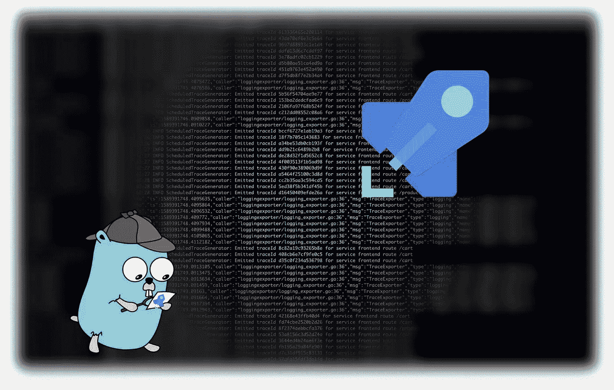
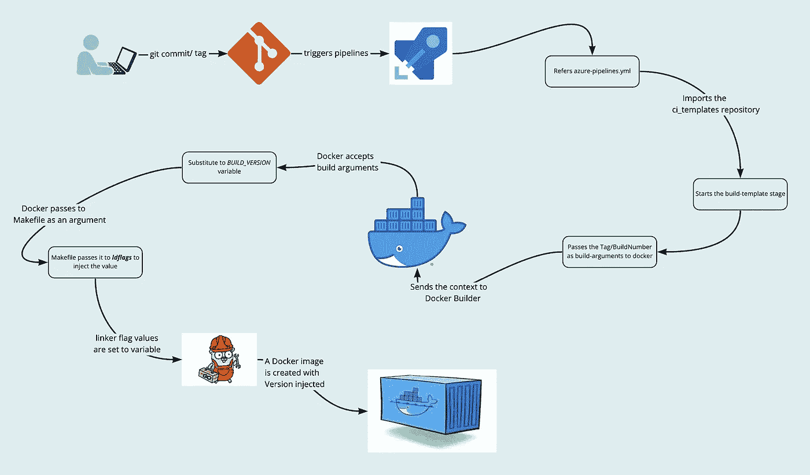

# 通过 Azure DevOps 管道的 GoLang 应用构建版本

> 原文：<https://levelup.gitconnected.com/golang-app-build-version-via-azure-devops-pipelines-fd4d800bf465>

## 通过 Azure 管道在 GoLang 容器日志中注入构建版本



具有内部版本的 GoLang 容器日志

在我上一篇关于容器中的 GoLang 应用构建版本的文章中，我们已经讨论了构建版本在日志中的重要性。我们还讨论了在构建期间使用 GitHub 动作和 GitLab CI 注入版本。

在本文中，我们将看到在 Azure DevOps 中构建 GoLang 容器时如何实现同样的目标。先决条件是

*   有效的 Azure DevOps 订阅
*   活跃的 Azure DevOps 组织
*   具有 docker 功能的 Azure DevOps 代理
*   docker 注册表的活动服务连接

项目结构如下所示。

```
golang-server
|_main.go
|_go.mod
|_go.sum
|_Dockerfile
|_Makefile
```

`main.go`文件内容类似于前一篇文章中的内容。

```
package main

import "github.com/sirupsen/logrus"

var BuildVersion = "development"

func main() {

   logrus.Infof("The version of the app built with 'go build' : %s\n", BuildVersion)

}
```

像往常一样，为了保持轻量级图像，让我们使用多阶段 docker 构建。至此，Dockerfile 文件的内容如下所示。

带有 BUILD_VERSION 参数的 Dockerfile

基于 alpine:3.12 构建的简单 GoLang 服务器。当您仔细查看 docker 文件时，您会发现`go build`并不是在 docker 文件中本地发生的。这里使用`Makefile`来做`go build.`，这仅仅是因为它提供的动态性。

`Makefile`的内容如下。

带有 BUILD_VERSION_ARG 参数的 Makefile

有了上面的`Dockerfile`和`Makefile`，人们可以很容易地从本地创建 Mac 兼容的二进制文件和 linux/amd64 兼容的二进制文件。还可以通过设置本地环境变量来注入构建版本。

但是在 Azure 管道中运行并为构建版本传递 ***git 标签*** 是我们想要的技巧。在 Azure 管道中这样做；首先，创建一个`azure-pipelines.yml`文件。这是 azure 搜索管道定义的默认文件。你可以在这里阅读更多关于 Azure 管道的信息。

要在分支上放置标签时触发管道，需要进行配置。所有的配置都发生在`azure-pipelines.yml`文件中。`tag`的触发器如下。

```
trigger:
  batch: true
  branches:
    include:
      - "*"
  tags:
    include:
      - "*"
```

在这种情况下，我们已经指定在任何分支和任何标记丢弃中触发提交管道。“*”指定通配符 any。

需要为运行作业的代理指定一个配置。这允许您选择安装了`docker`的代理。

```
pool:
  name: default
  demands:
    - docker-builder
```

上面的代码片段定义了`default`池中任何具有`docker-builder`标签功能的代理。点击查看更多关于代理功能[的信息。](https://docs.microsoft.com/en-us/azure/devops/pipelines/agents/agents?view=azure-devops&tabs=browser#capabilities)

现在编写了定义作业的 ***阶段*** 的主要部分。这里，我们必须传递在 *Makefile 中定义的变量`BUILD_VERSION_ARG`的值。*这样构建版本将被注入到容器中。我们想满足几个要求。如果有标签丢失，需要进行设置，否则必须设置 *BuildNumber* 。因此，通过 Azure Pipelines 的内部版本号，我们可以追溯到代码提交。内部版本号在美学上看起来比提交-sha 更清晰。

Azure Pipelines 还允许开发人员创建一个集中的存储库来创建模板，然后在任何管道中直接引用这些模板。为此，在同一个 Azure Repos 中创建一个 git repo。在我们的场景中，我们已经创建了一个名为`ci_templates.`的回购，以在当前管道中引用它，下面的代码片段必须添加到`azure-pipelines.yml`文件中。

```
resources:
  repositories:
    - repository: templates
      name: MyOrgProject/ci_templates
      type: git
      ref: main
```

Azure Pipelines 提供了许多内置的环境变量。查看[这里的](https://docs.microsoft.com/en-us/azure/devops/pipelines/build/variables?view=azure-devops&tabs=yaml)以了解更多可用的预定义变量。在这些预定义变量和用户定义变量的帮助下，我们可以实现如下目标。

ci_templates repo 下的映像构建模板

在上面的构建模板定义中，我们使用 docker 命令的内置任务。请参考[这里的](https://docs.microsoft.com/en-us/azure/devops/pipelines/tasks/?view=azure-devops)获取可用的内置任务列表。

在撰写本文时，`Docker@2`是使用 docker 命令的最新内置任务。在这里，我们执行两个独立的任务:构建和推送映像。这是因为内置任务的命令`buildAndPush`忽略了 build 参数。容器注册由已经注册的`service connection`提供。`repository`是指 docker hub 中的 *uname* 的容器库。

关键概念是我们传递的`arguments`输入。使用预定义变量`Build.SourceBranch`我们可以得到分支名称。如果有一个标签被丢弃，上面变量的值将类似于`refs/tag/<tag-name>.`如果在任何分支上有任何提交，那么上面变量的值将是`refs/heads/<branch-name>.`有了上面的区别，我们几乎可以将`arguments`和`tags`的值指定为标签值或编译号。管道作业的构建号可以从预定义变量`Build.BuildNumber`中获得。

`tag`或`buildNumber`的控制流程如下图所示。



将构建版本注入 Azure DevOps 管道中的 GoLang 容器映像

如上图所示，`Build.BuildNumber`或`Build.SourceBranchName`将作为构建参数传递给 docker 构建命令。这将把另一个环境变量中该变量的值作为参数传递给 Makefile。Makefile 会将它传递给`golang linker flags`以将其注入到已经构建好的代码中。

为了推送上面构建的 docker 映像，我们使用来自同一个 *Docker@2* 任务的命令`push`，如下所示。

ci_templates repo 下的映像推送模板

部署后，容器将开始记录内部版本号

```
INFO[0000] The version of the app built with makefile : 0.1.0
```

如果你喜欢这篇文章，请通过鼓掌帮助其他人找到，并在这里和 [twitter](https://twitter.com/gkarthics) 上关注我以获取更多更新。

# 参考:

*   [GoLang 应用在容器中构建版本](https://medium.com/@github.gkarthiks/golang-app-build-version-in-containers-3d4833a55094)
*   [天蓝色管道](https://docs.microsoft.com/en-us/azure/devops/pipelines/get-started/what-is-azure-pipelines?view=azure-devops)
*   [Azure DevOps 代理功能](https://docs.microsoft.com/en-us/azure/devops/pipelines/agents/agents?view=azure-devops&tabs=browser#capabilities)
*   [Azure DevOps 代理内置变量](https://docs.microsoft.com/en-us/azure/devops/pipelines/build/variables?view=azure-devops&tabs=yaml)
*   [Azure 管道内置任务](https://docs.microsoft.com/en-us/azure/devops/pipelines/tasks/?view=azure-devops)