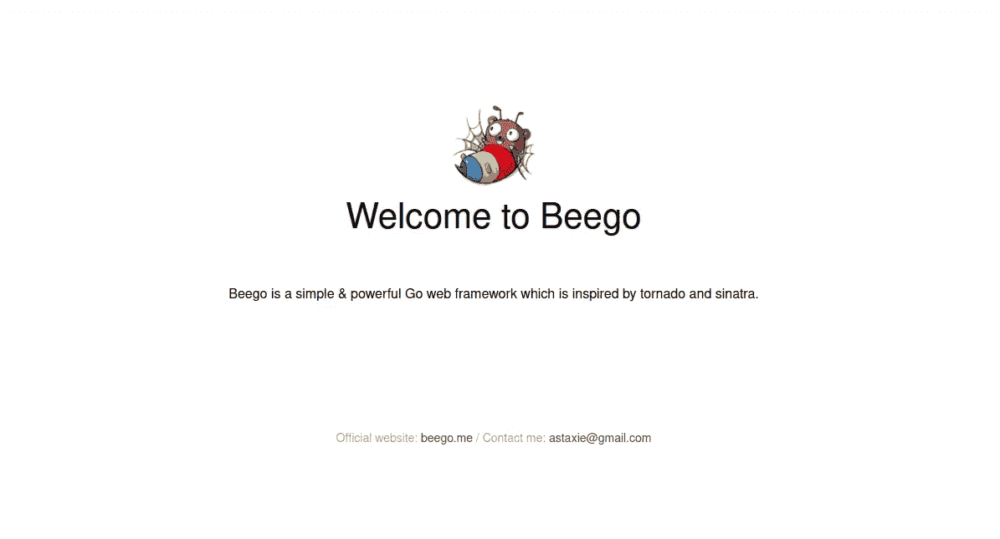
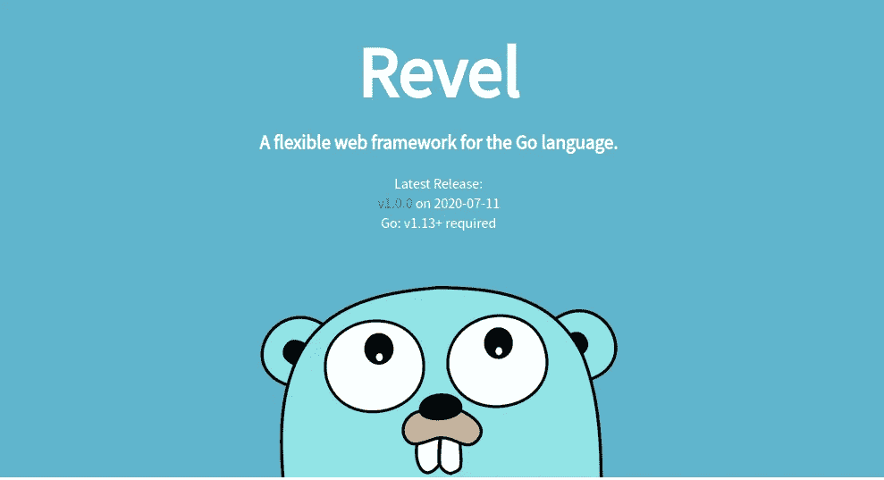

# 戈朗:比格 vs 狂欢。如何选择？

> 原文：<https://levelup.gitconnected.com/golang-beego-vs-revel-how-to-choose-63ee8f081bc3>

## Golang 两个最著名框架的比较。

Golang 自上线以来人气不断攀升。T2 的一项调查显示，76%的用户在工作中使用 Golang，66%的用户在工作之外使用 Golang。

如今，很多开发者都在考虑使用 Golang 进行 Web 开发。这种语言有几种可用的框架。选择你想用来启动新应用的框架可能是一场噩梦。

有两个非常流行的 MVC 框架 Beego 和 Revel。这些框架在很大程度上可以独立开发一个 web 应用程序。虽然在许多情况下，您可能希望使用许多外部库来满足您的需要或舒适。

> 声明:这种比较不是针对轻量级框架的。如果您优先考虑轻量级/小型应用程序，还有许多其他框架可以考虑。Gin Gonic、Martini、Web.go 是几个可以考虑的选择。

让我们看看这些框架以及它们提供了什么:

## [比戈](https://beego.me/)

Beego 类似于 Python 的 *Django* 框架。它为 web 应用程序提供了大量的功能。

除了 *MVC* 之外，该框架还集成了一个 *ORM* (对象关系图)、日志系统、HTML 模板引擎和许多其他库。

Beego 有一个命令行工具(`bee`)，这是 Django 所熟悉的。Bee 监视代码变化，并在检测到变化时运行任务。

**优点**

*   节省大量时间，尤其是在项目开始时
*   加快 web 应用程序开发
*   定义的应用程序结构
*   提供集成的 ORM、内置的缓存处理程序、记录器等。
*   不需要第三方库。虽然不太可能！

## [狂欢](https://revel.github.io/)

Revel 是第一个全功能的 Go web 框架之一。它是一个自给自足的框架，不需要任何第三方插件或中间件。

开发人员喜欢 Revel 的原因是，不管任务有多复杂，它都是 API 开发的一站式商店。

**优点**

*   没有第三方中间件、配置、插件和设置
*   成熟的框架
*   庞大而活跃的社区

## 比较

让我们比较一下这些框架:

*   **效率** —这两个框架具有相似的性能。这里没有明确的赢家。
*   **易学** —视情况而定。这要看开发者的背景。如果你用过 *Ruby on Rails* ，你会爱上 Revel 的。如果你是使用过 *Django* 的 Python 开发者，你会喜欢 Beego 的。如果你以前使用过任何 MVC 框架，由于这两个框架的基本原理是相似的，所以这些很容易学会。
*   **路由** —路由是 web 框架中最重要的部分之一。这两种框架都有许多配置路由的方法。但是我最喜欢 Revel 的语法，可能是因为我是 Rails 开发人员。没有明确的赢家，是你的选择。
*   **流行度** —这两个框架都非常流行。Beego 在 Github 上的星数几乎是 Revel 的两倍。
*   **社区支持** —他们拥有出色的社区支持。找到解决问题的方法很容易。

## 结论

Revel 和 Beego 是内置了各种特性的优秀框架。选择其中的一个完全取决于开发者。Rails 开发者和 Django 开发者会分别倾向于 Revel 和 Beego。

*喜欢自己体验媒介？考虑通过注册会员* *来支持我和其他作家* [***。会员每月只需 5 美元，它支持我们，作家，没有额外的费用。如果你这样做，我会收到一部分费用，不会多花你多少钱。谢谢大家！***](https://singhamrit.medium.com/membership)

# 分级编码

感谢您成为我们社区的一员！[订阅我们的 YouTube 频道](https://www.youtube.com/channel/UC3v9kBR_ab4UHXXdknz8Fbg?sub_confirmation=1)或者加入 [**Skilled.dev 编码面试课程**](https://skilled.dev/) 。