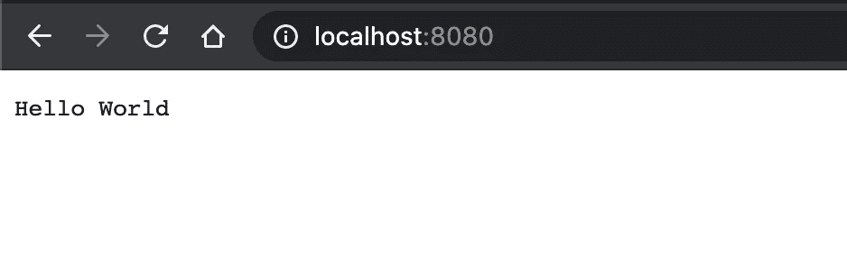

# GoLang:构建 Web 服务器

> 原文：<https://levelup.gitconnected.com/golang-building-a-web-server-2d34d4f90fa1>


图片来源:[谷歌](https://www.scylladb.com/wp-content/uploads/1200x628-fb-golang-scylla-gocqlx-package.png)

当你读到 web 服务器这个术语时，你的脑海中会浮现出什么？在我转到 GoLang 之前，我一直从事 Java 工作，首先想到的是 [Spring](https://spring.io/) 及其复杂的配置。所以，在这里我欢迎你来到 GoLang 的世界，这里的事情简单得不能再简单了。

*先决条件:GoLang 基础，HTTP 工作原理基础。*

[](https://medium.com/@AkyunaAkish/setting-up-a-golang-development-environment-mac-os-x-d58e5a7ea24f) [## 设置 Go 开发环境| Mac OS X

### 围棋越来越受欢迎，所以我认为向您展示如何在您的……

medium.com](https://medium.com/@AkyunaAkish/setting-up-a-golang-development-environment-mac-os-x-d58e5a7ea24f) 

编写“hello world”web 服务器的一种典型方式是启动 HTTP 服务器并运行某种路由，浏览器可以通过该路由与服务器进行交互。

在下面的代码片段中，我们使用 GoLang 的`net/http`包创建了一个服务器，同样不需要外部依赖。

```
Filename: server/server.goimport "net/http"

// Handler for http requests
type Handler struct {
   mux *http.ServeMux
}

// New http handler
func New(s *http.ServeMux) *Handler {
   h := Handler{s}
   h.registerRoutes()

   return &h
}

// RegisterRoutes for all http endpoints
func (h *Handler) registerRoutes() {
   h.mux.HandleFunc("/", h.HelloWorld)
}

func (h *Handler) HelloWorld(w http.ResponseWriter, r *http.Request) {
   w.WriteHeader(200)
   w.Write([]byte("Hello World"))
}---Filename: main.gopackage main

import (
   "net/http"

   "medium/web_server/server"
)

func main() {
   mux := http.NewServeMux()
   server.New(mux)

   http.ListenAndServe(":8080", mux)
}
```

一旦你有了上面的代码，到你的终端和`cd`到你存储上面两个文件的文件夹，然后简单地运行`go run main.go`

您的服务器已准备好满足您的请求。万岁！



请在 GitHub 这里找到上面[写的代码。](https://github.com/sumiet/medium_webserver_series/tree/master/1)

嗯！！还没有，因为我们上面写的简单的 web 服务器已经足够玩了，但是当涉及到写真实的 web 服务器时，你可能不想依赖这么多的手工布线。这就是我们将使用 [Fx](https://github.com/uber-go/fx) 的地方，这是一个由[优步](https://github.com/uber-go)构建的依赖注入框架。

[](https://medium.com/better-programming/what-is-dependency-injection-b2671b1ea90a) [## 什么是依赖注入？

### 这比你想象的要简单

medium.com](https://medium.com/better-programming/what-is-dependency-injection-b2671b1ea90a) 

这是我们将在[后续文章](https://medium.com/swlh/dependency-injection-in-go-using-fx-6a623c5c5e01)中探讨的内容。

敬请关注。

本系列迄今发表的文章的完整列表:

1.  [使用 Fx 在 Go 中进行依赖注入](https://medium.com/swlh/dependency-injection-in-go-using-fx-6a623c5c5e01?source=your_stories_page-------------------------------------)
2.  [编写 Fx 模块](/writing-fx-modules-517193b9c4f0?source=your_stories_page-------------------------------------)
3.  [在 Go 中编写 RPC 服务器](https://sumit-agarwal.medium.com/writing-an-rpc-server-in-go-eb9afd56d1e1?source=your_stories_page-------------------------------------)
4.  [在 GoLang 使用 gRPC 和 proto buf](https://medium.com/swlh/using-grpc-and-protobuf-in-golang-9c218d662db3)
5.  [在 Java 中使用 gRPC 和 proto buf](https://sumit-agarwal.medium.com/using-grpc-and-protobuf-in-java-f8730bb65aa7)

更多即将推出…