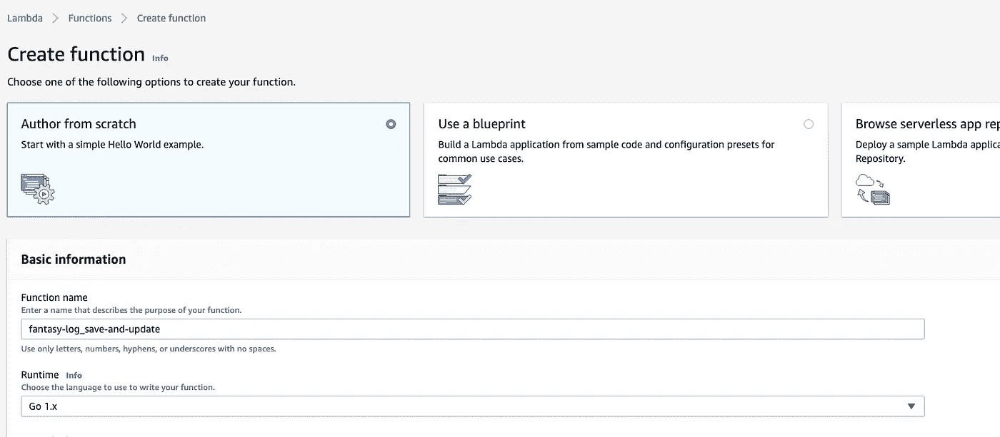
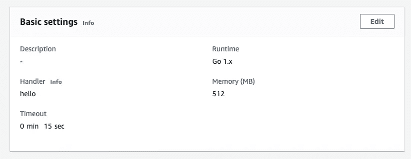
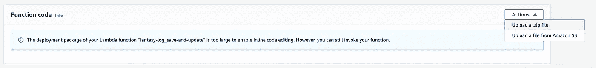

# Golang 奇幻狩猎应用，1:在 AWS 上将 Golang 应用部署到 Lambda

> 原文：<https://levelup.gitconnected.com/golang-fantasy-hunting-app-1-deploying-a-golang-app-to-lambda-on-aws-f9b950648bae>

## 猎杀怪物，学习围棋


照片由[安妮·尼加德](https://unsplash.com/@polarmermaid?utm_source=unsplash&utm_medium=referral&utm_content=creditCopyText)在 [Unsplash](https://unsplash.com/s/photos/monster?utm_source=unsplash&utm_medium=referral&utm_content=creditCopyText) 拍摄

有时候我有种奇怪的冲动，不想自责。当这种情况发生时，我停止摆弄 Java、Javascript 或 Python，转身就走。Go 是快速、轻量级和静态类型的。它的包装管理系统是一个梦想。你可以在大约三秒钟内开始使用 Go，这比计算出微软在创建 Typescript 时所想的时间要快 200 万倍。

这是我们将使用 Golang、DynamoDB、AWS Lambda 和 API Gateway 编写和部署整个后端的系列文章的第一篇。我的目的是向您展示在 Go 中编写后端有多好。如果我成功地说服了你，那么这将是一个值得的过程。如果我不是，那也是值得的，因为那时你会明白你讨厌自己，你可以寻求专业的帮助。

## **我们将建造什么**

最终，一个幻想狩猎日志应用程序的后端，你可以添加新的怪物，查看所有条目，并记录杀戮。

在这篇特定的文章中，我们将创建第一个 lambda(保存和更新),没有任何 dynamo 集成，将其部署到 AWS 并证明它是可行的。

## **你需要什么**

走吧。我不能比官方文件更好地解释安装过程，所以在这里查看这些。

您还需要一个 AWS 帐户和某种代码编辑器(我使用 VSCode)。

## **创建 Lambda**

在我们进行任何编码之前，我们需要在 AWS 中创建一个 lambda。转到 lambda 控制台([此处为](https://eu-west-1.console.aws.amazon.com/lambda/))并点击“创建功能”。输入函数名，并确保从运行时下拉菜单中选择`Go 1.x`。



其他一切保持原样，点击底部的“创建函数”。创建完成后，向下滚动到“基本设置”窗口并点击“编辑”。



将“处理程序”从`hello`更改为`main`，因为我们的文件名为`main.go`。

省省吧，暂时就这样。

**写代码**

首先，我们将创建一个 lambda 来接收 HTTP 请求，并将我们的`monster`作为 JSON 负载。然后，我们将把 JSON 转换成我们的 monster 类型，并只返回名称。如果我们先把这三件事做好，那么我们就可以专注于 dynamo，而不用担心程序中其他地方的错误。

假设你已经安装了 Go，在你的电脑上创建一个名为`fantasy-hunt`和`cd`的目录。然后，创建一个名为`save-and-update`的文件夹。

这个目录将包含一个`main.go`文件，我们将在这里为我们的`save-and-update` lambda 编写主入口点代码。稍后我们将有一个`get-all` lambda，它将有自己的`main.go`文件。

*类型*

不过，在我们开始编写任何主代码之前，我通常喜欢定义我们的程序将使用的类型。设计强数据类型是加速开发和避免运行时错误的最佳方式。数据就是一切。没有它，编程就没有意义了。

我们的节目只会有一种类型:`monster`。在您的`fantasy-hunt`目录中创建一个`types`文件夹，然后在其中创建一个`monster.go`文件，看起来应该像这样。

这就是你如何在 Go 中定义一个复杂类型，它有点像其他语言中的类，但是在 Go 中被称为`structs`。这个是一个叫做 Monster 的 struct，有三个属性:ID，Name，Hunted。

每个属性都由三部分组成，一个名称、一个类型和一个用于将对象映射到 json 的字符串。希望名称和类型部分是不言自明的。json 部分，即``json:”id”``告诉 Go 的`json`库该字段应该映射到 json 有效载荷的哪个部分。例如，如果我们试图将一个 json 有效负载转换成一个 monster 对象，那么 json 库将会读取其中的每一个，并确定 json 中的`id`字段对应于结构的`Id`字段，等等。

你可能已经注意到结构名和所有属性名都是大写的。这很重要。在 Go 中，对字段、对象和方法的访问是通过大写来控制的。如果这些名称中的任何一个以大写字母开头，就意味着它可以在定义它的直接文件之外被访问。如果它以小写字母开头，它就不是。所以在这里，因为`Monster`和它的所有属性都是大写的，这意味着我们可以从另一个文件中引用这个类型，并且仍然可以访问它上面的所有内容。`json`库也依赖于大写，因为它必须在封送处理时访问结构体上的字段(我们马上会看到封送处理)。

最后是顶部的包声明。这只是为代码定义了一种名称空间。因为它在`types`文件夹中，我们就称它为类型。

*主文件*

主文件稍微复杂一点，所以我们将逐行处理。

*   第一行

另一个包裹申报。因为这是主文件，所以我们将把这个包称为 main，尽管这个文件夹叫做`save-and-update`。

*   第 3–9 行

导入语句。Go 的包管理系统允许你直接提取 github repo 并在你的代码中使用它们。这就是我们在这里为 AWS lambda 和 events 包所做的事情。一旦你在你的代码中定义了它们，你必须在你的终端中运行`go get <github-url>`来将它们下载到你的机器上，例如`go get github.com/aws/aws-lambda-go/lambda`

非 github 导入不需要您安装任何东西。第 6 行和第 7 行的代码来自 Go 标准库，该库预装了 Go。我们使用`net/http`来访问所有的 HTTP StatusCode 常量。我们使用`encoding/json`解析 JSON 并将其转换成我们的结构类型。

第 8 行导入了我们的类型包。

*   第 12–14 行

每个主 Go 包都需要一个主函数。这是我们运行 Go 程序时调用的函数。这个函数只调用`lambda.Start(Handler)`，它告诉 AWS 当 lambda 被调用时，我们的`Handler`函数(我们接下来会看到)应该被调用。

*   第 17 行

这是我们的处理函数声明。它从`events`包接收一个`ApiGatewayProxyRequest`类型的参数`req`。我们使用这种类型是因为我们稍后将与 API Gateway 集成。它返回**两个**东西；类型为`ApiGatewayProxyResponse`的变量和一个错误。这是围棋中常见的模式。函数通常会返回实际值和一个错误值，如果错误值不是`nil`(像其他语言中的 null)，那么我们可以假设函数在某个地方失败了。我们马上会看到它的应用。

*   第 18 行

我们创建一个类型为`Monster`的变量。

*   第 20 行

这是我们将 JSON 有效负载转换成 monster 类型的地方，这就是`Unmarshal`所做的。第一个参数必须是一个字节数组，所以我们通过调用`[]byte(req.Body)`将`req`参数的`Body`字段转换为一个字节数组。第二个参数是我们创建的怪物对象。

这里的`&`符号告诉 Go 我们想要通过引用传递我们的 monster 对象。这意味着在`Unmarshal`函数中对 monster 对象进行的任何更改也应该在`Handler`函数中对 monster 对象进行，也就是说，当`Unmarshal`完成它的工作时，我们的 monster 字段将被填充，而不必显式返回它。

`Unmarshal`函数可能会返回一个错误，所以这就是为什么我们把它的结果放在一个`err`对象中。我们使用特殊的`:=`操作符，它有效地告诉 Go 创建对象，自己计算出类型，然后填充它，所有这些都是同时进行的，而不需要我们显式地去做。

*   第 22–24 行

这是 Go 中错误处理的典型方式。如果在`Unmarshal`函数中没有发生错误，`err`将会是`nil`，这意味着 If 语句不会执行。如果它确实执行了，它将返回调用我们的`response`函数的结果，我们马上就会看到。我们还必须在这一行的末尾指定`, nil`,因为这个函数应该返回 2 个东西，但是我们正在优雅地处理这个错误，所以我们可以让 err 对象为零。

*   第 26 行

这将调用响应函数，并向它传递我们的 monster 的名称和 http OK 状态代码，因为至此我们已经成功地完成了我们想要做的事情。

*   第 29–37 行

这里我们创建了一个函数，它接收一个主体和一个状态代码，然后返回 amazon lambda 期望我们返回的值的类型，一个`events.ApiGatewayProxyResponse`。然后返回它，填充状态代码、主体和用于 CORS 目的的头映射。

*上传 Lambda 到 AWS*

现在代码已经完成，我们可以构建和部署我们的 lambda 了。第一步是将我们的代码编译成 linux 二进制文件(aws lambda 需要这样做)。

在您的终端中，导航到您的`save-and-update`文件夹并运行以下命令:

`GOOS=linux GOARCH=amd64 go build -v main.go`

这应该会在名为`main`的文件夹中吐出一个二进制文件。

使用您的 GUI，找到该文件并将其压缩到一个名为`main.zip`的档案中。然后导航回你的 lambda 控制台，找到`Function code`部分。选择`Actions`下拉菜单，然后选择`Upload a .zip file`。



找到你的`main.zip`档案并上传。

一旦完成，我们就可以测试 lambda 是否如预期的那样工作。找到页面顶部的`Test`按钮。它应该会打开一个模式，您可以在其中配置测试事件。找到事件模板下拉菜单并搜索`Amazon API Gateway AWS Proxy`。当从 API 网关调用 lambda 时，这是将被发送到 lambda 的事件类型。

现在应该填充事件有效负载了。找到顶部的`body`属性并编辑它，这样您就可以传入:

```
"{ \"id\": \"1\", \"name\": \"A Scary Monster\", \"hunted\":true }"
```

这就是我们庞大的 JSON 有效载荷的样子。为您的测试事件命名并保存它。

现在，如果您点击`Test`按钮，您的 lambda 应该会执行，您应该会看到如下响应:

```
{
  "statusCode": 200,
  "headers": {
    "Access-Control-Allow-Origin": "*"
  },
  "multiValueHeaders": null,
  "body": "A Scary Monster"
}
```

仅此而已。

在这个应用程序可以被幻想猎人使用之前，还有一点要做，但希望你已经体验过 Go，并且它让你渴望更多。到目前为止，您已经学习了包、结构、函数、多重返回、错误处理、编译和部署到 AWS。有了这个基础，我们就可以开始研究更复杂的东西了。但是它实际上从来不会变得太复杂，因为围棋太棒了。Go 爱你。你也应该爱它。

*你可以在这个* [*回购*](https://github.com/z3n0tus/fantasy-log-basic) *中找到这篇文章的所有代码。*