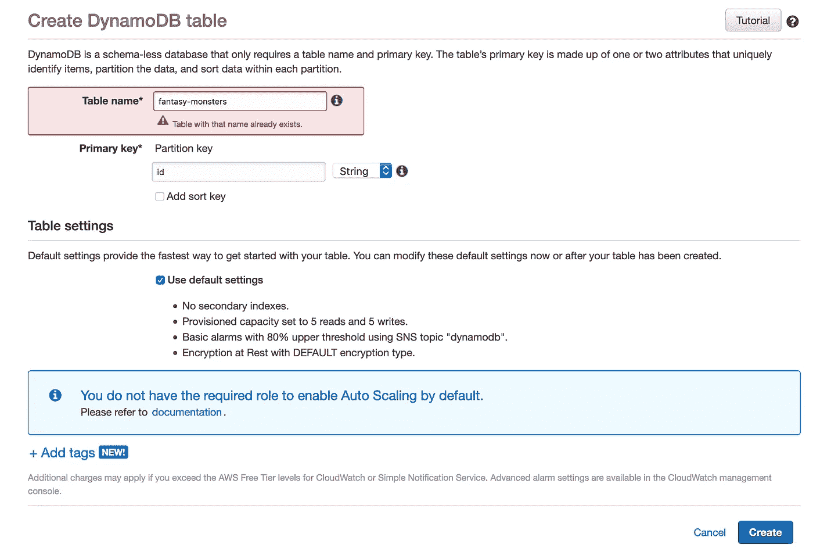
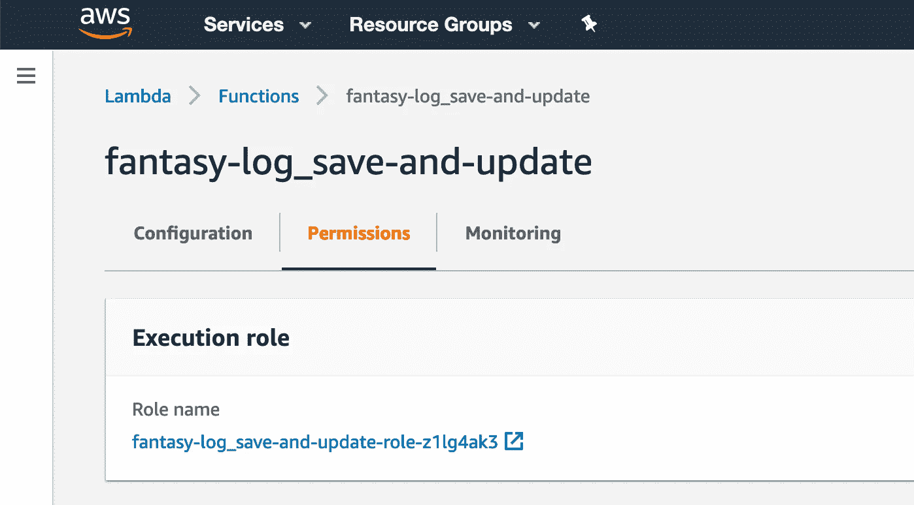
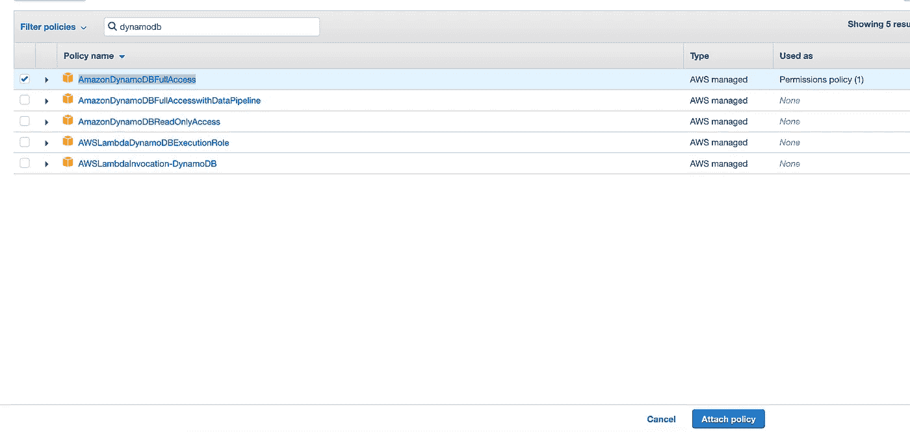
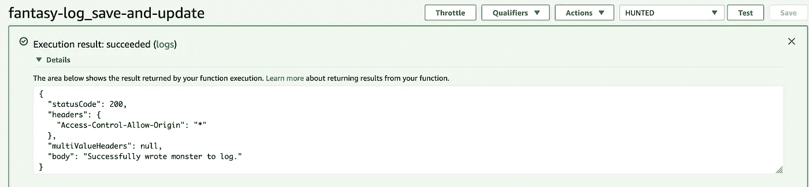
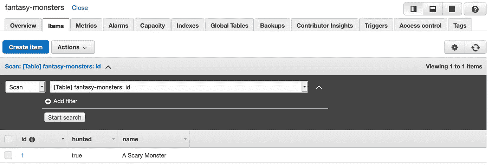

# Golang 幻想狩猎应用程序，2:使用你的 Golang Lambda 与 DynamoDB

> 原文：<https://levelup.gitconnected.com/golang-fantasy-hunting-app-2-using-your-golang-lambda-with-dynamodb-9c82b0b91783>

安妮·尼加德在 [Unsplash](https://unsplash.com/s/photos/monster?utm_source=unsplash&utm_medium=referral&utm_content=creditCopyText) 拍摄的照片

*本文系列的第一部分可以在这里找到***。我建议您从那里开始了解完整的背景。但是，如果你只是想了解如何让一个 golang lambda 与 dynamodb 对话，那么你可以从* [*这里*](https://github.com/z3n0tus/fantasy-log-basic) *克隆这个项目的启动代码(你将需要把它部署到 AWS)。**

*因此，我们编写了一个基本的 lambda，并将其部署到 AWS。下一个难题是将它连接到 DynamoDB，这样我们可以将新的怪物保存到日志中，并更新现有的怪物。*

*为此，我们需要做以下三件事:*

*   *创建一个新的发电机表*
*   *授予我们保存/更新 lambda 的权限，以写入 dynamo 表*
*   *编写连接到表并插入记录的代码*

***创建发电机表***

***注意:迪纳摩会让你花钱。那里*是*自由层，但是我曾经在 EC2 上欠了 300 美元，当时我以为我在自由层。我本可以把钱花在花生酱上。做你的研究。***

*要创建 dynamo 表，请访问 AWS 控制台中的 dynamo 服务([此处为](https://eu-west-1.console.aws.amazon.com/dynamodb/home))并点击“创建表”。给你的表一个名字和一个主键。这将用于在您的表中查找记录。为此使用`id`。然后单击创建。*

**

*不要创建二级索引，因为那肯定会让你付出代价。*

***授予您的 lambda 读/写权限***

*现在，我们的 lambda 无法与该表进行交互。他们现在真的不能处理彼此的事情。要让他们成为朋友，请进入 lambda 的保存/更新控制台页面，点击顶部的权限选项卡。*

**

*抱歉，用这个毫无意义的截图来光顾你*

*单击角色名称，这将打开 IAM 控制台，您可以在其中配置与访问相关的各种角色和权限。*

*单击标有“附加策略”的蓝色按钮。如果看不到，请在这里试试这个链接[。](https://www.specsavers.com/)*

*现在，在搜索框中输入‘dynamo db’，然后选择`AmazonDynamoDBFullAccess`。*

*声明:为了安抚目前正在扫视我的窗户的一群戴眼镜的安全书呆子，我应该警告你，给任何东西完全的访问权都不是一个好主意。但既然什么都不重要，生活是痛苦的，而且我们都将不久于人世，我要说，去吧。请自便。*

**

*天哪，我们在做什么，这太疯狂了*

*单击附加策略。*

***通过代码连接到表，插入/更新记录***

*当我们最后一次离开代码时，它看起来像这样。*

*为了保持代码的整洁和可重用性，我们将把 dynamo 的东西放在一个单独的包中。创建一个名为`dynamo`的文件夹和一个名为`dynamo.go`的文件。*

*我们需要创建两个函数，一个连接到 dynamo，另一个向它写入数据。我会给你看完整的代码，然后再看一遍。*

*我将依次处理每个函数，但是首先，*

*   *第 1-10 行并不新鲜。我们从 AWS 导入我们需要使用 dynamo 的类型和一堆包。`fmt`包来自 Go 标准库，用于将文本打印到控制台。*
*   *第 12 行演示了如何定义一个常数，即一个永远不会改变的值。*

**createDynamoSession 函数**

*createDynamoSession 函数未被大写，因为它未在该文件外部被引用。*

*这个函数负责创建 dynamo 会话并返回它。您会注意到返回类型旁边有一个`*`符号。这意味着我们正在返回一个`pointer`。指针就是指向一个内存地址的指针。指针可以用来计算出一个值所在的确切的内存地址。这有各种各样的应用，但在这里不相关，对于我们的目的，指针的行为就像一个常规变量一样。*

*然后，我们使用 AWS 会话包创建一个会话对象，并向它传递一些选项。*

*最后，我们通过将 aws 会话对象传递给`dynamodb.New()`来返回一个新的 dynamodb 会话。*

**save monster 功能**

*SaveMonster 函数是大写的，因为它在这个文件之外被引用。*

*在第 15 行，我们将 monster 对象编组到一个 dynamo 可以用来写的 map 中。这可能看起来很奇怪，因为我们刚刚在处理函数中将它从 JSON 有效负载转换为一个 Monster 类型。当您可以将 JSON 有效负载直接转换为 dynamo map 时，为什么要这样做呢？*

*原因是，首先将其转换为 Monster 类型会给我们一些隐式验证和类型检查。例如，如果我们试图在 JSON 有效负载中为怪物名称传递一个布尔值`true`,而没有先将其转换为怪物类型，那么 dynamo 会很高兴地接受它，我们最终会得到一个名为 true 的愚蠢怪物，这一点也不可怕。但是通过解组它，我们迫使 Go 的 JSON 库验证所有的字段都匹配我们在 Monster struct 中指定的类型。这也使我们处于一个有利的位置，如果我们愿意的话，可以在以后做进一步的转变。*

*第 17–20 行检查封送处理是否成功。如果不是，我们打印一些东西到控制台并原样返回错误，这样我们就可以把它反馈给调用 lambda 的客户机。*

*第 22 行创建了 dynamo 会话。*

*第 24–27 行获取 monster map 和表名，并将其组合成 AWS 定制类型之一，`PutItemInput`，然后我们在第 29 行将其传递给`PutItem`。PutItem 将保存新的条目，但是如果条目的主键(在我们的例子中是`id`)与表中已经存在的条目匹配，它还将更新任何现有的条目。*

*第 31–34 行再次进行错误检查。*

*第 36 行返回 nil，这就是我们的处理函数如何知道在执行过程中没有错误。*

**更改主文件**

*既然我们已经完成了自定义 dynamo 客户端的编写，我们只需要更新我们的 lambda 处理程序就可以使用它了。这是应用更改后的样子。*

*这里只有几行是重要的。*

*   *第 9 行导入了我们新的 dynamo 客户机。*
*   *第 27 行调用我们的`SaveMonster`函数并检索错误。*
*   *第 29–31 行检查是否存在错误，如果存在，它将错误返回给客户端。*

*我还将第 33 行从返回怪物的名字改为打印成功消息，但这并不重要。*

***展开***

*完成所有这些后，我们就可以部署了。像以前一样，通过运行`GOOS=linux GOARCH=amd64 go build -v main.go`构建您的`main.go`文件，然后压缩该文件并通过您的 lamdba 控制台上传它。完成后，运行我们在上一个教程中创建的测试事件，您应该会看到类似如下的输出。*

**

*如果你去迪纳摩的牌桌，你会看到你的记录被保存下来。*

**

*在这一部分，你学习了如何创建一个 dynamo 表，给你的 lambda dynamo 权限，并通过 Go 代码与 dynamo 交互。下一篇文章将演示如何在 lambda 前面添加一个 API 网关，并把它变成一个 HTTP 服务。*

**这部分的所有代码都可以在* [*这里*](https://github.com/z3n0tus/fantasy-log-dynamo) *找到。**