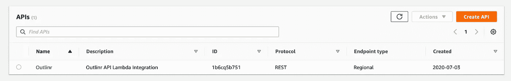

# Golang Fantasy Hunting App，3:使用你的 Lambda 作为带有 API 网关的 HTTP 后端

> 原文：<https://levelup.gitconnected.com/golang-fantasy-hunting-app-3-use-your-lambda-as-an-http-backend-with-api-gateway-dfe05ef0c5a4>


安妮·尼加德在 [Unsplash](https://unsplash.com/s/photos/monster?utm_source=unsplash&utm_medium=referral&utm_content=creditCopyText) 上拍摄的照片

*这是我的“Golang 奇幻狩猎应用”系列的第三篇文章。建议你从第一个帖子开始，这里。*

在前一篇文章的结尾，我们已经成功地开发了一个保存并更新 lambda 和 dynamo 之间的工作集成。最后一步是使用 AWS API Gateway 将 HTTP 请求代理到 lambda，这样我们就可以将它用作 web 服务。

要做到这一点，我们需要做五件事:

1.  通过 API 网关控制台创建新的 API
2.  创建新的端点
3.  将所有请求代理到我们的 lambda
4.  测试 API
5.  部署 API

**创建新的 API**

HTTP API 就像一组描述用户如何与你的后端交互的规则。API 与一个基本 URL 相关联，例如`www.example.com`和一个或多个表示不同域、进程、区域等的`paths`。你的 API 所拥有的。例如，`www.example.com/users`可能会返回属于`example.com`的用户列表。然后，`www.example.com/user/create`可能用于访问创建新用户的后端功能。通过在浏览器中点击这些 URL 并提供可能需要的任何数据，您就可以启动后端操作来完成您想要完成的任何事情。目前，我们的 API 将做一件事，那就是`save`一个巨大的记录。在我们的例子中，`save`意味着创建*或*更新，这取决于所提供的 ID 是否已经在我们的数据库中定义。我们将有一个`path`，`/monsters`，它将接收一个包含我们想要保存的 monster 对象的 JSON 有效载荷。

前往 [AWS API 网关控制台](https://eu-west-1.console.aws.amazon.com/apigateway/main)。您将看到如下所示的内容。



点击“创建 API”开始。在下一页，点击‘REST API’下的‘构建’**；不是那种只能在 VPC 内部使用的。**

填写名称，忽略其他所有内容，然后单击“创建 API”。


**创建端点和代理请求**

您应该会看到如下所示的页面。


`/`表示您的 API 的根。您可以针对这个根创建一个方法(GET、POST、PUT、DELETE 等)并从那里开始，但是为了保持整洁，我将首先创建一个资源。

点击`Actions`下拉菜单，然后点击“创建资源”。资源是您的 API 公开的特定路径。你可以有任意数量的这些，并对它们进行配置，当它们被加载到用户的浏览器中时做不同的事情。

以下是您将看到的页面。称你的资源为“怪物”，然后是`Create Resource`。我们不需要启用 CORS，因为我们的 lambda 已经返回了 CORS 所需的标头。


一旦创建了资源，它就会出现在`/`下的层次结构中。确保新资源被选中，然后再次使用`Actions`下拉菜单，点击“创建方法”。

当你这样做的时候，一个临时的选择框会出现在“怪物”的下面。点击并选择`Post`。然后打勾确认。

HTTP 方法定义了一种特定的方式，人们可以通过这种方式与您的 API 进行交互。例如，GET 方法通常意味着 API 将只返回数据。POST 方法通常意味着 API 将接收新数据并对其进行处理，比如将数据保存到数据库中。因为我们将把怪物唱片插入迪纳摩，所以使用 POST 是有意义的。

您现在应该会看到如下所示的内容。


从这个页面中，您可以看到 lambda 集成是默认选择的。既然这是我们想要的，我们所要做的就是在`Lambda Function`框中选择相关的 lambda，并将其设置为代理集成。**确保选中代理集成框，否则会有问题**。一旦你完成了，开始在 lambda 函数框中输入你的 Lambda 的名字，它应该会出现在一个下拉列表中。


完成后，点击`Save`。一个模态会弹出警告，你要给你的 API 权限，让它调用你的 lambda。我们想要这个，所以只需点击`OK`。

现在我们有一个 API、一个路径和一个方法，都指向我们的λ。

**测试 API**

在左边，你应该看到下面有一个闪电粗体字`Test`。点击那个。

在下一页的底部，您会看到一个`Request Body`文本框。我们把我们的怪物 JSON 放在这里。这是 lambda 将从传递给我们的处理函数的`req`参数的`Body`属性中提取的内容。

如果我们再看一下代码，检查一下我们的 monster struct，我们会发现它应该像下面这样:

```
{
    "id": "123",
    "name": "Gorgon",
    "hunted": true
}
```

因此，将它粘贴到`Request Body`文本框中。


然后点击测试。你应该看到一些东西出现在屏幕的右边，如果你滚动到顶部，你会看到你的 lambda 的 HTTP 响应。一旦部署了 API，这也是 web 浏览器和专用 HTTP 客户端将会看到的。


如果您去检查 dynamo，您应该会看到一个与您刚才发送的请求体相对应的新记录。

**部署 API**

我们需要做的最后一件事是部署 API，这将使它可以在 AWS 控制台之外访问。为此，再次点击`Actions`下拉菜单并选择“部署 API”。将打开一个模态。

对于部署阶段，您需要选择新阶段。阶段是区分同一 API 部署的方法。例如，您可能想要一个可以随意摆弄和破坏的测试部署。您可能还希望实时部署成为您的用户将与之交互的官方 API。我们真的不关心阶段，因为这不是一个真正的项目，所以我就叫我的生活。


完成后，部署它。

您将被带到一个页面，在那里您可以看到所有已部署的阶段和 API 的基本 URL。


通过将该 URL 输入 HTTP 客户端，添加您的`/monsters`路径并发送一个带有一些怪物数据的`POST`请求，您现在可以将怪物保存并更新到您的幻想日志中。

至此，你已经准备好创建`get-all` lambda 了。您可能不知道从 dynamo 数据库中检索所有记录的具体代码，但是您知道如何创建和部署新的 lambda，导入您需要的内容，编组和解组数据，连接到 dynamo，并使用 API gateway 代理它。所以另一点就是看文档。

简单地说，您已经拥有了使用 Golang、Lambda、Dynamo 和 API gateway 创建 HTTP 服务所需的一切。

然而，如果你觉得你还需要一点整合，将会有最后一篇文章再次为λ做所有这些事情，但是在更高的层次上，解释也更少。所以如果你感兴趣的话，请留意一下。