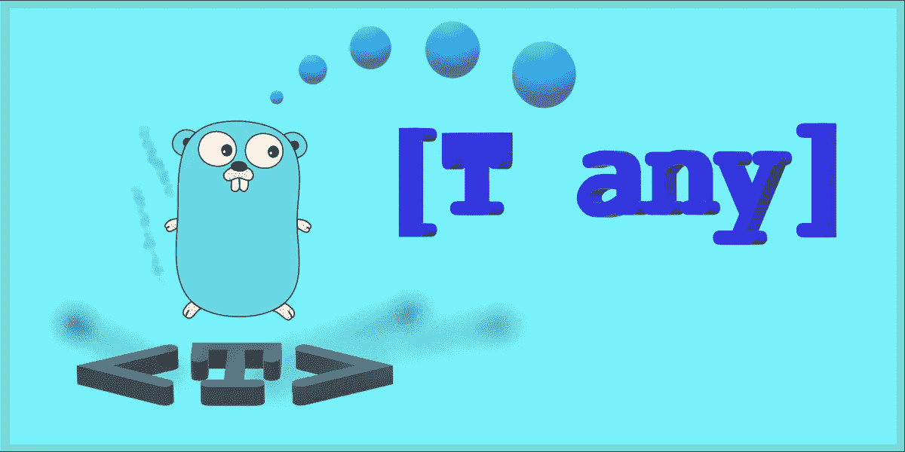

# Golang 仿制药:一项新提议

> 原文：<https://levelup.gitconnected.com/golang-generics-proposal-2021-4510b715b5d0>

## 编程；编排

## 对最近 Golang 增加泛型的提议草案的简短分析——包括什么，排除什么，以及它将如何影响语言。



日前， **Golang** 中**仿制药**实现的新[建议稿提交。这是对该草案的简要分析。如果你知道什么是**泛型**并且意识到 Go 中缺少它们的含义，你可以跳过第一部分，直接进入](https://go.googlesource.com/proposal/+/refs/heads/master/design/go2draft-type-parameters.md)[这里](#fe19)。

# 什么是“仿制药”，它们解决什么需求？

很长一段时间以来，这种语言缺乏基于通用的、**参数化类型**而不是**具体类型**定义函数和其他实体的能力。因此，例如，寻找最小值和最大值的函数`math.Min()`和`math.Max()`只在`float64`的标准库中定义。没有提供任何其他类型的最小值/最大值。即使一个人想创建自己的最小-最大包，为各种类型使用类似`mymath.Min()`或`mymath.Max()`的功能，他们也不能这样做。这种语言的当前结构不允许这样的代码:

```
var vi, ui **int**
var vi8, ui8 **int8**

vi = **min**(102, ui)
vi8 = **min**(ui8, 3)
```

在第一个赋值中，函数`Min()`与`int`参数一起使用(至少一个；另一个是一个**文字**，转换后与之匹配)。该函数的结果也被赋给一个 int 类型的变量。在第二次赋值时，调用了一个同名的函数，但是这一次，它应该接受`int8`参数并返回一个`int8`结果。

但是我们怎样才能做到这一点呢？
一方面，Go 要求明确、具体的自变量类型作为函数定义的一部分。这意味着单个函数的每个参数只能有一种类型。例如，下面的代码只能处理类型为`int`的参数，并且总是返回该类型的结果:

```
func Min(a, b **int**) **int** {   
    if a < b {     
        return a   
    }   
    return b 
}
```

另一方面，语言不允许 [**函数重载**](https://en.wikipedia.org/wiki/Function_overloading) 。这意味着，不能在同一个名称空间中编写几个名为`Min()`的函数，它们的区别仅在于参数类型。所以，尝试这样的事情是完全不相关的:

```
func **Min**(a, b **int**) **int** { ... }
func **Min**(a, b **int8**) **int8** { ... }
```

这让我们只有两个选择。要么编写一组几乎相同的函数，它们共享完全相同的逻辑，只有类型*和*名称不同，比如:

```
func **MinInt**(a, b **int**) **int** { if a < b { return a }; return b } 
func **MinInt8**(a, b **int8**) **int8** { if a < b { return a }; return b }
func **MinInt16**(a, b **int16**) **int16** { if a < b { return a }; return b } 
```

—哪一个不是我们见过的最漂亮、最清晰、最安全、最优雅的代码；或者，尝试使用该语言当前的通配符`interface{}`。另一个选项需要一些难看的代码来将参数转换成实际类型，可以是任何数值类型。更糟糕的是，它的*调用者*也必须将结果转换为原始类型。
***这实在是太荒谬了，以至于它不是一个真正的选项。***

我们真正想要的是一种优雅的方式，拥有“一枚戒指统治他们所有人”；类似于-

```
func **Min**(a, b «**SOMETYPE**: any numeric type») «that very **SOMETYPE**» { 
    if a < b { 
        return a 
    } 
    return b 
}
```

这将允许我们进行任何形式的调用-

```
vi = **Min**(102, **ui**)
vi8 = **Min**(**ui8**, 3)
vi16 = **Min**(**ui16**, 0)
```

简单。
明朗。
优雅。
**不可能**。

当处理更复杂的类型时，使用**函数**而不是**操作符**来访问，这种语言确实提供了某种灵活性。在这些情况下，使用**接口**允许函数以多态的方式工作。例如，一个函数`f1()`可能将其参数定义为类型`Averager`，其中`Averager`被定义为一个`interface`，它需要定义一个名为`Average()`的函数。这样，`f1()`就可以安全地在它上面调用`Average()`，而不需要知道它的实际类型，相应的`Average()`函数就会被调用。这是 Go 中**多态性**的标准实现。

这些类型的“最小公分母”是已经提到的类型`interface{}`，它没有定义任何函数。因此，它可以被任何其他类型所取代——但出于同样的原因，它的用处要小得多。

# 它是如何工作的？

新提案将上述关于使用“`SOMETYPE`”的想法正式化。**类型参数**出现在函数名及其括号之间的方括号中。例如，可以编写这样一个函数:

```
// Stringify accepts a slice of any type that 
// implements the Stringer interface:
func Stringify**[T Stringer]**(s1, s2 []**T**) (ret []string) {
  ...
}
```

这个函数`Stringify()`接受一个类型参数`T`；但是，并不是任何类型都可以作为`T`的替代品。只有实现了`Stringer`接口的类型才适合。然后，它得到两个参数，`s1`和`s2`，它们必须是为`T`选择的相同类型。跟在类型参数后面的类型——例如，在那个例子中的`Stringer`——是`T`上的**约束**。如果没有应用约束，则提供新的关键字`any`。

也可以以参数形式定义复杂的**类型**。例如:

```
// Vector is a name for a slice of any element type.
type Vector**[T any]** []T
...
var vi Vector**[int]** 
var vf Vector**[float64]**
```

> 有趣的是，在这里，就像在许多其他语法问题中一样，Go 似乎有意地不同于 c++及其表亲的常见形式。*尖括号*、`<T>`——模板**或**仿制药**无可置疑的传统“商标”——被弃用，取而代之的是*方括号*。这个提议解释了其中的原因(提示:对 Go 编译规则的限制)。
> 不仅靠*形式*，还靠*概念*，围棋和那些语言有很大的不同，即使是选秀被接受。其他编译语言，如 **C++** 、 **Java** 或 **Rust** ，提供了极其强大的通用/模板工具，这些工具在通用设计和开发中发挥了重要作用。围棋，至少从选秀来看，还远远落后于他们；它的泛型只是少数边缘情况下的次要解决方案。**

编译语言的主要缺点是需要预先为每个平台准备二进制产品。另一方面，这种语言的优势在于它们能够生产出更高效的产品，无论是在内存占用方面还是在性能方面。其中一个关键因素是在编译时解析期间使用这些泛型的能力来改善运行时。
然而，围棋并不打算走那条路；那么——
***这个提议真的会让 Golang 更有效率吗？答案是——它可能会，但方式非常有限。
那么，与当前形势相比，该提案的优势是什么？***

# 该草案的主要好处

虽然本提案中对泛型的支持相对于其他语言来说非常有限，但它仍然为开发人员提供了几个重要的优势。

## 将错误从运行时转移到编译时

在**编译时**发现错误和 bug 比在**运行时**发现错误和 bug 能让代码开发进展得更快。当然，运行时不一定是*任何*运行；不一定是先*后*运行；事实上，它可能首先发生在*客户端的*运行中。原则上，精心制作的**接口**可能会大大降低这种风险。然而，许多 Go 函数都是使用通用接口作为参数编写的，只有在函数内部才会测试它们的动态类型，并且它们会被转换成适当的具体静态类型**。首先，使用泛型可能会改变编码风格，使其更加准确。**

## **无函数多态**

**正如本文开头所展示的，接口类型的参数只适合通过多态函数或方法来访问。如果一个函数应该接受非具体类型的参数，并且不是通过**函数**而是通过**操作符**来访问它们，那就完全不同了。**

**当前的 Go 语法只能通过在函数中转换成各种可接受的静态类型来实现这一点。然而，这种方法—**

1.  **很麻烦，**
2.  **违反**OCP**—[开/关原理](https://swarch.blog/the-five-principles-for-solid-software-design/)，**
3.  **导致性能损失，*和***
4.  **将错误从编译时移到运行时。**

**另一个选择，正如用`min()` / `max()`函数所演示的，是编写许多看起来相似的函数，每个具体类型一个。原则上，使用泛型编写这两个函数应该可以解决所有这些问题。**

## **在多个多态参数之间实施约束**

**Go 函数可以接受某种接口类型的参数`Some`。类似地，一个函数可能接受该接口类型的两个或多个参数。比如，像这样:**

```
func f1(a **Some**) { ... }
func f2(a, b **Some**) { ... }
```

**在这种情况下，`f1()`将为`a`接受任何实现接口`Some`的东西。如果`Sometimes`和`Somewhere`都实现了`Some`，那么它们中的任何一个都可以正常工作。`f2()`中的`a`和`b`也是如此。当然，也有可能`a`是`Sometimes`类型，而`Somewhere` — `f2()`类型的`b`不强制它们具有相同的具体类型。
****不能*** *强制执行*。
有时候真的无所谓。但是总有其他的情况。***

***使用新提出的泛型语法，可以定义`f3()`，它接受实现`Some`的同类型的两个参数**:*****

```
*func f3**[T Some]**(a, b **T**) { ... }*
```

***用两个`Sometimes`参数调用`f3()`也可以，用两个`Somewhere`参数调用也可以。然而，试图用一个`Sometimes`参数和一个`Somewhere`参数调用它会破坏编译。同样，不仅可以定义类型相同的参数，还可以定义任何其他基于类型的关系。例如，一个类型为`T`的参数和另一个类型为`[]T`的参数，等等。***

## ***直接使用泛型类型***

***通过接口类型参数获取多态类型的标准 Go 函数不能直接使用该参数的实际*类型*。例如，它不能直接创建该类型的局部变量。(由于**反射**，可以出于某种目的间接引用变量的类型；这需要付出代码和性能的代价。)
使用泛型提议，这可以轻松优雅地完成。***

## ***使用类型参数定义复杂结构***

***正如本文开头所展示的，新的提议不仅允许定义泛型函数，还允许定义泛型类型。例如，一个结构保存一些数字类型的两个片段(或者是两个相同的`T`，或者是两个可能不同的类型，`T`和`S`)。使用这些泛型类型，很容易创建具体类型来定义其内部数据的特定类型，并像使用任何其他结构一样使用它们。***

## ***通过直接访问内部元素改善性能和占用空间***

***任何通过`interface`对数据的访问都是间接地**完成的**:接口从不保存数据本身，而是保存一个指向实际数据的指针。因此，举例来说，一个通过接口持有的`int8`，消耗的不仅仅是一个字节的内存。此外，对其值的任何访问都需要“双重访问”:首先是对接口地址的访问，然后是使用它持有的指针对数据本身地址的访问。***

***当处理一些这样的问题时，这可能不是一个关键的考虑因素。但是在这种情况下，例如，在一个非常大的切片中，消耗的内存和运行时间可能会急剧增加。再加上一个一直更新所有地址的**垃圾收集器**——这就成了一个真正的问题。根据该提议使用泛型将消除所有开销。***

# ***在某些实现下，该提议可能会改进什么？***

***当前的草案提出了 Go 中泛型的**语法**。它没有定义其具体的**实现**。与 C++这样的语言不同，Golang 的首要目标是始终产生最有效的二进制产品。***

***因此，例如，C++中的**函数模板**是为它们的每个**实例化**单独编译的。假设我们有一个名为`makePairs()`的 C++函数模板，它接受两个不同泛型类型的向量`vt`、`vs`和`S`，并返回一个向量对，这样第*I*th 对由第`vt`个元素 *i* 和第`vs`个元素 *i* 组成。如果这个函数被调用——至少一次——使用两个向量`int` s，编译器将*实例化*一个特定的函数。如果在其他地方使用两个向量`double`调用该函数，那么编译器将为两个向量`double`生成一个额外的*实例*，如果另一段代码调用`makePairs()`并将`vt`作为`int`并将`vs`作为`double`，将会创建第三个实例。在编译/链接时，每个调用将被链接到适当的实例，该实例是为这些参数量身定制的。由于不需要对实际类型进行运行时检查，并且编译器可以以最佳方式分别优化每个实例，因此通常会获得最佳性能(这里还涉及到[代码膨胀](https://en.wikipedia.org/wiki/Code_bloat)效果、[函数内联](https://en.wikipedia.org/wiki/Inline_expansion)和其他注意事项)。但是这是有代价的:任何曾经编译过重要 C++项目的人都知道，它极其高效的产品是非常长的编译时间的结果。模板实例化是这种权衡的一部分。***

***在 Go 中，不仅最终二进制的*效率很重要，编译过程*本身的*效率也很重要。当这两者竞争时，Go 的编译器会通过它们之间的某种妥协来解决它。出于这个原因，尽管草案没有明确定义泛型的实现，但它假设泛型将采取不同于多实例化的路径。****

# ***这个提议不允许什么？***

## ***泛型类型之上的泛型函数***

***除了最小化*二进制产品*的运行时间和占用空间，最小化*编译过程*的时间，Go 还努力最小化*语言*本身。那就是:尽可能保持语法简单。即使以不太优雅的代码或避免复杂的能力为代价，Go 也坚持这个原则。它的理念是，最好尽可能保持语法简单，即使完成一项任务需要更多的代码行，而这项任务本来可以用更少的复杂语法来编码。这是围棋被认为学习曲线相对较短的主要原因之一。事实上，这种方法是还没有泛型的主要原因。***

***例如，在 C++中，可以有一个接受某种泛型类型`T`的**类模板**，并向其添加一个接受某种其他泛型类型`S`的**成员函数模板**(或者用 Go 的术语来说是“泛型方法】)。因此，具体的成员函数取决于`T`和`S`。这优雅地允许了广泛的用例。但是模板的巨大灵活性——像这种类模板和函数模板的组合——使得 C++的模板对新手来说非常重要。***

***另一方面，Go 忠于它的原则，禁止这种复杂的通用结构。目前的草案只允许“一维”的“泛型”:
*或者*一个只接受具体类型的泛型函数，*或者*一个作用于泛型类型的函数，没有任何额外的类型参数。
这种方法可能会产生一点麻烦的代码(例如，创建一个新的泛型类型，仅仅是为了将它发送给一个给定的函数)，但是它使语法更简单。***

## ***专门化***

***这个提议不允许的另一个能力是为特定类型定义不同版本的通用代码——这被称为[专门化](https://en.wikipedia.org/wiki/Generic_programming#Template_specialization)。这种限制方法在一种甚至不允许简单的、基本的函数重载的语言环境中是有意义的:任何函数调用都必须映射到一个仅由其名称定义的特定函数。然而，消除专门化极大地限制了泛型的使用和优雅。***

***回想一下本文开头的例子——函数`math.Min()`和`math.Max()`。目前，它们仅在`float64`上定义。那么，将它们重写为泛型函数是很有诱惑力的，这样它们就可以为任何两个相同类型的数字参数工作。例如，类似这样的事情:***

```
*// Assume that constraints.Ordered includes 
// all the types on which "less then" operator works 
func Min**[T constraints.Ordered]**(x, y **T**) **T** { 
  if x < y { 
    return x 
  }
  return y 
}*
```

***简单、优雅，适用于最小值概念适用的所有类型。
显而易见的解决办法。
***唉，果然不行！******

***显然，上述寻找最小值的简单逻辑可能适用于某些数值类型，但不适用于所有类型。因此，对两个`float64`参数起作用的用于最小和最大计算的[现有函数必须考虑与整数类型无关的*特殊情况*。例如，在无穷大、`NaN`的情况下，或者当](https://github.com/golang/go/blob/682a1d2176b02337460aeede0ff9e49429525195/src/math/dim.go#L62)[比较+0.0 和-0.0](https://en.wikipedia.org/wiki/Signed_zero) 时会发生什么。因为不允许编写泛型函数的特例，所以不可能优雅地解决这个问题。***

***解决这个问题的一个方法可能是用不同的名字编写几个函数*——例如一个通用的`MinInt()`用于所有整数类型，其他函数用于非整数类型。另一种方法可能是编写一个泛型`Min()`，它在内部检查其参数的实际类型，并根据需要应用不同的计算。不是最高效最优雅的设计。此外，这种解决方案在设计上不是多态的(即，不是开放/关闭的)，并且会导致性能损失和繁琐的代码。****

## ***隐式接口— Duck 类型***

***一种现有的通用代码方法假设通用代码(函数或类型)可能接受的类型没有正式的限制。给定泛型类型`T`的接口不是**显式**定义的，而是从逻辑中隐式[](https://blog.ycshao.com/2017/12/16/effective-c-item-41-understand-implicit-interfaces-and-compile-time-polymorphism/)**(也称为[Duck-Typing](https://en.wikipedia.org/wiki/Duck_typing)——取自 Python 世界的术语)。也就是说，每当出现对泛型代码的调用时，编译器都会尝试使用所提供的参数及其类型来读取它。如果代码是为特定类型编译的——例如，`int64`或`MyAwesomeCar`——那就没问题。通用代码只有在每次特定调用后才有意义。此外:*如果不仔细检查泛型实体的整个逻辑或实际尝试编译它，就不可能事先知道为给定类型调用一段泛型代码是否合法。******

*****这种方法允许对这样的代码进行创造性的、多维度的使用，但是从软件工程的角度来看，这是非常糟糕的。为了知道用一个`MyAwesomeCar`参数调用某个函数是否合法，必须首先尝试一下，看看编译是否通过；与可能的编译错误作斗争来理解问题并解决它们本身可能是非常困难的。如果人们已经知道`MyAwesomeCar`确实可以使用通用函数，他们可能很难预测什么变化是好的，什么可能会破坏代码。*****

*****这就是为什么建议草案要求任何泛型代码从它接受的类型中显式定义所需的接口。草案将该定义称为通用类型的**约束**。定义可以用两种方法之一来完成。第一个是“开放的”:代码以通用的方式定义了一个接口——一组要实现的功能。任何类型都可以，只要它实现了接口。另一种方式是“封闭的”，用于支持非函数通用操作(如`Min()`示例中的操作符`<`):接口使用最后一组允许的类型来定义约束。*****

## *****元编程*****

*****根据草案，一段泛型代码实际上是一些 Go 代码的样板，允许用具体类型替换一个或多个泛型类型。它故意不够先进，不允许使用泛型语法本身来定义逻辑。也就是说，不允许有[元编程](https://en.wikipedia.org/wiki/Template_metaprogramming)(使用泛型语法编写的逻辑，在编译期间实际“运行”)。根据 Go 的快速编译和语法简单的原则，这当然很有意义。*****

## *****其他复杂性*****

*****泛型编程的世界是广阔的、丰富的和复杂的，并且在不同的语言中允许许多额外的能力，例如:*****

*   *****以各种方式定义允许的类型及其相互关系；*****
*   *****定义泛型参数，不仅用于类型，也用于值；*****
*   *****接受各种数量的泛型参数的可变实体；*****
*   *****在其他通用实体中使用通用实体；*****

*****这些只是泛型代码在 C++、Java 或 Rust 等语言中允许的一些附加工具。忠于 Go 哲学的提议草案，有意避免了这样的指示，给泛型留下了一个相当简单的基本工具。此外，该提案是在清晰明确的假设下编写的，即实际编写的通用代码相对较少。这表明只有很少很少的库会用通用术语写成*。根据这个预测，大多数围棋程序员将只需要处理*调用*这样的通用代码。******

# ******摘要******

******Golang 中缺少泛型是一个有争议的问题，已经讨论了很长时间。这并不是第一次尝试在语言中加入这样的机制，但是到目前为止，没有一次尝试成功。目前的提案试图克服这些问题，并提出一个简单的基本机制。如果社会接受它，它成为语言的一部分，检查它的实际用法就容易多了。通过学习实际的解决方案和广大程序员在这个解决方案中发现的障碍，以后将有可能重新考虑向更深层次的泛型支持的相关变化。******