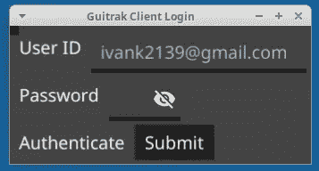
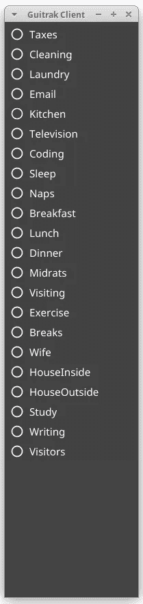

# Golang GUI 客户端

> 原文：<https://levelup.gitconnected.com/golang-gui-client-6b0edbfb0875>

## 这个场景需要一个桌面应用客户端


在 [Unsplash](https://unsplash.com?utm_source=medium&utm_medium=referral) 上由 [Austin Distel](https://unsplash.com/@austindistel?utm_source=medium&utm_medium=referral) 拍摄的照片

## AccTrakII

该项目名为 AccTrakII，是一个服务器应用程序，带有一个 PostgreSQL 数据库来跟踪用户活动。最初的用户界面需要在桌面上点击一个图标来发送一个 RESTful API 调用到服务器。尽管最终会包含通过 JSON 的确认，但是不需要处理服务器响应。



最初的想法是有一个发送 API 调用的桌面图标集合。这在 Linux 桌面上运行良好。服务器应用尽职尽责地收集和处理输入。通过一个可下载的 bash 脚本，可以轻松实现生成和刷新桌面图标的功能。这个脚本删除了旧的图标，并放置了新的图标。每个图标代表用户的一项活动或任务。常见的活动或任务有电子邮件、会议、午餐、茶歇、编码、测试，

虽然这在 Linux 机器上可以工作，但 MacOS 或 Windows 的用户可能不会觉得这么方便。讨论了关于小型桌面客户机开发工作的各种建议。作为 Golang 的支持者，我考虑对我为测试目的开发的命令行客户端进行一些改进。这个客户端运行在本地桌面上，发送 RESTful API 调用来模拟用户与服务器的交互。易于管理、操作和处理。没有混乱，没有大惊小怪。它做了它应该做的事情。

## Guitrak 客户端

现在，我如何将这个想法变成应用程序的一个更完整的开发部分呢？我不得不考虑如何实现这一点的一些新的方面。要做的第一件事是命名这个新客户。因为这是我和我的决定，我给她取名为吉特拉克。虽然有许多不同的方法和技术可以用来支持我对基于 Golang 的方法的坚持，但这意味着我必须拥有某种 Golang GUI 工具包。快速搜索发现了这条线索。Io 库。这看起来是我需要开始的所有东西，并承诺对 Android 和 iOS 移动工作都有用。除了几个网页之外，我没有做过很多 GUI 工作，也不认为自己有任何艺术才能。尽管如此，我还是想尝试一下，看看能做些什么。

## 要求

当然，我们希望从几个要求开始。guitrak 的更新应该来自服务器，所以每次用户登录到客户端应用程序时，它都会查询服务器来更新用户的任务列表。用户场景是这样陈述的，她将打开 guitrak 作为开始工作的第一件事，并且随着工作日的展开，向服务器发送关于正在工作的任务或活动的事件。服务器应用程序将这些事件保存到 Postgres 数据库中，用于发票创建和计费。不是每个任务都是收费的。服务器计算每项任务花费的时间，并生成报告供管理层和主要开发人员使用。

这里是用 Fyne.io 库创建的登录窗口的截图。


许多提到的任务可以从应用程序网页上执行。例如添加、删除和更新新任务。guitrak 很难完成这项工作，因此推迟了这项工作。此时，使用 Fyne 在 Go 中构建初始 GUI 客户端就足够了。Io 库。Guitrak 必须提供登录 userid 和 pwd，以便向服务器进行身份验证。更新的例程将从服务器下载用户分配的任务，这些任务也基于用户被分配到一个或多个项目。预计 guitrak 应用程序将在用户的桌面上保持打开，并方便地允许用户单击代表先前分配的任务的按钮，以跟踪在每个任务上花费的时间。

成功登录后，该窗口为用户显示从服务器检索的所有任务。



这个任务列表反映了我的个人任务和我一直从事的开发活动。这就要求 guitrak 屏幕能够容纳可变数量的任务，并以某种方式显示所有这些任务，以便了解哪个按钮与哪个任务相关，并尽可能方便地点击按钮，从而开始跟踪新的活动。指出哪个任务当前是“活动的”任务并显示这种情况已经持续了多长时间也是有帮助的。为了避免潜在的“失控”活动，如果持续时间超过 50 分钟，guitrak 应用程序应该向任何正在进行的“活动”任务发出信号。50 分钟后，短暂的休息是合适的，或者用户可以重置计时器并继续进行相同的任务。

时钟显示显示任务的活动时间和注销按钮，并且随着开发的进展，可能会在以后添加暂停功能。

我发现 Fyne.io 库非常容易使用，他们的文档写得很好，也很容易使用。

下面是显示初始登录窗口和字段的窗口代码。请注意，submit 按钮实际上调用了 authenticate func，如果成功，将显示 tasks 窗口。

```
myApp := app.New()
if !authenticated {
   myWindow := myApp.NewWindow("VBox Layout")
   myWindow.SetTitle("Guitrak Client Login")
   uidLabel := widget.NewLabel("User ID")
   uidText := widget.NewEntry()
   uidText.SetPlaceHolder("ivank2139@gmail.com")
   row1 := fyne.NewContainerWithLayout(layout.NewHBoxLayout())
   row1.AddObject(uidLabel)
   row1.AddObject(uidText)

   row2 := fyne.NewContainerWithLayout(layout.NewHBoxLayout())
   pwdLabel := widget.NewLabel("Password")
   pwdText := widget.NewPasswordEntry()
   row2.AddObject(pwdLabel)
   row2.AddObject(pwdText)

   row3 := fyne.NewContainerWithLayout(layout.NewHBoxLayout())
   authLabel := widget.NewLabel("Authenticate")
   authButton := widget.NewButton("Submit", func() {
      log.Info.Println("auth func()")
      authenticated = true
      myWindow.Hide()
      go showTasks(myApp)
   })
   row3.AddObject(authLabel)
   row3.AddObject(authButton)

   vbox := fyne.NewContainerWithLayout(layout.NewVBoxLayout(), row1, row2, row3)
   myWindow.SetContent(vbox)
   myWindow.ShowAndRun()
}
```

该窗口包括几个嵌套的容器，第 1-3 行是水平的方框布局。

“任务”窗口以单选按钮阵列的形式列出了 22 项任务。

```
*//myApp := app.New()* myWindow := a.NewWindow("Tasks")
myWindow.SetTitle("Guitrak Client")
updateTasks("1")
rt := []string{}
for _, task := range tasks {
   rt = append(rt, task.Name)
}
radio := widget.NewRadio(rt, func(value string) {
   log.Info.Println("Radio set to", value)
   changeActivity(value)
})
*//taskLabel := widget.NewLabel("Tasks")* vbox := fyne.NewContainerWithLayout(layout.NewVBoxLayout(), radio)
myWindow.SetContent(vbox)
myWindow.Show()
```

对服务器进行 RESTful 调用来检索用户分配的任务运行得相当好。这是 API 和处理程序。

API 和处理程序

我惊喜地发现只用 Golang 创建一个最小的 GUI 是多么容易。根据 Fyne.io 文档，这个客户端可以编译成 Android 和 iOS。因此，我将能够提供移动和桌面版本的客户端。

在生产就绪之前，还有相当多的工作要做，但在这一点上，只是有很多工作，但没有什么是真正未知或不太了解的。服务器和客户端都需要更多的努力来完成它们，但这至少表明原型不仅是可行的，而且很有趣。

我还没有展示认证细节。我真的很想使用第三方提供商的 OAuth，如谷歌，脸书，Github 和其他人，以及作为最后手段的用户 id，电子邮件和密码。我还要指出，服务器是启用 https 的，我在 guitrak 客户机中使用了一个简单的设置来信任服务器的自签名证书，这样客户机就不会抱怨了。