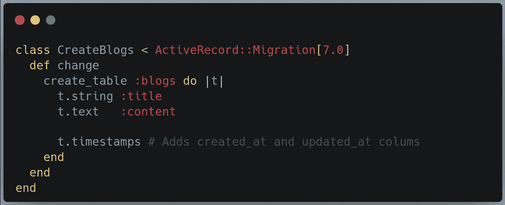
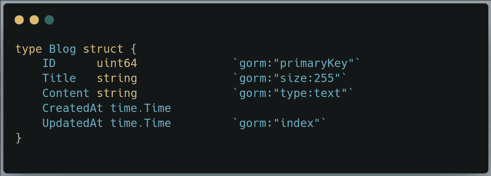

# Golang —如何处理数据库迁移

> 原文：<https://levelup.gitconnected.com/golang-how-to-handle-database-migrations-ad676e6159f>

## 作为一名 Rubyist，我有哪些方法和途径

本杰明·雷曼在 [Unsplash](https://unsplash.com?utm_source=medium&utm_medium=referral) 上的照片

[Golang](https://go.dev/) 从一开始就越来越受欢迎。它是一种简单的语言，性能与 C++这样的低级语言一样好。Golang 在 web 开发中的接受度正在高速增长。

我在[***Rails***](https://rubyonrails.org/)上开始了我的 web 开发之旅。我爱上了 [***主动记录***](https://guides.rubyonrails.org/active_record_basics.html) 。看到 ORM 如此简单易用，我感到非常惊讶。它通过使数据库迁移成为代码的一部分来出色地处理数据库迁移。

# Rails 中如何处理数据库迁移(有活动记录)

说真的，Rails 和 Active Record 让我变得懒惰。活动记录及其数据库迁移非常容易使用，以至于我不再直接编写 SQL 查询。

要创建表，您需要创建一个新的迁移，如下所示:

创建表的数据迁移

通过编写一个类似的迁移来修改这个表是很容易的。

除了迁移之外，活动记录具有最简单的与数据库交互的模型。您不必指定模型中的每一列，它从表中获取列名。

# 戈兰奥姆斯

Go like 的 ORM 库有很多——[gorm](https://github.com/go-gorm/gorm)， [xorm](https://github.com/go-xorm/xorm) ， [sqlboiler](https://github.com/volatiletech/sqlboiler) ， [reform](https://github.com/go-reform/reform) 等等。GORM 是最流行的围棋 ORM。它与活动记录有许多相似之处。

# GORM 如何处理数据库迁移

与活动记录不同，您在定义表的模型中指定一个结构。例如，博客表可以这样指定—

仅仅指定一个结构不会改变数据库。您需要为每个模型显式调用 ***AutoMigrate*** 方法来运行数据库迁移

**当你改变结构时会发生什么？**

A 添加一列

改变一个表并不简单。如果您**添加一个列**到一个表中，您只需要在 struct 中添加该列。当应用程序运行时，它会将列添加到表中。

移除一列

从结构中移除列时，数据迁移不会从表中移除该列。要删除一列，您需要显式地编写如下代码—

其他场景

有很多方法可以处理这样的情况—

*   创建表格
*   放下一张桌子
*   重命名表格
*   对列进行更改
*   指数

有关更多详情，请查看此[文档](https://gorm.io/docs/migration.html)。

# 我更喜欢什么？

尽管 GORM 的数据迁移特性能够处理任何场景，但这需要一个学习过程。如果您正在使用自动迁移，您需要了解它是如何工作的。

由于这些原因，我更喜欢编写 SQL 语句来管理 DB 模式。我知道这很老套，但我觉得很简单。

其中一个项目是 Rails 项目的子项目，我使用活动记录迁移来维护 Golang 项目的 DB 模式。

# 最后的话

做这件事没有对错之分。开发人员有他们的偏好和技能来帮助他们做出这样的决定。

我其他与 Golang 相关的故事—

 [## 为什么你应该在 2022 年学习 Golang

### 是的，你应该，有很多原因

levelup.gitconnected.com](/should-you-be-learning-go-in-2022-55ea75170cf9)  [## 使用 Golang 和 Gin Gonic 发送 HTTP 错误代码

### 处理 API 中错误的简单方法

levelup.gitconnected.com](/sending-http-error-codes-with-golang-and-gin-gonic-d915d1dd0166)  [## 戈朗:比格 vs 狂欢。如何选择？

### Golang 两个最著名框架的比较。

levelup.gitconnected.com](/golang-beego-vs-revel-how-to-choose-63ee8f081bc3)  [## Golang:将配置移动到外部文件以获得更好的可维护性

### 开发人员倾向于为不同的开发环境使用不同的可执行文件。这个方案移动各种…

levelup.gitconnected.com](/golang-move-the-configuration-to-an-external-file-for-better-maintainability-4dd258dc5612)  [## Rails，如 Golang 设置，带有 Revel 和 GORM

### Golang 的知名度自问世以来一直在不断提高。最近的调查显示，76%的用户正在使用…

medium.com](https://medium.com/geekculture/rails-like-golang-setup-with-revel-and-gorm-33dab0aae11a) 

*喜欢自己体验媒介？考虑通过报名成为* *会员来支持我和其他* [***作家。会员每月只需 5 美元，它支持我们，作家，没有额外的费用。如果你这样做，我会收到一部分费用，不会多花你多少钱。谢谢大家！***](https://singhamrit.medium.com/membership)

 [## 通过我的推荐链接加入 Medium-Amrit Pal Singh

### 作为一个媒体会员，你的会员费的一部分会给你阅读的作家，你可以完全接触到每一个故事…

singhamrit.medium.com](https://singhamrit.medium.com/membership)