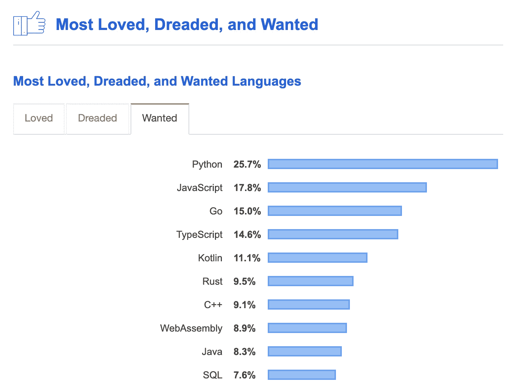
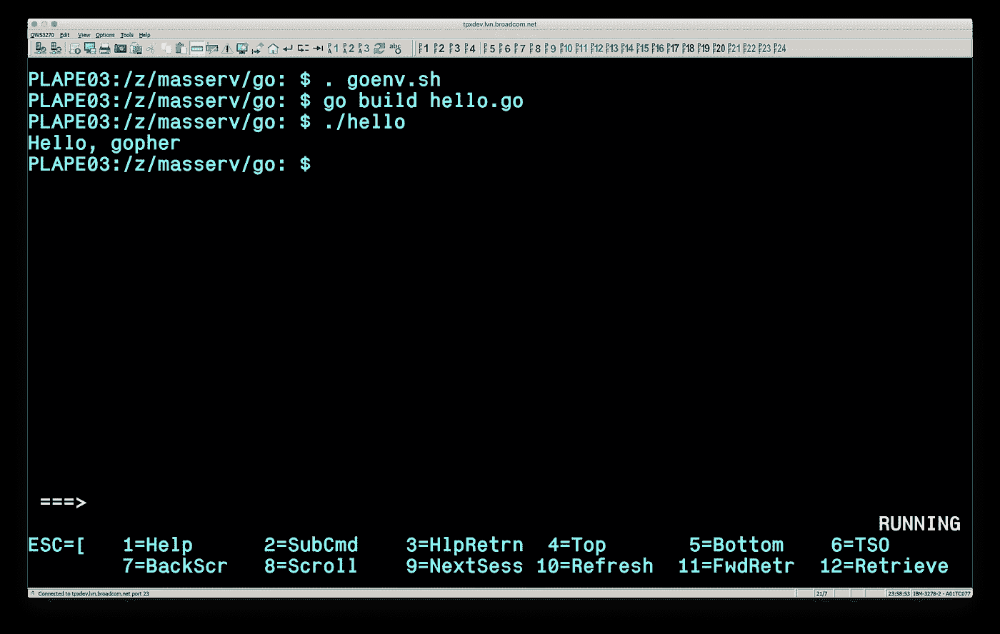
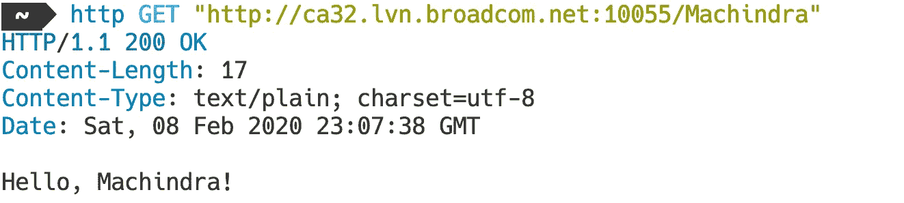

# 在大型机(z/OS)上运行 Go (Golang)

> 原文：<https://levelup.gitconnected.com/golang-on-mainframe-z-os-14276f747eb>

Go 通常被称为 Golang，是一种静态类型的编译编程语言，由 Robert Griesemer、Rob Pike 和 Ken Thompson 在 Google 设计。Go 看起来与 C 类似，但它是内存安全的，它有垃圾收集、结构化类型和 CSP 风格的并发性。

在[Stack Overflow Developer Survey 2019](https://insights.stackoverflow.com/survey/2019)中，它已经排在 Python 和 JavaScript 之后，成为第三大最想要的编程语言。它也与排名第三的高薪工作有关。



堆栈溢出—2019 年开发者调查结果

Rob Pike 在他的演讲[为什么围棋会成功(又名简单就是复杂)](https://youtu.be/k9Zbuuo51go)中解释了围棋成功的主要原因。Go 没有任何其他编程语言中没有的新特性，它有一个非常好的功能强大且易于使用的子集。您将在最后看到的 HTTP 服务器的简单示例不仅易于阅读和理解，而且是生产就绪和完全并发的。


Gopher 很可爱。他有足够的勇气在 z/OS 上运行吗？

# 在系统 z 上安装 Go to Linux

我们将使用我们之前在故事[大型机 Linux 入门](/getting-started-with-linux-on-mainframe-fcd4b19d147d)中创建的 LinuxONE 机器。

[](/getting-started-with-linux-on-mainframe-fcd4b19d147d) [## 大型机 Linux 入门

### 从上个世纪末开始，在大型机(System z)硬件上运行 Linux 并从中受益是可能的

levelup.gitconnected.com](/getting-started-with-linux-on-mainframe-fcd4b19d147d) 

您可以使用运行在大型机上的任何其他 Linux(System z)。这些指令在 RHEL 7.6 上进行了测试。

你可以在`sudo yum install golang`之前使用`yum`安装 Go，但是我们想要最新版本的 **s390x** 架构，所以我们会在[https://golang.org/dl/](https://golang.org/dl/)找到它，下载它，并安装到`/usr/local/go`:

```
curl -OL [https://dl.google.com/go/go1.13.7.linux-s390x.tar.gz](https://dl.google.com/go/go1.13.7.linux-s390x.tar.gz)
sudo tar -C /usr/local -xzf go1.13.7.linux-s390x.tar.gz
```

将`/usr/local/go/bin`添加到`PATH`环境变量中。您可以通过将这一行添加到您的`/etc/profile`(用于系统范围的安装)或`$HOME/.profile`中来实现这一点:

```
export PATH=$PATH:/usr/local/go/bin
```

通过以下方式验证安装:

```
$ go version
go version go1.13.7 linux/s390x
```

Go 已经可以在 System z 上的 Linux 上使用了，但是 z/OS 呢？

# 在 z/OS 上安装 Go

IBM 在 2016 年将 Go 移植到 z/OS。移植的版本是 1.6。我们将从源头安装它。

```
git clone [https://github.com/zos-go/go.git](https://github.com/zos-go/go.git) go-zos
```

我们将在 System z 上使用 Go 编译器 Linux 版来构建 Go 编译器 z/OS 版。我们将使用 https://github.com/zos-go/go/wiki 的[指令。](https://github.com/zos-go/go/wiki)

设置环境变量以构建 z/OS 编译器:

```
export GOROOT_BOOTSTRAP=/usr/local/go
export GOARCH=s390x 
export GOHOSTARCH=s390x 
export GOHOSTOS=linux 
export GOOS=zos 
export GOROOT=~/go-zos
export PATH=$GOROOT_BOOTSTRAP/bin:$GOROOT/pkg/tool/linux_$GOHOSTARCH:$PATH
```

我们将构建交叉编译器和本机编译器。本机编译器的目标文件将在`$GOROOT/bin/zos_s390x`和`$GOROOT/pkg/tool/zos_s390x`目录下生成。

```
cd $GOROOT/src && ./make.bash---
Installed Go for zos/s390x in /home/linux1/go-zos
Installed commands in /home/linux1/go-zos/bin
```

我们将压缩 go-zos 文件夹，并将其转移到 z/OS 系统。

```
jar cvf go-zos.zip go-zos
```

将其下载到您的计算机:

```
scp linux1@{linux-host}:~/go-zos.zip go-zos.zip
```

建议为 Go 分配一个新的 zFS 文件系统。您可以使用以下作业模板，用您的作业卡替换`${jobcard}`和`${prefix}`变量，用 zFS 文件系统替换数据集的前缀。

在 z/OS 上创建 zFS 文件系统的 JCL

您可以下载这个 JCL，然后使用 Zowe CLI 轻松提交:

```
curl -O [https://gist.githubusercontent.com/plavjanik/fbf4fbf4318a1b7a44ac0381a1a39717/raw/19cc8feabd757549e719bb6c1e49b1dc9f6d9986/create_zfs.jcl](https://gist.githubusercontent.com/plavjanik/fbf4fbf4318a1b7a44ac0381a1a39717/raw/19cc8feabd757549e719bb6c1e49b1dc9f6d9986/create_zfs.jcl)
```

在您喜欢的文本编辑器中编辑文件并替换变量。关于参数的更多细节，参见[定义集群](https://www.ibm.com/support/knowledgecenter/SSLTBW_2.4.0/com.ibm.zos.v2r4.idai200/defclu.htm)。

然后您可以使用 Zowe 提交作业并检查其状态:

```
$ zowe zos-jobs submit local-file create_zfs.jcljobid:   JOB41333
retcode: null
jobname: PLAPE03Z
status:  ACTIVE$ zowe zos-jobs view job-status-by-jobid *JOB41333*jobid: JOB41333
retcode: CC 0000
jobname: PLAPE03Z
status: OUTPUT
```

注意:如果你之前没有使用过 Zowe CLI，我推荐你从[Zowe CLI 入门](https://medium.com/zowe/getting-started-with-zowe-cli-7a29420c6be7)开始学习。

[](https://medium.com/zowe/getting-started-with-zowe-cli-7a29420c6be7) [## Zowe CLI 入门

### Zowe CLI 用于 z/OS，就像 AWS CLI 用于 AWS 一样。这是一个客户端 CLI，允许访问所有基础架构…

medium.com](https://medium.com/zowe/getting-started-with-zowe-cli-7a29420c6be7) 

0000 返回代码意味着 zFS 已分配，我们需要使用 SSH 或 telnet 登录到 z/OS，然后发出以下命令来挂载 zFS 文件系统:

```
export GO_HOME=***{go_dir}***
mkdir -p ${GO_HOME}
/usr/sbin/mount -f ***{prefix}***.ZFS ${GO_HOME} 
```

我们有一个很大的文件系统，所以我们可以使用 Zowe CLI 上传 Go for z/OS 包(`go-zos.zip`):

```
zowe zos-files upload file-to-uss --binary go-zos.zip ***{go_dir}***/go-zos.zip
```

我们现在可以继续 z/OS SSH 会话，并将包解压缩到`go-zos`目录:

```
export WORKDIR=***{go_dir}***
cd $WORKDIR
jar xvf go-zos.zip
for f in go-zos/bin/zos_s390x/* go-zos/pkg/tool/zos_s390x/*; do; mv -v "$f" "$f.o"; done
iconv -f UTF-8 -t IBM-1047 go-zos/src/make.bash > go-zos/src/makezos.bash
chmod a+x go-zos/src/makezos.bash
```

为编译器构建过程准备环境:

```
export GOROOT=$PWD/go-zos
export GOARCH=s390x
export GOHOSTARCH=s390x
export GOOS=zos
export GOHOSTOS=zos
export PATH=$GOROOT/bin/zos_s390x:$GOROOT/pkg/tool/zos_s390x:$PATH
export _BPXK_AUTOCVT=OFF
export _CEE_RUNOPTS=""
```

在 z/OS 主机上运行以下命令，在`$GOROOT/bin/zos_s390x`和`$GOROOT/pkg/tool/zos_s390x` 目录中绑定并创建本机工具链:

```
cd $GOROOT/src && ./makezos.bash --bind-tool
```

在`***{go_dir}***`中创建文件`goenv.sh`:

```
export GOROOT=***{go_dir}***/go-zos
export GOARCH=s390x
export GOOS=zos
export PATH=$GOROOT/pkg/tool/zos_$GOARCH:$GOROOT/bin/zos_$GOARCH:$PATH
export _BPXK_AUTOCVT=ON
export _CEE_RUNOPTS="FILETAG(AUTOCVT)"
```

使用以下方式激活它:

```
. goenv.sh
```

# 你好，世界！

让我们创建一个简单的 Go 程序，在 z/OS 上打印一条消息。

该文件需要采用 UTF 8 或 ASCII 格式:

```
touch hello.go
chtag -t -c ISO8859-1 hello.go
vi hello.go
```

内容:

```
package mainimport "fmt"func main() {
    fmt.Println("Hello, gopher")
}
```

构建程序并运行它:

```
go build hello.go
./helloHello, Gopher!
```



z/OS 上的地鼠！

# 简单 HTTP 服务器

在 Go 中创建 HTTP 服务器很容易。虽然代码很简单，但这个服务器是真正的并发和生产就绪的。

简单 HTTP 服务器



来自该服务器的示例请求和响应

# 摘要

Go 可以在 System z 上的 Linux 和 z/OS 系统上使用。然而，z/OS 端口是旧的—2016 年的版本 1.6。