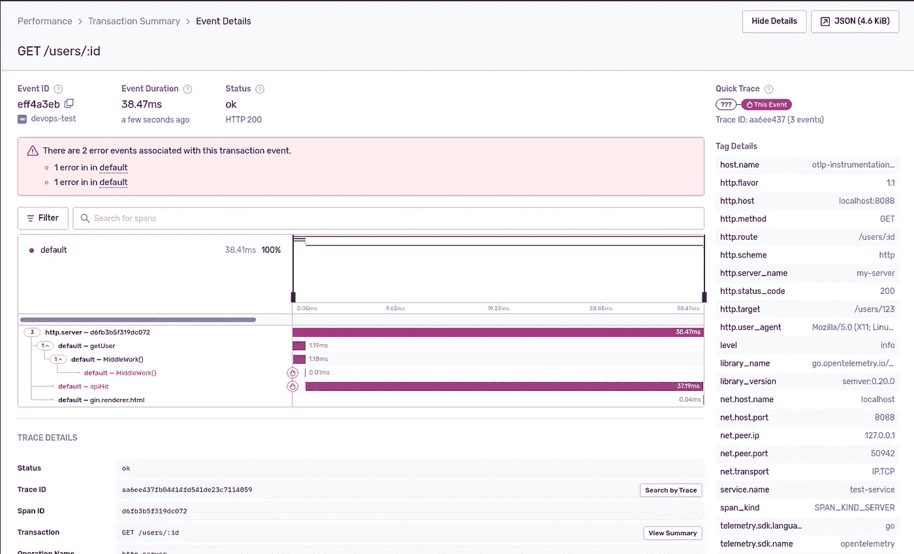
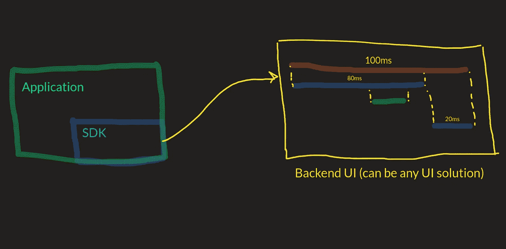
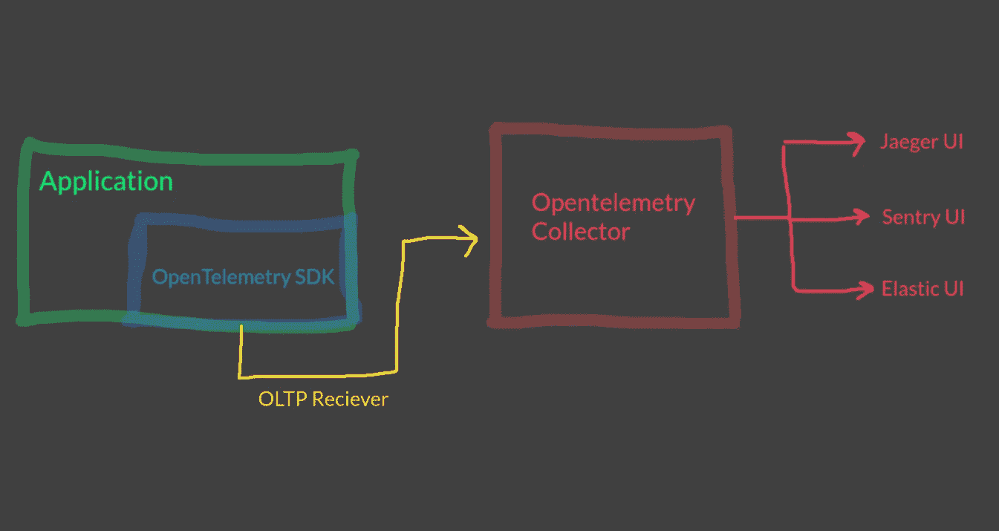
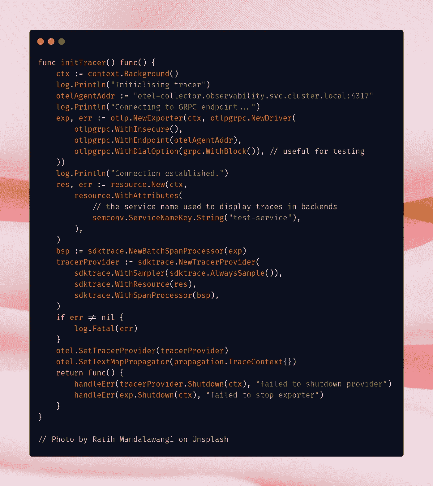
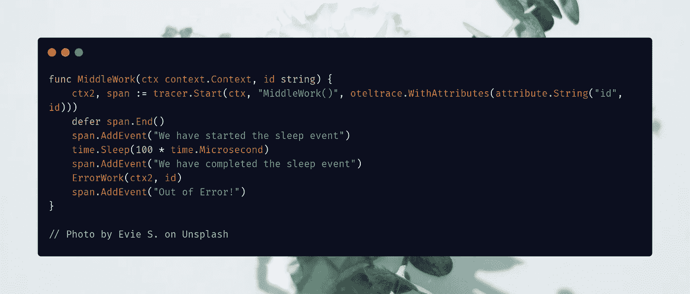
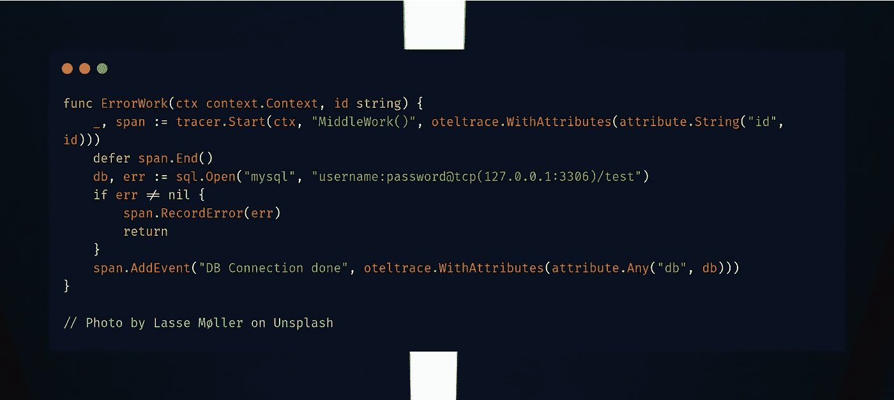
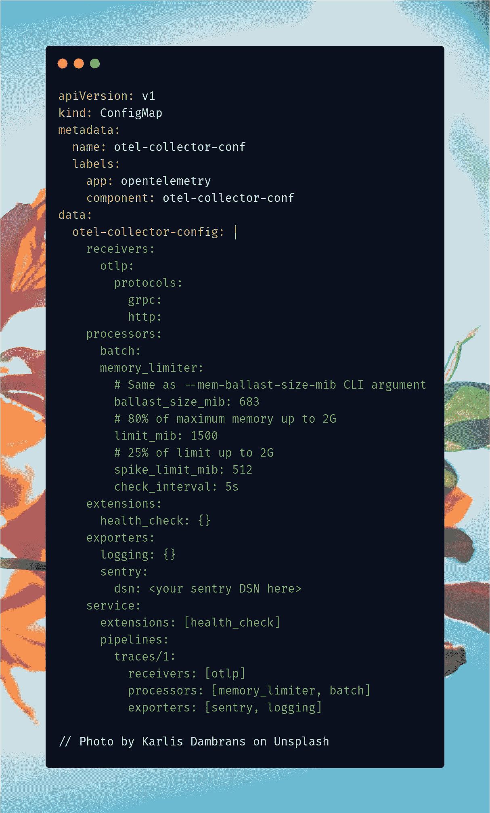

# Golang、Opentelemetry 和 Sentry——被低估的分布式跟踪堆栈

> 原文：<https://levelup.gitconnected.com/golang-opentelemetry-and-sentry-the-underrated-distributed-tracing-stack-69dcda886ffe>

**TL；博士🚶** 我做了一个迷你仪器示例，演示了如何配置 golang 应用程序来使用 opentelemetry 并将获得的轨迹推送到 sentry 后端。下面是 Github 的链接(您可以在那里找到运行示例的步骤)

 [## uds 5501/sentry-open 遥测-示例

### 要运行这个例子，您需要一个 kubernetes 集群。这个例子已经在 Minikube AWS Elastic 上进行了测试…

github.com](https://github.com/uds5501/sentry-opentelemetry-example) 

# 简介**👋**

还在吗？厉害！

分布式跟踪是微服务架构的可观察性、跟踪和分析的重要组成部分。我不会深入探究跟踪的基本含义及其工作原理，因为有大量的相关资源，如果您需要关于分布式跟踪工作原理的具体内容，我推荐 Open Tracing 关于[分布式跟踪](https://opentracing.io/docs/overview/what-is-tracing/)的文章，以获得基本概述，并推荐 Alois 关于 W3 跟踪上下文的博文，以更好地阐述分布式跟踪的工作原理。

# 这么多跟踪后端造成的混乱**🤔**

但是在整个追踪难题中有一个小小的矛盾。虽然跟踪上下文规范和指南可能已经声明，但应用程序的插装仍然是广泛的“后端特定”问题。我的意思是，我们有各种各样的后端可以可视化跟踪，如哨兵，耶格，谷歌云跟踪，新遗迹，弹性等等。他们每个人都有自己的仪器 SDK。

现在假设，今天你决定使用弹性 APM，并使用他们的 SDK 为你的微服务提供工具，后来你决定，嘿，这太重了，我们改用更轻的东西怎么样，比如说 Jaeger / Sentry？

哎呦！你必须使用 sentry / Jaeger 特定的 SDK 重新安装整个应用程序，因此，会产生巨大的技术开销。

# 这就是 OpenTelemetry 的用武之地**🚀**

有了 [opentelemetry](https://opentelemetry.io/) ，人们就不必重新测试他们的整个应用。相反，我们需要使用 OpenTelemetry 对我们的应用程序进行一次检测，这个 SDK 会将这些跟踪发送到一个“Open Telemetry Collector ”,该 Collector 会收集这些跟踪并将它们一次导出到多个后端。

# 为什么是哨兵？👀

像每一个可观察性堆栈一样，Sentry 有它的优点和缺点。但是具体来看 Sentry 作为一个分布式跟踪用户界面，下面是我特别喜欢的优点。

*   它相对紧凑，资源密集程度较低。我们的组织过去一直在使用 New Relic 和 Elastic APM，虽然它们本身完全支持日志记录+跟踪+指标，但它们是资源密集型的，如果您真的在寻找一个可靠的 ol，我会选择托管在简单 EC2 机器上的 sentry，而不是完全成熟的 k8s 集群。
*   哨兵是无与伦比的错误管理和警报能力。

T4 也有一些缺点:

*   要对错误使用堆栈跟踪捕获，您需要使用他们的官方 SDK，因为目前，opentelemetry 本身不支持完美的堆栈跟踪捕获。
*   Opentelemetry 自己的日志目前处于测试阶段，并且在多个语言特定的 SDK 中处于冻结的开发状态，因此这种组合在这方面是一种缺失。

# 理论已经讲得够多了，现在我该如何检测我的 Golang 应用程序呢？⚒️

我使用了 github 上的 openetelemetry 的 go sdk ,并在 golang 中使用了它们的文档。

整个工具可以在最初提到的 github 存储库中的`main.go`文件中找到。让我一步一步地告诉你，你是如何对你的应用程序进行检测的。

## 初始化跟踪器

首先必须初始化在`initTracer()`方法中处理的跟踪器。它首先创建一个**新导出器** (OLTP 导出器)，它通过 GRPC 协议连接到我们收集器的端口 4317。(嘶...我们通过**otel-collector . observability . SVC . cluster . local:4317**连接到收集器，这意味着它在端口 4317 连接到 observability 名称空间中的 otel-collector 服务

然后，我们创建一个新的**资源**来建立我们的服务名(在本例中，它是 test-service)。

然后获取一个 Span 处理器，最后我们创建一个 **TracerProvider** ，然后在我们的应用程序中对其进行全局设置。值得注意的一件有趣的事情是，我们可以决定我们应该采样多少条轨迹，目前通过`AlwaysSample()`，我们命令我们的跟踪提供者总是采样轨迹。

这可能对开发环境有好处，但是在生产中，我建议采用 10-20%的采样率，这样就不会在系统中产生任何技术债务(痕迹通常很重)。

## 开始吧。停下来。传播。

现在，我们的基本追踪器提供程序已经准备好了，让我们开始了解我们到底是如何开始、停止和记录事件的。

你可以在`somework/service.go`里找到这个函数。追踪器。Start()方法标记一个 span 和 span 的开始。End()结束一个跨度。我们可以分别使用`span.AddEvent()`和`span.RecordError()`在一个时间跨度内添加事件和记录错误。

要将跨度上下文传递给其他函数，您需要做的就是将当前的跨度上下文(在本例中为`ctx2`)传递给下一个函数。下面是如何在`ErrorWork()`函数中完成的。

# 设置 opentelemetry 收集器和导出器。🚢

这实际上是容易的部分，你需要在一个配置文件中设置 3 件事。

首先，我们配置**接收器，**也就是说，这是 SDK 导出器将跟踪信息推送到的地方。在这里，我们允许 oltp 接收器使用 grpc 和 http 协议(默认端口为 4317，如果没有提到的话)

然后你需要一些**处理器和扩展**，我已经使用了 memory_limiter 和 batch 处理器来确保我的收集器不会超过 512 mib 的峰值和 1500 mib 的内存限制。

现在，你设置你的**出口。**您可以一次配置多个导出器，就像这里，我已经配置了一个日志导出器(它将跟踪导出到 pod 的终端)和一个 sentry 导出器，它将跟踪同时导出到 sentry UI。

搞定这三个了吗？现在我们要做的就是创建一个**管道**，它有一个接收器、处理器、输出器和 Tada！

# 资源🔖

*   [打开遥测文档](https://opentelemetry.io/)
*   [打开遥测采集器 Github](https://github.com/open-telemetry/opentelemetry-collector)
*   [哨兵分布式追踪](https://docs.sentry.io/product/sentry-basics/tracing/distributed-tracing/)
*   [Github 仪器库](https://github.com/uds5501/sentry-opentelemetry-example)