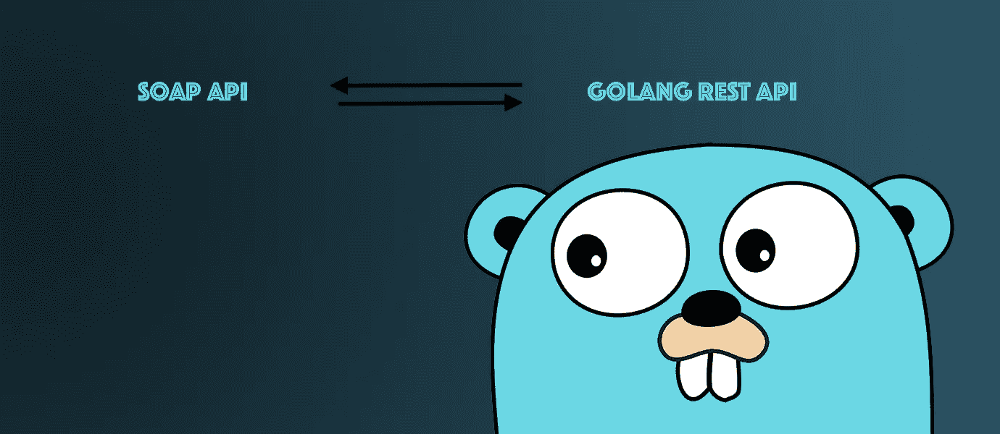

# 基于 Golang 和 SOAP 的服务

> 原文：<https://levelup.gitconnected.com/golang-soap-based-services-ccc4b3e3ee2e>

由于 Golang 的各种优势，它在企业应用程序中得到了广泛的应用，但是在尝试将一种新语言应用到您的项目中时，仍然会遇到一些前所未有的情况。我们在项目中遇到的挑战之一是将基于 SOAP 的服务与 RESTful API 集成。尽管在 Golang 上实现和集成基于 SOAP 的服务有多种方法，但我们通过使用 Go 上可用的少数供应商 dep 选择了其中一种方法。



*需要考虑的部门:*

*   `encoding/xml`:理解 XML 名称空间的简单 XML 1.0 解析器
*   `text/template` : template 实现数据驱动的模板，用于生成文本输出。

下面的代码片段显示了我们如何集成基于 SOAP 的服务的概述，接下来的部分将显示详细描述实现集成的步骤的逐步方法。

```
**func** callSOAPClientSteps(){

   req := populateRequest()

   httpReq, err := generateSOAPRequest(req)
   **if** err != nil {
      fmt.Println("Some problem occurred in request generation")
   }

   response, err := soapCall(httpReq)
   **if** err != nil {
      fmt.Println("Problem occurred in making a SOAP call")
   }
}
```

# **SOAP 请求模板**

为我们正在与可以动态分配的*变量*交互的服务创建一个 SOAP 模板。假设您正在使用一项服务，该服务需要如下所示的有效负载。用一个变量初始化它，如`getTemplate`

```
 **var** getTemplate =
<soapenv:Envelope
 xmlns:soapenv="[http://schemas.xmlsoap.org/soap/envelope/](http://schemas.xmlsoap.org/soap/envelope/)"
 xmlns:api="[http://soapdummies.com/api](http://soapdummies.com/api)">
 <soapenv:Header/>
 <soapenv:Body>
  <api:Command
   ae nc" href="http://soapdummies.com/api" rel="noopener ugc nofollow" target="_blank">http://soapdummies.com/api">
   <api:Credentials>
    <api:Username>{{.Username}}</api:Username>
    <api:Password>{{.Password}}</api:Password>
   </api:Credentials>
   <api:Body>
    <SOAPDummy schemaVersion="3.0"
     ae nc" href="http://soapdummies.com/products/request" rel="noopener ugc nofollow" target="_blank">http://soapdummies.com/products/request">
     <Identity>      
      <Title/>
      <FirstName>{{.FirstName}}</FirstName>
      <MiddleName>{{.MiddleName}}</MiddleName>
      <LastName>{{.LastName}}</LastName>
      <Suffix/>
      <DOB>{{.Dob}}</DOB>
      <Address>
       <Line1>{{.AddressLine1}}</Line1>
       <Line2>{{.AddressLine2}}</Line2>
      </Address>
      <City>{{.City}}</City>
      <State>{{.State}}</State>
      <Zip>{{.ZipCode}}</Zip>
      <MobilePhone>{{.MobilePhone}}</MobilePhone>
     </Identity>
    </SOAPDummy>
   </api:Body>
  </api:Command>
 </soapenv:Body>
</soapenv:Envelope>
```

*变量是以`{{.*variables*}}` ( *Ex* `*{{.Username}}*` *，* `*{{.FirstName}}*` *，* `*{{.AddressLine1}}*` *等*的形式表示的*，在向 SOAP 端点发出请求时被动态赋值为实际值。

# SOAP 请求的结构

创建一个结构，将变量*从`getTemplate`替换为实际值，方法是将值赋给结构。*

```
**type** Request **struct** {
   //Values are set in below fields as per the request
   FirstName    string
   LastName     string
   MiddleName   string
   AddressLine1 string
   AddressLine2 string
   City         string
   State        string
   ZipCode      string
   MobilePhone  string
   SSN          string
   Dob          string
   Username string
   Password string   
}
```

# 填充 SOAP 请求

一旦创建了一个`Request`结构，就使用`populateRequest()`填充这些值。

```
**func** populateRequest() *Request {
   req := Request{}
   req.FirstName = "Tony"
   req.MiddleName = ""
   req.LastName = "Blaire"
   req.Dob = "1946-08-08"
   req.AddressLine1 = "866 Atlas Dr"
   req.AddressLine2 = "Apt 999"
   req.City = "London"
   req.State = "England"
   req.ZipCode = "SW15 5PU"
   req.MobilePhone = "9876543210"
   req.Username = "tony1"
   req.Password = "password1"
   **return** &req
}
```

# SOAP 响应示例

```
<soap:Envelope xmlns:soap=”[http://schemas.xmlsoap.org/soap/envelope/](http://schemas.xmlsoap.org/soap/envelope/)" xmlns:xsd=”[http://www.w3.org/2001/XMLSchema](http://www.w3.org/2001/XMLSchema)" xmlns:xsi=”[http://www.w3.org/2001/XMLSchema-instance](http://www.w3.org/2001/XMLSchema-instance)">
 <soap:Body>
 <api:Response xmlns:api=”[http://soapdummies.com/products](http://soapdummies.com/products/request)/response">
 <api:Solution>Standard/MultiProduct</api:Solution>
 <api:RequestID>baff2531-1959-42b0-947a-807b77a87814</api:RequestID>
 <api:Body> 
 <Status>100</Status>
 <Salary>1</Salary>
 <Designation>A1</Designation>
 <Manager>122960618779897</Manager>
 <Company>2019–07–09T07:31:03</Company>
 <EmployedSince>500</EmployedSince>
 </api:Body>
 </api:Response>
 </soap:Body>
</soap:Envelope>
```

基于上面的 SOAP 响应示例，我们可以创建一个结构来在 RESTful API 中使用它。

# SOAP 响应的结构

创建一个结构来解组从 SOAP API 收到的响应。这是在 SOAP 响应的反序列化过程中可能会遇到问题的部分，因此我们应该相应地仔细构造响应结构以避免问题。

```
**type** Response **struct** {
   XMLName  xml.Name `xml:"http://schemas.xmlsoap.org/soap/envelope/ Envelope"`
   SoapBody *SOAPBodyResponse
}

**type** SOAPBodyResponse **struct** {
   XMLName      xml.Name `xml:"Body"`
   Resp         *ResponseBody
   FaultDetails *Fault
}

**type** Fault **struct** {
   XMLName     xml.Name `xml:"Fault"`
   Faultcode   string   `xml:"faultcode"`
   Faultstring string   `xml:"faultstring"`
}

**type** ResponseBody **struct** {
   XMLName       xml.Name `xml:"Response"`
   RequestID     string   `xml:"RequestID"`
   Response      *Body
   Status        string   `xml:"Status"`
}

**type** Body **struct** {
   XMLName            xml.Name `xml:"Body"`
   Status             string   `xml:"Status"`
   Salary             string   `xml:"Salary"`
   Designation        string   `xml:"Designation"`
   Manager            string   `xml:"Manager"`
   Company            string   `xml:"Company"`
   EmployedSince      string   `xml:"EmployedSince"`
}
```

请注意，添加了 *Fault* 结构来处理 SOAP API 返回的任何错误，以便让客户端捕获它。

# SOAP 请求

对 SOAP 服务的调用与 REST API 调用没有什么不同，使用`http`包对预期的 SOAP 服务进行调用。下面的示例代码应该显示它是如何完成的。

```
**func** generateSOAPRequest(req *Request) (*http.Request, error) {
   // Using the var getTemplate to construct request
   template, err := template.New("InputRequest").Parse(getTemplate)
   **if** err != nil {
      fmt.Println("Error while marshling object. %s ",err.Error())
      **return** nil,err
   }

   doc := &bytes.Buffer{}
   // Replacing the doc from template with actual req values
   err = template.Execute(doc, req)
   **if** err != nil {
      fmt.Println("template.Execute error. %s ",err.Error())
      **return** nil,err
   }

   buffer := &bytes.Buffer{}
   encoder := xml.NewEncoder(buffer)
   err = encoder.Encode(doc.String())
   **if** err != nil {
      fmt.Println("encoder.Encode error. %s ",err.Error())
      **return** nil,err
   }

   r, err := http.NewRequest(http.*MethodPost*, "https://www.soapurl.com/retreiveIdentity", bytes.NewBuffer([]byte(doc.String())))
   **if** err != nil {
      fmt.Println("Error making a request. %s ", err.Error())
      **return** nil,err
   }

   **return** r, nil
}
```

# SOAP 调用

创建请求后，进行如下所示的 SOAP 调用

```
**func** soapCall(req *http.Request) (*Response, error) {
   client := &http.Client{}
   resp, err := client.Do(req)

   **if** err != nil{
      **return** nil,err
   }

   body, err := ioutil.ReadAll(resp.Body)
   **if** err != nil {
      **return** nil,err
   }
   **defer** resp.Body.Close()

   r := &Response{}
   err = xml.Unmarshal(body, &r)

   **if** err != nil {
      **return** nil,err
   }

   **if** r.SoapBody.Resp.Status != "200" {
      **return** nil,err
   }

   **return** r, nil
}
```

在解组响应时，使用本机编码/xml dep 来反序列化从 SOAP 服务接收的响应。xml。解组方法有助于用从服务接收的相关值填充结构。

虽然有多种方法可以将基于 golang 的 API 与遗留服务集成在一起，但这个例子可以说是集成基于 SOAP 的服务的有效方法之一，只需最少地使用供应商的 dep 来完成 SOAP 集成。