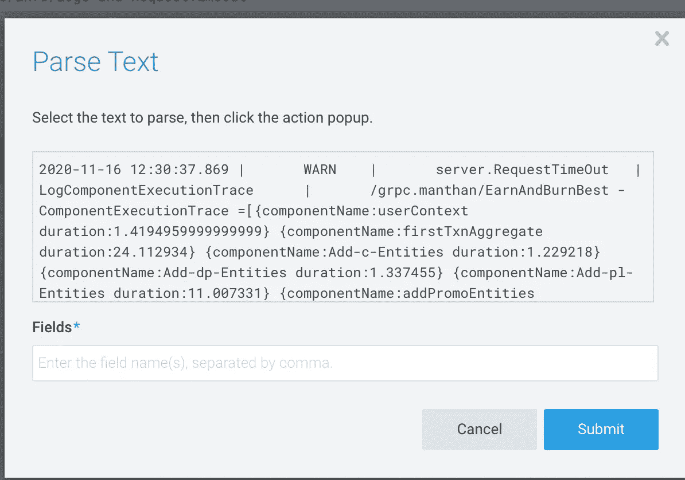

# Golang:使用 Sumologic 复杂日志解析跟踪 1%的请求超时

> 原文：<https://levelup.gitconnected.com/golang-tracking-1-request-timeouts-with-sumologic-complex-log-parsing-febf9e8ef59e>

## **简介**

吸引最终用户的一个主要因素是应用程序响应用户请求的速度。当流量较低时，应用程序执行得相当好，但是一旦应用程序上的负载增加，事情就开始失败了。

在将应用程序投入生产之前，将对应用程序服务器或数据库服务器能够处理的最大负载进行严格的基准测试。基于预期的负载和波动，服务设置 SLA 超时(服务级别协议),表示如果处理任何请求花费的时间超过该 SLA 时间，上游服务必须以超过截止时间错误取消请求。

## **问题陈述**

手动基准测试只是评估系统容量的初步检查，但是我们开发人员不能仅仅依赖于基准测试的结果。因此，为了监控实时交通信息，我们开始使用应用程序监控工具，如 **NewRelic。**

在实时应用程序监控、洞察、警报等方面，NewRelic 是市场上最好的。但我觉得它缺少一样东西。


上图描述了 GRPC 服务，以及每个子组件所用的平均时间。我们识别服务的痛点，并为每个痛点启动一个事务，以便我们可以跟踪它们。


NewRelic 还为我们提供了%(百分位数)的性能。基于此，我们可以说中值低于 50 毫秒，95 %的请求在不到 500 毫秒内得到服务，4%的请求花费了将近 2 秒。假设我的服务 SLA 是 250 ms，如果我们仔细观察，就会发现有一些主要的东西丢失了。

*   **如果请求处理超过 SLA，我无法跟踪我的每个子组件花费了多少时间。可能有 50 个子组件，调试每一个都是一场噩梦。**
*   **该仪表板不提供 100 %的请求处理报告。这意味着如果服务每分钟处理 100K 个请求，99%低于 SLA 超时，但 1%的请求超过了这个时间。这意味着对于每 100K 个请求，我们在 1K 个请求上超时，我们甚至没有得到通知，也不能发出警报。**

在接近 150，150K RPM 的规模下工作，对我们来说，跟踪所有这些指标以跟踪确切的难点并确定哪里出错是至关重要的。

## **解决方案**

这时，我们构建了一个定制的跟踪模块，它计算每个组件花费的时间，并将其记录到 stdout 中。

让我们进入代码的细节。我的跟踪器几乎没有结构字段。

*   trackerEnabled-->这表示我是否必须跟踪请求。可以在运行时动态切换
*   tracker Name-->这类似于我们正在跟踪的 API 或 GRPC 服务名。
*   trackerStartTime-->这表示请求开始的时间。
*   componentexctrace->这是一个包含子组件名称及其执行时间的切片。
*   slaTimeOut ->如果总处理时间超过这个时间，将记录组件执行时间。

**功能**

*   StartTransaction ->为子组件启动新的事务
*   EndTransaction ->结束已开始的事务
*   logcomponenteexecutiontrace->检查 diff b/w 当前时间，并请求以毫秒为单位的开始时间，如果 diff 大于 SLA 超时，它将记录单个组件的执行跟踪。
*   AddCanonicalLog ->如果任何特定的信息需要与相同的组件跟踪一起记录，我们可以将其添加为规范日志的一部分。

在每个 API 或服务开始时，我们用 trackerName & slaTimeOut 初始化跟踪器。(SLA 超时是非强制性的，因此，如果我们需要记录所有请求组件执行跟踪，我们不需要任何额外的开发)

**用法**

我们在每个 API 请求上初始化一个 tracker 对象，并从中创建一个上下文。因为上下文作为第一个参数是每个函数的一部分，所以我们不需要将这个跟踪器作为一个单独的参数传递给所有的子函数。如果任何一个子函数需要获取 tracker 对象，它们需要做的就是:

```
trackerObject = tracker.FromContext(parentContext)
```

这是示例日志的样子。

```
2020-11-16 12:30:37.869	|	WARN	|	server.RequestTimeOut	|	LogComponentExecutionTrace	|	/grpc.manthan/EarnAndBurnBest - ComponentExecutionTrace =[{componentName:userContext duration:1.4194959999999999} {componentName:firstTxnAggregate duration:24.112934} {componentName:Add-c-Entities duration:1.229218} {componentName:Add-dp-Entities duration:1.337455} {componentName:Add-pl-Entities duration:11.007331} {componentName:addPromoEntities duration:13.598098} {componentName:updateNonReferencedRules duration:0.0011409999999999999} {componentName:secondTxnAggregate duration:1.218247} {componentName:parseComplexResp duration:28.384265999999997} {componentName:processEarnTxn duration:12.904318} {componentName:processBurnTxn duration:83.656057} {componentName:formEarnBurnResponseTxn duration:0.589044} {componentName:EarnAndBurnImpls duration:150.10316200000003}]
```

现在是我们解析日志的时候了，用它构建一个仪表板，并尝试找出哪个组件花费了更多的时间。

我们使用的日志聚合器是 **Sumologic** 。它有两种日志记录方式。

*   Rest Client ->应用程序必须在每个日志请求上对 sumo logical rest-Client 进行网络调用。
*   后台监听器->在这里，我们将它直接记录到 stdout，Sumologic 监听器一直监听所有的更改，并在光标的帮助下，跟踪所有这些日志，并一直将它们推送到服务器。

我们更喜欢方法 2，因为这减少了多个应用程序与 Sumologic Rest 客户端的集成。


打开 sumologic 仪表板，右键单击日志并选择**解析所选文本。点击后会打开一个对话框。**



现在单击组件执行时间，您将得到如下文本。


假设我想提取这个值作为用户上下文。


最后的结果是这样的。


现在，如果我需要检查燃烧组件的最大时间。


通过这种复杂的日志解析，我们不仅可以实现排序功能，还可以实现许多聚合功能，我们可以计算出 95 %的请求处理时间、99%的处理时间等。

希望我已经涵盖了我想要的。如果有任何问题或疑问，请发表在评论区，我会尽快回复。