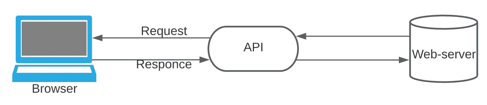

# 好的 API 设计，坏的 API 设计

> 原文：<https://levelup.gitconnected.com/good-api-design-bad-api-design-2405dcdde24c>

现代 REST API 设计的原则和规则

丹尼·米勒在 [Unsplash](https://unsplash.com?utm_source=medium&utm_medium=referral) 上的照片

通常，更新或开发某个服务的 API 时，会对 API 的结构、命名和功能进行长时间的讨论。尽管多年来已经创建了一些规则，但这些规则可以应用到开发过程中，并有助于在开发过程中找到共同点。

首先是一些基础知识。

API -是应用编程接口的首字母缩写**，它是一种允许两个应用程序相互对话的软件。在本文中，我们将关注 web API。**

Web 应用程序结构

基本上，每次你使用一个 web 应用程序，发送一条消息，或者访问某个 URL，你都在使用某个应用程序的 API，无论它是客户端应用程序还是服务器应用程序。

因为 API 和其他所有东西之间的所有通信都是通过 HTTP 完成的，所以记住 HTTP 有一组不同的方法必须用于特定的目的是很重要的。其中最重要的是:

*   `GET` —请求指定资源的表示。使用 GET 的请求应该只检索数据。
*   `POST` —向指定的资源提交数据。
*   `PUT` —用请求数据替换目标资源的所有当前表示。
*   `DELETE` —删除指定的资源。
*   `PATCH` —对资源应用部分修改。

关于其余的可以在这里阅读**更详细。**

**多年来，有几种不同类型的 API 架构和协议。它们在指定数据类型和命令的方式上不同，在功能上也不同。有一段时间最流行的是基于 XML 的协议，但现在它大多被 JSON 所取代。**

**当今世界最常见的 API 架构是 REST ( *表述性状态转移*)。使用 REST 时，必须遵循 JSON 规则，并以有效的 JSON 格式形成请求。除此之外，好的 API 应该遵循以下规则:**

*   **API 必须与后端、数据存储、客户端等分离。由于安全性和灵活性，它必须是单独的层。**
*   **state less——不同的请求应该彼此一无所知，并被独立处理。这也意味着每个请求都需要包含处理它所需的所有信息。**
*   **API 应该独立于发送请求的客户端以相同的方式工作(例如，它是 web 服务器、负载平衡器还是任何其他客户端)。**
*   **REST APIs 通常发送静态资源，但是在后一种情况下，响应也可以包含可执行代码(比如 Java 小程序)。在这些情况下，代码应该只按需运行。**
*   **可缓存性—如果可能，资源应该在客户端或服务器端可缓存。目标是提高客户端的性能，同时增加服务器端的可伸缩性。虽然，有一些特殊的头像**来控制缓存行为。****
*   ****处理错误并返回相应的错误代码。所有错误都有其特定的代码，而不是向用户抛出内部错误，处理它并发送相应的代码和消息(例如，404-未找到。代码列表可以在[**这里找到**](https://developer.mozilla.org/en-US/docs/Web/HTTP/Status) )****
*   ****不要忘记 API 应该是幂等的(也就是说可以多次调用得到相同的结果)。用户有时可以复制到达 API 的请求。这些重复的请求可能是无意的(或者由于超时或网络问题而故意的)。所以 API 必须是容错的，这样重复的请求应该有相同的结果(只有 POST 请求不是等幂的)。****
*   ****使用 swagger 或其他工具编写 API 文档。文档是非常重要的部分(如果有人将来会使用这个 API 的话)****

****命名端点也有一些好的方式:****

*   ****仅使用名词:应该用指定资源内容的名词来命名端点，而不是为正在执行的功能添加一个动词(例如，命名端点 */users* 并使用不同的 HTTP 方法来处理 users 实体，而不是创建几个端点，如 */get-user* 、 */add-user* 等)。).****
*   ****使用清晰的名称:端点的名称应该清晰直观(不要使用任何快捷方式或缩写，除非它是显而易见的— */ids* 可以理解并且比*/identificati on-numbers*更可取)。****
*   ****通过正斜杠构建层次结构:将端点分组为逻辑组(*/部门/id*和*/部门/经理*比*/部门-id*和*/部门-经理更好)。*****
*   ****仅使用小写:URIs 区分大小写(根据 [**规范**](https://datatracker.ietf.org/doc/html/rfc3986) )，所以除非必要，最好尽量避免大写。****
*   ****使用“-”来分隔单词:端点名称中的不同单词通常用“-”来分隔，而不是下划线或大小写。****
*   ****避免使用特殊字符:URL 只能使用 ASCII 字符集发送和接收，因此可以只使用该字符集的字符(也有一些可预期但不安全的字符，如“%”、“[]”、“{}”、“|”、“<>”，最好尽量避免使用它们)。****

****REST API 大部分是和微服务架构一起做的。在这种情况下，这种 API 结构将提供改变底层逻辑、添加或删除组件等的灵活性。而不改变与其他服务的其他通信协议。****

****有了所有的规则，让我们看看 API 的例子:****

*   ****Stripe(在线支付系统):[https://stripe.com/docs/api](https://stripe.com/docs/api)****
*   ****https://www.twilio.com/docs/usage/api****
*   ****领英:[https://docs.microsoft.com/en-us/linkedin/](https://docs.microsoft.com/en-us/linkedin/)****

****如果您想更深入地了解 API 设计，这里有一些有用的资源:****

**** [## 网络应用编程接口的设计

### 以一种易于访问的方式组装 API 设计的基本构件，并带您了解大量的…

www.manning.com](https://www.manning.com/books/the-design-of-web-apis)  [## REST API 设计的最佳实践

### 了解如何设计 REST APIs，使其易于任何人理解，面向未来，安全且快速，因为它们服务于数据…

stackoverflow.blog](https://stackoverflow.blog/2020/03/02/best-practices-for-rest-api-design/) 

谢谢，保重！****