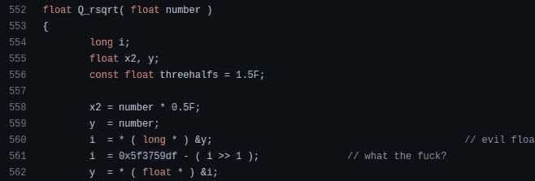
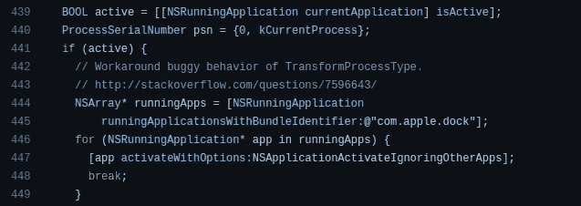

# 每个程序员都应该有的好习惯

> 原文：<https://levelup.gitconnected.com/good-habits-that-every-programmer-should-have-333154658535>

## 实践这些好习惯，成为一个人人尊敬的杰出程序员

由[萨法尔·萨法罗夫](https://unsplash.com/@codestorm?utm_source=unsplash&utm_medium=referral&utm_content=creditCopyText)在 [Unsplash](https://unsplash.com/s/photos/coding?utm_source=unsplash&utm_medium=referral&utm_content=creditCopyText) 拍摄，由 Canva 编辑

程序员通常遵循各种实践来改进他们的工作方式，以在他们的职业生涯中前进，扩展他们的知识，并增加他们的收入。他们通常从高级工程师、开源项目和互联网资源中学习好的实践。同时，一些顽固的程序员在他们漫长的编程旅程中定义了独特的好习惯。

在我们的编程生涯中，我们通常有机会参与许多项目。每个项目都用不同的技术和基础设施带来新的体验。然后根据一个具体的项目和开发文化，实践各种好习惯。但是，在核心层，我们可以找到好的通用习惯，每个程序员都可以实践，不管项目领域或技术如何。

我十三岁开始用微软 Visual Basic 版本`6.0`编程。我从事过许多不同技术的软件项目，使用过十多种编程语言。在我的软件工程生涯中，以下好习惯帮助我提高了编程技能和知识。一定要把这些好习惯也加入到你漫长的编程生涯中！

# 掌握维护和优化方法

怎样才能开发出高质量的软件系统？一些软件项目以令人印象深刻的架构设计和规范开始，但是后来它们经常变得臃肿，不太受欢迎，并且没有维护。例如，我们都喜欢 Windows-XP-就像早期的微软操作系统一样，但是后来，这个伟大的操作系统变得臃肿、缓慢、不太受欢迎。与此同时，一些软件系统开始时是实验性的，但却拥有令人印象深刻的用户群和开发者社区。

延长特定软件系统的寿命有两个秘密:维护和优化。维护包括重构代码库、修复已识别的错误，以及通过回答问题来帮助用户。甚至一个简单的 GitHub Dependabot 自动拉取请求合并也能提高你的项目质量。

另一方面，优化是反膨胀的武器。根据众所周知的[摩尔定律](https://en.wikipedia.org/wiki/Moore%27s_law)，计算机每天都变得越来越强大，因此代码优化越来越被低估。但是，写出即使在旧电脑上也能流畅运行的优化代码，无疑是每个程序员都应该有的好习惯。

过去的程序员通过按位操作优化平方根倒数计算，如下所示:

[雷神之锤 III 竞技场](https://github.com/id-Software/Quake-III-Arena/blob/dbe4ddb10315479fc00086f08e25d968b4b43c49/code/game/q_math.c#L552)中的快速平方根倒数算法，作者截图

[优化](/5-things-to-know-before-you-write-optimized-code-3ca424110db1)你的代码库以支持低端计算设备。编写干净和最少的源代码也是优化的一部分。

# 当你掌握一个库、框架或工具时，学习内部知识

每天，我们都会看到新的工具、框架或软件库，让我们的生活变得更加轻松。这些创新通常很受欢迎，拥有大量用户。稍后，我们可以看到新发布的趋势技术的各种职业道路。例如，谷歌在 2018 年宣布了 Flutter——现在，数百万开发者使用 Flutter 来构建跨平台的应用。

我们可以通过长期从事某项特定的技术而变得擅长某项特定的技术。怎样才能成为某项特定技术的专家？学习内部是一个很好的习惯，支持我们成为任何技术的专家。例如，在使用 Git 一段时间后，您可以通过不太为人知的[管道命令](http://git-scm.com/docs#:~:text=update%2Dserver%2Dinfo-,Plumbing%20Commands,-cat%2Dfile)来学习 Git 的内部机制。

当您了解技术堆栈的内部时，您可以做出准确的技术决策。当您学习内部时，您确实会更加熟悉特定技术的局限性和变通方法。学习内部知识也有助于我们理解我们每天都在用编程做什么。激励每个人进一步了解他们工具的内部原理！

# 使用 DevOps 原则并激励他人使用

在过去，程序员习惯于手工进行软件工程活动。还记得我们的老朋友菲莱兹拉吗？—过去的 web 开发人员经常使用 FTP 工具更新他们的软件系统。但是，现在我们甚至可以通过推送一个简单的 Git 标签来自动部署 web 应用程序。类似地，DevOps 运动彻底改变了我们用自动化开发软件系统的方式。

如今，每个软件开发团队都努力集成 DevOps 实践，以在现代软件市场中保持竞争力。软件工程师往往倾向于实现 DevOps 原则，以节省每个人的时间。然而，一些软件开发团队仍然没有在 DevOps 上投入时间，因为 DevOps 原则通常不会添加他们可以向最终用户展示的特性。

DevOps 不仅仅是关于软件发布工作流程的自动化——它激励我们自动化整个软件开发生命周期( [SDLC](https://en.wikipedia.org/wiki/Systems_development_life_cycle) )。使用 DevOps 原则来节省您的时间，并激励其他软件开发团队提高他们的生产力。

# 尊重地使用其他程序员的辛勤劳动

现实是，由于有限的开发时间和受控的预算，很难从头开始编写每个软件组件。假设您计划在不使用任何第三方库的情况下创建一个控制台程序。尽管如此，你还是需要使用一个预编译的第三方编译器程序来编译你的源代码。即使你希望用普通汇编语言编写程序，你仍然需要一个汇编程序和内核函数接口(也称为系统调用)。如果你打算从头开始写所有的东西，那么早在 [Unix](https://en.wikipedia.org/wiki/Unix) 的时候，你就需要用 ISA(指令集架构)汇编来构建一个操作系统。

因此，使用第三方开发工具在现代软件开发中是不可避免的。有时，我们从互联网论坛上找到的示例代码片段中获得编程解决方案。当我们使用其他程序员的代码片段、库和工具时，称赞他们的辛勤工作是一个好习惯，即使他们的许可文档说不需要署名。

如果您复制了一个代码片段或者使用了类似 StackOverflow 的论坛中的一个决策，请添加超链接作为代码注释。根据第三方库的许可证添加版权说明。尊敬地赞扬其他程序员的辛勤工作。查看电子[源代码](https://github.com/electron/electron/blob/a401360057cab274e8552736647f7a1e1793c54e/shell/browser/browser_mac.mm#L442)如何包含相关 StackOverflow 链接的变通方法:

电子源代码包括一个带有 StackOverflow 链接的工作区，一个作者的截屏

# 永远不要在你的知识周围筑起边界——学习你热爱的一切！

我们经常遇到 React.js，。NET、Angular、Java 专家，但我们很少遇到能适应并热爱任何技术的多面手。铁杆程序员将技术栈视为帮助他们解决工程问题的工具。他们倾向于掌握计算机科学的基础知识，并实践他们喜欢的每一项技术来扩展他们的技能和知识。

一些开发人员在其职业生涯中只从事一个技术栈和软件工程子领域的工作。专攻一个计算机科学领域无疑是好的，但是如果你专攻一个技术栈，你将围绕你的知识和技能集建立边界。比如掌握软件工程领域就很棒。但是，如果你整个职业生涯都在构建 Node.js RESTful APIs，你会自己限制自己的知识和技能。

学习你喜欢学习的一切——这是确定你专长的好方法。学习多种编程语言，尝试不同的技术，然后你会学到令人印象深刻的概念和课程，帮助你在职业生涯中前进。例如，我在学习围棋后学到了以下无价的经验:

 [## Golang 教给所有程序员的 5 条经验

### 你可能不会用 Go 编程，但是这些经验对你喜欢的编程语言是有效的。

levelup.gitconnected.com](/5-lessons-that-golang-teaches-to-all-programmers-71b332504cf2) 

感谢阅读。

# 分级编码

感谢您成为我们社区的一员！升级正在改变技术招聘。 [**在最好的公司**找到你最理想的工作](https://jobs.levelup.dev/talent/welcome?referral=true) **。**

 [## 升级—转变技术招聘

### 升级—转变技术招聘🔥使软件工程师能够找到完美的角色…

作业. levelup.dev](https://jobs.levelup.dev/talent/welcome?referral=true)