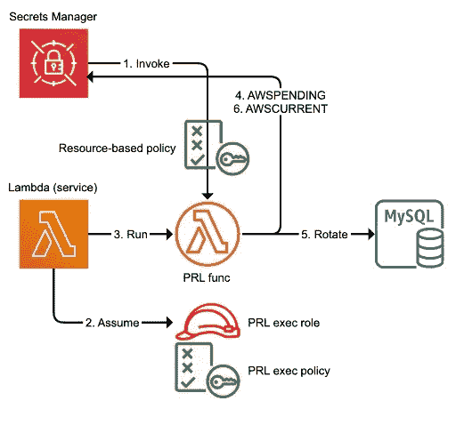

# 再见自定义旋转 Lambdas:欢迎 RDS-Secrets Manager 集成

> 原文：<https://levelup.gitconnected.com/goodbye-custom-rotation-lambdas-welcome-rds-secrets-manager-integration-9ee012ac5c67>

本着**客户执念**和**发明简化**的领导原则，AWS 几乎*偷偷*发布了一个充分体现上述原则的功能:RDS-Secrets Manager 直接集成。

 [## 亚马逊 RDS 宣布与 AWS Secrets Manager 集成

### 发布于:Amazon RDS 现在支持与 AWS Secrets Manager 集成，以简化您管理主用户的方式…

aws.amazon.com](https://aws.amazon.com/about-aws/whats-new/2022/12/amazon-rds-integration-aws-secrets-manager/) 

该功能正确地解决了以下问题:

> 如何自动轮换 RDS 数据库机密？

这是一个众所周知的问题，有着众所周知的答案。然而，我总觉得 AWS 给出的是变通办法，而不是稳定的解决方案。

让我们看看这些变通办法，并将它们与此版本的解决方案进行比较，如下图所示。

# 发布前

假设您知道什么是 [AWS Secrets Manager](https://aws.amazon.com/secrets-manager/) 以及为什么 secret rotation automation 是一个好的实践，发布前的过程包括以下两个步骤。

## 提供旋转λ函数

第一步是创建一个新的或重用现有的 Lambda 函数，该函数将通过 Secrets Manager APIs 管理 RDS 秘密管理。

***AWS/samples***GitHub 项目提供了一个全面的 Python 实现，展示了函数应该是什么样子。

 [## AWS-secrets-manager-rotation-lambdas/lambda _ function . py at master…

### 此时您不能执行该操作。您已使用另一个标签页或窗口登录。您已在另一个选项卡中注销，或者…

github.com](https://github.com/aws-samples/aws-secrets-manager-rotation-lambdas/blob/master/SecretsManagerRDSMySQLRotationSingleUser/lambda_function.py) 

上述函数执行以下步骤:

*   它创造了秘密的新版本。
*   一旦与数据库主机建立了 SSL/TLS 连接，该函数将使用机密的 ***AWSPENDING*** 阶段/版本更改数据库凭证。
*   它测试上述未决秘密。
*   一旦通过验证，Lambda 将秘密阶段/版本设置为 ***AWSCURRENT，*** ，秘密最终被更改。

## 安排轮换

最后，您需要安排函数定期运行。我想到了三种类型的实现:

*   CloudWatch 事件/ EventBridge 计划程序

 [## 介绍 Amazon EventBridge 调度程序| Amazon Web Services

### 今天，我们宣布亚马逊 EventBridge 调度程序。这是 Amazon EventBridge 的一项新功能，允许您…

aws.amazon.com](https://aws.amazon.com/blogs/compute/introducing-amazon-eventbridge-scheduler/) 

*   在秘密创建时安排自动循环

*   Secrets Manager 中的直接调度程序集成

 [## 在机密管理器循环中计划表达式

### 当您打开自动循环时，可以使用 cron()或 rate()表达式来设置循环您的…

docs.aws.amazon.com](https://docs.aws.amazon.com/secretsmanager/latest/userguide/rotate-secrets_schedule.html) 

我将重点介绍不太为人所知的第三种方法。

## 机密管理器计划程序

这种方法要求 Secrets Manager 调用 Lambda 函数。

 [## 使用…为 Amazon RDS、Amazon Redshift 或 Amazon DocumentDB secrets 设置自动旋转

### 轮换是定期更新秘密的过程。当您轮换密码时，您会更新两者中的凭证…

docs.aws.amazon.com](https://docs.aws.amazon.com/secretsmanager/latest/userguide/rotate-secrets_turn-on-for-db.html) 

其架构如下图所示:

上面的高层次暗示了这些步骤:

*   在机密管理器中打开自动旋转。
*   设定轮换时间表( *cron* 或 *rate*
*   将轮换功能与适当的权限相关联
*   一旦秘密被改变，它就被传播到数据库。

## 自定义 Lambda 限制

机密管理器方法有几个限制:

*   除非您需要在 Lambda 中执行一些额外的定制逻辑，否则您已经可以看到这在理解概念、解决方案和 IAM 管理方面涉及到一定程度的复杂性。
*   每个步骤都将执行一次 Lambda。虽然兰姆达斯天生便宜，但它仍然是一个需要考虑的维度。
*   数据库和 lambda 99%的时间都在 VPC 和私有子网中；因此，需要考虑联网。
*   缺少用于允许 Lambdas 从私有子网访问机密管理器的 VPC 接口端点。

“仅仅”允许 RDS 中的秘密自动轮换仍然需要特定的思想和行动。现在让我们看看这是如何改变的。

# 发布后

在最新版本中，RDS 将数据库机密的自动轮换与 Secrets Manager 集成在一起，只需选择一个复选框:

只需在 AWS Secrets Manager 中**凭证设置**设置下选择**管理主凭证，就可以了！**

这意味着:

*   你不需要维护一个 Lambda 函数。
*   您不需要处理 IAM 权限和策略。
*   您不需要维护 EventBridge 或 Secrets Manager 计划。
*   AWS 通过将复杂性隐藏在权限和网络管理后面来完成繁重的工作。

# 结论

通过隐藏 AWS Lambda 实现来自动执行 AWS Secret Manager 中的秘密轮换过程，AWS 再次听取了客户的反馈，并转向了一个自动化且经济高效的模型。这降低了安全漏洞的风险，并保持您的应用程序平稳运行。虽然仍然不支持 CloudFormation，但这听起来是一个巨大的进步。

如果你想了解更多关于工程管理、全栈和云开发的见解，请访问 LinkedIn。

# 分级编码

感谢您成为我们社区的一员！在你离开之前:

*   👏为故事鼓掌，跟着作者走👉
*   📰查看[升级编码出版物](https://levelup.gitconnected.com/?utm_source=pub&utm_medium=post)中的更多内容
*   🔔关注我们:[Twitter](https://twitter.com/gitconnected)|[LinkedIn](https://www.linkedin.com/company/gitconnected)|[时事通讯](https://newsletter.levelup.dev)

🚀👉 [**加入升级达人集体，找到一份惊艳的工作**](https://jobs.levelup.dev/talent/welcome?referral=true)