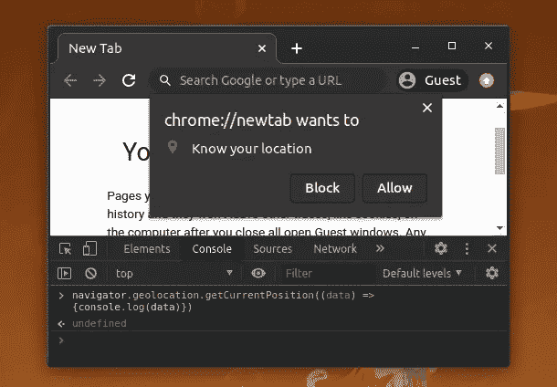

# 再见，桌面应用

> 原文：<https://levelup.gitconnected.com/goodbye-desktop-apps-bf4d2c0438c4>

## 现代网络应用正在取代你最喜欢的桌面应用。

照片由来自 [Pexels](https://www.pexels.com/photo/wood-laptop-writing-business-4271925/?utm_content=attributionCopyText&utm_medium=referral&utm_source=pexels) 的 [alleksana](https://www.pexels.com/@alleksana?utm_content=attributionCopyText&utm_medium=referral&utm_source=pexels) 拍摄

更早的时候，互联网只有由只读信息组成的网站，被称为 Web 1.0 时代。后来，随着 Web 2.0 时代的兴起，现代 Web 应用程序的概念被引入。如今，我们有非常用户友好和高度动态的网络应用程序。如果没有操作系统，计算机就没有价值。如果安装了操作系统，我们可以安装应用程序来完成日常工作。有三种类型的应用程序:桌面应用程序、移动应用程序和 web 应用程序。移动和桌面应用程序运行在操作系统之上。另一方面，web 应用程序在 web 浏览器内部工作，这是一个桌面应用程序。

现在，web 浏览器 API 也提供了对所需硬件组件的足够访问。例如，使用摄像头、扬声器和麦克风。另一方面，互联网的使用成本越来越便宜，创造了大量的网络用户。因此，开发者倾向于为 web 浏览器实现更多的应用，而不是为操作系统制作应用。如果我们正在开发一个桌面应用程序，我们必须使它适用于所有现有的平台，以达到所有的用户。但是，如果我们的应用程序是一个 web 应用程序，它就变成了一个跨平台的应用程序，因为 web 浏览器通常可以在所有平台上使用。

这种情况造成了桌面应用程序和 web 应用程序之间的竞争。如今，一个典型的计算机用户会花更多的时间在网络浏览器上，因为几乎所有的桌面应用程序都有可供选择的网络应用程序。例如，我们可以用 web 应用程序创建文档、电子表格、演示文稿、视频以及几乎任何东西。这些网络应用程序比具有在线协作等功能的桌面应用程序表现更好。在 web 应用程序的许多场景中，云计算资源正在用户的硬件上使用。

# 独立于硬件的应用

照片由[泰勒维克](https://unsplash.com/@tvick?utm_source=unsplash&utm_medium=referral&utm_content=creditCopyText)在 [Unsplash](https://unsplash.com/s/photos/server?utm_source=unsplash&utm_medium=referral&utm_content=creditCopyText) 拍摄

早些时候，我们有桌面应用程序来转换媒体文件格式。文件转换速度取决于我们的硬件资源——拥有强大硬件的人能够快速完成工作。现在，情况不同了。Web 应用程序通常使用自己的云计算资源来处理繁重的工作负载。因此，基于网络的媒体文件转换器将会以极快的速度工作，而不管你的计算机的硬件速度有多慢。

桌面应用程序的性能完全取决于物理硬件的规格。但是，网络应用是由高速云计算资源驱动的。以云计算资源的计算能力，网络请求的等待时间可以忽略不计。同时，云游戏平台让你不用昂贵的硬件就能玩现代电脑游戏。毫无疑问，Web 应用程序的 UI 只是一个用来与用户交互的组件。因此，无论硬件性能如何，任何计算机都可以正常运行 web 应用程序。

# 更好的货币化支持

对所有应用程序开发者来说，盈利是一个至关重要的因素。赚钱的独立应用程序显然很难。即使公司制定策略，通过序列号或安装密钥来识别付费用户，人们还是经常使用盗版软件。但是，货币化在 web 应用中更安全、更实用。没有办法制作 web 应用程序的破解版本——因为只有所有者有权访问应用程序的后端。

现代网络应用通常使用现收现付和每月订阅模式来盈利。这些模型为 web 应用程序的所有者带来了更多的控制。换句话说，web 应用程序的所有者可以决定哪些用户可以继续使用服务。此外，与桌面应用程序相比，互联网广告在网络应用程序上的整体表现更好。

# 沙盒带来更多安全。

桌面应用程序通常可以访问整个操作系统，因为它们只是一组二进制命令。典型的操作系统没有像 web 浏览器那样对每个桌面应用程序进行深入的访问规则管理。操作系统通常有超级用户模式或管理员模式来控制访问级别。另一方面，web 应用程序通过仔细定义深入的访问规则来维护一个安全的沙箱环境。例如，控制麦克风访问，显示和隐藏每个 web 应用程序的图像。运行 web 应用程序就像在计算机上的虚拟机上运行桌面应用程序一样。Web 浏览器开发公司在安全方面投入大量资金，以保持浏览器沙盒环境的安全和严格。许多恶意程序伪装成桌面应用程序和安装程序。这种情况经常发生在 Windows 操作系统上，因为它在普通用户中很受欢迎。

web 浏览器中用户友好的权限处理。作者截图。

Web 应用程序使用 JavaScript 作为浏览器环境中的本地编程语言。事实上，由于 WebAssembly 实验，我们将能够在未来使用任何编程语言来制作 web 应用程序。web 浏览器的 JavaScript 引擎优化了类似于本机代码的 JavaScript 代码，以加快代码执行速度。因此，开发人员可以通过使用针对沙盒和安全 web 平台的 JavaScript 来制作类似本机的应用程序。

# 结论

现在，网络浏览器就像是在原有操作系统上运行的另一个操作系统。渐进式 web 应用程序(PWA)概念使得典型的 web 应用程序与本地桌面应用程序相比更具竞争力。现在几乎所有的软件产品公司最初都是通过 web 应用程序进入目标市场的。之后，他们将创建跨平台的桌面应用程序和移动应用程序，以覆盖目标社区的其余部分。此外，网络浏览器提供了一种令人印象深刻的使用标签在网络应用程序之间切换的方式。在典型的操作系统中，当屏幕尺寸变小时，用户经常发现很难处理许多桌面应用程序。

然而，如果目标是访问许多系统操作，本机桌面应用程序表现良好。另一方面，由于 web 浏览器的严格安全性，web 应用程序无法逃离浏览器沙箱。因此，典型的 web 应用程序不会取代终端应用程序、实用程序、守护程序服务、文件管理器、文本编辑器等。然而，像 [Neutralinojs](https://neutralino.js.org/) 这样的框架让开发人员可以浏览浏览器沙箱。因此，开发人员将能够使用任何本机操作来制作 web 应用程序(或 PWAs)。

当云资源成本和互联网账单变得比计算机硬件更便宜时，每个人都会喜欢 web 应用程序。web 应用程序方法还没有在所有用户中非常流行。当他们意识到这一点时，您最喜欢的桌面应用程序开发人员就该为特定的桌面应用程序制作一个 web 版本了。