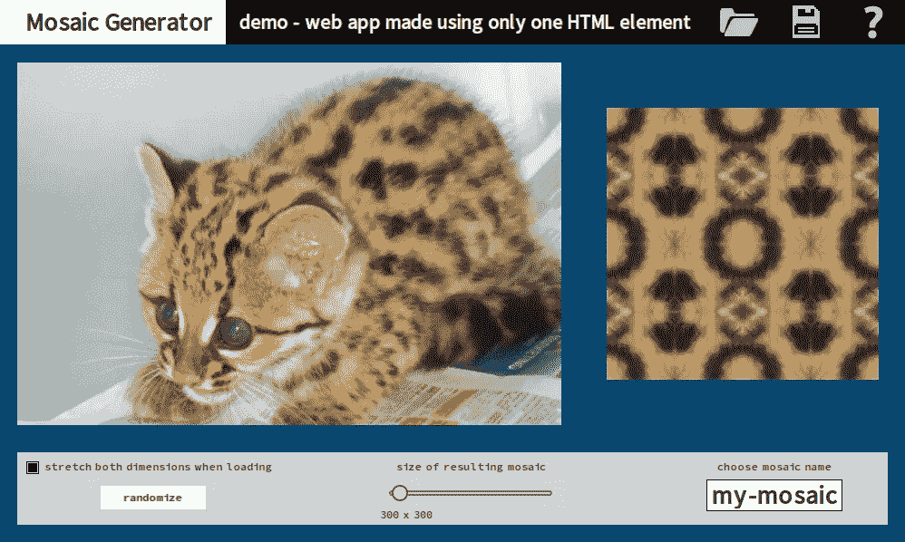
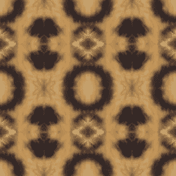
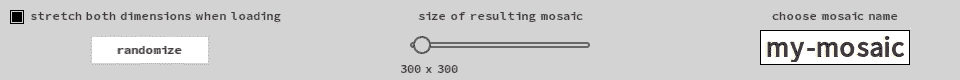
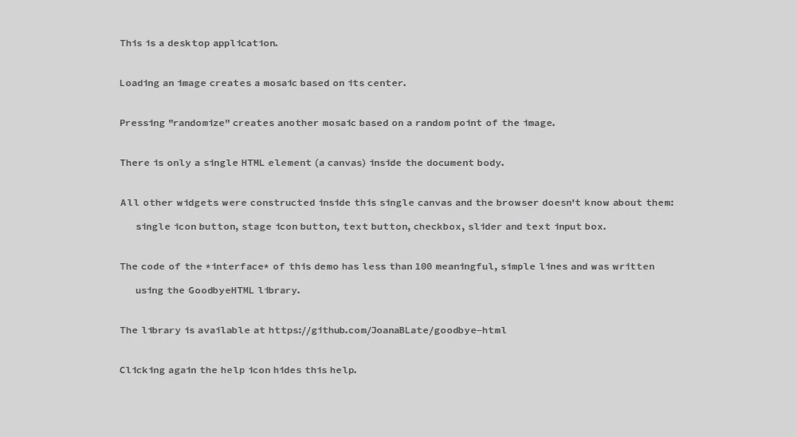
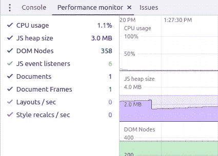

# 再见 HTML。你好画布！

> 原文：<https://levelup.gitconnected.com/goodbye-html-hello-canvas-bccba5601085>

## 第 7 部分:马赛克生成器&发布库

这里可以看之前的文章[。](https://javascript.plainenglish.io/goodbye-html-hello-canvas-3cc1b2e7b096)



马赛克生成器

## 图书馆

最后，今天我发布 GoodbyeHtml 库。

这是 GitHub 中库的 [**链接。**](https://github.com/JoanaBLate/goodbye-html)

## 应用程序(演示)

今天，我想解释更多的概念，谈论在浏览器中的*浏览器，但我有点恼火，因为读者不断回复说我正在做的事情是不可能的，或者说**太难了**，或者没有性能…因此，我决定使用当前的演示和文章来停止这些废话。*

这是 [**链接播放的 demo**](https://storage.googleapis.com/jblate/medium/mosaic-demo.html) (不适用于智能手机)。

同样，这个库与之前描述的有些不同。虽然我没有做一个适当的文档，你可以检查源文件，我认为它们非常可读。

同样，这个演示是一个嵌入了所有内容的 HTML 文件。它让我的服务器保持干净，但对学习不利。没问题，因为你可以在 GitHub 中轻松研究演示的源代码。

这是 GitHub 中演示的 [**链接。**](https://github.com/JoanaBLate/mosaic-generator)

浏览器只看到文档体中的一个 HTML 元素:画布。

在这个画布中有六种不同的小部件 : *简单图标按钮、舞台图标按钮、文本按钮、复选框、滑块和文本输入框*。

整个界面的**代码是在一个单独的 JavaScript 文件中编写的，这个文件统计**不到 120 个简单的行**(不包括备注和空行)。**

我们将一部分一部分地看到文件 *mosaic-interface.js* 的代码。

## 不适合智能手机！

我已经用 Chrome 在 Linux 和 Windows 上测试了演示，一切正常。

然后我在我的 Android 智能手机上用三星浏览器测试了这个演示。成功了，但是

1.  浏览器不允许保存(伪下载)结果
2.  “随机化”按钮可以工作，但按下后不会改变外观

现在灾难发生了。我在同一台 Android 设备上测试了演示，但这次使用的是 Chrome。好消息是 Chrome 允许我们保存结果。坏消息是，第一张图片一加载，Chrome 就删除了部分面板“header”和部分面板“options”，这意味着一个巨大的错误，因为在内部这些面板只是图像(绘制的画布)。此外，它们与加载和处理图像几乎没有关系。

这远远超出了我在本系列第一篇文章中所说的浏览器特质；这在一个…聪明的读者的回复中被讽刺了。

虽然这个工具只是为台式机设计的，但我从没想到在(同一台)智能手机上会有如此怪异的行为。

## 接口代码—初始化

这里我们创建了表示库的对象，并加载了**界面**需要的**资源**:字体表和图标。

正如代码所示，加载器必须只被创建和调用一次，否则我们将会遇到同步问题。还有**另一个功能，用于在应用程序运行时加载用户图像**。

```
"use strict"

var goodbye = null

var box = null

function main() {
    //
    goodbye = createGoodbyeHtmlLibrary()
    loadResources()
}

function loadResources() {
    //
    const loader = goodbye.createLoader()
    //
    loader.loadFont("sg", fontSmallGrey) 
    loader.loadFont("black", fontSourceProSansBlack) 
    loader.loadFont("white", fontSourceProSansWhite)
    //
    const keys = Object.keys(blackIconsSources)
    //
    for (const key of keys) { loader.loadImage(key, blackIconsSources[key]) }
    //
    loader.ready(resourcesLoaded) // must send a callback
}  

function resourcesLoaded() { // the callback 
    //
    initLogic()
    //
    mountInterface()    
}
```

## 接口代码—安装

这个简单的功能就是整个界面的**蓝图。首先，它创建盒子并将其赋给一个全局变量(常量)。该框将其自身附加到设计的父对象(文档正文)上。然后，它定义舞台的背景颜色(选择“透明”是可能的)。并初始化这些层。我们只需要两个。它隐藏了“帮助”层。并命令创建五个面板。就是这样！**

```
function mountInterface() {
    //
    box = goodbye.createBox(1000, 600, document.body)
    //
    box.setBgColor("#084d6e")
    //
    box.initLayers(["base", "help"])
    //
    box.get("help").hide()
    //
    createHeader()
    //
    createSourceArea()
    //
    createResultArea()
    //
    createOptionsPanel()
    //
    createHelp()
 }
```

## 界面代码—面板标题


面板标题

在这里，我们创建面板“标题”，设置一些装饰(包括文本)并应用 3 个图标按钮。请注意，“帮助”按钮的行为与其他按钮不同。它处于“活动”状态。

```
function createHeader() {
    //
    const i = goodbye.allImages
    //
    const ph = box.get("base").createPanel("header", 0, 0, 1000, 50, "black")
    //
    ph.paintRect(0, 0, 250, 50, "white")
    //
    ph.setFont("black")
    //
    ph.write(30, 10, "Mosaic Generator")
    //
    ph.setFont("white")
    //
    ph.write(265, 10, "demo - web app made using only one HTML element")
    //
    const bl = ph.createButton("load", 790, 0, 50, 50, "rgb(0,150,180)")
    bl.setImageNormal(i["load-black"])
    bl.setOnClick(loadSourceImage)
    //
    const bs = ph.createButton("save", 865, 0, 50, 50, "rgb(0,150,180)")
    bs.setImageNormal(i["save-black"])
    const disabled = goodbye.fadeImage(i["save-black"], "black", 0.40)
    bs.setImageDisabled(disabled)
    bs.disable()
    bs.setOnClick(save)
    //
    const bh = ph.createButton("help", 940, 0, 50, 50, "rgb(0,150,180)")
    bh.setImageNormal(i["help-black"])
    const negative = goodbye.negativeFromImage(i["help-black"])
    bh.setImageActive(negative)
    bh.setOnClick(buttonHelpClicked)
}
```

这是舞台图标按钮的代码:

```
function buttonHelpClicked() {
    //
    const button = box.get("base.header.help") // stage icon button
    //
    if (button.getActive()) {
        //
        button.deactivate()
        box.get("help").hide()
    }
    else {
        //
        button.activate()
        box.resetFocus()
        box.get("help").show()
    }
}
```

注意:库的代码高度封装在函数中。比如我们不说 **my_panel.visible** ，我们说 **my_panel.getVisible()** 。

## 界面代码-面板源区域


面板源区域(图像加载后)

这非常简单:一个没有小部件的面板。它只是一个用来画图像的基底。

```
function createSourceArea() {
    //
    const ps = box.get("base").createPanel("source", 20, 70, 600, 400, "red")
    //
    const chess = goodbye.createCheckerboard(600, 400, 50, 50, "silver", "gainsboro")
    //
    ps.paintImage(chess, 0, 0)
}
```

## 界面代码-面板结果区域



面板结果区域(图像加载后)

这几乎是一个前面板的副本。

```
function createResultArea() {
    //
    const pr = box.get("base").createPanel("result", 670, 120, 300, 300, "red")
    //
    const chess = goodbye.createCheckerboard(800, 450, 50, 50, "silver", "gainsboro")
    //
    pr.paintImage(chess, 0, 0)
}
```

## 界面代码-面板选项



面板选项

考虑到窗口小部件的数量(4)和不同种类窗口小部件的数量(4)，这是应用程序最复杂的面板。但是，令人惊讶的是，它的代码很短。

```
function createOptionsPanel() {
    //
    const po = box.get("base").createPanel("options", 20, 500, 960, 80, "lightgrey")
    //
    po.setFont("sg")
    //
    po.createCheckbox("stretch", 10, 10, 14, true, null)
    //
    po.write(30, 10, "stretch both dimensions when loading") 
    //
    const br = po.createButton("randomize", 90, 35, 120, 30, "white")
    br.config("sg", "randomize", randomize)
    br.disable()
    //
    po.write(418, 10, "size of resulting mosaic")
    //
    paintMosaicSize()
    //
    const ss = po.createSlider("size", 400, 30, 200, 30, 0)
    //
    ss.setOnChange(changeMosaicSize)
    ss.disable()
    //
    po.write(772, 10, "choose mosaic name")
    //
    const tn = po.createTextbox("name", 760,30,150,35,15, "black", true)
    tn.setText("my-mosaic")
}
```

这些是它的处理程序:

```
function changeMosaicSize() {
    //
    const factor = box.get("base.options.size").getValue()
    //
    mosaicDimension = 300 + (Math.floor(1500 * factor / 300) * 300)
    //
    paintMosaicSize()
}

function paintMosaicSize() {
    //
    const panel = box.get("base.options")
    //
    panel.clearRect(390, 60, 100, 20)
    //
    panel.write(400, 63, mosaicDimension + " x " + mosaicDimension)
}
```

## 界面代码-面板帮助



面板帮助

另一个非常直接的面板，没有小部件，只有文本。

```
function createHelp() {
    //
    const ph = box.get("help").createPanel("help", 0, 50, 1000, 550, "lightgrey")
    //
    ph.setFont("sg")
    //
    ph.write(150,  50, "This is a desktop application.")
    ph.write(150, 100, "Loading an image creates a mosaic based on its center.")
    ph.write(150, 150, "Pressing \"randomize\" creates another mosaic based on a random point of the image.")
    ph.write(150, 200, "There is only a single HTML element (a canvas) inside the document body.")
    ph.write(150, 250, "All other widgets were constructed inside this single canvas and the browser doesn't know about them:")
    ph.write(170, 280, "single icon button, stage icon button, text button, checkbox, slider and text input box.")
    ph.write(150, 330, "The code of the *interface* of this demo has less than 100 meaningful, simple lines and was written")
    ph.write(170, 360, "using the GoodbyeHTML library.")
    ph.write(150, 410, "The library is available at https://github.com/JoanaBLate/goodbye-html")  
    ph.write(150, 460, "Clicking again the help icon hides this help.")    
}
```

我们结束了！

## 按 ID 获取元素

将 box 作为一个全局变量(常量)非常有用，可以使源代码变得更简洁。一个网页中有很多框是没有问题的。当然，我们需要为每个盒子使用不同的全局变量——*box，box2，big box……*

我们可以使用函数 ***box.get(id)*** 随时访问任何图层、面板或小部件。

ID 只有 3 种格式:

1.  对于层:*层*
2.  对于面板:*图层.面板*
3.  对于小部件: *layer.panel.widget*

我们创建每个面板或小部件，只提供其名称；该库使用公式*parent . ID+dot+chosen _ name*创建其 ID。

```
// creating the panel
const po = box.get("base").createPanel("options", ...// creating the widget
const ss = po.createSlider("size", ...// acessing the widget in other function
const factor = box.get("base.options.size").getValue()
```

## 结论



演示的性能

我们今天制作的实际应用程序证明，基于画布的网页制作方法非常好。但是，正如我们在本系列文章中所看到的，在超过 99%的情况下，它不应该取代 HTML/CSS 方法。

我想我能听到你:

这很遗憾，因为用再见库构建一个网页是如此的酷和简单。我想在任何地方都使用它！另外，我不想失去 HTML 的任何优势，比如流畅的布局，易访问性，(可扩展)TrueType 字体，自动翻译…

嗯……一个好人不会把香肠递到狗的鼻子上，然后警告说，*这只是为了闻闻*。对吗？

请把下面的文章读完**结尾**，或者至少读完它的**结尾**。解决办法是有的。

[***哎，HTML……我回来了，乖乖！***](https://javascript.plainenglish.io/hey-html-i-am-back-darling-4505b557a66d)

## 敬请关注

这是 [**系列**](https://joanaborgeslate.medium.com/goodbye-html-hello-canvas-9e2b38a69ba) 下一篇文章的链接。