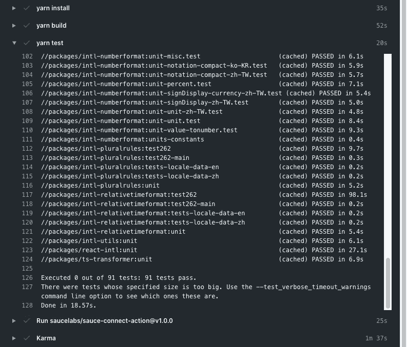

# 再见，勒纳，你好，巴泽尔

> 原文：<https://levelup.gitconnected.com/goodbye-lerna-sorta-hello-bazel-f47ef1a01f73>

你好，巴泽尔

# 语境

作为 [formatjs & react-intl](https://github.com/formatjs/formatjs) 的维护者，我使用 [lerna](https://lerna.js.org/) 来管理 monorepo，它包括几个任务:

1.  管理 npm 依赖项安装
2.  按照拓扑排序的顺序运行 npm 脚本，例如`build`或`test`
3.  创建新的 GitHub 版本
4.  生成变更日志
5.  发布到 npm

Lerna 非常擅长完成所有这 5 项任务，但是随着 monorepo 的增长和`build`时间的增加，我想我们可能需要更适合选择性构建的东西。在这篇博文中，我将向你介绍我放弃 lerna 作为构建系统而选择 bazel 的决定。

# 首先，结果

我们现在有了一个带缓存的 GitHub 动作工作流:

*   CI:我们与旧系统不相上下，具有更高的正确性和再现性(大约 14 分钟)。
*   选择性构建(本地):我们的构建步骤从 9 分钟变成了 50-10 分钟(取决于发生了什么变化)。
*   选择性测试(本地):我们的构建步骤从 4 分钟变成了 20-5 分钟(取决于发生了什么变化)。
*   大大减少了“**在我的机器上工作**”的问题。

# 我们的构建设置

我们的 monorepo 包含 8 个 ECMA 402[Intl poly fill](https://formatjs.io/docs/polyfills)，每个都有自己的数据集。我们大部分的`build`时间都花在处理 [CLDR](http://cldr.unicode.org/) & [IANA 时区数据库](https://www.iana.org/time-zones)上。预处理步骤允许我们的运行时实现具有高性能，同时保持符合 ECMA402 规范。

我的第一个设置是处理来自源代码的所有东西，包括像 IANA 这样的远程工件获取。这是没有规模的。在一个冷的 GitHub Action CI 构建中，我们的`build`步骤可能需要 30 分钟，瓶颈是`zdump`对于所有 IANA 时区大约需要 20 分钟。这使得 DevEx 非常痛苦，因为一个小的 doc 更改会导致长时间的 CI 等待。

我的第二次尝试是提交几个生成的工件，以及 IANA 数据库中的 vendoring。这在大规模 CI 构建中并不少见。`git`有内置的支持，通过`.gitattributes`对它们进行不同的标记，GitHub 也通过`linguist-generated` & `linguist-vendored`提供支持。这极大地减少了我们在冷 CI 构建上的构建时间到大约 15 分钟，没有“黄金”测试来验证生成的工件是最新的&确定性的(为了这样做，我们必须重新运行生成步骤，这仍然需要花费很长时间)。

# 我们的测试设置

我们的`test`设置非常标准:

*   `jest`中的单元测试
*   由[酱料实验室](https://saucelabs.com/)提供支持的`karma`中的硒测试
*   `test262-harness`中的 Test262 符合性测试

令人惊讶的是，我们的瓶颈不是 Selenium，而是`test262`，因为它是一个相当全面的测试套件。对于那些不熟悉`test262`的人来说，TC39 符合性测试套件确保任何规范实现都是符合规范的。为了防止污染，它还为每个测试旋转新的 v8 上下文，使其正确而缓慢(我们仍然会超时)。

排除偶尔的超时，我们的测试大约需要 4 分钟。

# 选择性构建

选择性构建基本上是只重建系统中发生变化的部分，从而提高性能的能力。由于潜在的缓存问题和构建环境设置中的差异，通常需要权衡正确性。除了`[--since](https://github.com/lerna/lerna/tree/master/core/filter-options#--since-ref)`标志之外，Lerna 本身并没有很好的(或者任何)支持。这使用`git` ref 作为过滤机制来过滤已更改的内容。然而，这有几个问题:

1.  执行单位仍然是包。
2.  可传递依赖是选择加入的。这导致 dep 的缺失构建，导致整个构建失败。包括那些基本上成为一个完整的重建。
3.  修改`git`输出的`git`别名的问题(我们的一个合作者就是这样)。

在高层次上，检测变更的底层机制(例如`git` ) &重建粒度(包)都存在问题。

# 向[巴泽尔](https://bazel.build/)问好，具体是 [rules_nodejs](https://github.com/bazelbuild/rules_nodejs)

Bazel 是一个密封的建筑系统，可重复，确定性和快速。它的核心是`rule`(如何构建东西)& `file`(嗯，文件)。构建系统的机制用**源文件**和**生成文件**之间的关系表示，用**规则**表示。Bazel 维护自己的输出目录，不会污染源代码树(除非您告诉它这样做)。因为它是密封的，它可以安全地缓存构建输出&测试结果，允许我有选择地重新构建&只重新测试发生变化的部分。

bazel 解决的另一类问题是最大化再现性，这有效地消除了“**在我的机器上工作**的问题。我们已经习惯了典型的`rm -rf node_modules && git clean -fd`，然后重新安装所有的东西并尝试重新运行，这已经成为一种常态。这个问题在 OSS 中变得更加困难，因为合作者之间的交流是一个挑战。

在加入 Dropbox 之前，我没有听说过 bazel，老实说，我并不喜欢它。它有一个相当高的学习曲线，从定制语言 [Starlark](https://docs.bazel.build/versions/master/skylark/language.html) 到它的哲学[再到它的设置。它不能很好地与现有的 web 构建生态系统互操作，主要是由于现有构建工具链中隐含的目录假设。然而，一旦我完成了学习曲线的第**部分**，结果就相当惊人了。](https://docs.bazel.build/versions/master/bazel-vision.html)

# 最后的话

让我们明确一点，bazel 并不能解决所有的用例。如果您的构建/测试相当快，并且您熟悉现有的工具链，那么没有理由转换。如果你正在处理一个构建/测试循环缓慢的 monorepo，这可能会大大加快你的速度。

我们目前的设置在 https://github.com/formatjs/formatjs 的[结束。这个社区非常有帮助，也非常活跃，所以如果你感兴趣的话，可以随时加入 bazel 的 Slack。](https://github.com/formatjs/formatjs)