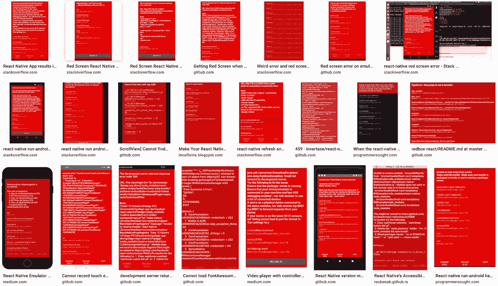
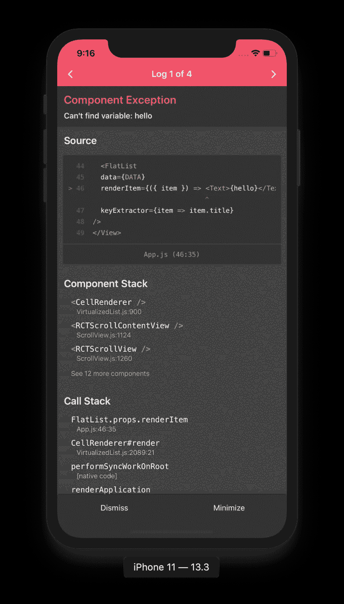
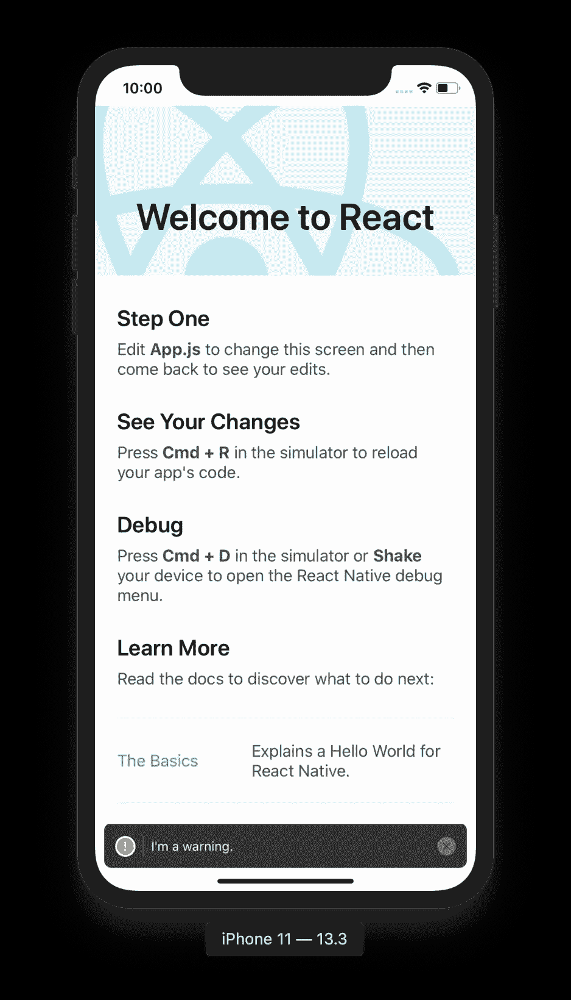
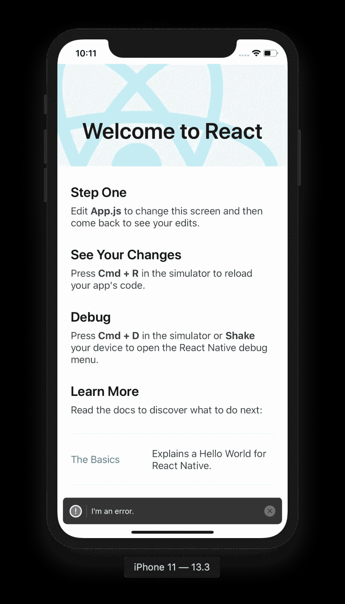
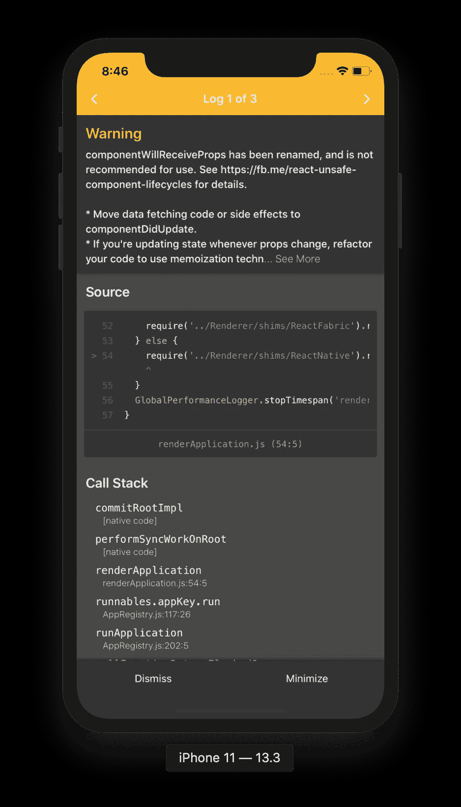
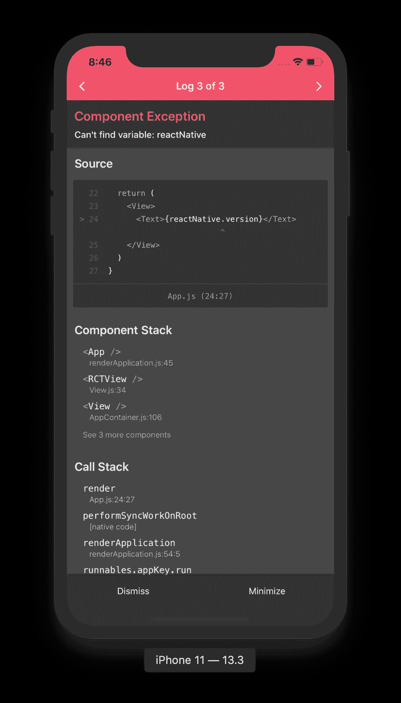

# 告别 React Native 中的红屏错误

> 原文：<https://levelup.gitconnected.com/goodbye-to-the-red-screen-error-in-react-native-baf59daaed0c>

## React 原生版本 0.63 中新的 LogBox 调试体验


由[安娜·格鲁](https://unsplash.com/@gruu?utm_source=medium&utm_medium=referral)在 [Unsplash](https://unsplash.com?utm_source=medium&utm_medium=referral) 上拍摄

如果你是 react 本地开发者，那么在你的一生中至少有一次你偶然发现了这个谷歌图片搜索。 ***吓人吧？*😱**



谷歌搜索显示 React Native 出现红屏错误

***是的！*** 这些都是 react native 中著名的红屏错误。你在代码中犯的每一个错误都会像这样结束。

随着即将发布的 *React 原生版本 0.63* ，它包含了大量的新功能和错误修复。但是吸引我注意力的是新的调试器屏幕，叫做 **LogBox** 。早期版本的调试器屏幕看起来很乱，全是红色。但是现在，用户界面看起来更加清晰和流畅。

自从 [*React 原生版本 0.62.0 以来，该团队一直致力于此。-rc.1* 任何目前坐在](https://github.com/facebook/react-native/releases/tag/v0.62.0-rc.1) [*React 原生版本 0.62*](https://reactnative.dev/blog/2020/03/26/version-0.62#other-improvements) 上的人，想要体验这个特性，都可以将`require('react-native').unstable_enableLogBox()`添加到你的`index.js`文件中。



警告**日志框**(左)和错误**日志框**(右)

新的 **LogBox** 屏幕由各种组件组成，帮助您在 react native 中获得更流畅的调试体验。

*   在顶部，它由日志导航组成，有助于导航到不同的警告/错误，以防出现多个警告/错误。
*   在导航下方，有相应警告/错误的合理解释。
*   源代码视图显示源代码中触发警告/错误的确切行(大多数情况下)。点击下面显示的文件名在编辑器中打开它。
*   显示的组件和调用堆栈跟踪提供了对警告/错误的更多了解。
*   在屏幕底部，一个按钮用于关闭，另一个按钮用于最小化日志框屏幕。

*我喜欢源代码视图，它能帮助我查明问题的确切原因，并直接点击打开文件。*👌


创建于 [ImgFlip](https://imgflip.com/)

在写这篇文章的时候，React 原生版本 0.63 还没有发布，但是你仍然可以接触到即将到来的特性。他们已经开放了一个[发布候选](https://github.com/facebook/react-native/releases/tag/v0.63.0-rc.0)来帮助他们在稳定发布之前测试它。

使用发布候选版本创建一个新项目。

```
npx react-native init RN063 --version 0.63.0-rc.0
```

安装依赖项并运行项目。

让我们使用简单的`console.warn("I'm a warning.")`和`console.error("I'm an error")`，看看它们如何出现在新的**日志框**中。



在**日志框**中新增反应本地警告和错误

让我们再做一些修改，看看更详细的**日志框**是什么样子。



React Native 中警告和错误**日志框**的详细视图

我见过一些例子，红屏错误仍然突然出现。但是我希望稳定发布会迎合这种情况。

> 在稳定的版本发布之前，我不建议你将现有的应用升级到这个版本。

**那都是乡亲们！编码快乐！！**

如果你喜欢这个故事，把它保存在媒体上，在你的母语社区中分享。👏 👏

[](https://blog.usejournal.com/how-to-use-svg-in-react-native-e581eca59534) [## 如何在 React Native 中使用 SVG

### 在 react 原生项目中使用 SVG 可以降低图像资源的大小，同时提高缩放性能。让我想想…

blog.usejournal.com](https://blog.usejournal.com/how-to-use-svg-in-react-native-e581eca59534) [](https://blog.usejournal.com/how-to-use-svg-in-react-native-2-4140b146b7d1) [## 如何在 React Native 中使用 SVG—# 2

### 我们已经看到了如何在 React 原生项目中使用 SVG，就像任何其他 png、jpg 一样。但是那种方式有一个主要的…

blog.usejournal.com](https://blog.usejournal.com/how-to-use-svg-in-react-native-2-4140b146b7d1) [](/how-to-create-a-github-profile-readme-5f9cd1445965) [## 如何创建 Github 配置文件自述文件

### GitHub 最近发布了一项功能，允许用户创建一个概要文件级别的自述文件，并在他们的…

levelup.gitconnected.com](/how-to-create-a-github-profile-readme-5f9cd1445965)