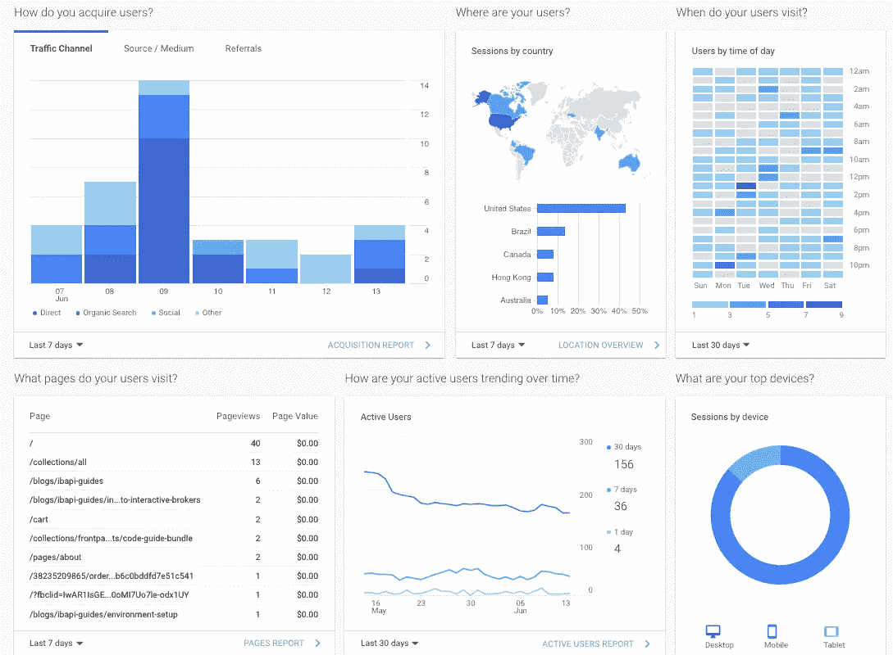
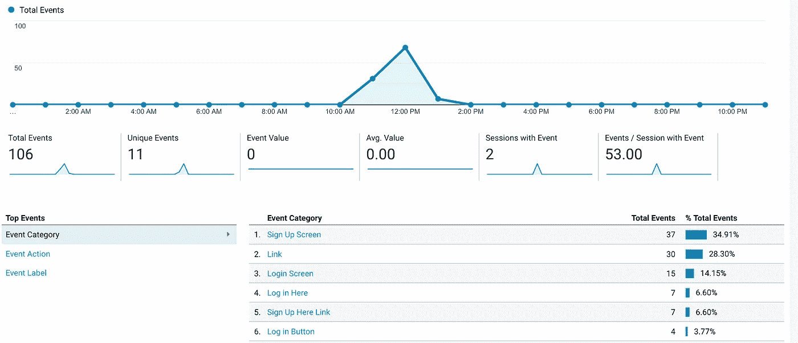

# React 中的谷歌分析自定义事件跟踪

> 原文：<https://levelup.gitconnected.com/google-analytics-custom-event-tracking-in-react-95983b6644c6>



看看所有这些惊人的分析

# 简介:

由于其易用性、慷慨的免费定价层和可定制性，Google Analytics (GA)已被证明是一个行业标准的点击流分析平台。

大多数现代网站在 GA 实现上相对简单。然而，由于 React 应用程序的单页面特性，需要进行一些棘手的修改。

本文将介绍 React 应用程序中的**通用和事件级跟踪。React Google Analytics 的实现可以在 5 分钟内完成(只要你够快；)**

## 内容:

1.  设置
2.  全球追踪(App.js)
3.  自定义事件
4.  结论(*和结果*)

*以后想看这个故事？* [*把它保存在日记本里。*](https://usejournal.com/?utm_source=medium.com&utm_medium=noteworthy_blog&utm_campaign=tech&utm_content=guest_post_read_later_text)

# 设置:

## npm 下载:

本文主要关注 React 应用程序中自定义事件的集成。但是，出于故障排除的目的，有必要确认是否有正确的下载。

Google Analytics React 社区的大多数都使用 react-ga 包。您需要通过命令`npm install react-ga --save`安装 npm。

## 属性设置(在 GA 控制台内):

谷歌分析正在推动谷歌分析 4 的属性。在撰写本文时，React 还没有支持这种新属性类型的包装器。因此，在创建属性时，您需要默认使用较旧的属性变体。这包括在 GA4 旁边设置一个通用分析属性([教程](https://www.analyticsmania.com/other-posts/how-to-create-a-universal-analytics-property/))。

然后，您可以从控制台使用 UA 代码作为跟踪代码片段([在哪里可以找到代码片段](/using-google-analytics-with-react-3d98d709399b))。下一步，我们将使用通用跟踪代码片段中的 UA 代码将我们的应用程序链接到控制台。

# 全球追踪(App.js):

全球级跟踪旨在捕捉:

*   用户统计数据(位置、设备、行为)
*   页面跟踪(页面浏览量、页面停留时间、跳出率、用户流量)
*   活动(流量来源、出口位置、广告整合)

在 App.js 的顶部，导入 npm 包:

```
//App.js imports
import ReactGA from 'react-ga';
```

然后，我们将用跟踪 ID ( [位置](/using-google-analytics-with-react-3d98d709399b))初始化应用程序:

```
const trackingId = "UA-195624444-1"; // Replace with your Google Analytics tracking IDReactGA.initialize(trackingId);ReactGA.set({ username: localStorage.getItem('userName'), // Other relevant user information})
```

这个片段将是自定义事件的基础，并处理简单的浏览量跟踪细节。有关全球跟踪的更多高级选项，请参考[官方 npm 文档](https://www.npmjs.com/package/react-ga)。

# 自定义事件:

现在开始有趣的部分——自定义事件允许您进行细粒度的用户跟踪。您可以监控:

*   与某些特征的接触频率
*   异常或警报消息
*   高级目标转换或漏斗跟踪

对于我们的例子，我们正在跟踪*注册*页面上的*注册按钮*点击。我们从文件顶部的**导入 react-ga 包**开始。

```
// Place this line at the top section of your file. In our example, this is in the signup.js fileimport ReactGA from 'react-ga';
```

接下来，**创建一个函数来处理定制事件**。这可以放在组件声明中(即 const SignUp = (props) …)或者任何保存组件函数的地方。

```
const eventTrack = (category, action, label) => { console.log("GA event:", category, ":", action, ":", label); ReactGA.event({ category: category, action: action, label: label, })}
```

现在**我们将自定义事件触发器附加到选择的动作**上。因为我们跟踪的是注册时的按钮点击，所以我们将把 on click 添加到一个<按钮>

```
<button type="submit" className="btn" onClick={eventTrack.bind(this, "Sign Up Screen", "Sign Up Button", "Button")}>Sign Me Up</button>
```

如果我们的函数中没有`.bind`，那么每次页面加载时都会触发`onClick`方法。因此，为了解决 React 中`onClick`触发每个页面加载的问题，我们绑定了函数，然后将`this`作为第一个参数传递。

您现在可以打开 web 控制台来查看事件的`console.log`,并在 Google Analytics 控制台中确认它们的操作。

# 结论:

谷歌分析跟踪将**工作在生产应用程序和本地主机上**。只需用`npm start`运行应用程序，在 localhost 上打开，就可以开始记录事件了。

所有事件将被发送到**谷歌分析控制台下的【行为-】>事件- >概述**。确保查看当天的小时视图(Google 默认为昨天的视图)。



仪表板中的结果！

如果您有任何问题或需要澄清，请在下面留下评论！

创造你自己的东西？加入[杂志 slack 社区](https://links.usejournal.com/slack-community)寻求像你一样的创作者的支持。