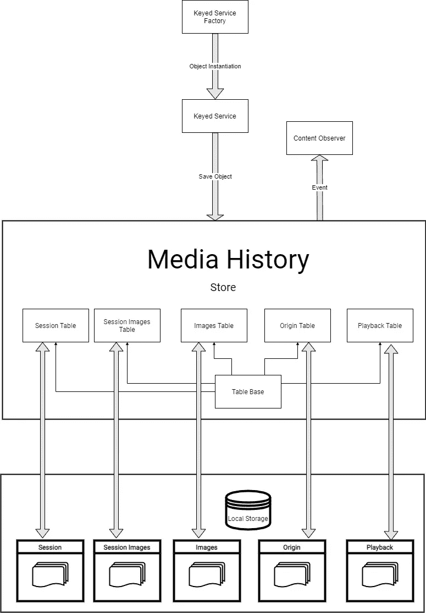

# 谷歌浏览器媒体历史:它是如何工作的？

> 原文：<https://levelup.gitconnected.com/google-chrome-media-history-how-does-it-work-1bcc74cf9c1f>

我再次挖掘谷歌 Chrome 的源代码，这是我发现的。

读完文章标题后，你可能想知道的第一件事是，“什么是媒体史？”事实上，从外部来看，谷歌 Chrome 没有这个功能。然而，这只是存储在 Chrome 本地存储中的一个数据库的名称。这个数据库存储了你播放音频或视频流的 URL 的历史记录，因此被称为“媒体”。

现在，它不存储媒体文件本身，而只存储播放或观看的时间长度，以及播放的网址。

那么，让我们来看看构成谷歌 Chrome 媒体历史功能的高层部分有哪些。

媒体历史特性的源代码位于库的[chromium/chrome/browser/Media/History/folder](https://github.com/chromium/chromium/tree/d7da0240cae77824d1eda25745c4022757499131/chrome/browser/media/history)中。在这里，我链接了 chromium repo 的 Github 镜像，因为它比 Google 自己的源代码列表更容易浏览。

Chromium 媒体历史功能由以下部分组成:

*   内容观察者
*   图像表
*   键控服务
*   键控服务工厂
*   原点表
*   回放表
*   会话图像表
*   会话表
*   商店
*   工作台底座

每一项都存在于自己的文件中，我们将逐一查看。

# 元素

## 内容观察者

它实现了四人帮著名的《设计模式》一书中描述的观察者模式。简单回顾一下，直接来自[维基百科——观察者模式](https://en.wikipedia.org/wiki/Observer_pattern):

> 观察者模式是一种软件设计模式，在这种模式中，一个名为 subject 的对象维护一个名为 observer 的依赖者列表，并自动通知它们任何状态变化，通常是通过调用它们的方法之一。

这里，媒体历史在新事件发生时通知其订户。在可能要监听的事件中，有继承自`WebContentsObserver`父类的`DidStartNavigation`、`DidFinishNavigation`和`WebContentsDestroyed`事件，我们将在稍后的日期讨论这些事件。

新颖的事件方法包括`MediaSessionInfoChanged`、`MediaSessionMetadataChanged`、`MediaSessionActionsChanged`、`MediaSessionImagesChanged`和`MediaSessionPositionChanged`，当这些字段发生变化时，它们会提醒用户。它有字段显示媒体是否曾经在这个特定的`WebContents`对象上播放过，以及网页导航是否正在暂停状态更新。

这些事件回调还会更新任何包含这些旧对象的缓存。

## 图像表

这是一个 SQL 表实体，将有关图像的信息保存到数据库中。它包含一个将图像导出到数据库并返回它们的 ID 的方法。

## 键控服务

键控服务保存一个指向存储对象的指针(稍后将详细介绍)，它可以在本地也可以在远程。每个键控服务也有一个指向谷歌 Chrome 配置文件的指针。

键控服务对象具有将观察时间和统计数据保存到存储中的方法。

## 键控服务工厂

这是设计模式书中的工厂模式，应用于键控服务。正如您可能已经猜到的，这个类负责创建键控服务对象。

## 原点表

它类似于图像表，但它将 URL 存储在类似 SQL 的表中。

## 回放表

类似地，回放表专门将时间戳和手表时间导出到数据存储。

## 会话图像表

这是一个将映像 ID 与会话 ID 相关联的支持表。

## 会话表

还有一个表，这个表保存了 URL、元数据和被放置媒体的位置。

## 商店

该对象包含指向数据库以及每个表的实际指针。

## 工作台底座

这是本节中所有其他表类的父类。它负责初始化表对象中的数据库成员对象。

正如我在上一节中简要暗示的那样，每个表对象都有自己的数据库指针。因此，当您在 Chromium Media History 中保存一个条目时，它会被分配到这些表中的一个表中，从而被分配到一个数据库中。没有单一的媒体历史数据库:它被分成几个不同的数据库用于每个表。

以下是媒体历史的这些组成部分如何联系在一起的示意图。

