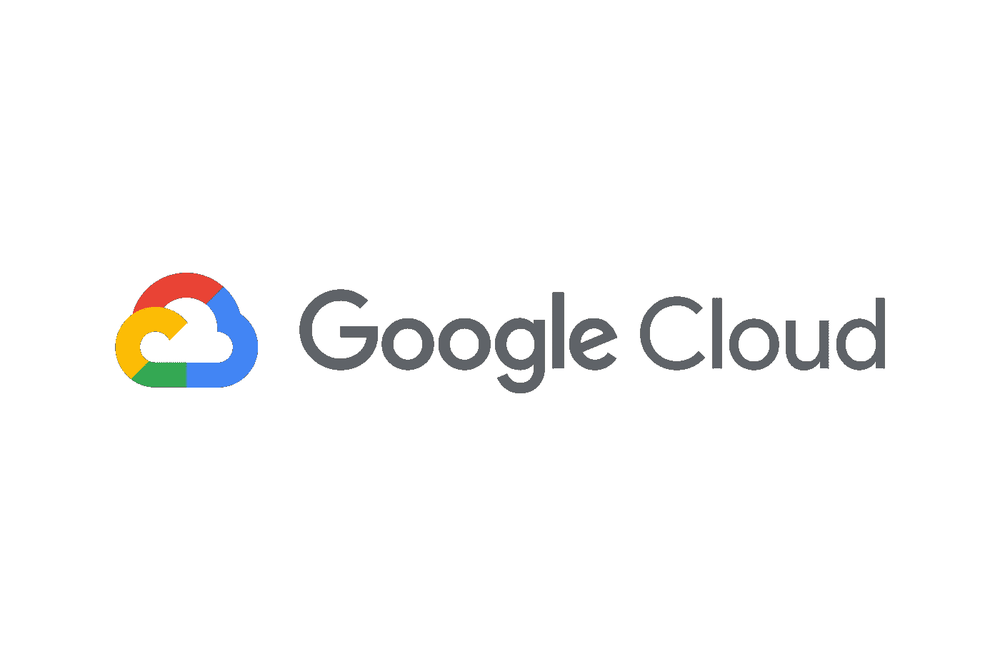
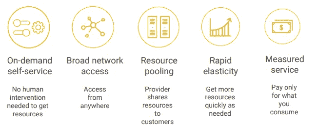
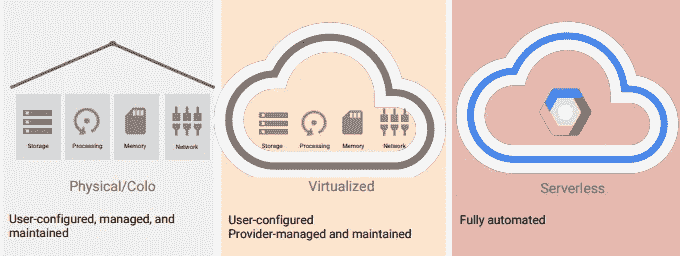
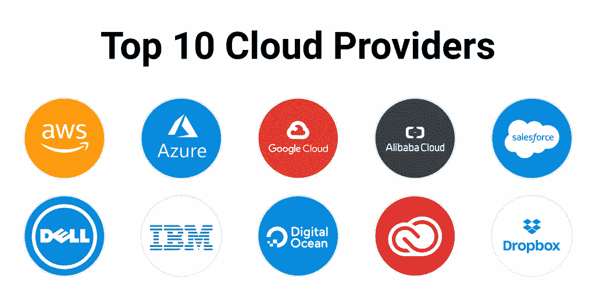

# 面向初学者的谷歌云平台

> 原文：<https://levelup.gitconnected.com/google-cloud-platform-for-beginners-9cf17d07da49>

大家好。我真的很兴奋能够在**谷歌云平台(GCP)** 技术上开始这个令人惊叹的系列。我们真的要从基础层面了解谷歌云。那到底是什么意思？在本系列结束时，您可以理解并解释云解决方案如何使组织整体受益。我不是专家，我也在通过 GCP 学习，所以让我们一起学习:))

**第一部**

# **你应该知道的事情**

所以你可能会有这样的问题，好吧，我需要学什么或者“预学”什么？正如我已经提到的，这些系列一开始是非常基础的。基本上，前几部分只是谷歌云的一般知识。好的，我知道你的下一个问题是，“好的，这是给谁的，我需要知道什么？”任何对云解决方案稍有兴趣的人都绝对可以消费这个系列。另外，让我告诉你，有许多云提供商，每个提供商可能使用不同的名称和术语，但大多数情况下功能似乎是相似的。例如，Google Cloud 中的 ***云存储类似于亚马逊 Web Services*** 中的 ***简单存储服务(S3)，而后者又类似于微软 Azure 中的 ***Azure Blob 存储。*** 因此，我想说的是，从哪家供应商开始您的云之旅并不重要，重要的是您对有助于您的使用情形的当前技术的坚持和更新程度。**简而言之，如果您想了解一般的云知识，那么这里就是您的理想之地，所以不多说了，让我们开始吧！*****

# 云计算的定义

根据国家标准和技术研究所(NIST)的说法，云计算是一种使用信息技术的方式，它具有这五个同等重要的特征。

首先，您可以按需获得计算资源和自助服务。您所要做的就是使用一个简单的界面，您就可以获得所需的处理能力、存储和网络，而无需人工干预。

第二，你可以通过网络从任何你想去的地方访问这些资源。

第三，这些资源的提供商有一个很大的资源池，并将其分配给该池中的客户，从而允许提供商通过批量购买并将节省下来的成本转移给客户来获得规模经济。客户不必知道或关心这些资源的确切物理位置。

第四，资源是有弹性的，如果你需要更多的资源，你可以更快地获得，如果你需要更少的资源，你可以缩小规模。

最后，客户只为他们使用或预订的东西付费。如果他们停止使用资源，他们就会停止付费。

# 云计算的发展

将我们带向云计算的第一波趋势是**物理/协同定位**，这基本上是在共享设施中租赁空间，而不是建立昂贵的数据中心。

在本世纪头十年，对效率的需求推动 IT 行业使用虚拟化。虚拟化数据中心的组件与物理数据中心的组件非常相似。这些组件包括服务器、磁盘、路由器等等，但是它们不再是物理的，而是变成了虚拟的。因此，资源更加灵活、可伸缩、可用和高效。

几年后，企业意识到他们无法在虚拟化模型的限制下快速发展，因此企业转向基于容器的架构。因此，自动化的弹性第三波云是从自动化服务构建的。资源和服务的供应和配置是自动完成的，无需任何人工干预。

# 云提供商

如前所述，有许多云提供商，每个提供商可能使用不同的名称和术语，但大多数情况下功能似乎是相似的。例如，Google Cloud 中的 ***云存储类似于亚马逊 Web Services*** 中的 ***简单存储服务(S3)，而后者又类似于微软 Azure 中的 ***Azure Blob 存储。*** 您可以访问[https://comparecloud.in/](https://comparecloud.in/)查看各个云提供商的完整对比图。***

至此，我们已经大致了解了云计算的关键基础知识，接下来，我们将详细了解 Google 云平台的基础知识和架构，在此之前，请耐心等待，小心行事:)

❖ [*GitHub*](https://github.com/ritchiepulikottil)

❖ [*领英*](https://www.linkedin.com/in/ritchie-pulikottil-6876341aa/)

❖ [*推特*](https://twitter.com/dloqcamguy)

❖[t31】insta gramt33】](https://instagram.com/ritchiepulikottil)