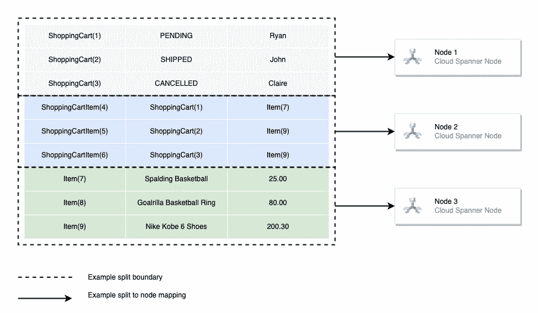
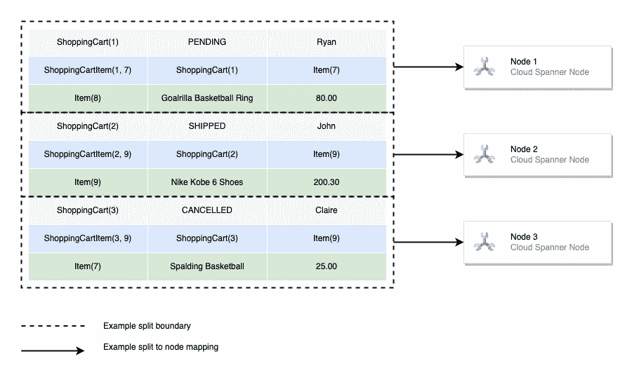

# Google Cloud Spanner:多对多关系模式

> 原文：<https://levelup.gitconnected.com/google-cloud-spanner-many-to-many-relationship-pattern-3f97d4e578e>

在为我们的数据库模式定义关系模型时，我们根据现实世界的实体对信息进行分组和存储。这些实体以特定的方式与其他实体有关系。例如，一名员工可能与他们的经理有关系。这种类型的关系被称为“属于/拥有许多”类型的关系，因为一个员工只能属于一个经理，而一个经理可能拥有许多员工。

当一个或多个实体与一个或多个不同类型的实体有关系时，就存在“多对多”关系。这里的一个例子是销售商品的电子商务网站。网站的每个用户都可以创建一个包含许多商品的购物车，并且每个商品都可以插入到许多购物车中。

当对这些类型的关系建模时，通常使用所谓的[连接表](https://learn.co/lessons/sql-join-tables-readme)来存储关于关系的信息。下面的模式说明了如何构建三个表来模拟本例中两个实体之间的关系。

使用连接表的多对多关系

*ShoppingCartItem* 表中的 *ShoppingCartID* 和 *ItemID* 列分别引用了 *ShoppingCart* 和 *Item* 表中相关实体的主键。

从这里，我们可以获取购物车的详细信息以及商品列表，如下面的查询所示。

查询 1:返回购物车以及里面商品的 id

**问题**

然而，当使用 Google Cloud 的水平可伸缩关系数据库解决方案 Cloud Spanner 时，像这样的模式设计可能会引入性能问题。

Cloud Spanner 允许我们在托管数据库的实例中添加或删除节点，从而实现了“无限”的可伸缩性。每个节点都为我们的数据库提供更多的存储和计算空间。然后，Cloud Spanner 通过主键值对表进行分区，将数据库中的数据分布到实例中的各个节点上。

因此，如果我们想要执行一个查询来查找属于一个购物车的商品，这个查询将必须搜索许多节点来查找属于这个购物车的数据及其关系。不保证 *ShoppingCartItem* 表中所需的行与与之相关的 *ShoppingCart* 行物理上位于同一节点。下图显示了在这种情况下建议的分区边界。

显示跨节点分布的相关数据的分割边界示例

随着数据库规模的增长(以及实例中节点数量的增长)，这可能会降低此类查询的性能。如果我们可以减少查询需要搜索的节点数量，那不是很好吗？

**解决方案**

让我们使用一种我发现在这种情况下效果很好的模式来重新构建这个数据库模式。

使用上面涉及 *ShoppingCart* 和 *Item* 实体的同一个示例，我们首先想了解关系中哪个实体将被更频繁地访问。我们是否想要:

*   查看购物车中包含的商品列表？运筹学
*   查看包含商品的购物车列表？

再次坚持上面的例子，我要说我们的应用程序更频繁地查看购物车中包含的商品列表。这样， *ShoppingCart* 就成为了接下来的父实体。

下一步是修改 *ShoppingCartItem* 连接表，使其通过表交叉成为 *ShoppingCart* 的子表。[表交叉](https://cloud.google.com/spanner/docs/schema-and-data-model)是 Cloud Spanner 中的一个概念，它指示存储子系统将父级的子行放在同一个拆分中。这意味着父节点及其所有子节点将在同一存储位置上彼此相邻。

该表的主键现在变成了一个组合键，包含作为前缀的 *ShoppingCart* 表的主键。由于该表中的每一行都表示一个 *ShoppingCart* 和一个*商品之间的唯一关系，*这很好地映射到一个主键: *< ShoppingCartID，ItemID >*

最后，由于表交错的父/子特性，我们保证在任何时候在这个表中插入一行都会有一个 *ShoppingCart* 。如果我们还想保证每个关系中关联的*项*的存在，我们可以在该表的 *ItemID* 列中包含一个外键约束。

应用这些更改后，我们得到了下图所示的模式。

交叉表的多对多关系

现在，spanner 存储子系统将使用分区来分发我们的数据，这些分区根据我们获取数据的方式进行了优化。下面的例子说明了所有彼此相关的 *ShoppingCart* 和 *ShoppingCartItem* 行将如何位于同一节点中。

显示位于同一节点的父/子行的拆分边界示例

使用与前面相同的查询，这一次它只需要转到一个节点，在那里它可以找到所有数据。这减少了开销，并消除了查询在将结果返回给用户之前连接在其他节点上执行的子查询的结果集的需要。

如果我们还想在*购物车*旁边嵌入每个*商品*的详细信息，我们可以通过下面的查询来实现。注意，这一次不能保证所有数据都位于同一个分割中，因为每个*商品*都不是*购物车*的子商品。然而，与我们以前的模式相比，它仍然是优化的。

查询 2:返回购物车以及购物车中商品的详细信息

有一点额外的:我非常喜欢这个模式的设置方式，因为它允许我们将结构嵌入到 select 语句中，如上所示。这非常好地映射到应用程序代码，因为我们可以轻松地将结果解析回我们选择的结构。

下面的示例说明了如何构造 go 代码来调用该查询，并将响应解析为在应用程序中使用的结构。这都利用了[云扳手 go 客户端库](https://pkg.go.dev/cloud.google.com/go/spanner)。

使用 go 客户端库解析查询 2 的响应

**总结**

在为 Google 的 Cloud Spanner 数据库设计数据库模式时，理解支撑数据存储方式的结构非常重要。

传统的连接表使用自己的主键，不能很好地映射到 Cloud Spanner 中使用的分区策略，因为数据很可能分布在不同的节点上。

要将使用连接表的模式转换为遵循建议模式的模式，请遵循下面概述的 3 步过程:

1.  标识父实体
2.  修改连接表以成为父表的子表
3.  包括指向关系中另一个实体的外键

**结束语**

在为 Cloud Spanner 设计模式时，在锁定特定设计之前，投入时间运行实验，并观察跨不同模式的查询的执行计划。

正如在 [Cloud Spanner 的表交错:一个查询优化特性](https://medium.com/google-cloud/cloud-spanners-table-interleaving-a-query-optimization-feature-b8a87059da16)中提到的，表交错应该被视为一个优化特性，而不是一个数据建模概念。但是，如果您能够尽早识别出该特性将会受益的领域，那么从长远来看，您将会节省大量的重构工作。