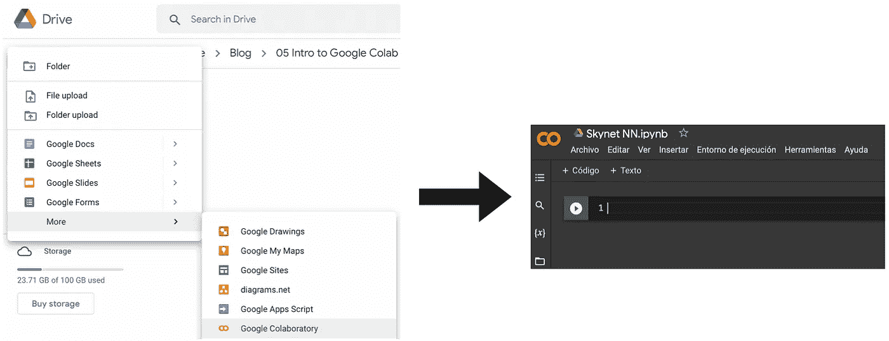
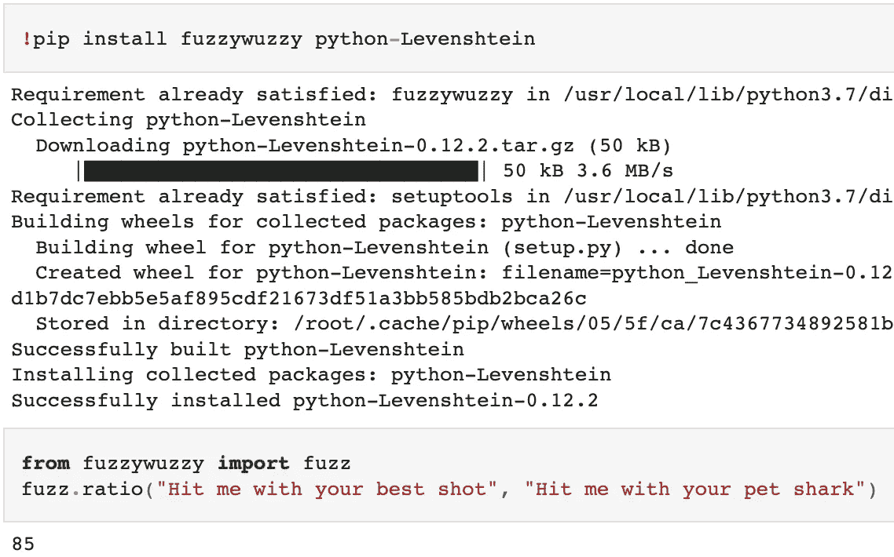
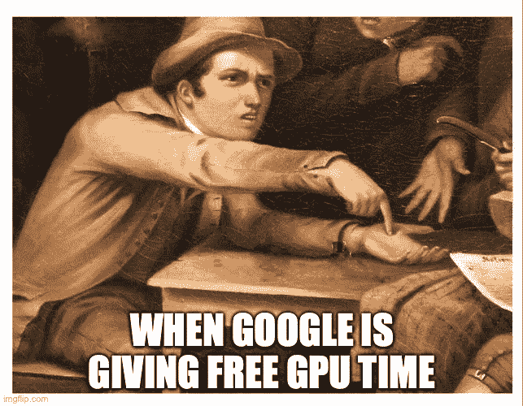
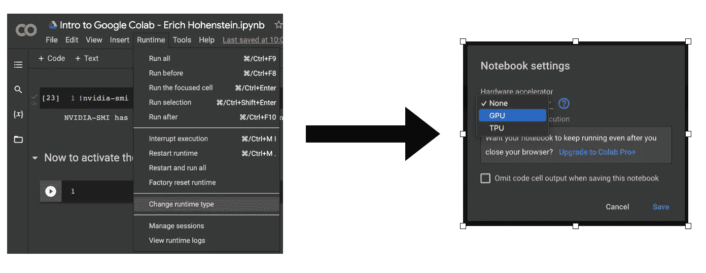
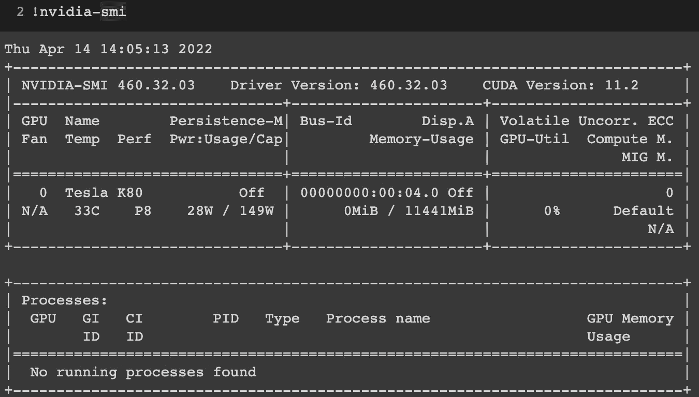
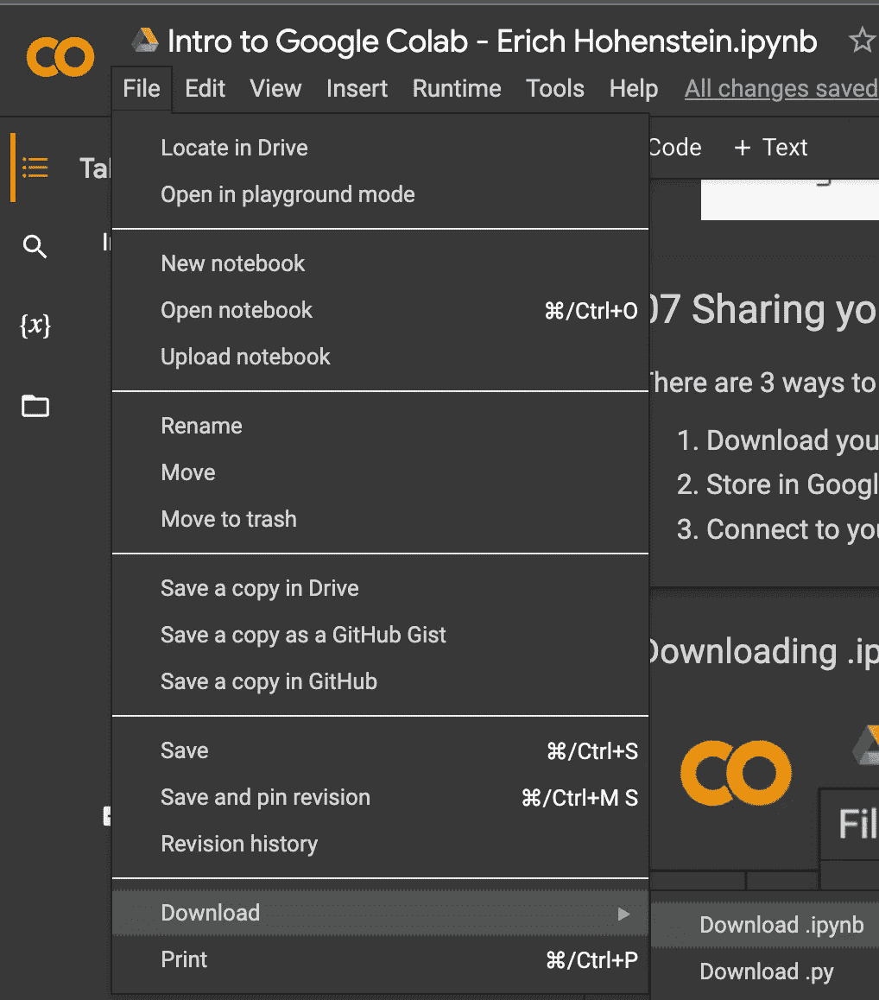
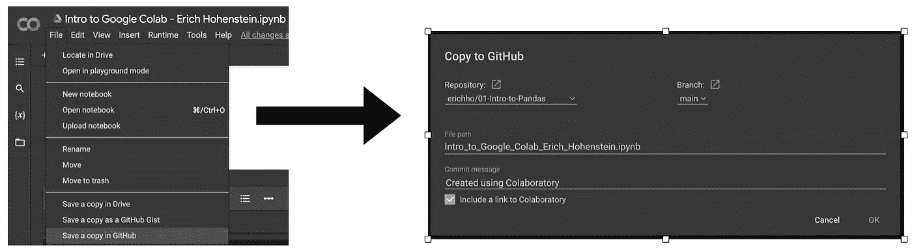

# Google Colab 简介

> 原文：<https://levelup.gitconnected.com/google-colab-what-is-it-how-to-use-it-and-why-should-i-care-721bb8a88c90>

你有没有想过投身到人工智能的狂潮中，与神经网络和所有热门的数据科学的东西一起工作，但你却被困在你的旧土豆 PC 上？公平地说，购买一台带有训练神经网络的特殊硬件的新电脑对任何人来说都是相当昂贵的。尤其是在今天，所有的加密矿工都囤积了宝贵的图形处理器。不要再哭了，我亲爱的孩子们！有一个解决方案甚至可以让你在树莓派上训练神经网络！简介:Google Colab


谷歌联合实验室

1.  Google Colab 是什么？
2.  如何创建一个谷歌 Colab 笔记本
3.  上传您的数据
4.  安装特殊库
5.  得到那些珍贵的图形处理器
6.  分享是关怀
7.  最终意见

# Google Colab 是什么？

Google Colab 是由…猜猜是谁…苹果创造的？不…谷歌！他们创建了 Colab，让几乎任何人都可以免费获得进行深度学习所需的硬件。使用 Google Colab，您可以免费访问服务器 CPU、**最先进的 GPU**和 TPU！你唯一需要的两样东西就是互联网接入和一个谷歌账户。它使用笔记本电脑的熟悉环境，所以如果你喜欢与 Jupyter 一起工作，你会有宾至如归的感觉。**我有没有提到是免费的？**


# 如何创建一个谷歌 Colab 笔记本

为了开始使用 Google Colab，我们将进入 Google Drive 并为我们的项目创建一个新文件夹。然后，我们将创建一个新的 Google Colab 笔记本，它将打开一个新窗口，直接进入笔记本环境。



# 上传您的数据

现在我们有了一个新的 Colab 笔记本，我们准备工作，下一个任务是获取您的数据。有两种方法可以做到这一点。一种是将你的数据直接从电脑上传到 Colab 会话，另一种是将你的 Google Drive 安装到 Colab 会话。后一个选项基本上意味着允许 Colab 访问您的 Google Drive 并直接从那里读取数据。

*   **直接上传**

```
**from** google.colab **import** files
uploaded **=** files**.**upload()
```

此命令将打开一个窗口，您可以从中选择并上传文件。一旦它们完成上传，我们就可以读取它们，例如，读取到这样的数据帧中。

```
df **=** pd**.**read_csv(io**.**BytesIO(uploaded['netflix.csv']))
```

*   **安装驱动装置**

```
**from** google.colab **import** drive
drive**.**mount('/content/drive')
```

一旦安装了驱动器，我们通过给出 Google Drive 中的完整路径来读取我们的文件。

```
df **=** pd**.**read_csv('/content/drive/MyDrive/Blog/00 Data/netflix.csv')
```

值得一提的是， **Colab 与 sessions** 一起工作，这意味着对你让服务器空闲多长时间以及你让它训练你的模型多长时间是有限制的。出于这个原因，我建议将您的数据集和模型放在 Google Drive 上，并将其安装到您的 Colab 会话中，这样您就不必在每次启动新会话时手动上传所有文件。

# 安装特殊库

Google Colab 预装了所有常见的数据科学库，如 Pandas、Matplotlib、numpy 等。如果你想让**安装其他库，你可以如下操作。**



# 得到那些珍贵的图形处理器



每次创建新的 Google Colab 笔记本时，默认情况下不会启用 GPU。实际上，您可以通过以下方式检查这一点:

```
!nvidia**-**smi
```

如果我们运行这个命令，我们将看不到 GPU。要激活 GPU，我们做如下。



再次运行该命令，我们得到。



# 分享是关怀

在处理完模型和笔记本之后，您可能想要共享它或者将它添加到您的 Github 存储库中。有两种方法可以导出和共享您的笔记本:

*   将您的脚本下载为。ipynb，。py，甚至。html



*   **连接到你的 Github 库**



你可以在我的 **Github** 上查看这个笔记本:

[](https://github.com/erichho/02-Intro-to-Google-Colab) [## GitHub-erichho/02-Google-Colab 简介

### 此时您不能执行该操作。您已使用另一个标签页或窗口登录。您已在另一个选项卡中注销，或者…

github.com](https://github.com/erichho/02-Intro-to-Google-Colab) 

或者在我的 **Google Drive** :

[](https://colab.research.google.com/drive/1WVaK6YhirgsQmLF3_3B5EHag5mbvHb9p?usp=sharing) [## 谷歌联合实验室

### 编辑描述

colab.research.google.com](https://colab.research.google.com/drive/1WVaK6YhirgsQmLF3_3B5EHag5mbvHb9p?usp=sharing) 

# 最终意见

投身人工智能炒作从未如此容易。谷歌无疑正在推动这项技术变得越来越主流。作为一名数据科学家，我看到这是一个很好的机会来学习深度学习、数据科学，甚至使用 Google Colab 的 Python，而不用担心硬件、成本和编程环境。所以，继续吧…把你的数据收集起来，创造下一个将改变世界的人工智能！