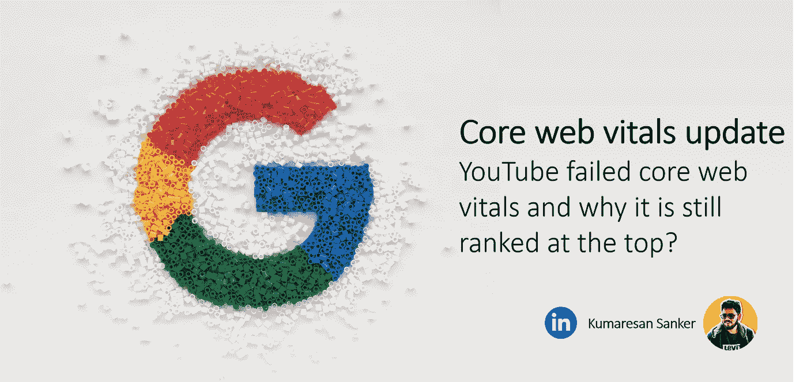
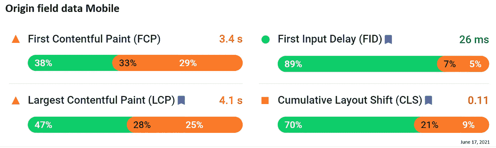
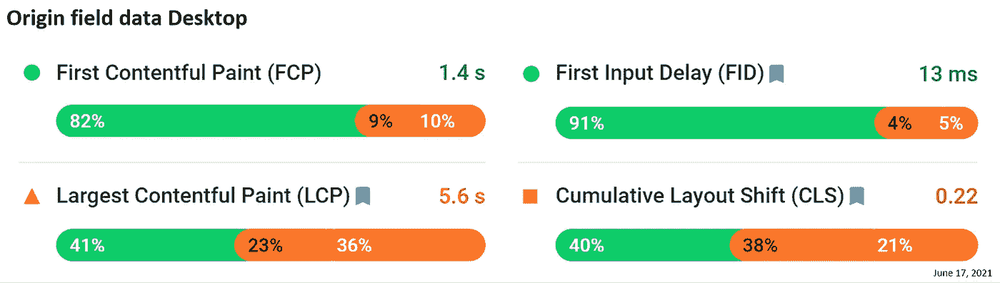

# YouTube 在核心网络要害上失败了，为什么它仍然排在首位？

> 原文：<https://levelup.gitconnected.com/google-core-web-vitals-update-youtube-failed-core-web-vitals-and-why-it-is-still-ranked-at-the-ee232e9a55c8>

## 谷歌核心网站动态更新

自 1997 年谷歌进入搜索引擎领域以来，它一直主导着整个搜索引擎市场。谷歌在搜索引擎领域拥有超过 92.81%的市场份额。当大多数公司试图将他们的网页排在 Google 的 SERP 的顶端时。谷歌正在给它添加一种全新的味道。谷歌现在正在引入核心网络指标——LCP、FID、CLS，预计未来将引入更多指标。

然而，是否有必要将你的技术支出转向优化核心网站的要害来提高你的排名呢？

让我们简单看看谷歌子公司 YouTube 在基本网络指标方面的表现。为了研究这个场景，我使用 PageSpeed Insights 对 YouTube 进行了性能测试，并收集了移动和桌面的原始字段数据(YouTube 所有页面的真实数据)。

从上面的结果中，你可以注意到 YouTube 在首次输入延迟方面表现良好，在 LCP 方面表现较差，在 CLS 方面需要改进。在三个核心网络要素中，YouTube 只超过了一个。尽管如此，你可能会看到 YouTube 在算法更新后仍然排名第一。在进入为什么之前，让我们看看谷歌如何从 2015 年开始尝试推动性能优化。

2015 年—谷歌宣布 AMP 优化网站将有优势获得更好的排名。但大多数网站无法适应 AMP。

2016 年——谷歌降级了带有广告弹出窗口等侵入性空隙的网页。

2017 年——谷歌推出了更好的广告标准，在没有恼人广告的情况下改善网络体验。

2018 年-谷歌推出了移动优先索引，以促进移动版本网站在索引中的抓取。

2019 年-谷歌部分引入了速度标记，以识别网站的快慢。

2020 年——谷歌宣布将于 2021 年 5 月推出谷歌页面体验标准

2021 年——谷歌通知从 5 月到 6 月中旬推迟推出页面体验更新，并计划在 8 月底之前逐步实施算法更新。

谷歌花了六年时间制定和实施页面体验指南。在经历了太多不成功的尝试后，谷歌终于开始认真对待性能和 SEO 了。但我们必须等待，看看谷歌最新的算法调整是否成功。只有时间会证明一切！

回到 YouTube，这是一个不同的场景。用户信号，比如花在网页上的时间，点击率在 YouTube 中起着重要作用。YouTube 平均每月有超过 330 亿次访问，每次访问近 11 个页面，平均每个用户在 YouTube 上花费超过 21 分钟。如果你的网站像 YouTube 一样有这么大的流量和更好的用户信号，你可以跳过核心网站的更新。其余的人必须尽早开始优化他们网站的性能。因为谷歌可能会在未来推出更多的重要功能，如果你的竞争对手在游戏中领先，那些没有优化的人将会很艰难。

> “专家们一致认为，忽视对谷歌最新更新的准备可能意味着网站排名百分之百的下降，以及流量和转化率的显著下降。”

另一种情况是，如果你的竞争对手比你更好地优化了三个基本的网络要素，那么即使优化了这三个要素，你也不会在搜索结果上有所改善。下一个阶段是集中在额外的指标上，为了优化你的 SEO，总共有 15 个指标需要考虑。在我们的下一篇文章中，我们将讨论更多的生命体征。小心点！