# 谷歌数据工作室的 5 个步骤——初学者指南

> 原文：<https://levelup.gitconnected.com/google-data-studio-in-6-steps-beginners-guide-58a8dea77c6>

## 如何开始使用 Google Data Studio、连接到数据、生成见解、构建报告、创建故事以及共享您的工作—所有这些都是免费的！

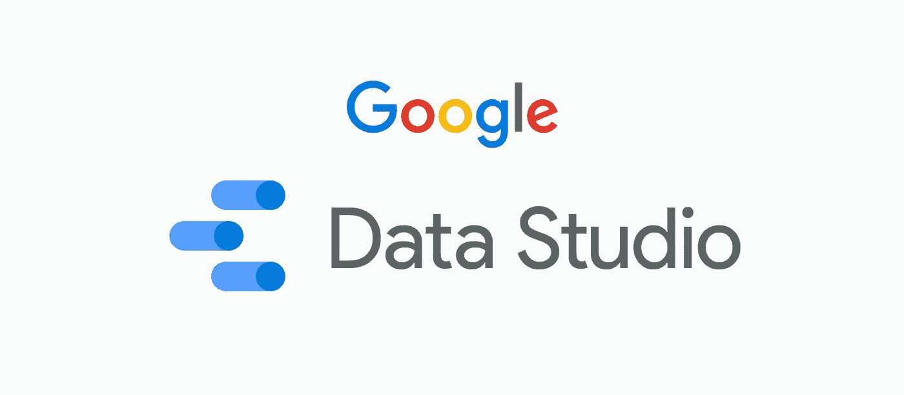

图片来源:[https://marketingplatform.google.com/about/data-studio/](https://marketingplatform.google.com/about/data-studio/)

> ***“无论你的信息是什么，数据可视化都可以使其达到千倍”——兰迪·奥尔森***

谷歌数据工作室是一个数据可视化或报告工具，旨在将数据转换成故事，产生见解和策划报告

在众多数据可视化或报告工具中，Google Data Studio 因其免费和灵活的服务产品而脱颖而出，虽然这可能足以吸引讲故事的爱好者，但它还有许多其他特性可以提供——

*   易用性——由于大多数用户都非常熟悉 google suite 的用户界面，解读和导航 data studio 变得自然而直观
*   200 多个数据连接器
*   拖放功能
*   可定制的图表和视觉效果
*   轻松共享和协作选项

# ***第一步—入门***

要使用 Google data studio，您可以使用现有的 Google 帐户或创建一个新帐户，不需要任何安装。

接下来，一旦你打开谷歌数据工作室，你的窗口将如下所示。

此窗口为您提供了一些预先设计的报告和模板，作为您的指南或参考。

左侧窗格中带有“ ***+*** ”符号或“ ***+ Create*** ”选项的空白报告平铺将引导我们到空白画布上创建报告。

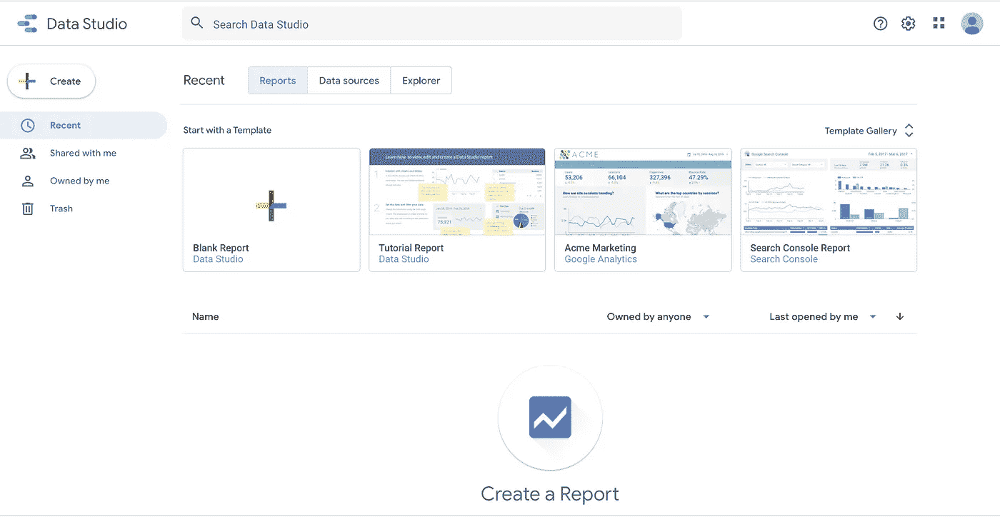

“数据源”选项卡提供了创建报告时使用的所有数据源的视图。

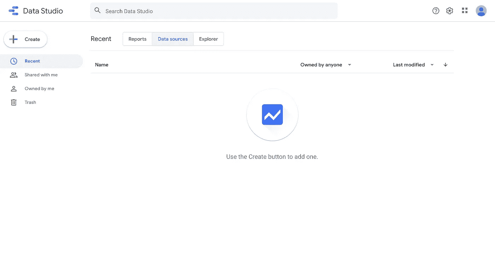

您可以点击' ***+创建*** '选项来添加一个数据源

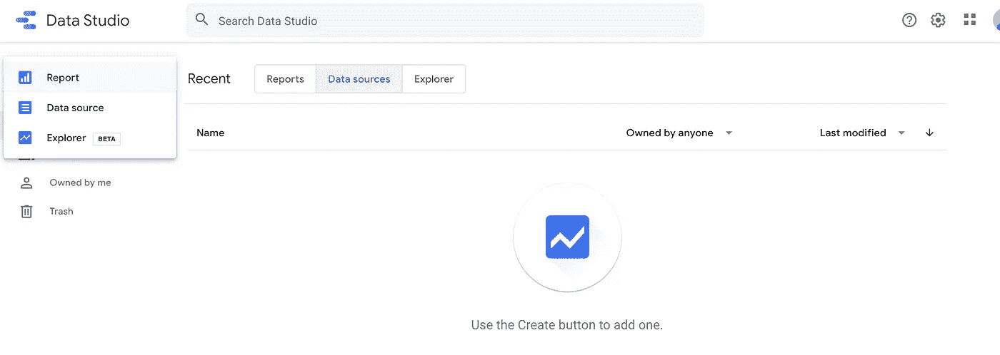

# ***第二步:数据准备***

您可以选择从多个平台提取数据。向下滚动或使用 Google Data Studio 中的搜索选项找到您希望连接的平台。

要了解更多关于数据连接器的信息，请参考此链接:[https://datastudio.google.com/data](https://datastudio.google.com/data)

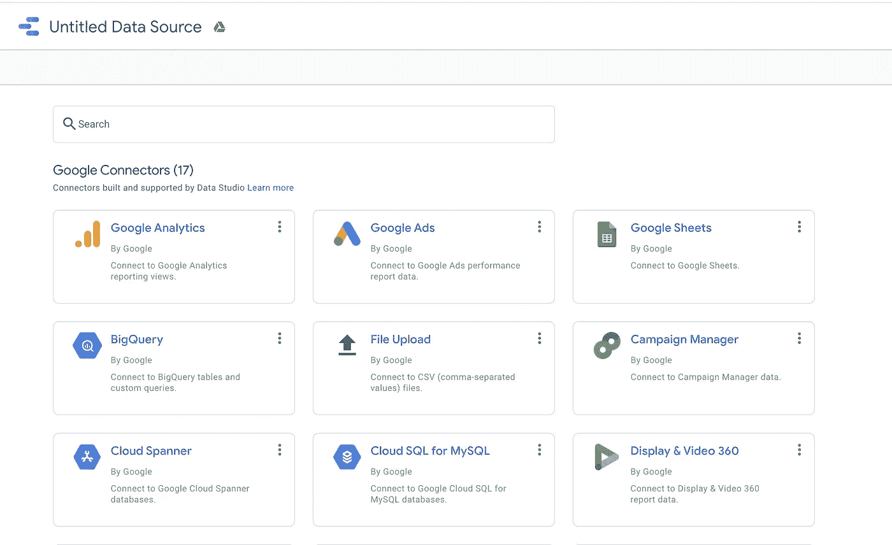

选择您选择的平台或连接器，浏览您希望连接的数据集，并点击“ ***连接*** ”按钮。

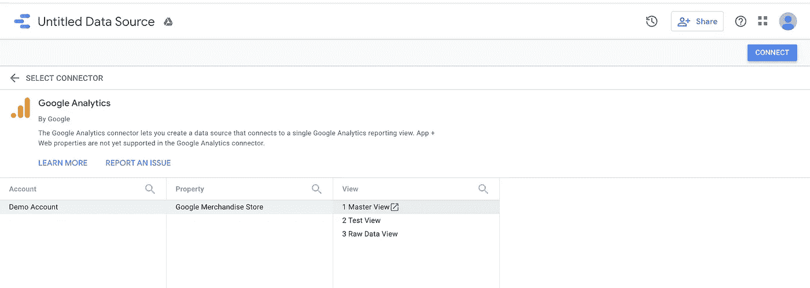

一旦您连接到数据集，您的窗口将被分成

*   字段名称
*   字段类型
*   字段默认汇总类型
*   描述(如果有)

蓝色字段是基于指标的—可以聚合的字段(总和、平均值、计数等。)或表示数量值。

绿色字段是维度字段，这些字段本质上是分类字段(姓名、国家等。)

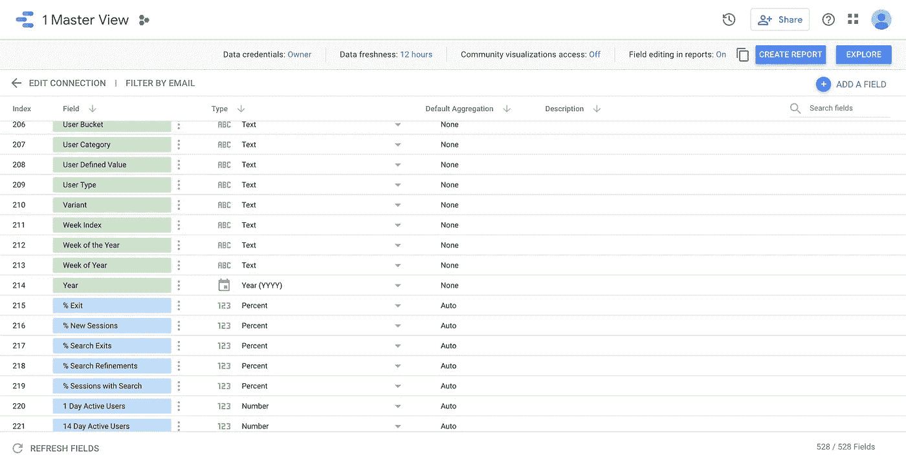

您可以通过点击下拉菜单来更改字段的' ***'类型*** '。

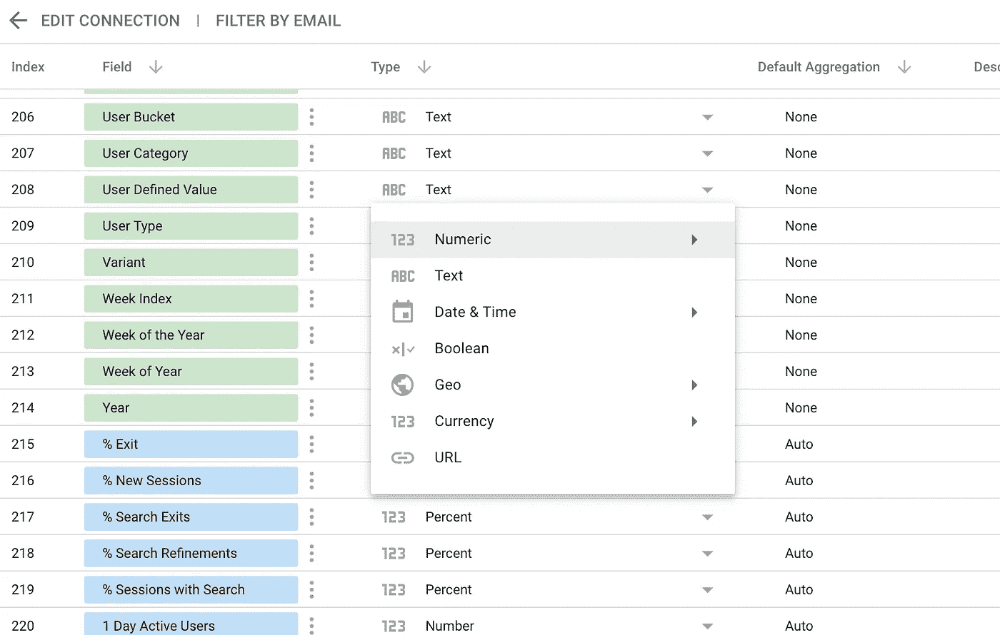

您还可以选择双击特定字段来更改或修改其名称

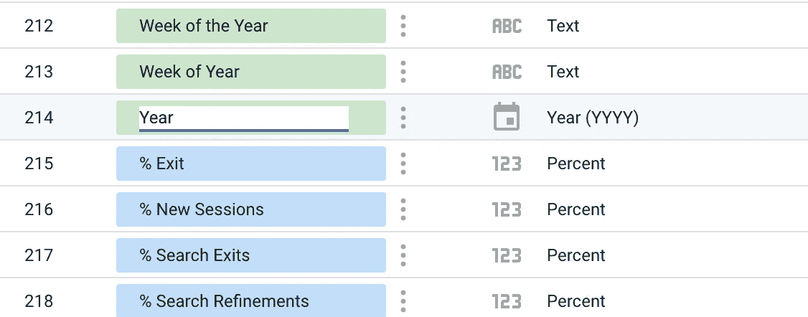

根据您的要求修改并准备好数据后，点击“ ***创建报告*** ”。

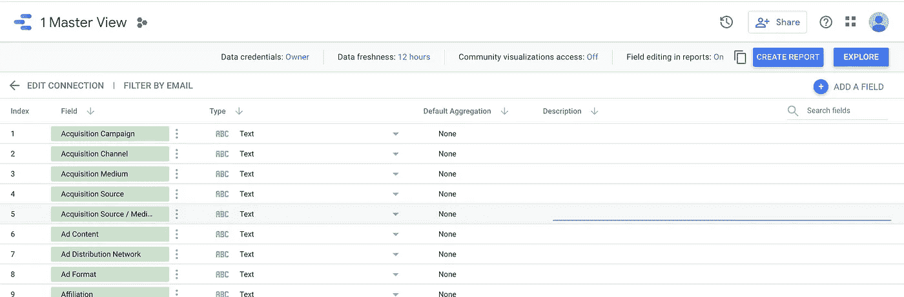

# ***步骤 3 —探索工作空间***

在空白画布上，从重命名报告的标题开始。

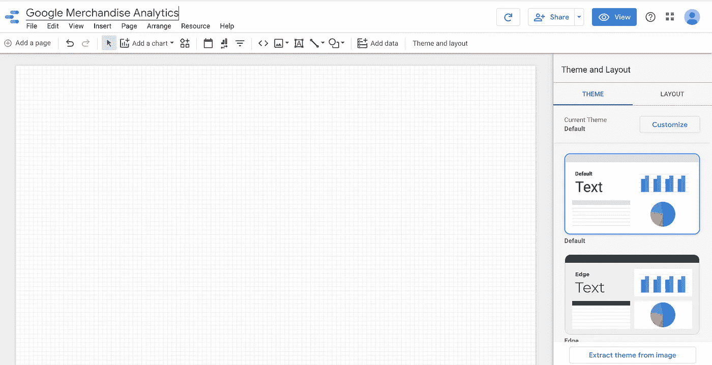

接下来，让我们快速浏览一下工具栏，如下所示:

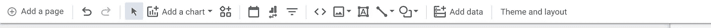

*   添加页面—允许您向报表添加另一个页面
*   基本撤消和重做选项

*   箭头表示选择模式
*   ***添加图表*** 选项为您提供了多个图表选项来构建您的视觉效果

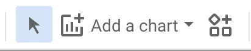

*   接下来的 3 个图标分别用于日期过滤器、数据控件和过滤器控件。

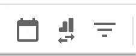

*   下面的 5 个图标用于在报表中嵌入 URL、图像、文本框、线条和形状。

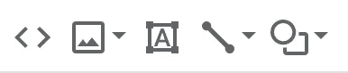

*   下面的最后两个选项允许我们在 Google Data Studio 中现有的数据源之外添加额外的数据源。
*   主题和布局为我们提供了格式化选项，这些选项将在窗口的右窗格中提示。

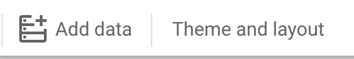

# ***第四步:创建图表/报表***

点击' ***添加图表*** '选项，选择您想要开始构建的图表。

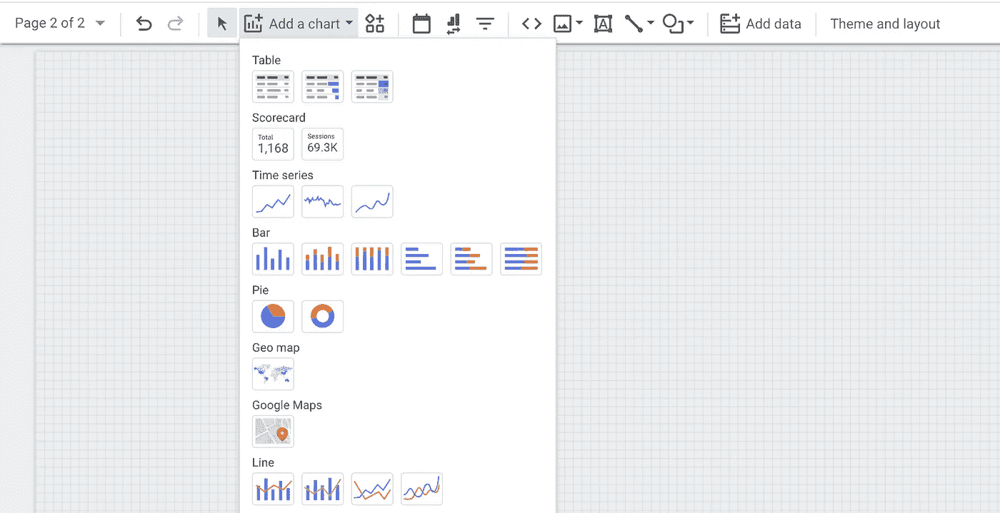

一旦你选择了一个图表类型——在下图中我选择了时间序列——你可以选择把它放在画布上的任何地方

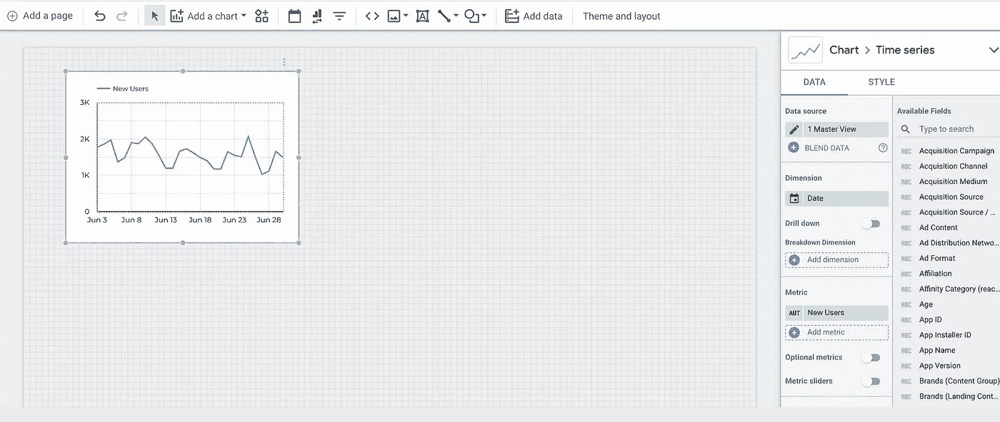

在右侧窗格中，您还可以选择更改折线图的维度或度量。

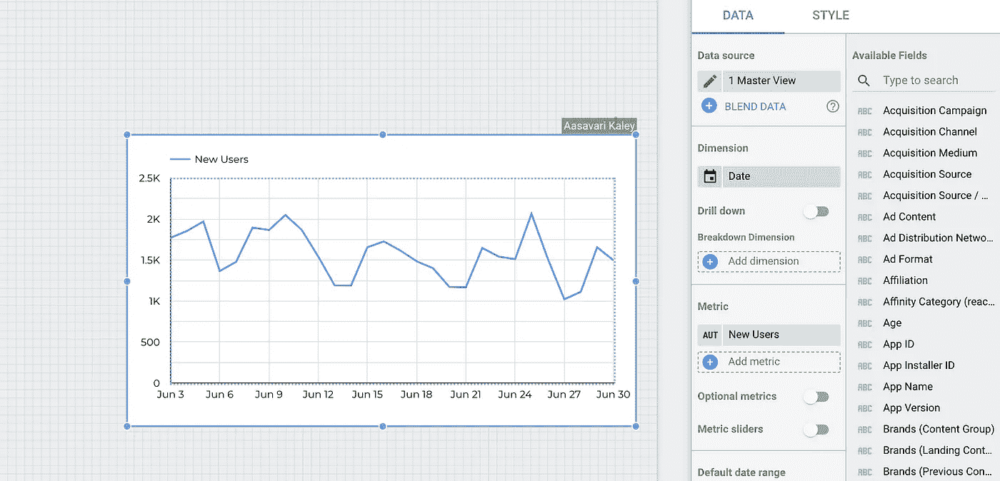

单击“新用户”指标选择其他字段。

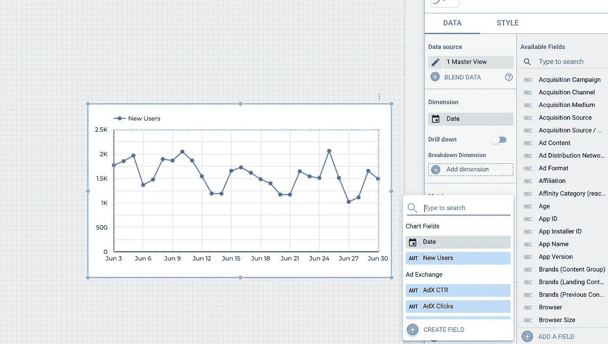

您还可以通过设置格式来增强图表。点击右侧窗格中的 ***样式*** 标签

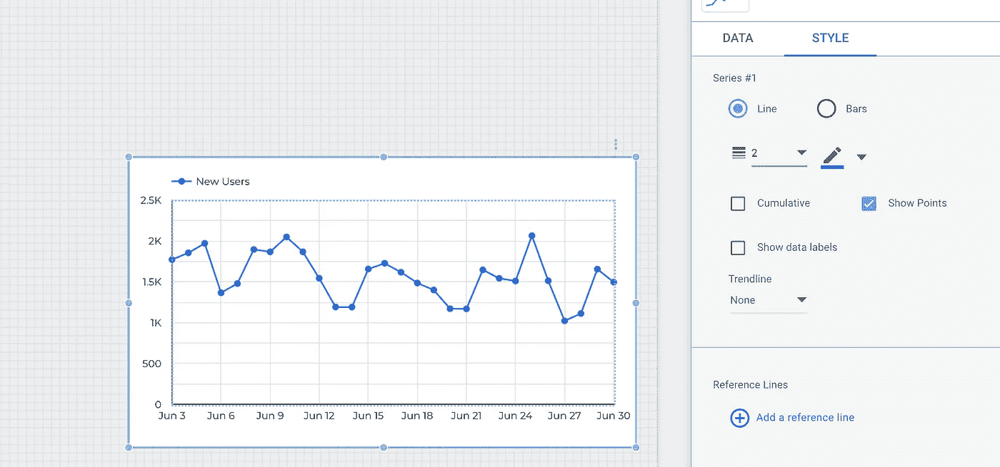

好了，你在 Google Data Studio 中建立了你的第一个图表。你可以在这里找到我创建的报告模板:[谷歌商品分析](https://datastudio.google.com/reporting/6d8372a6-f912-4ddf-86cd-b2fe1d62a0d7)

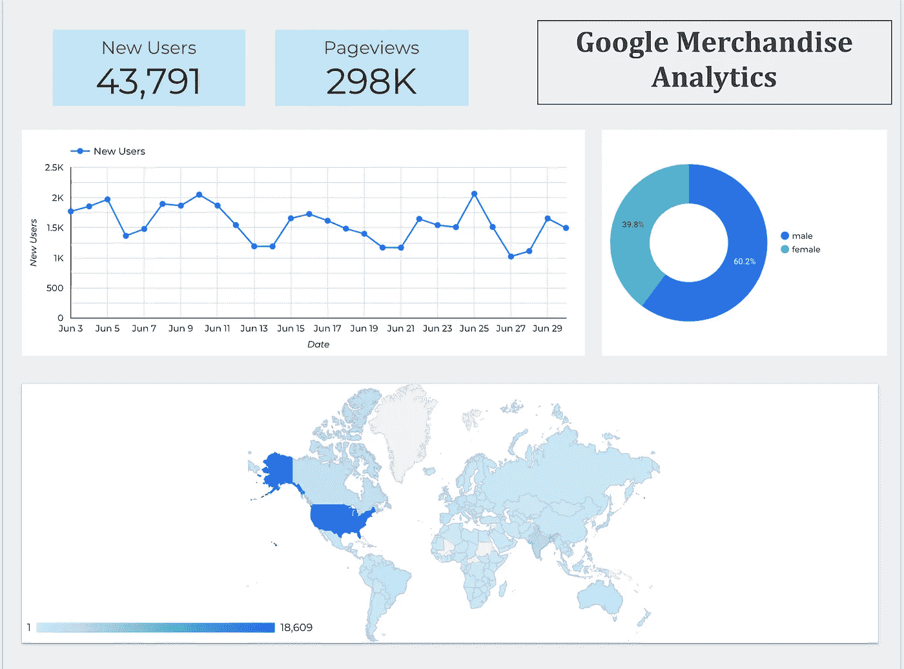

# ***第五步:协作与分享***

现在，您已经策划了您的见解深刻的报告，并希望与您的利益相关者或团队成员分享，请单击右上角的“ ***【分享】”*** 按钮，并添加您想要分享报告的收件人。

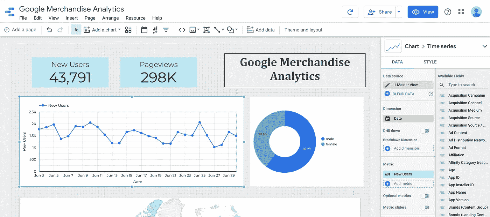

您还可以选择管理收件人的访问权限。

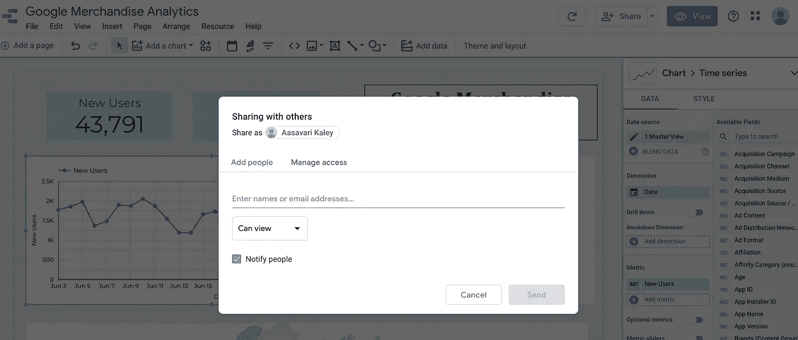

这篇文章为您提供了 Google Data Studio 的基本视图，我强调了 Google Data Studio 提供的一些非常基本的功能，并注意到还有许多更吸引人的功能来进一步增强我们的报告，使我们的故事更有洞察力。

敬请关注更多关于数据的文章！