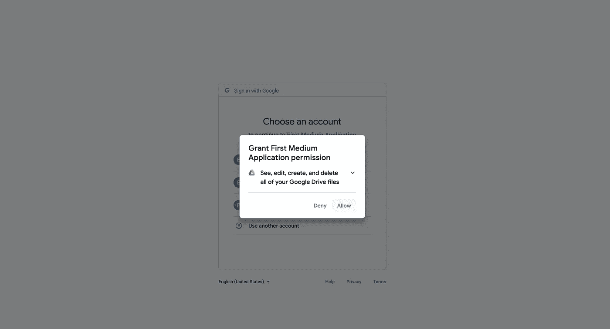
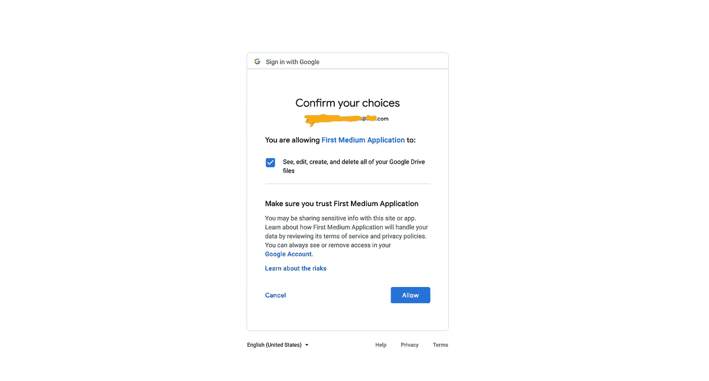

# 连接到 Google Drive 并使用 Python 搜索文件:使用 Python 的 Google Drive API 第二部分

> 原文：<https://levelup.gitconnected.com/google-drive-api-with-python-part-ii-connect-to-google-drive-and-search-for-file-7138422e0563>

如果你还没有设置你的 Google Drive API，那么请按照本教程[这里](https://medium.com/@thecruisy/google-drive-api-with-python-part-i-set-up-credentials-1f729cb0372b)的范围和凭证。

为了能够访问 API 资源，我们需要获得访问令牌。由于我们想要访问的 API 资源包含敏感范围(访问 Google Drive 中的文件)，我们需要第一次进行浏览器身份验证。


在我们开始之前，让我们设置一个`virtual environment`来包含和安装这个项目的所有依赖项。我们将从安装`google-api-python-client`和`oauth2client`库开始。

```
MacBook-Pro:~ bobthedude$ virtualenv venv_google_api
MacBook-Pro:~ bobthedude$ source venv_google_api/bin/activate# install all the dependent packages
(venv_google_api) MacBook-Pro:~ bobthedude$ pip install google-api-python-client oauth2client
```

在项目目录中创建一个名为`credentials`的文件夹来存储您的`client_secret.json`，您可以从您的 **Google 控制台**下载它。如果你不知道如何做到这一点，按照这个教程[这里](https://medium.com/@thecruisy/google-drive-api-with-python-part-i-set-up-credentials-1f729cb0372b)。

您的项目结构应该像这样开始。`connect_to_google_drive.py`是包含连接到 Google Drive API 的指令的 Python 文件。

```
first_medium_project
|
|__credentials
|  |
|  |__client_secret.json
|
|__connect_to_google_drive.py
```

让我们编写需要进入`connect_to_google_drive.py`的代码。

```
from apiclient import discovery
from httplib2 import Http
from oauth2client import client, file, tools

# define path variables
credentials_file_path = './credentials/credentials.json'
clientsecret_file_path = './credentials/client_secret.json'

# define API scope
SCOPE = 'https://www.googleapis.com/auth/drive'

# define store
store = file.Storage(credentials_file_path)
credentials = store.get()# get access token
if not credentials or credentials.invalid:
    flow = client.flow_from_clientsecrets(clientsecret_file_path, SCOPE)
    credentials = tools.run_flow(flow, store)
```

您的访问令牌将在浏览器认证后存储在`credentials/credentials.json`中，我将在此之后进行认证。

现在，保存文件并进入您的`terminal`。按照以下命令获取您的访问令牌。**注意**:如果你从一个 IDE(我使用`PyCharm`)执行上面的脚本，你会得到一个错误。只有第一次，您需要从您的`terminal`执行脚本。

```
(venv_google_api) MacBook-Pro:~ bobthedude$ cd first_medium_project
(venv_google_api) MacBook-Pro:first_medium_project bobthedude$ python connect_to_google_drive.py# below is the output of the above command
/Users/bobthedude/virtualenv/venv_google_api/lib/python3.7/site-packages/oauth2client/_helpers.py:255: UserWarning: Cannot access ./credentials/credentials.json: No such file or directory
  warnings.warn(_MISSING_FILE_MESSAGE.format(filename))Your browser has been opened to visit:[https://accounts.google.com/o/oauth2/auth?client_id=123456789101-ab12r1abcdefjklm1a2bcdefghi12a1a.apps.googleusercontent.com&redirect_uri=http%3A%2F%2Flocalhost%3A8080%2F&scope=https%3A%2F%2Fwww.googleapis.com%2Fauth%2Fdrive&access_type=offline&response_type=code](https://accounts.google.com/o/oauth2/auth?client_id=278243817351-rg97r0faiaalfbpa6e3ecaggsgv80o7m.apps.googleusercontent.com&redirect_uri=http%3A%2F%2Flocalhost%3A8080%2F&scope=https%3A%2F%2Fwww.googleapis.com%2Fauth%2Fdrive&access_type=offline&response_type=code)If your browser is on a different machine then exit and re-run this
application with the command-line parameter--noauth_local_webserver
```

执行上述命令后，将会打开一个浏览器选项卡。选择您在上一步中设置 API 和凭证的 Google 帐户。然后点击**允许**。



如果您想让您的**第一媒体应用程序**访问您的 Google Drive 文件，Google 将再次提示您并要求确认。继续点击**允许**。



如果成功，您的浏览器将返回包含以下文本的页面`The authentication flow has completed`。如果您返回到您的`terminal`，您应该看到额外的两行(表示认证成功)打印如下。

```
/Users/bobthedude/virtualenv/venv_google_api/lib/python3.7/site-packages/oauth2client/_helpers.py:255: UserWarning: Cannot access ./credentials/credentials.json: No such file or directory
  warnings.warn(_MISSING_FILE_MESSAGE.format(filename))Your browser has been opened to visit:[https://accounts.google.com/o/oauth2/auth?client_id=123456789101-ab12r1abcdefjklm1a2bcdefghi12a1a.apps.googleusercontent.com&redirect_uri=http%3A%2F%2Flocalhost%3A8080%2F&scope=https%3A%2F%2Fwww.googleapis.com%2Fauth%2Fdrive&access_type=offline&response_type=code](https://accounts.google.com/o/oauth2/auth?client_id=278243817351-rg97r0faiaalfbpa6e3ecaggsgv80o7m.apps.googleusercontent.com&redirect_uri=http%3A%2F%2Flocalhost%3A8080%2F&scope=https%3A%2F%2Fwww.googleapis.com%2Fauth%2Fdrive&access_type=offline&response_type=code)If your browser is on a different machine then exit and re-run this
application with the command-line parameter--noauth_local_webserverAuthentication successful.
success
```

此外，您将看到在`credentials`文件夹中创建了一个新文件`credentials.json`。干得好！我们现在已经获得了访问令牌，可以用它来连接 Google Drive API 资源。

```
(venv_google_api) MacBook-Pro:first_medium_project bobthedude$ ls credentials/# output as below
client_secret.json credentials.json
```

现在，让我们给我们的`connect_to_google_drive.py`添加一个函数，它将检索我们在 Google Drive 中的所有文件。

```
from apiclient import discovery, errors
from httplib2 import Http
from oauth2client import client, file, tools

# define variables
credentials_file_path = './credentials/credentials.json'
clientsecret_file_path = './credentials/client_secret.json'

# define scope
SCOPE = 'https://www.googleapis.com/auth/drive'

# define store
store = file.Storage(credentials_file_path)
credentials = store.get()

if not credentials or credentials.invalid:
    flow = client.flow_from_clientsecrets(clientsecret_file_path, SCOPE)
    credentials = tools.run_flow(flow, store)

# define API service
http = credentials.authorize(Http())
drive = discovery.build('drive', 'v3', http=http)

# define a function to retrieve all files
def retrieve_all_files(api_service):
    results = []
    page_token = None

    while True:
        try:
            param = {}

            if page_token:
                param['pageToken'] = page_token

            files = api_service.files().list(**param).execute() # append the files from the current result page to our list
            results.extend(files.get('files')) # Google Drive API shows our files in multiple pages when the number of files exceed 100
            page_token = files.get('nextPageToken')

            if not page_token:
                break

        except errors.HttpError as error:
            print(f'An error has occurred: {error}')
            break # output the file metadata to console
    for file in results:
        print(file)

    return results

# call the function
all_files = retrieve_all_files(drive)
```

现在，转到您的`terminal`并执行 Python 脚本。

```
(venv_google_api) MacBook-Pro:first_medium_project bobthedude$ python connect_to_google_drive.py# output will look like this
{'kind': 'drive#file', 'id': '12345678901234TyVhFjlzOhL9MoazYiFbyABWgV9abC', 'name': 'Christmas Plan', 'mimeType': 'application/vnd.google-apps.spreadsheet'}
{'kind': 'drive#file', 'id': '12345678901234sN8zlbWAptpqNOgEihTZhgKgsAbac9', 'name': 'Event Feedback', 'mimeType': 'application/vnd.google-apps.form'}
{'kind': 'drive#file', 'id': '12345678901234URWSjdpbEABCDE', 'name': 'Workshop 2010', 'mimeType': 'application/vnd.google-apps.folder'}
```

从上面可以看到，我们的 Python 脚本已经成功连接到 Google Drive API 资源，检索了所有文件并打印了文件元数据。

你可以用这个做很多其他的事情。您可以添加几行接受文件名的代码，以便 Python 脚本检索您感兴趣的特定文件的文件元数据。让我们修改一下`retrieve_all_files`函数，看看它会是什么样子。

```
# define a function to retrieve all files
def retrieve_all_files(api_service, filename_to_search):
    results = []
    page_token = None

    while True:
        try:
            param = {}

            if page_token:
                param['pageToken'] = page_token

            files = api_service.files().list(**param).execute()# append the files from the current result page to our list
            results.extend(files.get('files'))# Google Drive API shows our files in multiple pages when the number of files exceed 100
            page_token = files.get('nextPageToken')

            if not page_token:
                break

        except errors.HttpError as error:
            print(f'An error has occurred: {error}')
            break# output the file metadata to console
    for file in results:
        if file.get('name') == filename_to_search:
            print(file)
            break return results, file # call the function
filename_to_search = 'Christmas Plan'
all_files, search_file = retrieve_all_files(drive, filename_to_search)
```

在本系列教程的下一部分，我将向您展示如何从 Google sheet 下载特定的工作表到 csv 文件中。此外，我们将把上面的代码转换成命令行应用程序，而不仅仅是一个普通的 Python 脚本。

你可以在这里看到这个教程的第一部分[。](https://medium.com/@thecruisy/google-drive-api-with-python-part-i-set-up-credentials-1f729cb0372b)

敬请期待第三部！😃