# 谷歌 I/O 2021 主题演讲(第二部分)——新功能、Android 12 和星光计划

> 原文：<https://levelup.gitconnected.com/google-i-o-2021-keynote-part-ii-whats-new-android-12-project-starline-9a93f857f628>

大家好，我将继续主题活动的第二部分。你可以在下面找到前一部分。我希望你喜欢第二部分。

part I->[https://level up . git connected . com/Google-I-o-2021-keynote-whats-new-part-I-ea 8449 aa 5827](/google-i-o-2021-keynote-whats-new-part-i-ea8449aa5827)

# **谷歌购物**

谷歌使用来自用户的数据，使其更有帮助。他们这样做也是为了购物。据 Bill Ready 称，人们每天在谷歌上购物超过 10 亿次。让我们看看比尔宣布了什么。

**购物图**

购物图汇集了来自网站、价格评论、视频的信息，最重要的是他们从品牌和直接从零售商那里获得的产品数据。

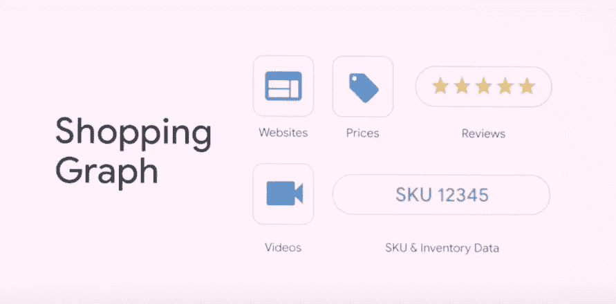

谷歌可以将用户与 240 亿个商品联系起来，从网上数百万个商家那里购买这些商品。

*   **购物场景**

根据 Bill Ready 的说法，谷歌将把购物体验与镜头、搜索、照片、Youtube 和 Chrome 结合起来。例如，你在餐馆看到家具，你想买下来。可以用 Lens 搜一下，购买。

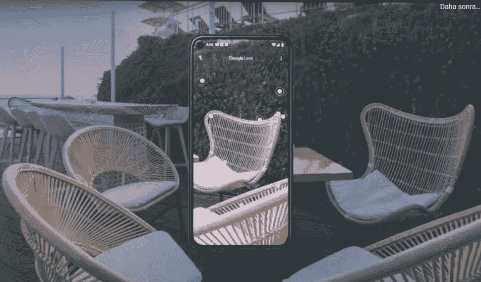

用谷歌镜头搜索家具

您找到了家具，但您改变了主意，键入“庭院家具”进行搜索。你可以在谷歌图片上找到数百万种不同家具的库存、评论和价格信息。

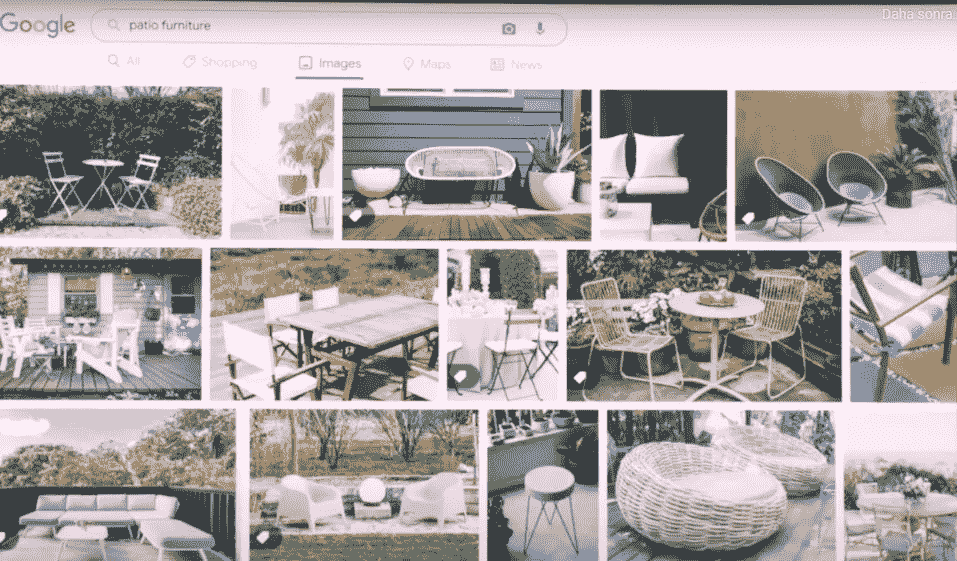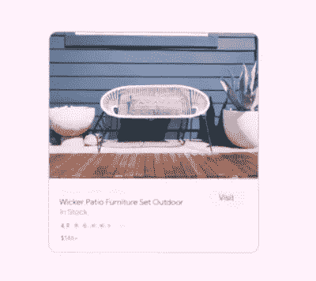

有时人们会截取产品的截图，但过一段时间后，他们会将图片隐藏起来。更新后，你将能够在谷歌镜头的帮助下在照片中搜索该项目。

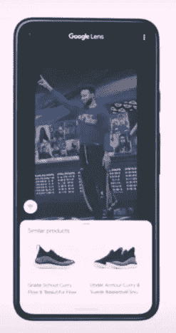

另一个正在更新的是 Youtube。用户将能够浏览他们在 Youtube 视频上看到的产品。

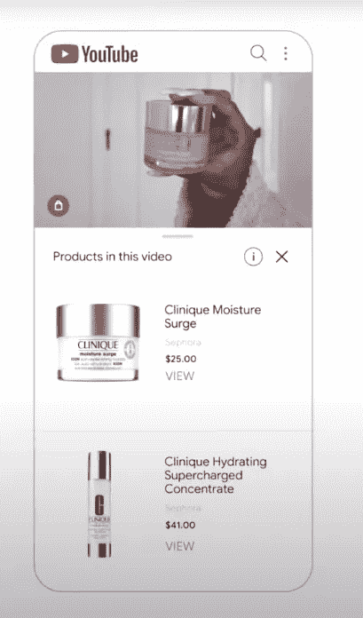

此外，Chrome 将在购物时获得更新。当你打开一个新标签，你会看到你在过去几周内打开的购物车。而且如果用户选择购买，还会有特别优惠。

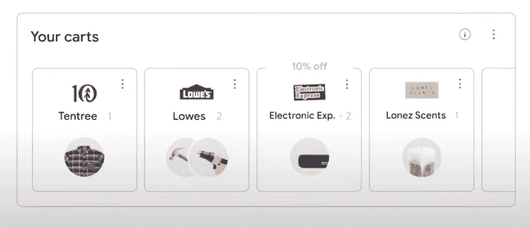

# Google 相册

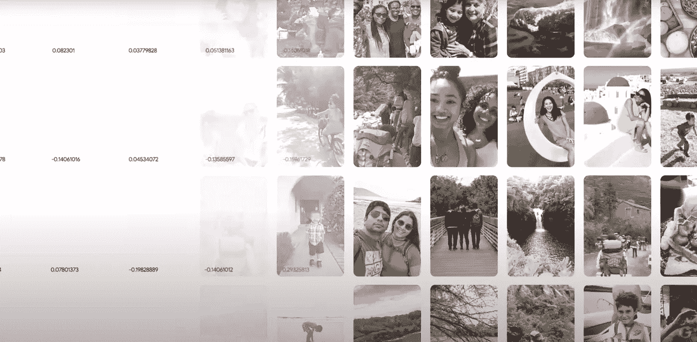

小图案

谷歌照片正在更新中，它旨在通过照片重现你的记忆。人们拍照，有时这些照片可能会被遗忘，谷歌有一个更新来改变它。

*   **小图案**

> “这项功能使用机器学习将照片转化为一系列数字，并比较这些图像在视觉上或概念上的相似程度。当我们发现一组三张或三张以上的照片在形状或颜色等方面有相似之处时，我们会将它们作为一种模式呈现出来。”希姆里特·本·亚伊尔

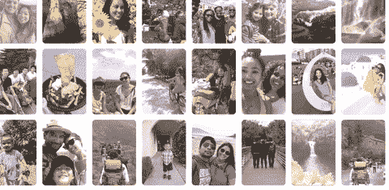

*   **电影照片**

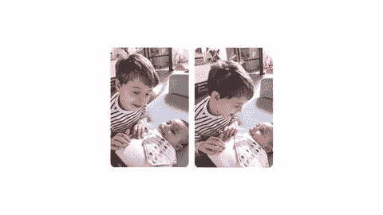

# 设计和安卓

在 2014 年推出材料设计后，它为 Android 应用程序设定了新的标准。人们更倾向于表达他们的个性，他们对他们的技术也有同样的要求。谷歌认为这是一个挑战，他们意识到美是个人的。他们称新设计为“材料你”。这种设计包括用户作为共同创作者，并让您通过生成个人材料调色板来转换应用程序。此外，这种设计可以适应每种屏幕和每种设备。这种新设计允许您更改:

1.  调色板
2.  对比
3.  大小
4.  线条宽度

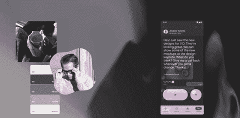

# 安卓 12

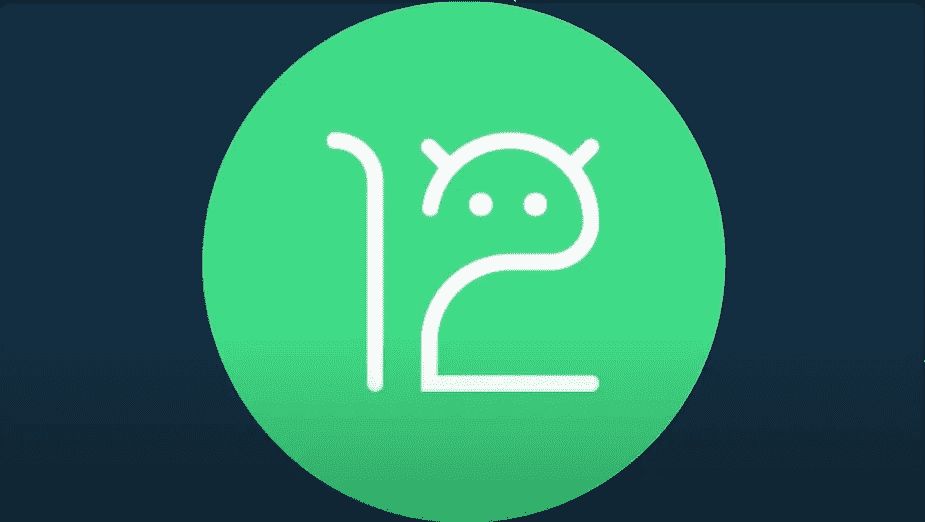

这就是我们的 Android 12！作为一名 Android 开发者，这个话题与我关系太密切了。我们去看看。

## 动态调色板和照明

谷歌将使用一种具有材料颜色目标的聚类算法来确定哪些颜色是主导色，哪些颜色是互补色，哪些颜色在一起看起来很棒。系统将根据壁纸照片中的颜色创建自定义调色板。然后，它会在界面的不同部分应用色调。

在照明的情况下，从锁定屏幕开始，照明将改变你触摸或拿起你的手机没有触摸，屏幕将从你的屏幕底部点亮。

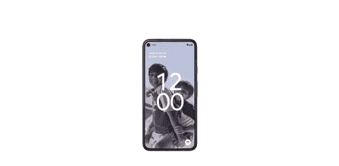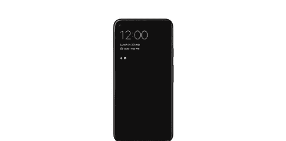

## 隐私与安全

> “自 2017 年以来，谷歌 Pixel 和三星 Galaxy 在 Gartner 的年度移动操作系统比较报告中连续获得最高的安全评级。简单来说就是运行在 Android 上的最安全的设备。随着 Android 12 的推出，我们将进一步保护您的信息安全。”苏珊娜·弗雷

在 Android 12 中，谷歌创建了一个新的**隐私仪表板**，给人们更多的透明度和控制权。

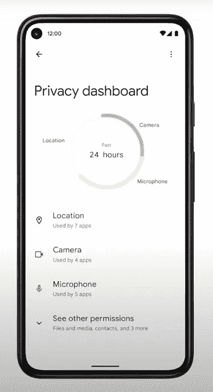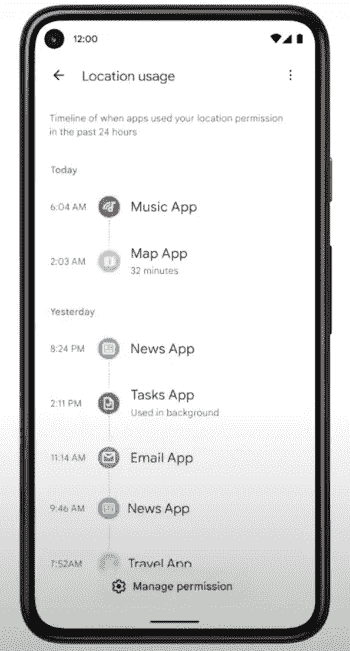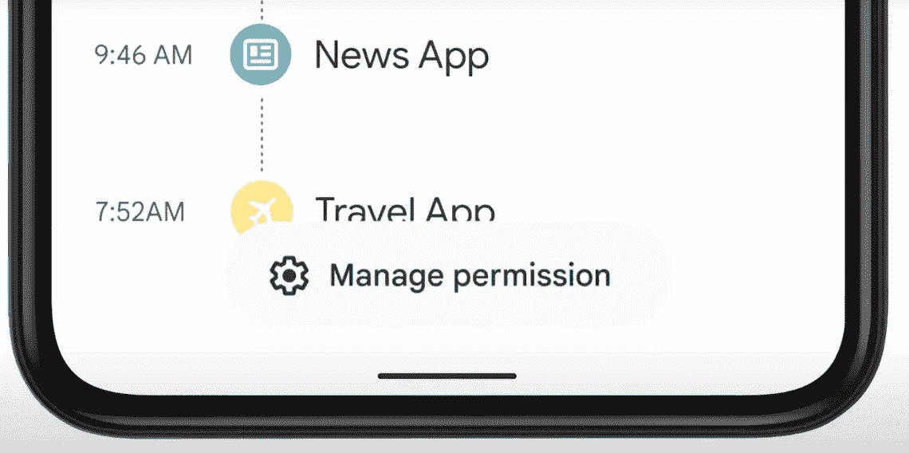

此外，如果麦克风和摄像头在使用中，还会有指示。

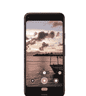

# 健康

谷歌人工智能正在帮助卫生部门识别不同类型的癌症。人工智能正在标记图像以供进一步评估。

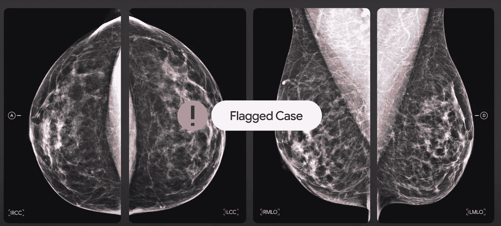

*   **皮肤科辅助工具**

您可以通过电话或计算机使用该工具。从不同角度上传 3 张不同的照片就足以搜索你想要了解的皮肤、指甲或头发问题。

# 星光计划

根据我对演示的理解，Project Starline 是一种新的 3D 成像技术，它允许您在电话和会议中以自己的全息 3D 图像显示自己的 3D 模型。这项技术仍在开发和测试中。我们将会看到我们的未来。

谢谢大家的阅读和掌声。我希望你喜欢我的文章。再次感谢 cyaa！👋👋