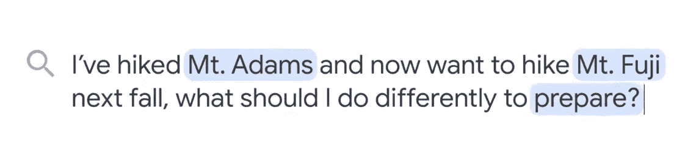

# 谷歌 I/O 2021 主题演讲(第一部分)——有什么新内容？

> 原文：<https://levelup.gitconnected.com/google-i-o-2021-keynote-whats-new-part-i-ea8449aa5827>

各位开发者好，今天是我们一个大事件的第一天。Google I/O 2021 于 5 月 18 日开始，我们期待着 Google 产品的精彩更新。主题活动结束后，我决定写一写这次活动的新闻。(提示:这个活动很鼓舞人心，看完整个视频，我会说。)希望你喜欢这篇文章。:)

# **为新冠肺炎提供高质量的信息**

新冠肺炎影响了每一个社区，像商业和学校。据桑德尔·皮帅称，谷歌与[的非营利组织](https://www.google.org/covid19/crisisrelief/)密切合作来帮助这些社区，并推出了产品和倡议来帮助这些社区。这些产品和计划帮助学生和教师不断学习，使小企业适应新常态，并为有需要的人提供紧急救济。在谷歌，他们与 [CDC](https://www.cdc.gov/) 、 [FDA](https://www.fda.gov/) 、[世卫组织](https://www.who.int/)合作，帮助人们获取高质量、权威的新冠肺炎信息，包括准确的疫苗信息。据桑德尔·皮帅称，covid 相关信息被浏览了数千亿次。

# 谷歌地图更新

根据桑德尔·皮帅的说法，谷歌正试图以一个终极目标发展，“为每个人建立一个更有帮助的谷歌”。 得益于这个目标，谷歌在谷歌地图上多增加了 15 万公里的自行车道。

*   **环保路线**

利用他们对道路和交通状况的了解，谷歌地图将很快让用户选择最省油的路线，以减少大量的排放和燃料消耗。

*   **更安全的路由**

在人工智能的帮助下，地图将识别道路和交通状况，以创建更安全的路线。谷歌的目标是通过这项新功能减少事故。

*   **现场查看**

据 Liz Reid 称，谷歌将发布 100 多项地图改进。其中之一就是实时取景。他们正在将 AR 导航添加到地图中(左侧图片。)用户可以通过谷歌地图游览这些地方。此外，用户将直接从地图上访问实时视图，并将立即看到细节(右侧图片。)

除了这些功能，谷歌还宣布了谷歌地图的几个功能。

1.  实时视图中的街道标志。
2.  地标和必要的建筑，比如他们住的酒店或餐馆。
3.  在室内帮助用户在机场、火车站和商场等建筑物中导航。

*   **详细的街道地图**

另一个特点是详细的地图。你可以看到路灯，人行道，人行横道，人行岛。到今年年底，详细的街道地图将被添加到 50 个城市。

*   **更量身定制的地图**

有时我们会在地图上看到很多信息。可能会让人不知所措。为了解决这个问题，谷歌将通过在你需要的时候高亮显示最相关的位置，使地图更加动态。例如，在 08.00 时，地图上会显示更多的面包店或咖啡店；在 17.00 时，地图上会显示更多的餐车或餐馆。

另一方面，如果你在一个新的城市，地图会显示地标或旅游景点。

*   **区域繁忙程度**

利用这一功能，用户可以检查区域繁忙程度。

# 智能画布

去年，由于 covid19，同事们改变了他们的工作空间和办公室。随着越来越多的人在家工作，使用协作工具变得越来越重要。Google 在 2006 年的中引入了*【Docs】*和*【Sheets】*来帮助人们进行协作。一年后，他们公布了“幻灯片”。它们是 Google Workspace 的一部分。Google Workspace 的新成员是**智能画布**。谷歌旨在通过这款新产品实现更丰富的合作。

示例:开始灵感触发文档

用户可以:

*   添加团队成员以共享文档。
*   写下目标或头脑风暴主题。

*   共享文档后，同事们可以放下他们的想法进行头脑风暴。

*   “*辅助写作”*功能通过建议单词，帮助您使用更准确、更有效的单词。
*   **分享**

更新后，用户将能够直接在 Google Meet 电话会议上分享他们正在处理的工作表、文档和幻灯片。此功能将使团队在处理同一文档时能够听到和看到彼此。

# Google Meet 更新

*   **语音取消**

借助人工智能的力量，Google Meet 将取消不想要的声音，以增强沟通。

*   **自动灯光调节**

Google Meet 会在机器学习的帮助下调整你的视频缩放和灯光。

*   **定制视图**

用户将根据他们的需要安排他们同事的视频块。

*   **直播字幕**

Google Meet 将允许你为国际同事打开字幕甚至翻译来跟踪会议。

# **LaMDA(用于对话应用的语言模型)**

谷歌[桑德尔·皮帅](https://www.google.com/search?sxsrf=ALeKk00MFI0YVeryfNde9B1aH2NNKAgZgQ:1621378964592&q=Sundar+Pichai&stick=H4sIAAAAAAAAAONgVuLSz9U3sExPKTY3ecRoyi3w8sc9YSmdSWtOXmNU4-IKzsgvd80rySypFJLgYoOy-KR4uJC08Sxi5Q0uzUtJLFIIyEzOSMwEAG8r_JxWAAAA)的 CEO 宣布了他们最新的突破 LaMDA。LaMDA 是一种语言理解模型，可以与 AI 进行更自然的对话。下面我放了完整对话的视频。

与 LaMDA 的另一个对话示例。

# 使用谷歌更安全

据桑德尔·皮帅称，所有谷歌产品都遵循三个重要原则。这些是默认安全的*，*设计私有的*，以及由您控制的*。**

## ***默认安全***

*为了保证用户的安全，谷歌构建的一切在默认情况下都是安全的。他们的每个产品都受到最先进的人工智能驱动技术的保护，谷歌宣布了密码管理器的 4 项新升级。*

*   *从其他密码管理器导入密码的简单工具。*
*   ***Chrome 和 Android 之间的深度集成，以便在两者上使用密码。***
*   ***自动密码提醒会让您知道您保存的任何密码是否被泄露。***
*   ***一个助手，可直接导航至受损帐户，在几秒钟内更改密码。***

## *设计为私有*

*根据 Jen Fitzpatrick 的说法，谷歌会不断思考，以做出深思熟虑的决定，决定何时、如何以及为什么在他们的产品中使用数据。谷歌声称，他们从未将数据出售给任何人，也从未将存储的数据用于广告。*

## *你在控制中*

*谷歌认为隐私是个人的，他们正在升级他们的一些产品，以允许用户选择适合他们的产品。*

**

*点击个人资料图片并立即删除最近 15 分钟的搜索历史记录。*

**

*在更新中将有一个切换按钮来禁用谷歌地图上的最后访问位置历史。*

**

*最后，锁定的文件夹在照片的路上。*

# *多任务统一模型*

**

*MUM 是一种使数据变得可访问和有用的技术。谷歌将使用这项技术来理解语音、图像、文本等数据类型，谷歌引擎将做出相应的响应。MUM 比 BERT 模型强大 1000 倍。这项技术最重要的一面是多任务处理能力，以便以新的方式解锁信息。妈妈可以同时做的一些事情:*

*   *获得深刻的世界知识*
*   *生成语言*
*   *75 种以上语言的培训*
*   *了解多种形式*

**

*MUM 集成谷歌搜索的一个例子*

*现在，我们来看看答案。*

**

*很神奇，对吧？！！*

# *谷歌镜头*

*谷歌镜头可以让你搜索你用相机和照片看到的东西。根据 Prabhakar Raghavan 的说法，人们每天使用谷歌镜头翻译超过 10 亿个单词。谷歌正在开发新的功能，将视觉翻译与来自网络的教育内容结合起来，以帮助人们学习。Raghavan 先生说，例如，你拍了一张科学问题的照片，镜头会以你喜欢的语言提供学习资源。*

*让我们在短片中看看这一新功能的一个很好的例子。*

*有很多要消化，对吧？但是，这些发展让我们得以一瞥未来。第二部将会有更多的内容。我希望你喜欢阅读这篇文章，并跟上新技术。谢谢，再见！*

*第二部分->[https://level up . git connected . com/Google-I-o-2021-keynote-whats-new-part-I-ea 8449 aa 5827](https://gurescaner.medium.com/google-i-o-2021-keynote-part-ii-whats-new-android-12-project-starline-9a93f857f628)*