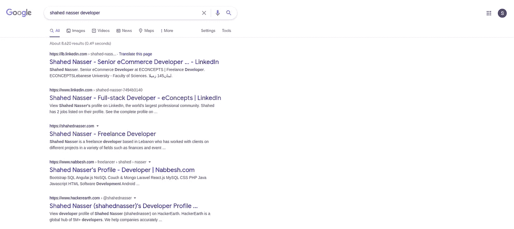
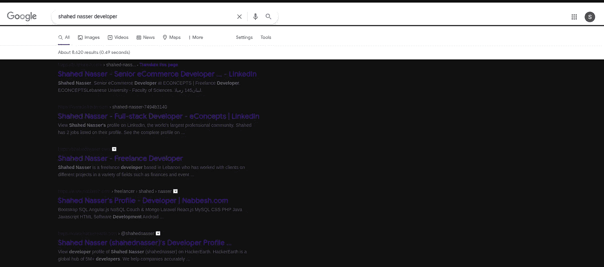
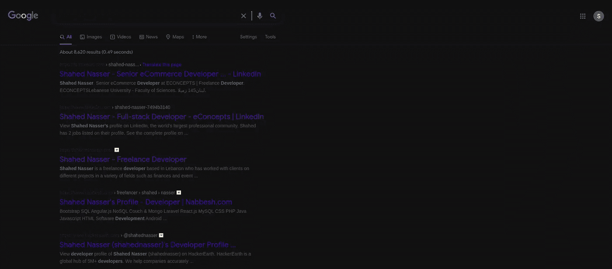
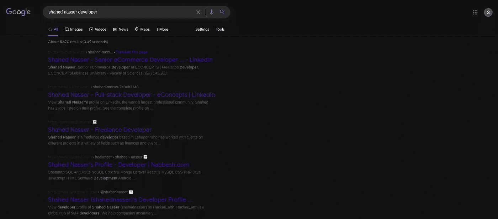
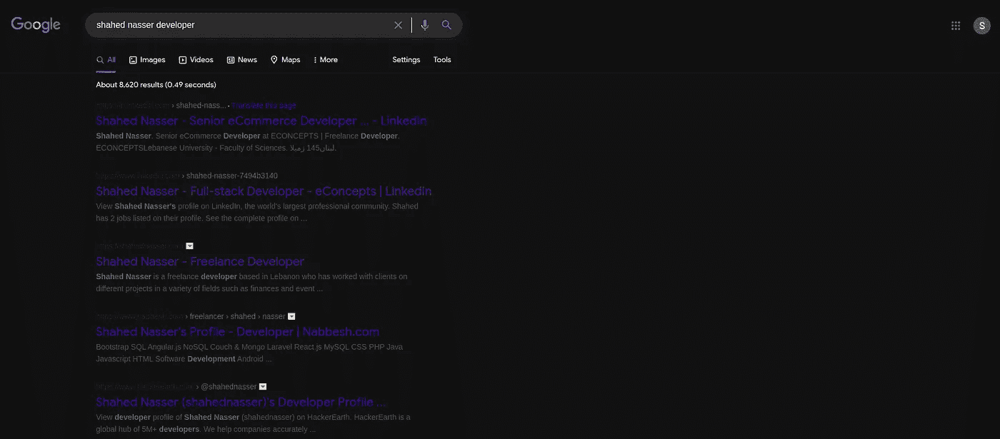
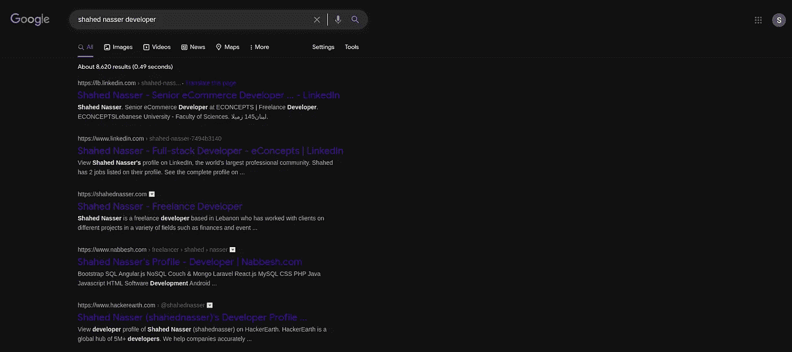
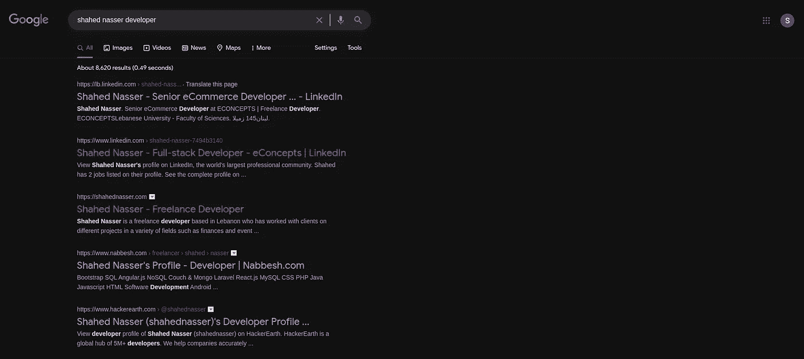

# 黑暗模式下的谷歌

> 原文：<https://levelup.gitconnected.com/google-in-dark-mode-4d5b4357f298>


[米切尔·罗](https://unsplash.com/@mitchel3uo?utm_source=medium&utm_medium=referral)在 [Unsplash](https://unsplash.com?utm_source=medium&utm_medium=referral) 上的照片

*本文原载于* [*我的个人博客*](https://blog.shahednasser.com/google-in-dark-mode/) *。*

如果你和我一样，那么你一定喜欢黑暗模式。它更酷、更有品位，但对眼睛来说也更容易。现在，它在大多数网站和应用程序中得到了更多的应用，然而，并不是所有的网站和应用程序都顺应了这一趋势。

我们几乎每天都用得最多的网站就是其中之一。大家最喜欢的搜索引擎 Google 不支持黑暗模式。所以，为了好玩，我想我应该试着想象一下谷歌的黑暗模式会是什么样子。

我将使用材质的[深色主题](https://material.io/design/color/dark-theme.html#properties)作为深色模式的调色板。

你已经知道这一点，但只是为了比较，这是谷歌默认的样子:



第一个明显的步骤是将`body`的背景颜色改为深色，将`body`中的文本颜色改为浅色。基于材质的深色主题，我们将为主体使用的深色是`#121212`，为文本使用的浅色是`#fff`。

所以，这就是我要添加的 CSS:

```
body { 
 background-color: #121212;
 color: #fff; 
}
```

这就是结果:



需要做更多的工作。我们在正文中有一些部分，它们的背景颜色被明确设置为白色。

在检查了 Chrome 的 Devtools 中的元素后，我发现具有白色背景色的元素有:`#hdtb`和`.yg51vc`用于导航栏，`#appbar`用于结果栏(显示找到的结果数的那个)，`.sfbg`用于标题的背景，以及`.RNNXgb`用于输入的背景色。我还注意到`#hdtb`有一个边框底部，它的颜色被设置为`#ebebeb`这是一个浅色，所以它也需要改变。

我知道你在想什么，这些类和 id 肯定是随机生成的。我也是这么想的，但是，在试了几次之后，我发现它们不是随机的。他们总是一样的。

所以我添加的下一条规则如下:

```
#hdtb, .yg51vc, #appbar, .sfbg, .RNNXgb {
 background: #121212; 
}

.RNNXgb {
 background: #2b2b2b !important; /** Give it a different color than the background to stand out **/ 
}

.gLFyf {
 color: #fff; /** The input for the search field **/ 
} #hdtb {
 border-bottom-color: #1F1B24; 
}
```

这是结果:



所以，现在背景是黑暗的，但还有很多工作要做。

页面上几乎所有的文本都不会因为改变`body`元素的`color`而受到影响。因此，我们需要检查元素，看看如何改变它。

我从导航栏开始。检查后，`.hdtb-mitem a`、`.hdtb-mitem .GOE98c`、`.GshZze`元素的颜色设置为`#5f6368`。所以，我添加了以下规则:

```
.hdtb-mitem .GOE98c, .hdtb-mitem a, .GshZze {
 color: #FFFFFF !important;
}
```

这是结果:



接下来，结果栏。设置了颜色的类是`.LHJvCe`。所以我添加了以下规则:

```
.LHJvCe {
 color: #FFFFFF; 
}
```

这是结果:



接下来，我转到结果中的文本和链接。从文本开始，检查完元素后，需要更改元素`.IsZvec`和`.aCOpRe em`。我注意到`.aCOpRe em`用于指出搜索查询中包含的文本，所以我决定给它一种不同的颜色。

我添加了以下规则:

```
.IsZvec {
 color: #adadad; 
} .aCOpRe em {
 color: #e4e4e4; 
}
```

至于引用，或者结果上面的链接面包屑，需要改变的元素是`cite`。我添加了以下规则:

```
cite, cite a:link, cite a:visited { color: #9c9c9c; }
```

这是结果:



现在对于结果的链接，Google 只是在所有的`a`元素上设置了颜色规则。对于“翻译此页面”链接，它在`a.fl:link`上设置规则。很简单。所以我添加了下面的规则来改变颜色:

```
a, a.fl:link {
 color: #BB86FC; 
} a:visited {
 color: #9326ca; /** color for the visited links **/ 
}
```

最后，结果是:



我们完事了。显然，这只是为了网站的主结果页面，但它看起来很好。

作为比较，下面是亮模式和暗模式之间的区别:


# 结论

你更喜欢谷歌的哪个版本？你希望哪些网站或应用有黑暗模式？让我知道！

*原载于 2021 年 2 月 4 日 https://blog.shahednasser.com*[](https://blog.shahednasser.com/google-in-dark-mode/)**。**