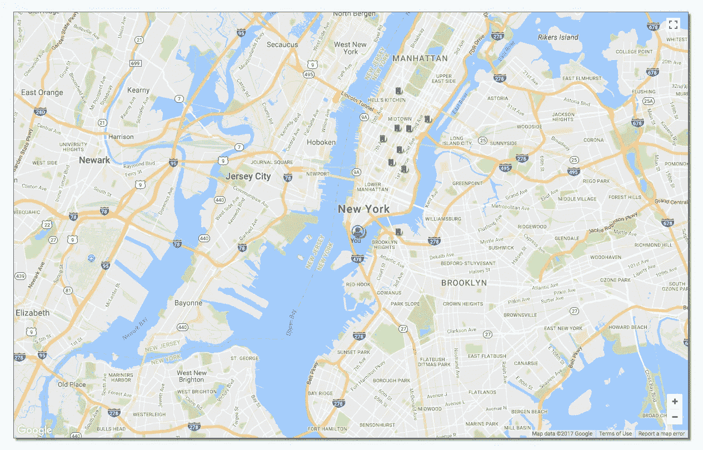
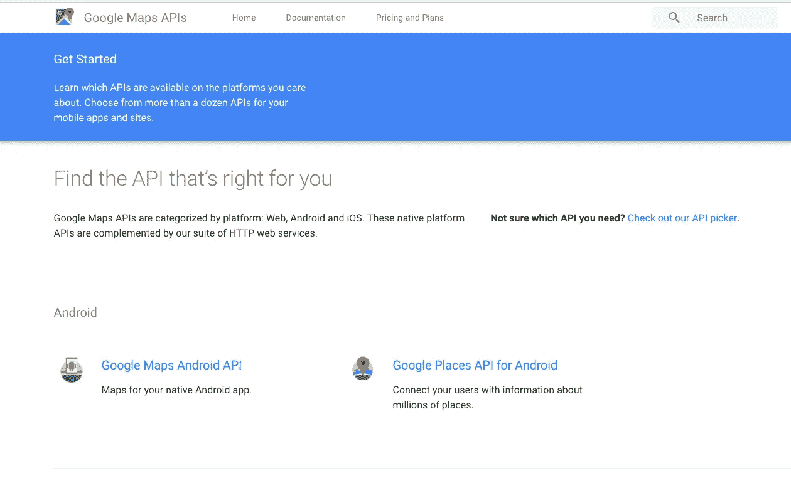
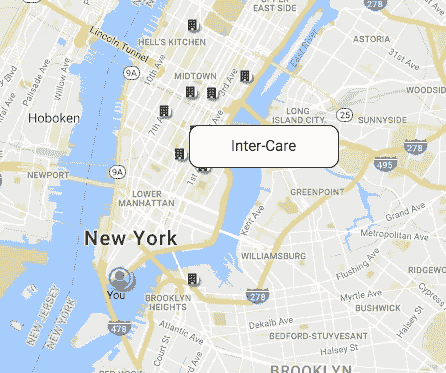

# 谷歌地图反应初学者指南

> 原文：<https://levelup.gitconnected.com/google-map-react-beginners-guide-85bb1a94b04a>



我的 GoogleMapReact 组件用于显示附近的药物滥用康复机构

能够在 React 应用中使用 Google Maps API 不仅可以为您提供可靠的导航资源，还可以通过整合流畅的地图界面来改善整体用户体验。Google Map React 做了很好的工作，让您可以访问 Google Maps API，并展示 JavaScript 功能和表示。

为什么我选择了`google-map-react`而不是`react-google-map`？我以前没有使用后者的经验，因此无法给出准确的评估，但我的一些“不幸”使用它的同学强烈要求我不要使用它。然而，谷歌地图 React 获得了好评！

# 入门指南

你要做的第一件事是从 Google API 站点[获取一个 Google API 密钥。](https://developers.google.com/maps/get-started/)



我选择了 Google Maps Javascript API，它让您能够根据自己的内容和功能定制地图组件。

抓住那个 API 键，我会在后面讲到它。但是现在您已经有了它，您可以继续下载项目中的`google-map-react-package`。

```
npm install --save google-map-react
```

在您成功地安装了这个包之后，您需要将它导入到您将在其中使用`GoogleMapReact`组件的组件中(以及任何`GoogleMapReact`属性，我很快就会谈到)。

```
import GoogleMapReact from 'google-map-react';
```

首先，您应该设置一些`defaultProps`供您的地图组件使用。这不仅在地图等待接收您选择的任何数据时非常有用，而且实际上是必要的。如果您没有通过您的组件`defaultProps`，该组件将会中断，因为它没有所需的数据。

```
static defaultProps = {
   center: {lat: 40.73, lng: -73.93}, 
   zoom: 12
}//the center coordinates are NYC. I chose 12 as the zoom because it didn’t seem too far away or too close. The higher the number you choose, the more you zoom in on the map.
```

除了`defaultProps`，你还需要一些其他的参数。以下是我用于我的`GoogleMapReact`组件的内容:

```
<GoogleMapReact 
   defaultCenter={this.props.center}
   center={this.state.center}
   defaultZoom={this.props.zoom}
   onChildMouseEnter={this.onChildMouseEnter}
   onChildMouseLeave={this.onChildMouseLeave}
/>
```

我提供了`defaultCenter`，这是地图在接收到另一个改变中心的选项之前的中心位置(在我的例子中，是通过我的`currentUser`动作获得的当前位置)。我还是想维持原来的`defaultZoom`(用户可以通过点击地图上的加号和减号来放大和缩小)。那么`onChildMouseEnter`和`onChildMouseLeave`事件是与`GoogleMapReact`组件的悬停功能一致的功能。这样，我可以将鼠标悬停在每个标记上并显示设施名称。当悬停在每个标记上时，显示消失。



如果你不把这些函数传递给你的地图组件，它不会崩溃，但也不会有任何酷的悬停交互性。所以，是的，传下去。

还记得之前的 API 密匙吗？是的，它也会成为一个道具。

```
<GoogleMapReact  
   **bootstrapURLKeys={{
      key: YOUR_API_KEY, 
      language: 'en'
   }}**
   defaultCenter={this.props.center}
   center={this.state.center}
   defaultZoom={this.props.zoom}
   onChildMouseEnter={this.onChildMouseEnter}
   onChildMouseLeave={this.onChildMouseLeave}
></GoogleMapReact>
```

`**bootstrapURLKeys**` 带两个花括号，因为它是一个对象道具，你有两个键/值:`key`指向你的 API 键(用引号括起来)，和默认语言(我用`‘en’`表示英语)。

但是你怎么拿到马克笔呢？还是当前位置 pin？嗯，我做的方法是我做了两个组件:`FacilityPin`和`CurrentPin`。

对于设施，我绘制了从商店获得的所有设施，并为每个设施制作了一个`FacilityPin`，传递了所有必要的道具。

```
const facilityPins = this.props.facilities.map((facility, index) ={
   if (facility.latitude === null || facility.longitude === null){
     return null
   } else {
     return <FacilityPin 
             onClick={()=>this.setPinAsCenter(facility)}
             key={index} 
             onChildMouseEnter={this.onChildMouseEnter}
             onChildMouseLeave={this.onChildMouseLeave} 
             handlePinClick={this.handleOnClick} 
             facility={facility}
             hover={this.state.hover} 
             lat={facility.latitude} 
             lng={facility.longitude} 
            />
   }
}
```

如果设施由于任何原因具有不合法的纬度或经度(即，当在设施对象创建时地址在后端被错误地传递时)，那么我检查它们并忽略它们。没有别针！

附注:我在 App 中调用了对我的 facilities API 进行提取的操作，因此我只需进行一次提取，而无需重新加载。因此，只要您不重新加载页面，它就可以在我的组件中使用，无需等待时间！

我需要将鼠标功能传递给工具引脚，因为它们是我们将要悬停的组件。下面是我的`FacilityPin`组件的代码。

```
import React from 'react'
import { Icon } from 'semantic-ui-react'const pinStyle={
  borderRadius: '10px',
  transform: 'matrix(-1, 0, 0, 1, 10, 0)'
}const FacilityPin = (props) => {
    return(
      <div>
        <Icon className="building icon" 
          size='big' 
          style={pinStyle} 
          onClick={props.onClick}
         />
      </div>
    )
}export default FacilityPin
```

至于`CurrentPin`，在这一点上它仅仅是表象。所以我传递给它一个文本对象，以及当前用户的纬度和经度。

```
{facilityPins}<CurrentPin
  lat={this.props.current.lat}
  lng={this.props.current.lng}
  text={'You'}
/>
```

这里是`CurrentPin`组件的代码。

```
const iconStyle = {  
    borderRadius: '100px',  
    boxShadow: '3px 3px 1px #888888'
} const CurrentPin = ({text}) => {  
   return(
      <div>
        <Icon name="user circle outline" 
         color='blue' 
         size='big' 
         style={iconStyle}
        />      
        {text} 
       </div> 
    )
}
```

悬停时出现的信息框呢？是的，另一个组成部分。

```
{this.state.hover 
   ? <InfoBox 
      onClick={()=>{this.setPinAsCenter({
                      lat: this.state.lat, 
                      lng: this.state.lng
              })}
      lat={this.state.lat}
      lng={this.state.lng}
      facility={this.state.facility}
  : null
}
```

请注意，该组件不包含在设施 pin 组件中。我一开始是这样做的，当你将鼠标悬停在其中一个设施上时，它会显示所有设施的信息框。只是一团糟。点击下面的链接查看 GitHub Repo 中的所有代码。

 [## macro 6461/mod-5-项目-前端

### 此时您不能执行该操作。您已使用另一个标签页或窗口登录。您已在另一个选项卡中注销，或者…

github.com](https://github.com/macro6461/mod-5-project-frontend/tree/master/src/components/facility) 

# **外卖**

1.  从[谷歌地图 API 站点](https://developers.google.com/maps/get-started/)获取 API 密钥
2.  安装 [google-map-react npm 包](https://www.npmjs.com/package/google-maps-react)(不是 react-google-map)
3.  在地图组件中导入`GoogleMapReact`
4.  确保给予适当的…支持(确保适当地包括适当的`defaultProps`——好吧，我就不说了)
5.  任何想要出现在地图上的组件都需要用`<GoogleMapReact></GoogleMapReact>`包裹起来
6.  `GoogleMapReact`有很多有用的功能来提高地图的交互性
7.  定制(外观和功能)是一个主要的关键🔑

我仍在探索`GoogleMapReact`的所有酷功能，但我希望这是一个有用的指南！还有大量有用的文档。(眨眨眼)

[*点击此处，将您的免费媒体会员升级为付费会员*](https://matt-croak.medium.com/membership) *，每月只需 5 美元，您就可以收到各种出版物上数千名作家的无限量无广告故事。这是一个附属链接，你的会员资格的一部分帮助我为我创造的内容获得奖励。谢谢大家！*

# 参考

[](https://github.com/fullstackreact/google-maps-react) [## fullstackreact/谷歌地图-反应

### “如何编写 Google Maps React 组件”教程的配套代码

github.com](https://github.com/fullstackreact/google-maps-react) [](https://github.com/istarkov/google-map-react) [## 伊斯塔科夫/谷歌地图反应

### 通用谷歌地图反应组件，允许在谷歌地图上渲染反应组件

github.com](https://github.com/istarkov/google-map-react) [](https://www.npmjs.com/package/google-map-react) [## 谷歌地图反应

### 同构的谷歌地图 react 组件，允许在谷歌地图上渲染 react 组件

www.npmjs.com](https://www.npmjs.com/package/google-map-react) [](https://developers.google.com/maps/get-started/) [## 开始使用谷歌地图 APIs |谷歌开发者

### 了解哪些 API 在你关心的平台上可用。为您的移动应用程序选择十几个 APIs

developers.google.com](https://developers.google.com/maps/get-started/)