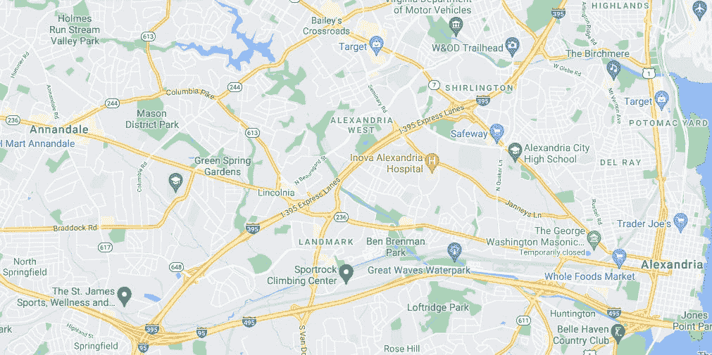
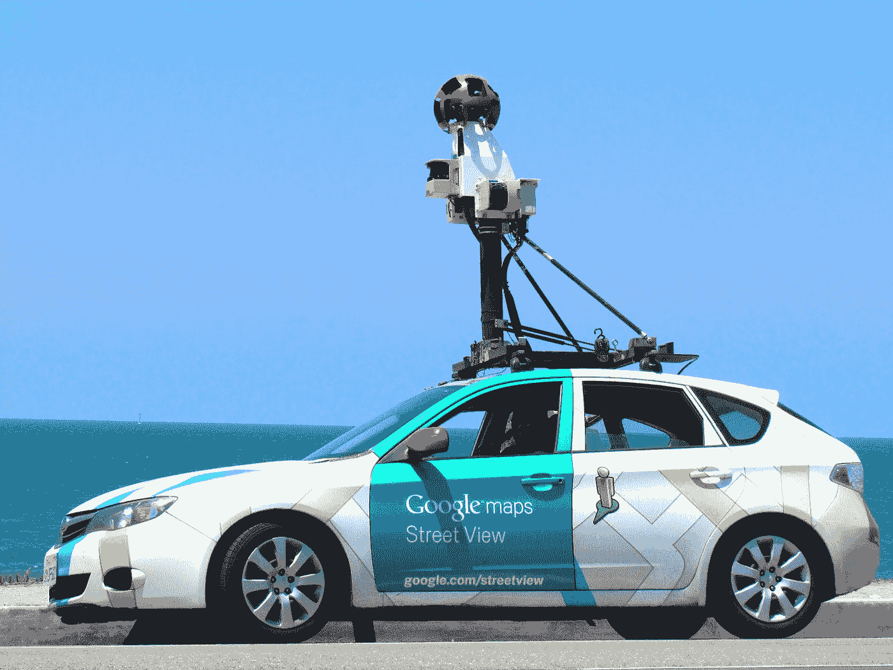
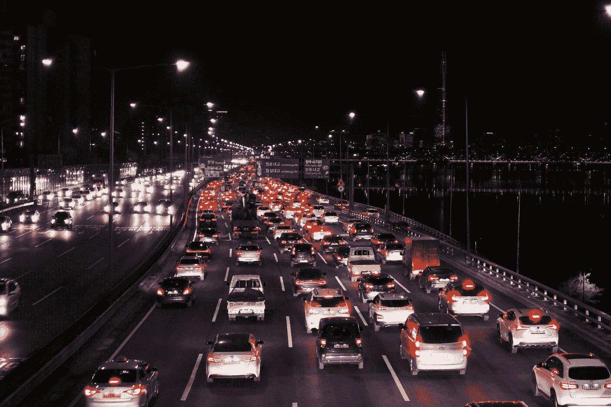

# 谷歌地图太疯狂了！

> 原文：<https://levelup.gitconnected.com/google-maps-is-insane-29f85bca4ed6>

布兰登·林在 [Unsplash](https://unsplash.com?utm_source=medium&utm_medium=referral) 上的照片

想象一下，你正开车去参加一个重要的活动，但是不认识路。你可能感到无助，因为你不想迟到。你拿出手机，打开谷歌地图，搜索你的目的地。它向您显示到达目的地的准确路线，同时预测您的到达时间。

在上述场景中，多亏了谷歌地图，您才能够到达目的地。它向你展示了最快的路线，同时也预测了交通状况。

但是谷歌地图怎么知道走哪条路线呢？它如何显示你家附近的每一条道路？在这篇文章中，你将了解谷歌地图是如何在幕后工作的。

> 在物理和虚拟空间中，导航的便利性都很重要
> 
> —约翰·奎尔奇 CBE

# 构建地图

谷歌已经与国家和地方政府当局合作，以获得各自地区的地图。然而，这些并不包含所有的道路和建筑物。使用**卫星图像**可以获得更精细、更详细的地图视图。这些地图然后被处理以显示道路和建筑物的轮廓，如下图所示。

图片来源:谷歌地图

上面获得的数据并不完全准确。为了仔细检查数据，谷歌使用**街景车**。这些汽车访问每一个地方，以确保道路地图是正确的。他们还帮助获取现有道路和建筑物的地址，以及为没有名称的街道分配地址。

照片由[苏西·布鲁克斯](https://unsplash.com/@simplysuzy?utm_source=medium&utm_medium=referral)在 [Unsplash](https://unsplash.com?utm_source=medium&utm_medium=referral) 上拍摄

这些汽车还为谷歌地图提供了一个有趣的功能，即[谷歌街景](https://www.google.com/streetview/)。这些汽车使用特殊的摄像机从多个方向拍摄图像。它们后来被组合并重叠成一个 360 度的视图。你可以坐在房间里环游世界！

谷歌还鼓励用户为保持地图的准确性做出贡献。用户可以通过谷歌地图上的**建议编辑**选项报告不准确的数据。

世界一直在快速变化。企业关闭或搬迁到不同的位置或修建新的道路。所以，谷歌几乎每秒都要更新地图！让我们看看谷歌是如何做到这一点的。

谷歌通过卫星图像和街景车不断收集新信息。一些组织、企业和用户也可以通过不同的渠道做出贡献。一个这样的渠道是针对企业的 Google My Business。

此外，谷歌有一个专门的团队，通过结合各种来源的数据，开发识别垃圾邮件或欺诈的算法，甚至直接联系企业和组织，来保持地图的更新。

谷歌的产品总监伊桑·拉塞尔(Ethan Russell)说，“谷歌地图用户每天贡献超过 2000 万条信息”。

# 预测交通状况

谷歌希望确保向你展示到达目的地的最佳路线。为此，事先了解交通状况是很重要的。你可能已经注意到用橙色或红色标记的路段，那里的交通比平时拥挤。你会看到谷歌是如何估计这些交通状况的。

[敏库康](https://unsplash.com/@minkus?utm_source=medium&utm_medium=referral)在 [Unsplash](https://unsplash.com?utm_source=medium&utm_medium=referral) 上的照片

如果你的手机定位服务开启，谷歌会从你的手机收集位置数据，这些数据是匿名的(谷歌不知道你是谁)。其他用户也是如此。对于任何一条路线，谷歌都知道使用谷歌地图的汽车数量以及行驶速度。如果大量的汽车低速行驶，那条路上就有交通。

上述方法显示了当前 时间 ***的交通流量。但是你想知道当你在 20-30 分钟内到达那个点时，交通会是什么样子。因此，了解当前的交通状况是不够的。***

谷歌有过去几年那条路上交通状况的数据。它将当前交通数据与历史数据相结合，并对它们使用**机器学习算法**来预测当你到达那条道路时交通会是什么样子。谷歌还收集任何可能让你减速的道路封闭或事故的报告。

如果你担心谷歌收集的数据，你可以关闭手机的定位功能。显然，您将无法使用导航服务。最佳做法是仅在使用导航时打开您的位置。

# 显示最快的路线

我们看到了谷歌如何利用用户手机的位置数据预测交通状况。让我们来了解一下谷歌是如何利用这些数据来显示到达目的地的最快路线的。

当用户输入他的出发地和目的地时，谷歌地图使用几种最短路径算法来计算你的路线。一种这样的算法是 Dijkstra 的最短路径算法。

图由用边连接的节点组成，并且图算法涉及遍历每个节点一次。对于地图，节点是道路之间的地标或交叉点以及源和目的地节点，而边是连接它们的道路。每条边都有一个权重，该权重是使用道路的长度、花费的时间以及由于交通或道路封闭导致的任何延迟来计算的。

自然，边权重越高，路径通过该边的机会就越小。Dijkstra 算法构造一条由权重最小的边组成的路径。这意味着它会向您显示耗时最少的道路。

访问[此处](https://www.geeksforgeeks.org/dijkstras-shortest-path-algorithm-greedy-algo-7/)了解 Dijkstra 算法的实现。这是一个简化的实现，谷歌地图中使用的算法非常复杂，需要考虑很多因素。

[丹钟](https://unsplash.com/@dannayyyboi?utm_source=medium&utm_medium=referral)在 [Unsplash](https://unsplash.com?utm_source=medium&utm_medium=referral) 上的照片

你需要知道的最后一件事是谷歌地图如何能够估计到达目的地所需的时间。类似于预测交通状况，谷歌从用户手机上收集位置数据。因此，谷歌知道每辆车的行驶速度。

谷歌有过去几年这条路上平均速度的数据，并使用这些数据来预测你的速度，从而估计你的到达时间。

# 结论

谷歌已经绘制了几乎整个世界的地图。在几个合作伙伴的帮助下，谷歌能够收集数据以构建地图并不断更新它们。

谷歌地图彻底改变了现代导航。无论你在哪里，你总能找到到达目的地的路。Google 使用您的位置数据和过去的信息来预测交通状况以及到达目的地所需的时间。谷歌使用几种图形算法来找到到达目的地的最快路线。

这些实现是可能的，因为谷歌拥有大量数据。我试图用一种简单的方式来解释这个实现。数百万用户使用谷歌地图，因此了解它的工作原理非常重要。

如果您无法理解内容或对解释不满意，请在下面评论您的想法。新想法总是受欢迎的！如果你喜欢这篇文章，请关注我的每周更新。到那时，再见！