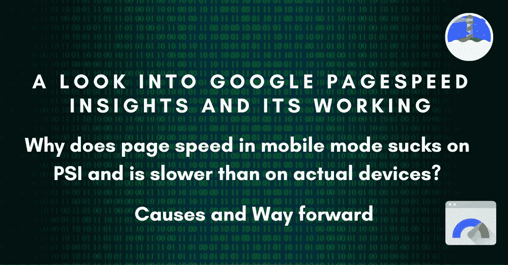
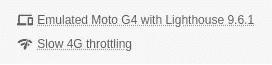
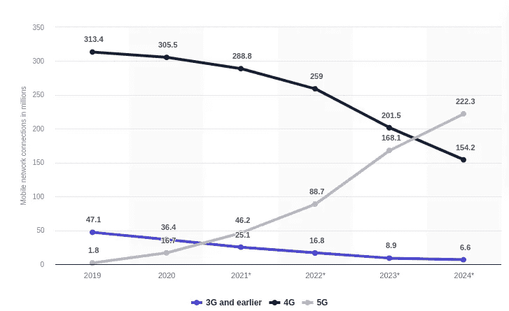
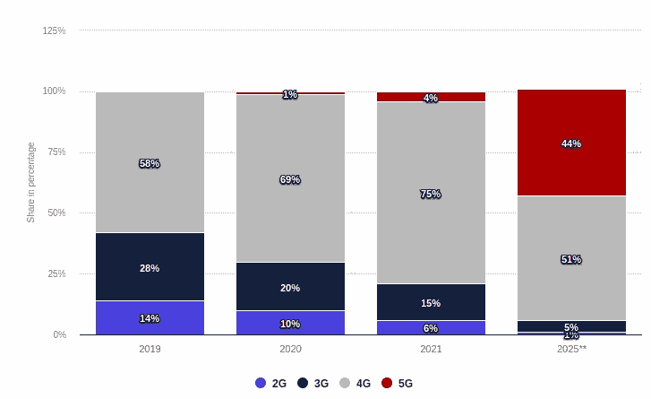
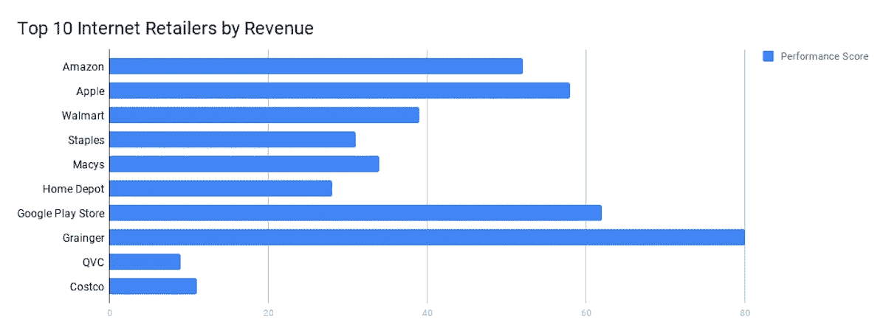
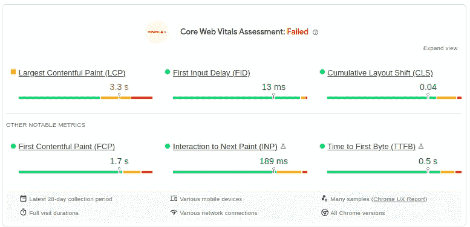
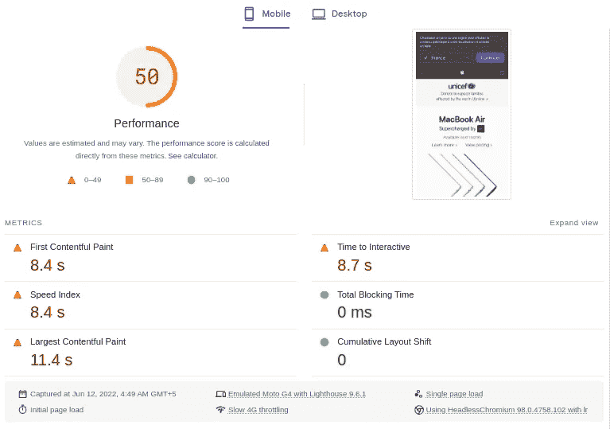
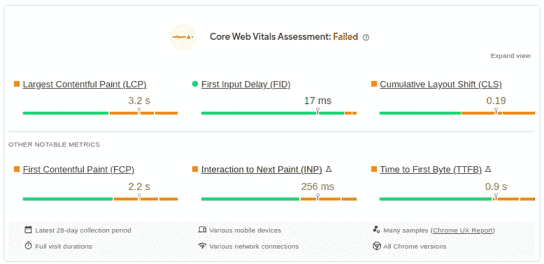
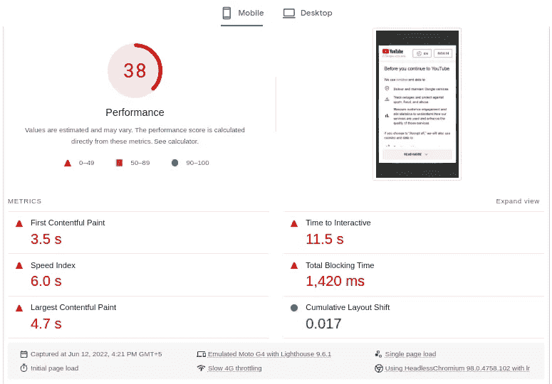
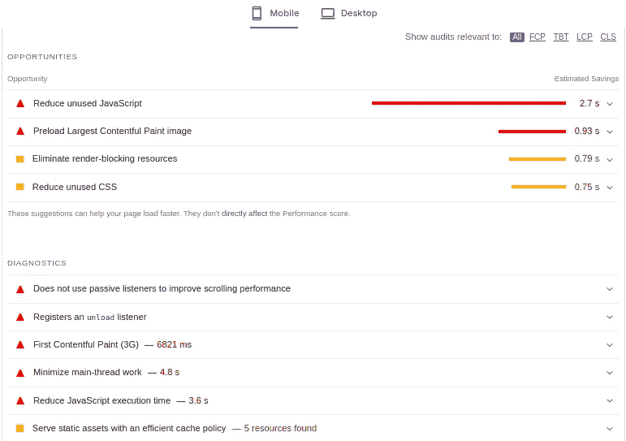

# 为什么 Google Page Speed Insights 结果中的移动速度低于实际设备的速度

> 原文：<https://levelup.gitconnected.com/google-pagespeed-insights-is-broken-for-mobile-mode-causes-and-way-forward-a9cb967a735d>



一个网络应用的前端一旦完成，开发者、产品负责人、项目经理等就会争先恐后地使用 Google PageSpeed Insights 来评估网站性能。这是显而易见的:为什么客户会使用一个缓慢加载的网站？据说，甚至谷歌也在惩罚搜索引擎优化速度慢的网站。赌注很高。

但是，当审计结果出乎意料地低时，计划和战略被设想来解决它。雪上加霜的是，移动模式的性能通常只有桌面模式的一半。但是，有一线希望:这主要不是你的错。我们来深挖一下这个移动排名系统是怎么破的。

# **什么是 Google PageSpeed Insights？**

PageSpeed Insights (PSI)报告移动和桌面模式下的页面速度。它根据预定义的标准为核心 web 生命周期提供现场数据和实验室数据，并提出改进网站性能的建议。

在引擎盖下，它使用 Lighthouse，这是一个开源的自动化工具，旨在根据各种页面速度指标审计网页，包括性能、可访问性、渐进式 web 应用程序等。

Lighthouse 分三个部分审核站点:

1.  **建议**针对每项指标进行改进，以加快加载速度。
2.  **诊断**并提供如何使用最佳实践的信息。
3.  已经通过的**指标**及其分值。

**衡量网站/页面速度得分的指标**

六个因素决定了页面速度得分，每个因素构成不同的百分比。

```
+--------------------------+--------+
|          Audit           | Weight |
+--------------------------+--------+
| First Contentful Paint   | 10%    |
| Speed Index              | 10%    |
| Largest Contentful Paint | 25%    |
| Time to Interactive      | 10%    |
| Total Blocking Time      | 30%    |
| Cumulative Layout Shift  | 15%    |
+--------------------------+--------+
```

# **谷歌页面速度洞察是如何工作的？还有为什么移动成绩差？**

Google Page Speed Insights 根据桌面和移动屏幕评估网站速度得分。但是，结果之间的差距是显而易见的，即使使用相同的互联网连接作为移动屏幕也将比桌面屏幕实现的低。

让我们来了解一下移动审计是如何工作的。

> 谷歌灯塔和 PageSpeed Insights 使用较慢的设备和 4G 连接。



谷歌使用 2016 年 5 月发布的 Moto G4，以慢速 4G(更快的 3G)连接加载网页。这意味着 2022 年制造的现代互动网络应用不仅可以在六年前的移动设备上测试，还可以在较慢的互联网连接上测试。结果是 web 应用程序加载缓慢。

# 您的目标客户还在使用 3G 连接吗？

由于谷歌设定了较慢的 4G 网络速度作为衡量网站速度的基准，因此对真正的 4G 和 3G 用户进行了比较。

有必要弄清楚大多数用户是否会使用慢速的 4G 连接。根据 Statista.com 的数据，在美国，3.477 亿用户将使用更快的连接，相比之下，1680 万用户选择 3G 连接。



statista.com

欧盟也是如此，79%的消费者购买 4G 和 5G 网络，相比之下，21%的消费者购买速度较慢的 3G 和 2G 网络。



**那谷歌为什么要用更慢的设备和互联网连接呢？**

一个解释是，谷歌希望让所有用户都能访问该网站，不管他们的设备和互联网连接如何。

# 网络/电子商务巨头对页面速度的评价是多少？

Layer0 进行了一项[研究](https://www.layer0.co/post/top-100-retailer-lighthouse-performance-score)，发现排名前 100 的电子商务网站在移动屏幕上的平均得分为 25.9%。所以，你并不孤单。



对 100 家领先零售商的第 0 层研究。

# 弄清楚 PSI 是如何出错的。

在连接速度较慢的过时移动设备上刺激页面加载是没有意义的。现代网络应用变得越来越互动，加载了大量的 JavaScript 和其他库。处理和执行这项技术需要大量的计算内存，幸运的是，最新的移动设备提供了这种内存。同样，要在浏览器中下载 JS 和其他代码，4G 和 5G 连接就足够了。

但是，在 Lighthouse 和 PSI 的例子中，这两个依赖关系都存在了多年。因此，为在常用手机上高效运行而构建的前端在旧设备上表现不佳，并给出了糟糕的网站速度分数。这就像责怪 GTA V 游戏没有在英特尔的奔腾 4 电脑上运行一样。

# 解决方案:Chrome UX 报告给出了真实的设备速度分数。

## **什么是 Chrome UX 报告？**

Chrome 用户体验报告由来自用户的公共网络关键用户体验指标的真实用户测量提供支持，提供对真实用户指标(RUM)的低延迟访问。

需要注意的一件重要事情是，CRUX 报告中的一些指标发生了变化。但是，指标背后的审计因素或多或少是相同的，有着相似的一般理解。

> Chrome 用户体验报告作为一个公共项目在 Google BigQuery 上提供。

我测量并比较了一些顶级网站，这些网站显示了移动设备上 PSI 和 CRUX 得分之间的差异。

1.  [Apple.com](https://pagespeed.web.dev/report?url=https%3A%2F%2Fwww.apple.com%2F)

CRUX 报告上的指标表明，没有一个审计处于红色区域，性能要好得多。但是，慢速设备上的 PSI 会生成一个警报中有四个指示器的报告。差别真大。



Apple.com |症结报告



Apple.com | PSI 报告

2.[Youtube.com](https://pagespeed.web.dev/report?url=https%3A%2F%2Fwww.youtube.com%2F)



Youtube.com |症结报告



Apple.com | PSI 报告

Pagespeed Insight 的结果证实了在 Moto G4 和慢速 4G 上进行测试在 2022 年已经过时的观点。

# 利用 PSI 提高站点速率还有前景吗？

是的。PSI 的诊断和机会特征确实值得改进。需要改进的度量标准会被指出，并提供有价值的建议。解决这些问题当然可以确保更快的加载和得分。

例如，它准确地指导和建议需要优化的地方和内容。这些建议的范围从 JavaScript 到 CSS 文件。甚至经常改变图像格式来更快地加载它们也是一个方便的技巧。

记住一件事:你的目标应该是从你的网站速度结果中消除所有红色和黄色区域。



Youtube.com | PSI 的诊断和机会

# **还有其他一些测试页面速度的方法吗？**

1.  【https://gtmetrix.com 
2.  [https://tools.pingdom.com/](https://tools.pingdom.com/)
3.  [https://www.webpagetest.org/](https://www.webpagetest.org/)

# 结论

显而易见，Google PageSpeed Insights 并不是测试网站性能的最佳解决方案。在旧设备上测试时，大多数网站都没有通过基准测试。然而，Chrome UX 报告是一个更好的选择，因为你可以在真实用户的设备上检查性能和体验。

关注更多精彩内容。

让我们在 [LinkedIn](https://www.linkedin.com/in/thealiraza/) 和 [Twitter](https://twitter.com/nowaliraza) 上连线。

谢了。