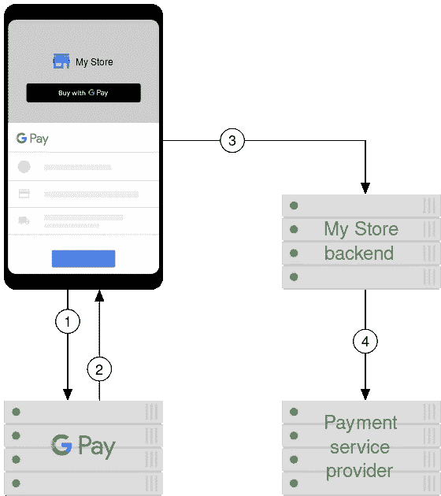
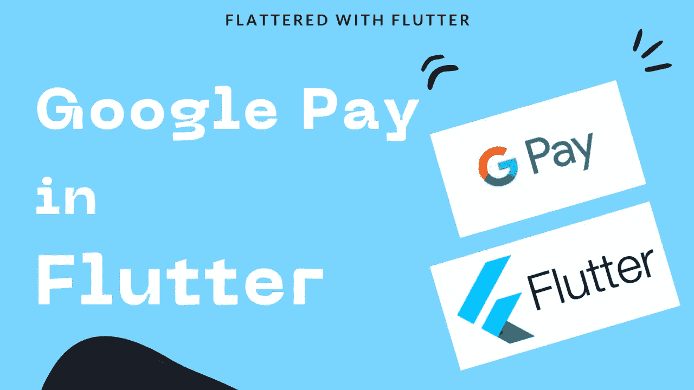
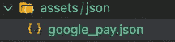

# 摇摆中的 Google Pay

> 原文：<https://levelup.gitconnected.com/google-pay-in-flutter-1d9a848cc11a>

*飘起的 Google Pay*

【T2 篇】此处:[*【https://flatteredwithflutter.com/google-pay-in-flutter/】*](https://flatteredwithflutter.com/google-pay-in-flutter/)

我们将简要介绍:

1.  什么是 Google Pay
2.  整合 Google Pay
3.  支付结果
4.  UI 元素

摇摆中的 Google Pay

# 什么是 Google Pay

**Google Pay** (被称为 **G Pay** )是谷歌开发的一个[数字钱包](https://en.wikipedia.org/wiki/Digital_wallet)平台和[在线支付](https://en.wikipedia.org/wiki/E-commerce_payment_system)系统，用于在移动设备上实现应用内、在线和面对面[非接触式购买](https://en.wikipedia.org/wiki/Contactless_payment)。美国和印度的用户也可以使用 iOS 设备，尽管功能有限。除此之外，该服务还支持优惠券、登机牌、校园 ID 卡、车钥匙、活动门票、电影票、公共交通票、商店卡、健康记录和积分卡等通行证。


Google Pay 标志

## **工作原理**

在应用程序中，当用户点击谷歌支付按钮时，他们会看到一张支付单，显示保存到他们谷歌账户的支付方式。用户可以快速选择付款方式，添加可选的送货地址，或在完成付款前添加新信息。

[](https://youtube.com/shorts/oYtSnXq5xVA) [## 摇摆中的 Google Pay🤑👨‍💻# googlepay # flutter #短裤

### Google Pay(被称为 G Pay)是一个数字钱包平台和在线支付系统，由 Google 开发，用于支持应用内…

youtube.com](https://youtube.com/shorts/oYtSnXq5xVA) 

Google Pay 支付流程

1.  用户点击 G Pay 按钮，会看到一张付款单，上面列有支持的付款方式。
2.  用户选择一种支付方式，G Pay 向应用程序返回所选方式的支付令牌。
3.  该应用程序向后端提交支付令牌
4.  后端处理购买，并将支付令牌发送给支付服务提供商(PSP)

> G Pay 与这些支付处理器整合。



摇摆中的 Google Pay

# 整合 Google Pay

我们将期待谷歌支付整合的[支付](https://pub.dev/packages/pay)方案。这个包兼顾了 [Apple Pay](https://www.apple.com/sg/apple-pay/) 和 [Google Pay](https://pay.google.com/) 。

在引擎盖下，这个包使用了 [Google Pay API](https://developers.google.com/pay/api) 。设置支付 API 所需的东西最终将被集成到[支付](https://pub.dev/packages/pay)包中

## **设置:**

*   点击查看他们的集成需求[。它基本上提到了他们的环境、品牌指南和其他东西。](https://developers.google.com/pay/api/android/overview)
*   点击这里查看他们的生产访问请求[，在这里您可以设置对 Google Wallet API 和其他清单的访问。](https://developers.google.com/pay/api/android/guides/test-and-deploy/request-prod-access)

> 现在开始设置您的代码。

*   在内部，Google API 需要以下 Gradle 依赖关系(**来自 android native** )，由**支付包**处理

```
implementation "com.google.android.gms:play-services-wallet:18.0.0"
```

因此，我们需要在您的应用程序的`build.gradle`中更改以下内容

```
minSdkVersion 19compileSdkVersion 31
```

*   在你的`pubspec.yaml`中包含[包](https://pub.dev/packages/pay)

```
# pubspec.yaml
dependencies:
  pay: ^1.0.10
```

现在，你可以访问[谷歌支付按钮](https://pub.dev/documentation/pay/latest/pay/GooglePayButton-class.html)和[苹果支付按钮](https://pub.dev/documentation/pay/latest/pay/ApplePayButton-class.html)

## GooglePayButton


谷歌支付按钮

这是一个小部件，根据 [PayButton](https://pub.dev/documentation/pay/latest/pay/PayButton-class.html) 中指定的规则和约束显示 Google Pay 按钮。

这个小部件提供了另一种基于 UI 的集成路径，它包装了支付库的 API 调用，并将它们作为小部件生命周期的一部分。因此:

*   小部件仅显示 [Pay.userCanPay](https://pub.dev/documentation/pay/latest/pay/Pay/userCanPay.html) 方法是否返回 true。

例如，如果代码在 iOS 上运行，那么将显示**apple pay 按钮**(假设您已经设置了 [ApplePay 配置](https://developer.apple.com/documentation/passkit/apple_pay/setting_up_apple_pay_requirements))。

*   点击按钮会自动触发[pay . showpaymentselector](https://pub.dev/documentation/pay/latest/pay/Pay/showPaymentSelector.html)方法，开始支付过程。

这就是**Google pay 按钮**的样子。

> 注意:GooglePayButton 从 PayButton 扩展而来

```
GooglePayButton(
  paymentConfigurationAsset: 'google_pay_config.json',
  paymentItems: _paymentItems,
  style: GooglePayButtonStyle.black,
  type: GooglePayButtonType.pay,
  margin: **const** EdgeInsets.only(top: 15.0),
  onPaymentResult: onGooglePayResult,
  loadingIndicator: **const** Center(
    child: CircularProgressIndicator(),
  ),
)
```

## 支付配置

在上面的代码片段中，我们看到`PaymentConfiguration`是一个必需的参数。此参数保存有关支付交易的信息。

它加载支付交易所需的配置信息，该信息基于来源。对此有两种选择:

*   从这样的远程服务器

```
PaymentConfiguration.fromJsonString(
    '{"provider": "apple_pay", "data": {}}');
```

*   像这样从资产文件夹中



资产的付款配置

**内部支付配置**

*   PaymentConfiguration 是一个 JSON，按照 Google Pay API，其中每个参数代表一个请求对象。

```
{
   "provider":"google_pay",
   "data":{
      "environment":"TEST",
      "apiVersion":2,
      "apiVersionMinor":0,
      "allowedPaymentMethods":[
         {
            "type":"CARD",
            "tokenizationSpecification":{
               "type":"PAYMENT_GATEWAY",
               "parameters":{
                  "gateway":"example",
                  "gatewayMerchantId":"gatewayMerchantId"
               }
            },
            "parameters":{
               "allowedCardNetworks":[
                  "VISA",
                  "MASTERCARD"
               ],
               "allowedAuthMethods":[
                  "PAN_ONLY",
                  "CRYPTOGRAM_3DS"
               ],
               "billingAddressRequired":true,
               "billingAddressParameters":{
                  "format":"FULL",
                  "phoneNumberRequired":true
               }
            }
         }
      ],
      "merchantInfo":{
         "merchantId":"01234567890123456789",
         "merchantName":"Example Merchant Name"
      },
      "transactionInfo":{
         "countryCode":"US",
         "currencyCode":"USD"
      }
   }
}
```

*   `provider`:这个可以是 **apple_pay** 也可以是 **google_pay**
*   `data`:这是 PaymentRequest 的核心，它本身就是一个 JSONObject
*   `environment`:这可以是**测试**或**生产**

有 Google 提供的测试卡套件，只能在**测试**环境内部使用。要访问这些测试卡，请在此处加入[](https://groups.google.com/forum/#!forum/googlepay-test-mode-stub-data)

**测试环境支持**

1.  **Visa、Mastercard、Discover 和 Amex 卡网络**
2.  **`PAN_ONLY`和`CRYPTOGRAM_3DS`认证方式**

*   **`apiVersion`:该规格的值为`2`。**
*   **`apiVersionMinor`:该规格值为`0`。**
*   **`allowedPaymentMethods`:这是类型 **PaymentMethod** ，指定了对 G Pay API 支持的一种或多种支付方式的支持。**

****支付方式****

**这包括 3 个属性:**

1.  **`type` : **卡**是该参数唯一支持的值**

**2.`tokenizationSpecification`这是类型**tokenization specification**并且有两个属性**

****标记化规范****

*   **`type`:对于`CARD`支付方式，使用 PAYMENT_GATEWAY。**
*   **`parameters`:包含一个 Gateway 对象，该对象有两个属性 **gateway** 和 **gatewayMerchantId。****

> **注意:网关的值取决于支持的[网关](https://developers.google.com/pay/api/android/reference/request-objects#gateway)**

**3.`parameters`这是**卡参数**类型，有 **2 必需**和 **5 可选**参数**

****卡片参数****

*   **`allowedAuthMethods` ( **必选**):支持验证卡交易的字段的字符串数组。 **PAN_ONLY** 和 **CRYPTOGRAM_3DS****

> **注意:我们只能在测试环境下使用这两个**

*   **`allowedCardNetworks` ( **必选**):您和 Google Pay API 支持的一个或多个卡网络。例如**美国运通、DISCOVER、INTERAC、JCB、万事达卡、VISA****
*   **`billingAddressRequired`:如果需要账单地址，请设置为`true`。这会增加摩擦。**
*   **`billingAddressParameters`:这是类型**计费地址参数**，有两个参数**

****计费地址参数****

*   **`format`:完成交易所需的账单地址格式。例如 **MIN(** 名称、国家代码和邮政编码 **)** 和 **FULL** (长参数列表)**
*   **`phoneNumberRequired`:如果处理交易需要电话号码，则设置为`true`。**

*   **`merchantInfo`:这个 **MerchantInfo** 对象提供请求支付数据的商家的信息，包括**

****商品名称**:该名称出现在付款单中。在`TEST`环境中，或者如果商户未被识别，支付单上会显示“支付未验证商户”消息。**

*   **`transactionInfo`:这个 **TransactionInfo** 对象用于呈现支付授权对话框。它包括**

****货币代码(必填):** ISO 4217 字母货币代码**

****国家代码:**ISO 3166-交易处理地的 1 alpha-2 国家代码。**

# **支付结果**

**一旦点击了 G Pay 按钮，就会触发付款单的显示。一旦用户做出选择，工作表就会关闭，您会在 **onPaymentResult** 中收到结果**

```
{
   "apiVersion":2,
   "apiVersionMinor":0,
   "paymentMethodData":{
      "description":"YOUR CARD DESCRIPTION",
      "info":{
         "billingAddress":{
            "address1":"YOUR ADDRESS1",
            "address2":"YOUR ADDRESS2",
            "address3":"",
            "administrativeArea":"YOUR AREA",
            "countryCode":"YOUR COUNTRY",
            "locality":"YOUR LOCALITY",
            "name":"YOUR NAME",
            "phoneNumber":"YOUR PHONE NUMBER",
            "postalCode":YOUR POSTAL CODE,
            "sortingCode":""
         },
         "cardDetails":YOUR CARD DETAILS,
         "cardNetwork":"VISA"
      },
      "tokenizationData":{
         "token":"examplePaymentMethodToken",
         "type":"PAYMENT_GATEWAY"
      },
      "type":"CARD"
   }
}
```

*   **`apiVersion`:该规格的值为`2`**
*   **`apiVersionMinor`:该规格值为`0`**
*   **`paymentMethodData`:该值的类型为 **PaymentMethodData** ，包含 4 个参数**

****支付方法数据****

**如果选择成功，结果由一个 [PaymentData](https://developers.google.com/pay/api/android/reference/object#PaymentData) 对象完成，该对象包含所选支付方式的相关信息:**

*   **`type`:在 G Pay 支付单中选择的支付方式类型**
*   **`description`:包含描述支付方式的面向用户的消息**
*   **`tokenizationData`:该值的类型为**paymentmethotokentizationdata**，由两个参数组成**

**`type`:应用于所选支付方式的令牌化类型**

**`token`:生成的支付方式令牌。例如**支付 _ 网关**，**直接****

*   **`info`:包含 3 个参数**账单地址、卡片详情、**和**卡片网络****

**计费地址以[地址对象](https://developers.google.com/pay/api/android/reference/response-objects#Address)的形式出现。CardDetails 存在于一个表示卡的详细信息的字符串中。该值通常是所选支付账号的最后四位数字。**

**CardNetwork 也是一个字符串，表示所选支付的支付卡网络。该值是 [CardParameters](https://developers.google.com/pay/api/android/reference/request-objects#CardParameters) 中`allowedCardNetworks`格式内的值之一。**

## **付款后结果**

**现在，您可以使用此付款方式信息来执行实际交易。例如，您可以从上面的响应中获得`tokenizationData`并从中提取`token`。**

**然后，使用此令牌通过您的支付网关进行支付。查看受支持处理器的[列表](https://developers.google.com/pay/api/#participating-google-pay-processors)，了解每个处理器的具体实现细节。**

# **UI 元素**

**GooglePayButton 在其定义中公开了一个名为`type`(这是一个枚举)的参数。我们可以使用这个参数来按照要求显示按钮。以下是提供的选项:**

1.  **GooglePayButtonType.pay(这是默认值)**
2.  **GooglePayButtonType.book**
3.  **GooglePayButtonType.buy**
4.  **GooglePayButtonType.checkout**
5.  **GooglePayButtonType.donate**
6.  **GooglePayButtonType.order**
7.  **GooglePayButtonType.plain**
8.  **GooglePayButtonType.subscribe**

**例如，如果您希望类型为`GooglePayButtonType.subscribe`，那么结果将是**

****

**使用 GPay 订阅**

**如果你喜欢对每个请求和按钮分别有更多的控制，你可以使用 [RawGooglePayButton](https://pub.dev/documentation/pay_android/latest/pay_android/RawGooglePayButton-class.html) 实例化一个支付客户端并独立地将按钮添加到你的布局中。**

```
RawGooglePayButton(
  onPressed: onGooglePayPressed,
  style: GooglePayButtonStyle.white,
  type: GooglePayButtonType.plain,
)
```

**此按钮的结果是**

****

**RawGooglePayButton**

**一旦用户点击这个按钮，您就可以使用 [Pay.withAssets](https://pub.dev/documentation/pay/latest/pay/Pay/Pay.withAssets.html) 来发起请求，它是一个带有字符串格式的配置列表的 [Pay](https://pub.dev/documentation/pay/latest/pay/Pay-class.html) 对象的替代对象。**

```
// PayClientPay _payClient = Pay.withAssets([
  'YOUR_GOOGLE_PAY_JSON_FILE',
])// On the Button Pressedvoid onGooglePayPressed() async {
  final result = await _payClient.showPaymentSelector(
    provider: PayProvider.google_pay,
    paymentItems: _paymentItems,
  );  
}
```

**作为 Google Pay 令牌的响应可以发送到您的服务器/ PSP**

**其他文章:**

**[](/how-to-add-flutter-to-android-app-4d80d9820686) [## 如何给安卓 App 添加 Flutter

### 如何给安卓 App 添加 Flutter

如何给安卓 Applevelup.gitconnected.com 添加 Flutter](/how-to-add-flutter-to-android-app-4d80d9820686) [](https://medium.com/flutter-community/using-mockito-in-flutter-cd015d338277) [## 在 Flutter 中使用 Mockito

### 在 Flutter 中使用 Mockito

在 Fluttermedium.com 使用 Mockito](https://medium.com/flutter-community/using-mockito-in-flutter-cd015d338277) [](https://medium.com/flutter-community/dart-on-aws-lambda-3a46aad38335) [## AWS Lambda 上的 Dart

### AWS Lambda 上的 Dart

AWS Lambdamedium.com 上的 Dart](https://medium.com/flutter-community/dart-on-aws-lambda-3a46aad38335) 

```
[Source Code](https://github.com/AseemWangoo/dynamism/tree/feature/gpay)
```

# 分级编码

感谢您成为我们社区的一员！在你离开之前:

*   👏为故事鼓掌，跟着作者走👉
*   📰查看[升级编码出版物](https://levelup.gitconnected.com/?utm_source=pub&utm_medium=post)中的更多内容
*   🔔关注我们:[Twitter](https://twitter.com/gitconnected)|[LinkedIn](https://www.linkedin.com/company/gitconnected)|[时事通讯](https://newsletter.levelup.dev)

🚀👉 [**加入升级人才集体，找到一份神奇的工作**](https://jobs.levelup.dev/talent/welcome?referral=true)**