# 谷歌 Play 商店分析

> 原文：<https://levelup.gitconnected.com/google-play-store-analysis-8501228a1ace>

> 应用开发者如何让他们的产品在谷歌 Play 商店更受欢迎？

[谷歌 Play 商店上有大约 300 万个应用程序](https://www.statista.com/statistics/266210/number-of-available-applications-in-the-google-play-store/)，开发出在竞争中脱颖而出的应用程序对应用程序开发人员来说是一个挑战。为了在这个过度饱和的市场中脱颖而出，他们需要准确定位在客户决策过程中发挥作用的基本因素。

这个项目的**目标**是提供洞察以更好地理解客户需求，从而帮助开发者推广产品。澄清一下，这个项目中的“受欢迎”意味着大量的安装。

# 数据理解

谷歌应用商店分析的数据集来自 [Kaggle](https://www.kaggle.com/lava18/google-play-store-apps) 。它有 10841 个观察值(应用数量)和 13 个变量(每个应用的特征数量)。目标变量是“安装”(安装数量)，解释变量包括类别、价格、评级和评论等。具体来说，“评级”是一个连续变量，范围为 1-5。

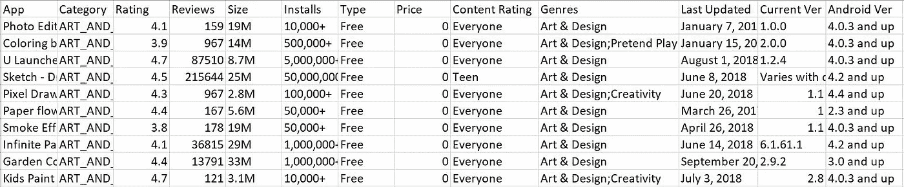

表 1。部分原始数据

# 数据清理

原始数据包含太多分类变量，评级列中约有 500 个缺失值。数据清理包括以下步骤:

1.  我们丢弃了所有带有缺失值的观察值。虽然这意味着损失 5%的数据，但很难用现有数据估算审查分数。如果每个应用程序的单独审查可用，则可以通过文本挖掘方法进行插补，即使用反向回归模型预测缺失的评级。
2.  我们删除了“应用名称”、“当前版本”、“Android 版本”和“流派”栏。因为这些信息在这个项目中不是很有用，而且“流派”也是“类别”列的一个子集。
3.  我们将“Last Updated”列转换为自上次更新以来的天数，这是通过从编译数据集时的日期中减去它来计算的。
4.  我们删除了“Installs”列中的所有“+”符号，并通过取下限将该列转换为数字数据。同样，删除“尺寸”和“价格”列的后缀。
5.  我们创建了一个新列“LogInstall”，以减少预测不足的错误，因为“Install”列中的数据范围很广。

最终的清洁数据如表 2 所示。

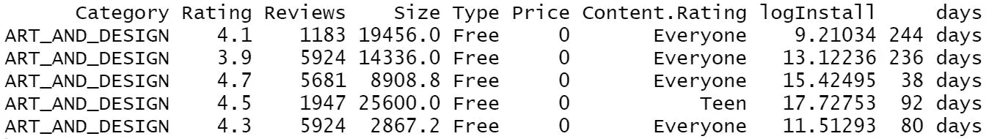

表二。干净数据的一部分

# 数据探索

说起人气，大多数人想到的都是口碑影响。也就是说，评级高的应用应该有更多的安装。图 1 描述了评级的分布，而图 2 显示了两个变量之间的关系。

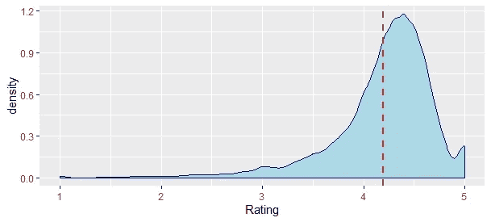

情节一。评级分布

在该数据集中，平均评分相当高，在 5 分制中约为 4.3 分。大多数评级集中在(4.2，4.5)的范围内。

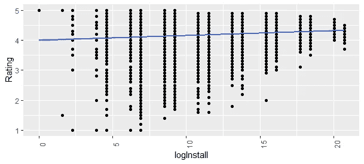

情节二。额定值和安装的关系

图 2 中略微向上的回归线显示了额定值和安装之间的正相关关系。更高的额定值确实有助于更多的安装。再者， **k-means 聚类**对各种 app 进行了分类。

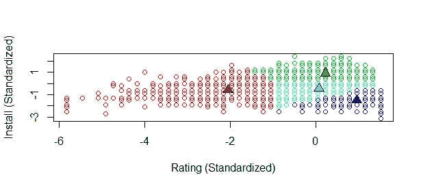

情节三。k 均值聚类

谷歌 Play 商店的应用分为四类:

1.  高收视率但低安装(深蓝色)
2.  低等级和安装(红色)
3.  两个中等额定值装置(浅蓝色)
4.  高额定值和安装(绿色)

集群 1 值得注意。为什么会有收视率高但安装率低的 app？这似乎是一个营销问题。那些开发者拥有很少有人知道的伟大产品。这个问题建模后再进一步讨论。一个可能的原因是，有些品类由于人们不经常使用，自然安装率低。下面的方框图证实了这个猜测。

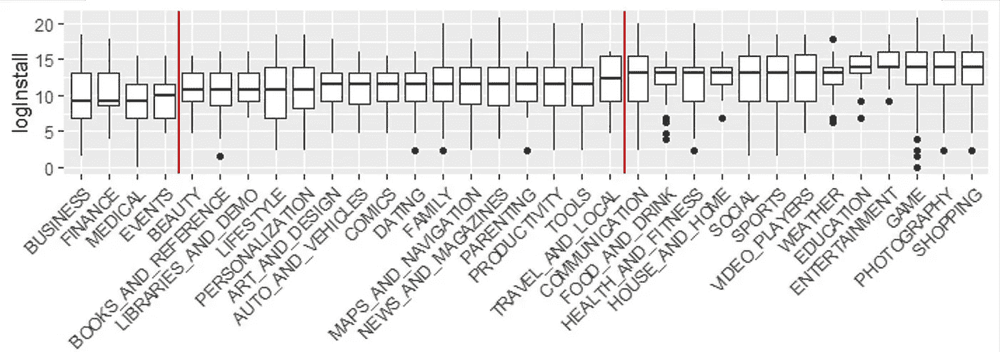

情节四。类别安装的箱线图

箱线图按安装从低到高排序。然后，所有应用程序被分成三组，以供以后研究。红线是中间安装水平发生显著跳跃的分界点。组的定义如下:组 1(左侧):低安装类别，组 2(中间):中安装类别，组 3:高安装类别。稍后，建模过程将对这三组分别进行，以发现它们各自的安装决定因素。让我们来看看这三组之间的相似和不同之处。

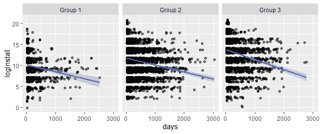

情节 5。三组的更新和安装之间的关系

图 5 显示了三个组的一个共同点:应用程序更新越不频繁，应用程序的安装率越低。

# 建模和评估

为了确定不同变量的重要性，我们应用了空模型、套索模型、后套索模型、随机森林模型、线性回归模型和树回归模型，然后使用 K-fold 交叉验证，通过比较 R 为每组选择模型。下面的文章将设置组 1 作为一个例子，并解释结果。

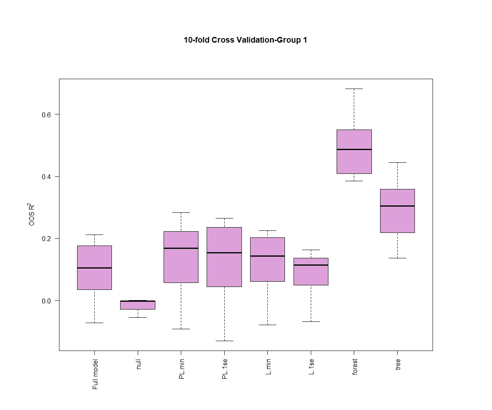

情节 6。不同车型的 OOS R-第 1 组

从图 6 中，我们可以看到**随机森林模型**的 R 最高，约为 50%，这意味着该模型可以解释约 50%的变量变化。

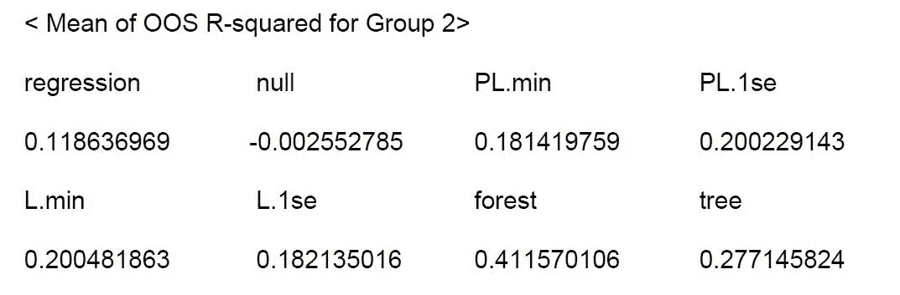

表 3。不同车型的 OOS R-第 2 组

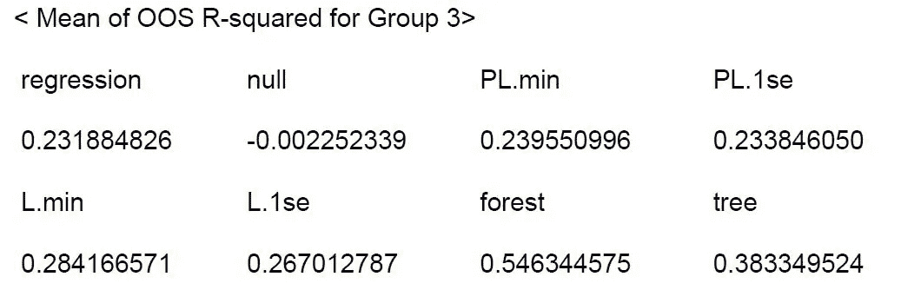

表 4。不同车型的 OOS R-第 3 组

类似地，表 3 和表 4 显示，对于随机森林模型，组 2 和组 3 具有最高的 R，分别为 41.1%和 54%。因此，我们通过用整个数据集改装随机森林模型来进行安装预测。该模型给出了回归中哪些变量是重要的估计。它还具有比单树回归模型更小的方差，并且克服了过拟合。下面是随机森林模型给出的第 1 组中的变量重要性。

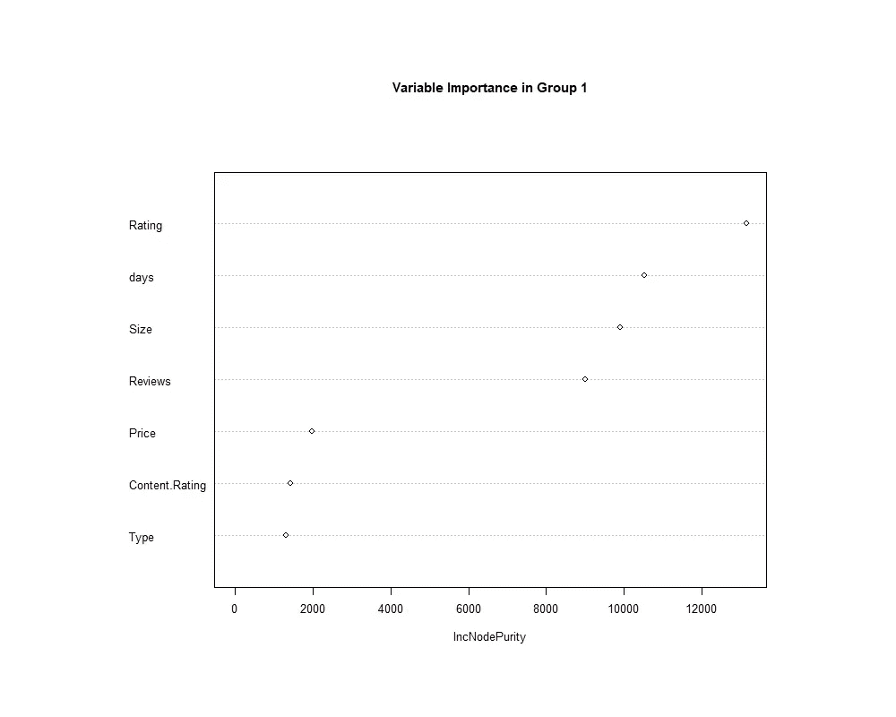

情节 7。第 1 组中的可变重要性

随着更多有用的变量在节点纯度上实现更高的增长，节点纯度越高，变量就越关键。值得注意的是，三组的曲线图在变量重要性方面非常相似。不出所料，对所有应用来说，*评分*是预测安装数量的最关键变量，其次是*最后更新日期*。价格、类型和内容分级相对来说不是重要的变量。

# 部署

回到我们在开始和数据探索期间提出的问题:应用开发者如何让他们的产品在谷歌 Play 商店更受欢迎？为什么有些 app 收视率高但下载量低？我们有以下建议:

对于目前评级较低的应用程序，开发者无疑应该首先提高评级，要么通过激励评级，要么添加新功能。他们还需要缩短更新周期，确保每次更新都能提升客户体验并引入新功能。应该提供评级激励，因为大多数客户不愿意对应用程序进行评级，除非他们有更好/更差的体验。通过利用口口相传的营销策略，这些应用程序将在客户中流行起来。

# 反射

这个项目有两个改进点。首先，由于这个数据集没有很多变量，我们可能在模型中忽略了变量。其次，我们需要考虑收视率的多少。一些高评分可能是因为很少有人给应用评分，导致结果有偏差。

同样，我们应该在这个模型中分析评论的情感，以减少错误。即使评论的数量很高，这些评论的负面情绪也会减少安装。因此，仅仅看评论的数量是不够的。要解决这个问题，从 Google Play 商店中提取评论是一个很好的方法。

最后，感谢我在这个项目中的队友:Gaurav Singh，Ruoyun Yang，Ha-eun Park，Will Jaouhari @ Duke Fuqua