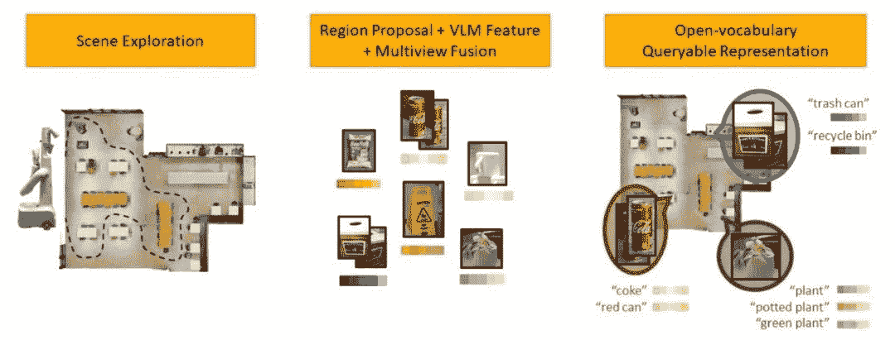

# 谷歌科学家谈:如何让具身推理成为现实？让大模型“说”机器人的语言

> 原文：<https://levelup.gitconnected.com/google-scientists-talk-how-to-make-embodied-reasoning-a-reality-3b8bc1f9e3f6>

**简介:**机器人学领域已经发展了三四十年，但是在应用上进展缓慢。这是因为机器人是建立在工作环境简单可控的假设上的。如果将机器人部署在稍微复杂一点的环境中，比如家庭环境，就给机器人的部署带来了很大的挑战。

随着大规模语言模型的发展，能否用于指导机器人理解复杂指令，完成更高级的任务？而在这个过程中，你会面临哪些挑战？近日，致远社区邀请谷歌研究科学家费霞博士做了“**语言和基于视觉的具身推理**”的报告，详细介绍了团队在这一新兴领域的前沿工作。

**01**

**背景**

机器人的机器学习近年来有了很大的进展，但是仍然存在比较大的问题。机器学习需要大量的数据训练，但是机器人产生的数据非常昂贵，机器人本身也会有损耗。

人类在孩提时代就通过玩耍和与物理世界的互动来学习许多物理定律。受此启发，是否有可能让机器人与环境进行交互，以获取这些物理信息来完成各种任务？将机器学习应用于机器人在很大程度上依赖于模拟环境。

在这方面，费霞博士和他的同事们提出了 Gibson Env(环境)和 iGibson 等工作。前者侧重于视觉环境的重建，后者侧重于物理仿真。通过对现实世界进行三维扫描和重建，并通过神经网络渲染视觉信号，创建模拟环境，让各种机器人进行物理模拟，学习从时间传感器到驱动器的控制等。在 iGibson 环境中，机器人可以学习与环境更丰富的交互，例如学习使用洗碗机。

费霞博士认为，上述工作代表了从互联网人工智能到嵌入式人工智能的转变。过去 AI 训练主要基于 ImageNet、MS COCO 等数据集，属于互联网任务。具体化的 AI 需要 AI 的感知和动作形成一个闭环——AI 必须根据感知的结果决定下一步的动作。费霞的博士论文《嵌入式感知与机器人学习的大规模模拟》讲的是机器人模拟放大后的学习、感知和推理。近年来，基本模型在人工智能领域发展迅速。一些研究人员认为，可以从基本模型中提取信息来帮助机器人做出决策，而不是依赖于模拟环境。费霞博士将这一新方向称为“决策的基础模型”，他和他的团队提出了 PaLM-SayCan 和其他工作。

***02***

**PaLM-SayCan:让语言模型指导机器人**

**1。为什么机器人很难处理复杂的远程任务？**

PaLM-SayCan 团队共有 45 位作者。这是谷歌机器人团队和日常机器人之间的合作项目。目的是探索用机器学习来改变机器人领域，让机器人提供数据，提高机器学习能力。这项研究集中在两个问题上:非结构化的复杂环境，以及让机器人在日常生活中更有用。虽然人们已经有了像 Siri 或 Alexa 这样的个人助理，但机器人领域还没有。夏博士举了这样一个例子:当一杯饮料洒了，我们要向机器人说明情况，请求它的帮助。或者运动后累了，让它提供饮料和零食。研究希望机器人能够理解并执行这些任务。目前的困难是，机器人仍然很难完成长时间或远距离的任务，对于需要复杂规划、常识、推理的任务仍然无能为力。原因在于两个方面。**首先是机器人领域缺乏良好的用户界面。传统机器人在执行取放(Pick & Place)任务时，通常采用目标条件(target Conditioning)或一热条件(One-hot Conditioning)方法。**目标条件化需要告诉机器人目标是什么，让机器人执行将初始条件变为目标条件的任务。这需要先向机器人演示完成后的任务状况是怎样的。

一热调理采用一热编码，用 0~99 对机器人能完成的所有任务进行编号(如 100 个任务)。每次需要执行的时候，给机器人提供一个数字，它就会知道要完成什么任务。但是，一热条件的问题是，用户需要记住每个任务对应的代码，一热代码并没有获得每个任务之间的依赖信息(比如完成一个目标对应的任务代码序列)。这些都导致了目前的**机器人只能完成短程任务，通常是抓取和放置，机器人本身是静止的而不是运动的。**此外，环境也仅限于实验室等场景，往往没有人类。

**2。机器人的语言模型:如何让它“说”机器人的语言？**

为了解决这些问题，团队想到了使用基本模型。语言模型可以取代目标制约，并通过语言清晰明确地描述任务。同时，该语言还包含任务步骤之间的依赖信息，如食谱上的第一步和第二步，以帮助机器人学习。此外，语言还可以用来定义长期任务，解决模仿学习方法的局限性。在机器人上使用大型模型会带来一些挑战。最重要的是确定机器人输出的语言。大模型是基于人类自然语言训练出来的，它输出的任务不一定机器人能完成。而且语言模型不是在机器人的数据上训练的，所以不知道机器人的能力。二是接地问题。大模型没有亲身经历过物理世界，缺乏具体化的信息。三是机器人本身在大模型引导下的安全性和可解释性。语言模型的偏见可能会因为它们与物理系统的联系而被放大，并产生现实世界的影响。有一个可信度的例子:当一个人类用户与谷歌的 LaMDA 模型交流时，用户问模型“最喜欢的岛屿”，模型回答希腊克里特岛，以及一些原因。但这个结果并不可信，因为 AI 应该给出的结果是“我不知道我最喜欢哪个岛，因为我没去过哪个岛”。语言模型的问题在于，它没有与现实世界进行交互，只是根据统计规律输出最有可能的下一句话。如果在机器人上使用语言模型，不同的模型会给出不同的结果，有些结果对于驱动机器人执行任务是没有用的。例如，如果用户要求机器人“清理溢出的饮料”，GPT 3 号可能会说“你可以使用真空吸尘器。”这个结果并不完全正确，因为真空吸尘器并不清理液体。如果是 LaMDA 车型，LaMDA 可能会说“要不要我给你找个清洁工？”这个答案很正常，但不实用，因为 LaMDA 对对话数据的微调，其目标作用是尽可能延长对话长度无助于完成任务。如果是果馅饼模型，它会回答“对不起，我不是故意的。”并且不理解用户的意图:对话到底是什么？还需要修复问题吗？因此，在机器人上使用大型语言模型存在一系列问题。PaLM-SayCan 致力于解决这些挑战。第一种是让大模型说机器人的语言，方法是少拍提示(少拍学习)。比如构造“把咖啡拿到柜子里”、“给我一个橘子”等任务，并给出相应的步骤(比如 1–5、1–3)。然后，用户给模型一个指令:“在桌子上放一个苹果”。在得到前面步骤的提示后，模型会自己寻找并组合合适的任务步骤，并生成一个计划来一步步完成任务。需要注意的是，大型模型的交互方式主要有两种，**一种是生成式接口，根据输入生成下一个 Token 另一个是评分接口，为给定的 Token 自然函数计算相似度。** PaLM-SayCan 采用评分法，语言模型会更稳定，容易输出想要的结果。在放置苹果的任务中，模型对各个步骤进行评分，并选择适当的结果。

**3。弥合语言模型和真实世界之间的差距:让机器人探索环境的启示**

还有一个问题需要解决:语言模型在不知道机器人当前能够做什么的情况下生成任务步骤。如果机器人面前没有苹果，机器人就无法完成放置苹果的任务。所以这就需要语言模型知道机器人在当前的环境和状态下能做什么任务。这里我们需要引入一个新的概念，叫做机器人启示，这也是这项工作的核心。

可负担性翻译成中文叫做可负担性，是美国心理学家 James J. Gibson 在 1977 年左右提出的概念，**定义为一个环境中的主体，在当前状态下能做什么代表其可负担性。**使用监督学习可以获得启示，但这需要大量的数据和注释。在这方面，该团队采用了强化学习的方法，使用政策的价值函数来逼近启示。比如训练一个机器人抓取环境中的各种东西。训练结束后，让机器人在房间里探索。当它看到面前有一个物品时，捡起这个物品的价值函数会变得非常高，从而替换掉可用的物品。性别预测。结合启示和语言模型，我们得到了 PaLM-SayCan 算法。如上图所示，左侧是语言模型，对用户给出的指令，机器人能够完成的任务进行评分，计算完成子任务有助于完成整体任务的概率。右边是价值函数，代表当前状态下完成每项任务的概率。两者的乘积代表了机器人成功完成对整体任务有贡献的子任务的概率。在苹果的例子中，在当前状态下，机器人前面没有苹果。要完成这个任务，首先要做的就是找一个苹果，所以找一个苹果的负担能力得分比较高，抢一个苹果的得分低。找到苹果后，抓取苹果的启示分数增加，执行抓取苹果的任务。重复这个过程，直到整个任务完成。

***03***

**更具具体化的智能工作:提高模型推理能力，利用环境反馈形成闭环**

**1。思维链提示:理解复杂的常识**

除了 PaLM-SayCan，夏博士和同事们还完成了其他相关工作。在提示方面，团队提出了思维链提示(可以理解为一种解题思路)的工作，目的是让语言模型具备更多的推理能力。

标准的提示模式是设计一个问题模板，给出答案。模型在推理时输出答案，但有时模型给出的答案是错误的。因此，思维链提示的目标是在提供问题的同时，给模型提供一个解释，可以显著提高模型的结果，甚至在某些任务中超过人类水平。

该模型在处理否定句时容易出错。例如，一个人类用户问“给我一个水果，但不要苹果”。模型倾向于提供一个苹果，因为问题和可执行选项中都有苹果。有了思维链的提示，可以提供一些解释。例如，模型将输出“用户想要水果，但不是苹果。香蕉是水果，不是苹果。我可以给用户一根香蕉。”思维链提示也可以解决更微妙的否定请求。例如，一个对咖啡因过敏的用户让机器人去拿一杯饮料。过敏是另一种微妙的否定形式，机器人可能会以传统方式拿起一杯含咖啡因的饮料(不知道过敏代表什么否定)。而思维链提示可以解释过敏等。，提高推理效果。

**2。内心独白:纠正错误，回到正确的执行轨道**

结合大模型进行机器人决策和环境交互也是一个重要的研究方向。团队提出了内心独白的工作，目的是让语言模型根据环境的变化回忆过去的决定，并从错误的指令或环境造成的事故中恢复。
例如，当人类回家时，他们发现所选的钥匙无法开门。这时，人们会选择试另一把钥匙，或者改变旋转方向。这反映了基于环境的反馈和新动作的更新对错误的修正。内心独白是这样工作的。比如在抢一个可乐的过程中，如果可乐掉了，后续的任务就无法完成，所以需要内心独白等工作来检测任务是否成功完成，把反馈放到决策过程中，根据反馈信息做出新的决策。决定。

如图，内心独白作品包括活动场景描述(active scene description)和任务成功探测器(success detector)。当人类发出指令时，模型可以执行指令并激活场景描述，以辅助机器人决策。训练过程仍采用少击提示法，这样可以举一反三。例如，当一个机器人被指示去取饮料时，它会问人类是去取可乐还是汽水。

另一个例子是语言模型对历史信息的推理。很多情况下，人类在下达命令后会改变主意，或者在改变多条指令后要求机器人完成“刚才的任务”。这里并没有特别指定“刚才的任务”，这就需要模型回到历史中去看看之前的任务是什么。除了英文，《内心独白》目前有中文和其他语言版本。经过在其他领域的实验，团队发现这种环境反馈的方法可以完成一些非常复杂的闭环规划任务。

***04***

**问&AQ:PaLM-say can 的大型语言模型是从零开始训练的吗？仍然只是模型。**答:大预言模型不需要微调，已经包含了很多决策的信息。比如有 1750 亿个参数的 GPT-3，或者 PaLM 都可以，里面已经包含了足够的任务规划和序列信息。

**问:在《内心独白》这部作品中，代理人也会主动提问吗？这是怎么吸收的？**答:我们使用语言模型和提示方法。当机器人完成一项任务时，会有“且问”和“且继续”两个选项。问还是继续，要看语境语义是否有歧义。

**问:机器人如何知道物品在哪里(比如抽屉里的薯片)？如果未来机器人的能力逐渐增强，在探索的过程中搜索空间会不会过大？**答:机器人对物品存放位置的了解目前是硬编码的，不是一个自动过程。但是大语言模型也包含一定的语义知识，比如物品在哪里。这种语义知识可以减少搜索空间。同时也可以根据找到物品的概率进行探索。目前，费霞的团队发表了一项解决这一问题的新工作，其核心思想是建立一种自然语言索引的场景表示。参考网站 nlmap-saycan.github.io

**问:另外，近年来出现的分层强化学习是否为复杂任务规划提供了一些启发？** PaLM-SayCan 类似于分层强化学习，底层技能和上层任务的规划。可以说是分层的方法，但不是分层强化学习。我个人比较看好这种分层的方法，因为在做任务规划的时候，不一定要做到每一个细节步骤，这样会浪费时间。任务规划可以利用海量互联网数据进行训练，但底层技能需要物理数据，所以需要与环境进行交互和学习。

**问:PaLM-SayCan 真的用于机器人。有没有什么根本问题没有解决？如果作为日常保姆的替代品，需要多久才能实现？**答:目前还有一些根本问题没有解决，而且不是简单的工程问题。从原理上来说，机器人的底层运动控制和抓取是一个很大的挑战。我们还没有能够做到 100%的成功把握，这是一个很大的问题。当然，已经有可能为行动不便的人提供一些价值。但如果它真的是一个商业产品，现在还不可能。任务成功率 90%左右，不符合商业要求。

**问:机器人规划的成功率是否受到训练数据集的限制？**答:机器人的规划能力受到训练语料的限制。在语料库中很容易找到一些说明，比如“扔掉垃圾”等等。但语料库中几乎没有“将机器人的两指爪向右移动 10 厘米”之类的语料库，因为人们不会在网上留下这样的信息。这涉及到粒度信息的问题。目前受限于语料库，机器人只能完成粗粒度的任务。另一方面，细粒度的规划本身不应该由语言模型来完成，因为它包含了太多的物理信息，很可能无法用人类的语言来描述。一种思路是可以通过模仿学习(参考 BC-Z 的工作)，或者代码生成(参考团队[的最新工作 https://code-as-policies . github . io/)来实现细粒度的操作。](https://code-as-policies.github.io/).)大模型更大的作用是作为用户的交互界面，解释人类给机器人的指令，并分解成机器可以执行的步骤。此外，语言可以进行高级语义规划，而不需要更多的物理规划。如果要实现细粒度的规划任务，还是要靠模仿学习或者强化学习。

喜欢这篇文章吗？成为一个媒介成员，通过无限制的阅读继续学习。如果你使用[这个链接](https://machinelearningabc.medium.com/membership)成为会员，你将支持我，而不需要额外的费用。提前感谢，再见！

**关于作者**:费霞目前是谷歌大脑机器人团队的研究科学家。他的主要研究方向是机器人技术在非结构化复杂环境中的应用。代表作品有《吉布森嫩夫》、《伊基布森》、《赛坎》等。他的研究被《连线》、《华盛顿邮报》、《纽约时报》等媒体报道。费霞博士毕业于斯坦福大学，师从西尔维奥·萨瓦雷塞和列奥尼达·吉巴斯。他在《CVPR》、《科尔》、《IROS》、《ICRA》、《Neurips》、《RA-L》、《自然通讯》以及其他会议和期刊上发表了许多文章。他最近的研究方向是基础模型(foundation models)在 agents 决策过程中的使用。他的团队最近提出了 PaLM-SayCan 模型。

**编曲:戴**