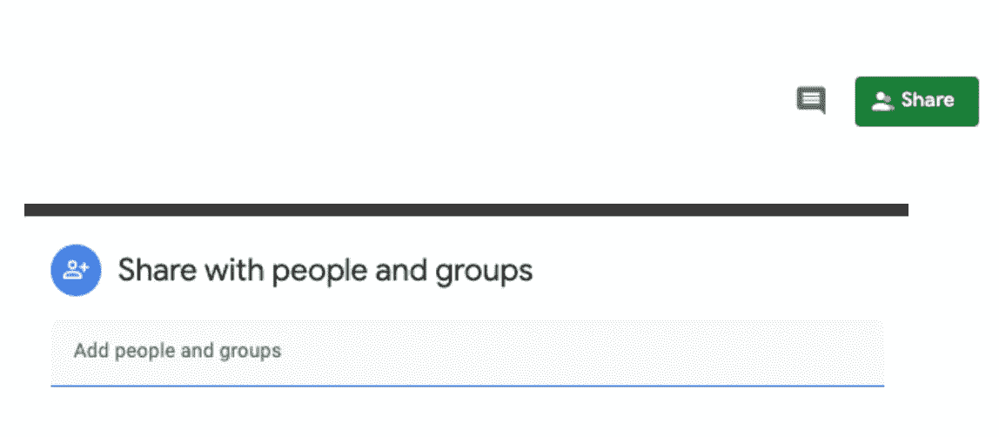
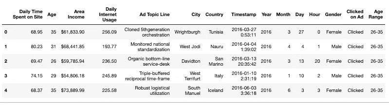

# Google Sheet API 和 Python

> 原文：<https://levelup.gitconnected.com/google-sheet-api-and-python-af188b3cf894>


1985 年 9 月 30 日，微软发布了第一个用于麦金塔电脑的 Excel 版本。之后，谷歌发布了与 MS Excel 功能相同的 Google Sheet。大多数公司和他们的数据分析师习惯于使用 Excel 或 Google Sheet 来操作和分析数据。几乎每个数据分析师每天都在使用 Excel 或 Google Sheet。对我来说，Excel 或 Google Sheet 适合存储数据，但不适合清理、挖掘和可视化数据。

如果你和我一样，有一个连接 Google Sheet 和 Python 的方法。然后，我们可以从 Google Sheet 中提取数据，并将更新后的数据上传到同一个 Google Sheet，但是是一个新的 Sheet。

连接 Google Sheet 和 Python 有几个步骤。

# 我们需要做的必要准备工作

首先，你需要一个账号登录 [Google 开发者控制台](https://console.developers.google.com/)，创建一个新项目。你可以给它取任何你想要的名字。然后你需要点击左侧的“库”并搜索“Google Drive API”，然后选择并启用它。之后，我们需要回去再次点击“库”，搜索“Google Sheet API”。启用后，您需要单击左侧的“Credential ”,为 Web 服务器创建访问应用程序数据的凭据，然后命名服务帐户，并授予它 Editor 项目角色。然后我们就可以把 JSON 文件下载到想要的位置，重新命名为“creds.json”。

别担心。第一次，你可能会觉得很迷茫。下面是[视频教程](https://www.youtube.com/watch?v=cnPlKLEGR7E&t=428s)到前期工作部分的所有步骤。

## Python 代码

*   安装/导入库

```
#If you did not install gspread, you need to install it first
!pip install gspread oauth2client# import necessary libraries
import json
import gspread
from oauth2client.service_account import ServiceAccountCredentials
from pprint import pprint
import pandas as pd
```

*   获取客户电子邮件的功能

```
def client_email(creds_file):
    # read and open creds.json file
    with open(creds_file) as f:
        creds = json.load(f)
    # get client_email 
    client_email=creds['client_email'] 
    return client_email
```

“creds.json”中有一条信息非常重要——client _ email。例如，我们有一个 google sheet，其中包含我们需要分析的所有数据，如果我们想要共享它，我们通常使用电子邮件来共享 Google sheet 文件。在这里，我们可以简单地复制粘贴您的客户端电子邮件，并通过该电子邮件共享您的 Google 表单。



*   创建一个从特定的 Google 工作表中提取数据的函数

```
# obtain the client email and the data from google sheet with dataframe type
def gs_to_df(creds_file,sheet_name):
    # Read Data from a Spreadsheet
    gc = gspread.service_account(filename=creds_file) # gspread – to interact with Google Spreadsheets
    # extract data from google sheet by the name of the sheet
    sheet = gc.open(sheet_name) 
    #For the first sheet, pass the index 0 and so on.
    sheet_instance = sheet.get_worksheet(0) 
    # get all the records of the data
    records_data = sheet_instance.get_all_records()
    # convert the json to dataframe
    df = pd.DataFrame(records_data)
    return df, sheet
```

*   创建一个功能来上传一个更新的数据到一个新的谷歌表

```
def upload_data_to_gs(title,sheet_page,updated_df):
    row=updated_df.shape[0] # row size
    col=updated_df.shape[1]  # column size
    # add a sheet with 20 rows and 2 columns
    sheet.add_worksheet(rows=row,cols=col,title=title) # title of new data
    # get the instance of the second sheet,for the first sheet, pass the index 0 and so on.
    new_sheet = sheet.get_worksheet(sheet_page)
    # Update values to the sheet
    new_sheet.insert_rows(updated_df.values.tolist())
    # add headers
    header = list(updated_df.columns)
    index = 1
    new_sheet.insert_row(header, index)
```

*   获取 client_email 并从 Google 工作表中提取数据

```
# Get client_email and share the Google Sheet with this email
client_email= client_email=client_email('creds.json')# After shared the google sheet with the client email,let us extract the data
df, sheet=gs_to_df('creds.json',"Consumer_Behavior_Data")
# my file's name is 'Consumer_Behavior_Data'
df.head()
```



*   让我们使用“groupby”创建新数据

```
new_data=df.groupby(['Clicked on Ad','Gender'])["Daily Internet Usage"].mean().reset_index()
new_data
```


您还可以使用 python 清理数据，并上传清理后的数据或您想要上传相同 google sheet 文件的任何数据。

*   现在让我们将这个 new_data 上传到 Google Sheet 文件的第四个工作表中。

```
upload_data_to_gs('target_gender_DailyInternetUsage',4,new_data)
```

## 结论

对我来说，用 python 来可视化数据更容易，因为我可以用 Python 灵活地操纵数据。如果你对 google sheet 的一些功能不是很熟悉，你可以使用 Python 来操作想要的数据，然后将这些数据集上传到不同工作表中的同一个 Google Sheet 文件。我之所以要这样做，是因为有些公司要求你创建一个仪表板，有时在 Google Sheet 中使用 query/sumifs 或其他功能创建一些数据透视表或任何表格非常耗时。因此，我们可以直接使用我们上传的数据集来轻松创建仪表板。