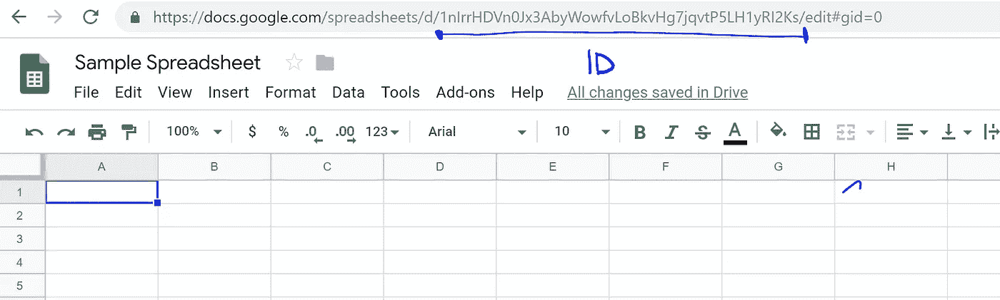

# 带 Javascript 的 Google Sheets API 教程

> 原文：<https://levelup.gitconnected.com/google-sheets-api-tutorial-with-javascript-588f581aa1d9>

## 快速、深入的教程。


[https://cdn . pix abay . com/photo/2016/10/26/12/48/excel-1771393 _ 1280 . jpg](https://cdn.pixabay.com/photo/2016/10/26/12/48/excel-1771393_1280.jpg)

*作者伊格纳西奥·n·阿吉雷*

几个月前，我试图用我的 Javascript 应用程序的 Sheets API V4 对一个 **Google 电子表格进行 CRUD 操作。我在前端使用 React.js，在后端使用 Node.js:这非常痛苦。我在后端有我的 google 令牌，把它发送到前端，但是当我试图用 React/Javascript 访问 API 时，它不工作！最后，我弄清楚了让它工作需要什么，以及如何扩展 API 的用法。我将直截了当地说明如何去做，稍后再详细解释。**

我用的是创建-反应-应用。但是它应该可以在任何使用 fetch 的 Javascript 应用程序上工作。你可以看到这个 API 可以为这个游戏做些什么:

[www.snowballfinances.com/sheets](http://www.snowballfinances.com/sheets)

这是一个用 React 和电子表格制作的预算游戏。尽情享受吧！

我也正在写一本电子书来分享我从零开始学到的关于 Google APIs 的一切！如果您感兴趣，请告诉我:)

 [## React & Google APIs

### 从头开始学习操作谷歌 API:认证，电子表格管理，谷歌日历，令牌…

react-ultimate-guide-Google APIs . vercel . app](https://react-ultimate-guide-googleapis.vercel.app/) 

我不推荐使用在线 ide，你会遇到 CORS 问题。create-react-app(我正在使用的)上有很多教程，设置它应该不会超过 5 分钟。这里有一个快速设置:

`npm i -g create-react-app`

`create-react-app my-app`

`cd my-app`

在您最喜欢的代码编辑器中打开它。

## 下面是你完成这项工作所需要的:

1.  电子表格及其 ID
2.  一个**令牌**发送给具有正确作用域的工作表 API
3.  一个带有正确信息的 **fetch()** 请求(主体、认证头)

我们一步一步来。我们从简单的开始，更新单元格 A1 中的值 ***10。***

# 1.电子表格 ID

这是简单的部分。去 sheets.google.com，用你的谷歌账户登录，创建一个电子表格。一旦你看到电子表格， ***电子表格 ID*** 将出现在 **URL** 中，如下所示。



所以我们在这种情况下的 ID 是:**1 nirrhdvn 0 JX 3 abywowfvlobkvhg 7 jqvtp 5 LH 1 yri 2 ks**

使用您自己的 spreadsheetID。这个只是为了解释的目的！

# 2.代币

要从谷歌获得一个令牌，你需要谷歌 OAuth 系统。我们将从**谷歌认证 2 游乐场:**获得令牌

[](https://developers.google.com/oauthplayground/) [## OAuth 2.0 游乐场

### OAuth 2.0 Playground 允许您使用 OAuth 2.0 和支持它的 API。

developers.google.com](https://developers.google.com/oauthplayground/) 

请访问上面链接的网站。


现在，在左栏中，找到***Google Sheets API V4:***

点击它，然后点击**范围**:**h**[***ttps://www . Google APIs . com/auth/***](https://www.googleapis.com/auth/drive.file)***电子表格***


一个 ***复选标记*** 应该出现在它的左边。

最后，点击**授权 API。它是上面的蓝色按钮。**

您将被要求登录 Google 并提供访问权限。登录，然后点击**允许**这样你就可以使用示波器了。

登录并授权后，你会得到一个**授权码**，如下图**所示。单击“交换令牌的授权码”。**


**警告:**一定要上**第二步，你 DONT 需要第三步。**

就是这样！你刚刚得到了**一个“访问令牌”。**复制到某个地方！从技术上讲，我们已经准备好更新我们的电子表格。所以，让我们继续这样做吧！

# 3.获取请求—代码

现在，让我们发送正确的 **fetch()请求。**要查看正确的获取请求参数，我们将转到工作表 API V4 文档。你可以不去那个网站，反正答案就在下面！但是，如果您希望扩展功能，您会希望稍后再查看它。

[](https://developers.google.com/sheets/api/reference/rest/v4/spreadsheets/batchUpdate) [## 方法:spreadsheets . batch update | Sheets API | Google Developers

### 由于电子表格的协作性质，不能保证电子表格会准确反映您的…

developers.google.com](https://developers.google.com/sheets/api/reference/rest/v4/spreadsheets/batchUpdate) 

# 发布请求代码

如你所见(如果你去链接)，这将是一个 POST 请求。


[https://developers . Google . com/sheets/API/reference/rest/v4/spreadsheets/batch update](https://developers.google.com/sheets/api/reference/rest/v4/spreadsheets/batchUpdate)

当我首先看到完整的代码时，我发现它很有帮助。我用的是 React.js create-react-app。下面是将单元格 A1 更新为 10 的代码。

*重要提示:这将在任何可以使用 fetch()的本地环境中工作。你不限于反应！*

## 这段代码将用单元格 A1 中的数字 10 更新您的电子表格。

***警告:您需要用您的信息替换工作表 ID 和访问令牌。我的不行！***


# 成功了！

当我运行 React.js 应用程序时，我单击按钮，工作表就会更新！

如果它不起作用，请在评论中告诉我，我很乐意帮忙。我们将在下面更详细地看到我如何构建**对象**。

教程的其余部分提供了更深入的解释。

# 构建对象

**获取请求需要一个字符串参数:** `**fetch('https://sheets.googleapis.com/v4/spreadsheets/SHEET_ID_HERE/batchUpdate')**`

这一部分不难理解，现在让我们看看**授权头。在这里你将使用我们从 OAuth 游戏回合得到的代币。**

```
fetch('https://sheets.googleapis.com/v4/spreadsheets/SHEET_ID_HERE/batchUpdate',{
method: 'POST',
headers:{
 **Authorization: 'Bearer TOKEN_GOES_HERE',
  'content-type':'application/json',** }})
```

**太好了！**

现在最重要的部分:**身体。**我们使用 Google 的 ***batchUpdate 请求。*** 看下图的最后。


**请求 url(/batchUpdate) *决定了您的工作表中要更新的内容、位置和方式。更新谷歌电子表格的方式有几十种，我重复一下，几十种*** 。我选择 batchUpdate 是因为您对单元格的值、格式、对齐等有很多控制。另一个例子在后面，但首先让我们解释完这个例子。

## 身体

这就对了。您已经构建了第一个对象来更新您的电子表格！

# 进一步解释和使用

您有一个 **POST 请求**，带有您的**工作表 ID** 到 Google 的 **batchUpdate url** ，其中包含一个**令牌**，一个**认证头**，以及一个**主体**。该请求使用 Google Sheets API v4 来更新您的特定电子表格。

你可以在一个应用程序中使用所有这些！比方说你想让用户填写一个更新你的工作表的表单(/batchUpdate)，或者有一个从电子表格中提取信息的函数(/batchGet)，或者更新单元格格式，或者动态创建工作表，这都是有可能的(我都做到了！).为了学习如何用正确的参数构建正确的获取请求，Google 有一种方法来测试 API 请求并为您构建对象。您可以转到每个请求的概述部分。


每当我构建一个与 API 交互的方法时，我首先使用这个引用，然后在 Postman 上测试它们，最后编码它们。请参见下面的 batchUpdate 概述链接(*与上面的图片*相同的 url)

[](https://developers.google.com/sheets/api/reference/rest/v4/spreadsheets/batchUpdate) [## 方法:spreadsheets . batch update | Sheets API | Google Developers

### 由于电子表格的协作性质，不能保证电子表格会准确反映您的…

developers.google.com](https://developers.google.com/sheets/api/reference/rest/v4/spreadsheets/batchUpdate) 

# 认证-我做了什么

有无数种方法可以将谷歌认证集成到你的应用程序中，我将告诉你我是如何做到的。

我在 Node.js 后端使用 Passport.js 向 Google 认证我的用户。我使用的**作用域**对于工作表操作非常重要，它是 **drive.file** 作用域，因为它只为应用程序提供对它创建的工作表的访问，仅此而已。我们在本教程中使用了**电子表格**范围来从任何应用程序访问 API。


用户通过身份验证后，我向客户端发送了**令牌，您应该在使用 Passport**进行身份验证后取回该令牌。现在，客户端 React.js 可以访问 API，我从客户端向 Google Sheets API v4 发送请求。我经常使用 batchUpdate ***。*** 我用过的其他方法有*/****values/batchUpdate***(不同于 batch update)，/ ***batchClear，*** *和/* ***values。***

我的应用程序在用户的谷歌账户上创建一个电子表格，然后相应地更新或检查它。

# 其他更简单的方法

我推荐的另一个选择是 **Firebase，**它在谷歌这边为你做一些验证的 vodoo 魔术(不需要服务器)，然后返回一个你可以使用的令牌。我能找到的最有用的教程在这里:

[***https://www.youtube.com/watch?v=zq0TuNqV0Ew&t = 195s***](https://www.youtube.com/watch?v=zq0TuNqV0Ew&t=195s)

有一点设置，但它的工作！你会得到一个你可以使用的代币。

# 再举一个例子:spreadsheet.values/get

我再给你举一个例子，告诉你如何从一个特定范围的电子表格中获取信息。

[](https://developers.google.com/sheets/api/reference/rest/v4/spreadsheets.values/get) [## 方法:spreadsheets . values . get | Sheets API | Google 开发者

### 编辑描述

developers.google.com](https://developers.google.com/sheets/api/reference/rest/v4/spreadsheets.values/get) 

## 假设我想获得以下列值:


在这种情况下，我想访问范围 **A1:B5 中的所有值。嗯，谷歌有一个方法可以做到这一点！**

为此，我将使用/values/{range}请求。请参见下面的请求 URL 的结构。


我将构建一个更简单的不同类型的获取(因为它是一个 GET 请求)，最好的部分是:在一个 ***代码中。我在本地开发环境中使用 React。***


这个应用程序有一个按钮，可以获取 A1:B5 的取值范围。现在您可以访问这些信息了！

很棒吧？

如果您有任何问题，请告诉我，我非常乐意带您浏览，甚至检查您的代码！

# 看看我的网站！

我必须学会如何为我正在创建的初创公司使用这个 API。前往[www.snowballfinances.com](http://www.snowballfinances.com)(暂时不适用于移动设备)查看 Google Sheets API 的所有应用程序！我在用真实的工具教人们个人理财，然后把它变成游戏。如果您想了解更多，请告诉我！

另外，如果你想了解更多关于 Javascript Async/Await 函数的知识，可以看看我的另一篇教程:

**将 API 调用与 Javascript Async/Await 结合:**
[https://medium . com/@ inaguirre/Combining-API-Calls-with-Javascript-try-catch-ba 1 b 7b 9303 a 5](https://medium.com/@inaguirre/combining-api-calls-with-javascript-try-catch-ba1b7b9303a5)

# 感谢您的参与，祝您编码愉快！

如果你想要我们今天做的，这是回购协议:

[](https://github.com/Ignacio1996/sheetsAPI-V4-tutorial) [## Ignacio 1996/sheet SAPI-V4-教程

### 在 GitHub 上创建一个帐户，为 Ignacio 1996/sheet SAPI-V4-tutorial 开发做出贡献。

github.com](https://github.com/Ignacio1996/sheetsAPI-V4-tutorial)