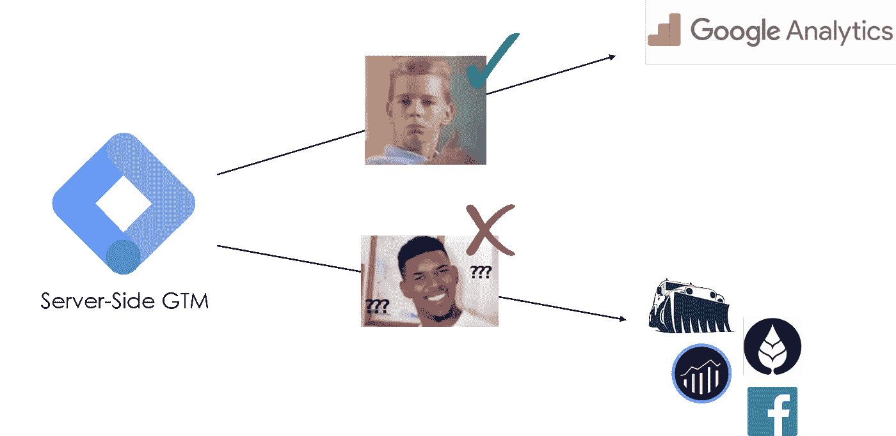
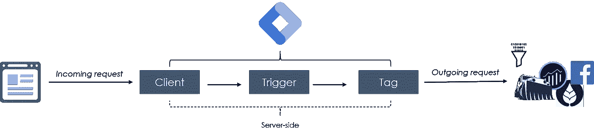
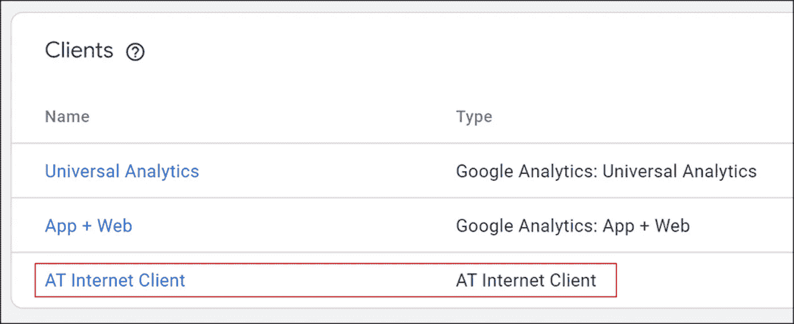
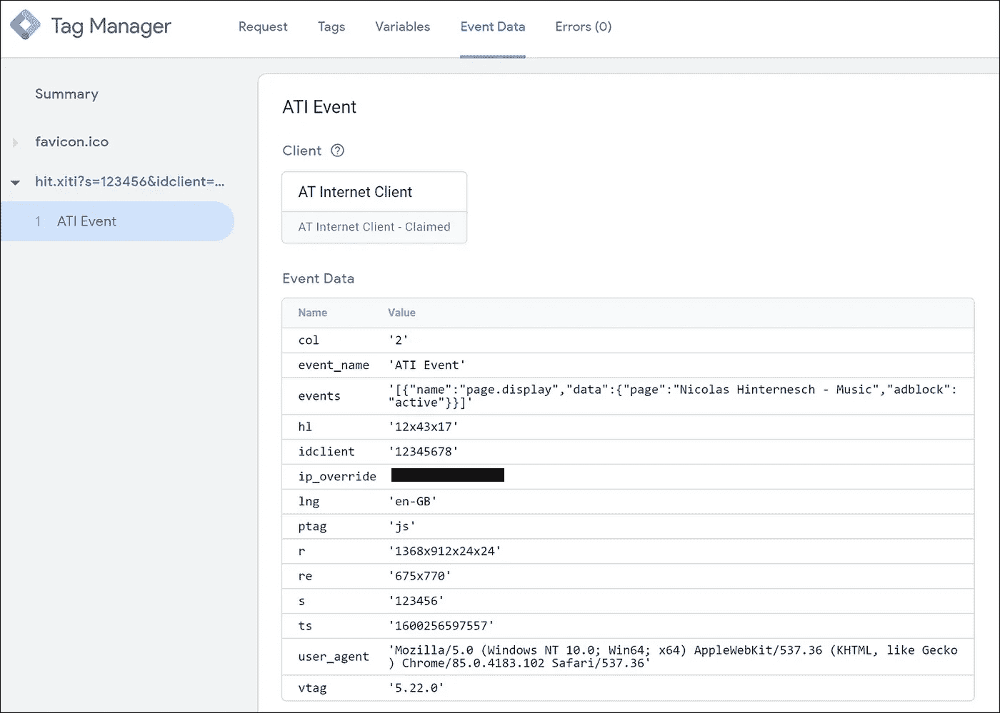
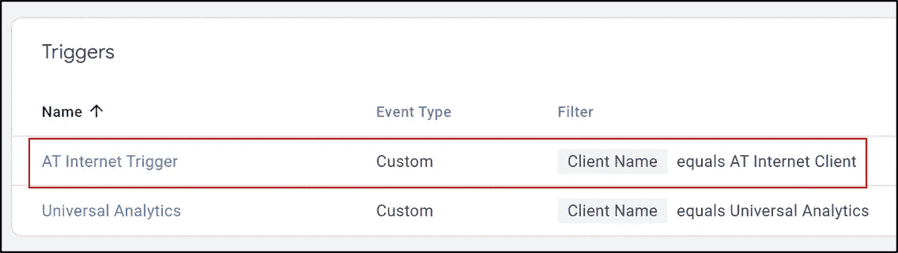
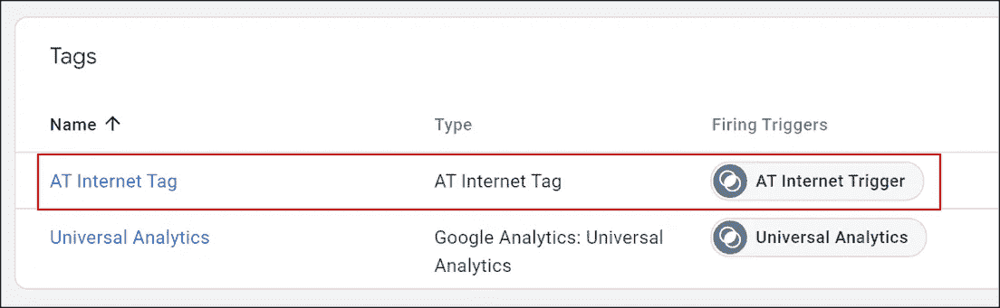
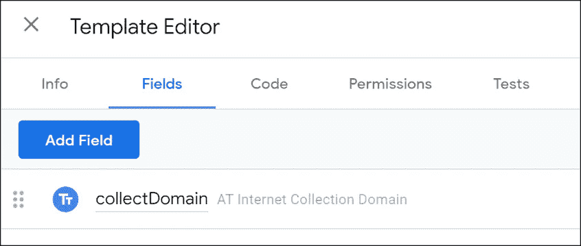
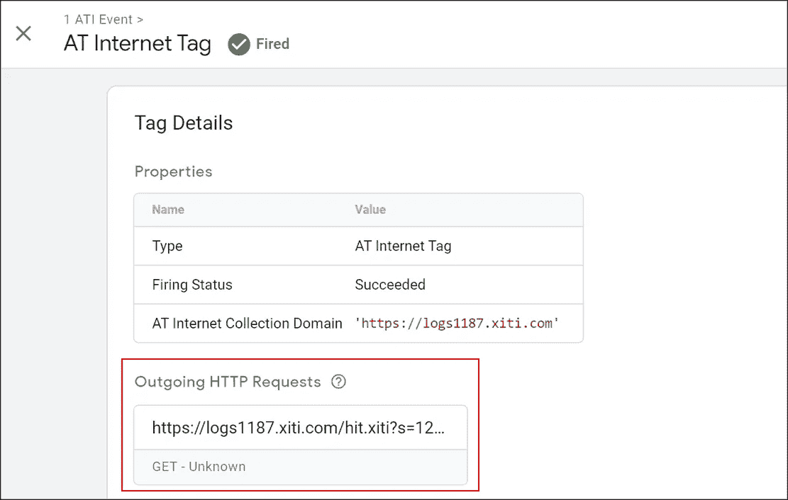

# Google 标签管理器服务器端——如何管理定制的供应商标签

> 原文：<https://levelup.gitconnected.com/google-tag-manager-server-side-how-to-manage-custom-vendor-tags-21bef51bc89e>

分析社区同意:谷歌标签管理服务器端的[发布是行业的一个重要里程碑。它不仅强调了向服务器端分析技术的范式转变，还可能彻底颠覆组织收集数据和构建数据模型的方式。](https://blog.google/products/marketingplatform/360/improve-performance-and-security-server-side-tagging/)

本文不是对服务器端标签管理的概念及其术语的介绍。Simo Ahava 和 Julius Fedorovicius 精彩地详细报道了这一点。本教程通过引导您完成**一个关于如何为不属于 Googleverse** 的定制供应商配置 GTM 服务器端的基本示例，建立在这些基础之上。



由于该产品目前仍处于早期阶段，其功能和可用文档主要集中在 Google 环境中。内置的客户端、标签和变量只关注通过服务器端容器实现 Google Analytics。虽然这对于设置您的 GA 测量非常有益，但部署服务器端标签管理的首要目标应该是让组织**在服务器上集中管理多个不同的标签**以显著减少客户端负载。

因此，我将带您浏览一个示例工作流，它说明了当**的目标是为一个定制供应商**收集、准备和分发数据时，GTM 服务器端设置的不同组件是如何协同工作的，例如 Internet、Snowplow 或脸书的 Adobe Analytics。



# 它是如何工作的

对于这个例子，我想管理互联网上[的测量请求。正确处理数据需要特定的命中结构。它由集合域、路径和查询字符串中的多个跟踪参数组成:](https://www.atinternet.com/en/)

`https://collectionDomain.com/hit.xiti?param1=value1&param2=value2...`

我想使用 GTM 服务器端收集数据，将其解析为事件模型，并使用该事件数据将测量结果从服务器发送到 AT Internet，而不是直接从浏览器发送到 AT Internet 服务器。

## 1 -将数据发送到 GTM 服务器端容器

大多数测量工具的跟踪数据是通过客户端浏览器中的 JavaScript 获取的，并发送给供应商收集服务器。虽然每个供应商在这里都需要一个特定的原始 hit 结构(例如 [Google 的测量协议](https://developers.google.com/analytics/devguides/collection/protocol/v1))，但是一个设计良好的 GTM 服务器端设置可以让您在一个通用的服务器容器跟踪请求中收集不同供应商端点所需的所有数据。这个跟踪请求可以由任何类型的 JavaScript 生成。对于下面的 hit(由 AT Internet Smartttag 库生成)，请注意，默认的**集合域**需要用您的 GTM 容器的域替换为**:**

```
**https://gtm-abcde12-a1aaa.uc.r.appspot.com**/hit.xiti?s=123456&idclient=12345678&col=2&ts=1600256597557&vtag=5.22.0&ptag=js&r=1368x912x24x24&re=675x770&hl=12x43x17&lng=en-GB&events=[{"name":"page.display","data":{"page":"Nicolas Hinternesch - Music","adblock":"active"}}]
```

## 2 -构建自定义客户端模板

对于传入的 GA 请求，有内置的客户端可用。但是，它们不适用于结构不同的请求——如上图所示。因此，我们必须构建自己的客户端模板，能够处理您计划管理的请求:



为了执行客户端和标签模板中的大多数代码，您需要使用 Google 提供的 [**服务器端标签 API**](https://developers.google.com/tag-manager/serverside/api)。您还必须在模板编辑器中授予相关的**权限**。

对于我们简单的工作流程，客户必须完成一些基本任务:

**声明请求** 指定您希望这个客户机响应哪些请求，并声明匹配的请求(第 17 行)。

**将数据存储在事件模型中** 客户端的主要任务之一就是将传入的数据存储在结构化的事件模型中。因此，各种标签可以利用这个统一的事件数据来填充它们的传出跟踪请求。
虽然有内置的 API 来自动构建传入的 GA 点击并将数据解析到事件模型，但当您使用其他供应商的端点时，这必须通过自定义代码来完成。这可以通过将来自查询字符串的输入数据存储在一个*事件*对象中来实现(第 23 行)。
此外，我们可以从传入的请求中检索头值(第 13 行)，并将它们添加到事件对象中(第 37 行)。IP 地址也是如此，它可以通过 *getRemoteAddress* API 获得(第 15 行)。通过在事件数据中传递它们，我们可以在以后使用它们来覆盖我们发出的请求的请求头。

**运行容器**

您可以在预览模式下监控客户端存储的事件数据:



## 3 -构建自定义标记模板

从现在开始，*常规* GTM 逻辑再次发挥作用。我们可以创建触发器和标记来管理我们的测量调用。在这种情况下，我希望我的标记在每次我的定制客户端处理请求时被触发:



同样，GA 有一个内置的标签模板。对于其他供应商，我们必须编写一个自定义的:



自定义标签模板必须执行以下任务:

**从用户** 处获取想要的采集域，这是数据应该发送到的域。它可以在标签创建期间从用户的输入字段中收集:



**构建跟踪请求** 为了将请求 URL(第 11 行)放在一起，我们需要检索集合域(第 8 行)以及来自事件对象的数据(第 9 行)。虽然这对于一个基本的请求来说已经足够了，但是我们还可以向发出的请求添加一些重要的**头**(第 24 行)。这些头值由客户端获取并存储。这就是像推荐人或用户代理这样的信息被处理并转发给定制供应商的方式。此外，您可以覆盖传出请求的 IP 地址，以匹配传入请求中的实际用户 IP 地址。请注意，这取决于定制供应商是否以及如何接受覆盖 IP 地址。常见的技术包括 *x-forwarded-for* 头(第 27 行)或一个 URL 参数。但这取决于供应商。如果我们不覆盖像 IP 或 UA 这样的值，传出的请求默认发送服务器容器的值。还请注意，管理 IP 地址被视为 PII。一些供应商倾向于默认截断 IP，但一定要注意隐私合规性。
请注意，所建立的 URL*而非*必须是为了在互联网上获得成功。除了根据 [ATI hit 制作标准](https://developers.atinternet-solutions.com/general-en/craft-your-hit/)修补 URL，我们还可以参考 [Adobe Analytics 实施指南](https://docs.adobe.com/content/help/en/analytics/implementation/home.html)或任何其他供应商文档来使用相同的事件数据并构建符合不同请求模式的 hit URL。

**向供应商端点发送 GET 请求** 最后一步，我们可以向 URL 发出 GET 请求，以便最终将数据传递给定制的供应商端点(第 29 行)。确保包含标题(第 31 行)。

这就行了。对于每个事件，可以在预览模式下查看标签发送的传出请求:



请注意，这只是一个**裸机实现**。一个正常运行的生产设置将包括其他关键方面，比如服务器端 cookie 处理和一个(最好是)定制域。但是本教程应该让您对通过服务器端 GTM 配置定制供应商度量时所涉及的一般过程和组件有一个相当好的理解。

# 关于 GTM 服务器端的结束语

总之，强调服务器端跟踪和服务器端标签管理之间的**差异很重要**。我经常听到这些术语互换使用。但是，在考虑服务器端实现的各种选项时，理解这种差异是很重要的:

**服务器端追踪**基于直接从提供网页内容的服务器发送追踪点击。这样，整个数据收集过程就不会通过任何客户端技术。当然，这里的数据可用性非常有限。

**然而，服务器端标签管理**提供了一个很好的解决方案，可以集中管理和分发所有不同供应商终端收集的数据，同时尽可能减少客户端负载。客户端仍在收集数据。**但是**不是让客户端将 100 个不同的点击分配给 100 个不同的服务，而是浏览器可以在一个请求中将数据发送到一个自定义域，同时在服务器上处理对所有端点的分发。

我个人最喜欢这一重新设计的流程，因为它推动组织走向**智能数据收集**和**统一数据模型**。

他们是**被迫** …

*   …思考哪些信息实际上**需要包含在**跟踪请求中，以满足不同测量供应商的需求
*   …创建一种**独立于供应商的方法，在事件级别构建此数据**，使其可用于所有端点。这将证明在数据治理方面非常有益。

*—如果您对这个过程有疑问，发现了代码中的一个 bug，或者您只是想讨论分析:请随时联系*[](https://hinternesch.com/?at_medium=affiliate&at_campaign=Medium&at_creation=GTMSSCustomVendorTags&at_format=link)****。****——**

# *更新*

*关于步骤 2:构建定制客户端模板，我已经写得更详细了。你可以在 [Github](https://github.com/NHinternesch/gtm-server-client-custom-event-parser) 上找到新文章[这里](https://nhinternesch.medium.com/google-tag-manager-server-side-parsing-event-data-from-any-custom-vendor-request-4d2ea7f25991)和相应的 GTM 服务器端客户端模板。*