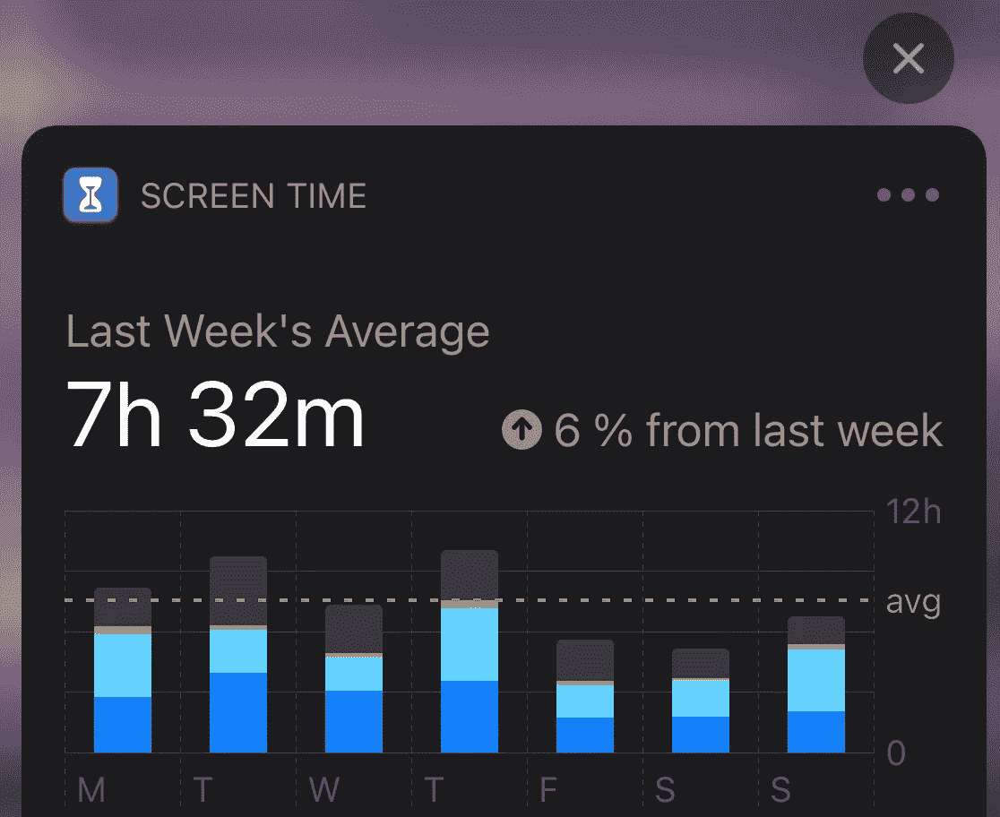
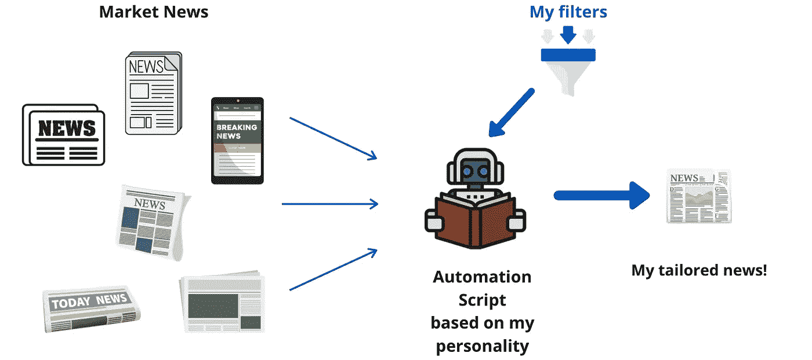
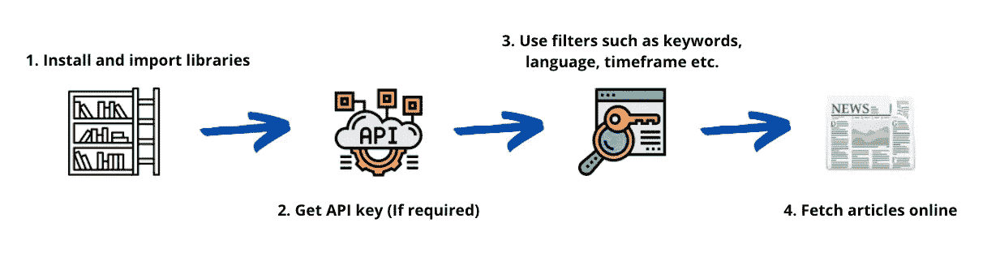
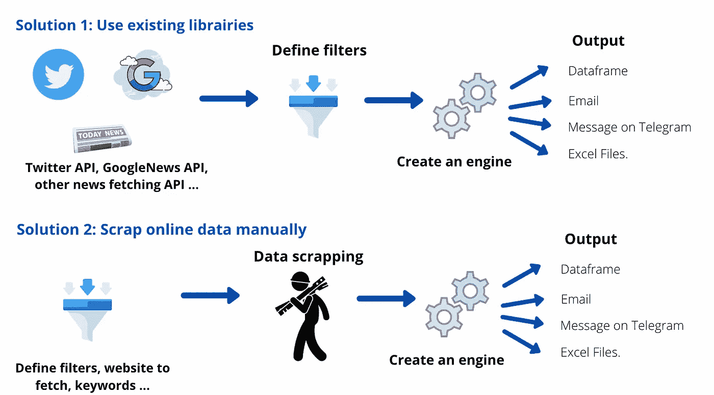
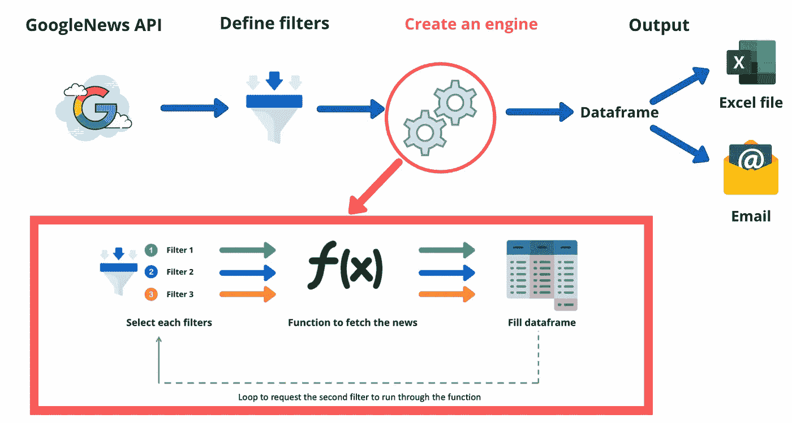
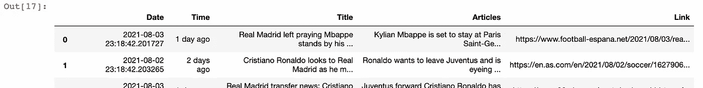

# Python:我如何用这个机器人新闻播报员每天增加 30 分钟

> 原文：<https://levelup.gitconnected.com/googlenews-python-api-gain-30-minutes-a-day-with-this-robot-newsreader-48ae6c593ef0>

## 编码和生产力

## 除了这篇文章，我还讲述了我如何使用 Python 创建新闻阅读器助手的故事。完整代码+视频教程分享。


罗马卡夫在 [Unsplash](https://unsplash.com?utm_source=medium&utm_medium=referral) 上拍摄的照片

## 滚动，滚动，滚动…

上周日，我感到有点沮丧，我无法用语言来描述发生了什么，但那就是事实。我跳上我的沙发，继续我的非生产性活动。开始问自己我到底怎么了。

几个小时后，我从我的 iPhone 上收到了我通常的每周电话习惯通知。



作者截图

就是这样！

我对自己非常失望，同时，我怎么能每周花这么多时间在手机上。

我开始看起来更深刻，刚刚发现上周我花了 18 个小时看新闻。尽管这是我工作的一部分，我还是要不断了解最新的经济法规、上市公司的信息…

那太过分了。

一个想法出现了，我开始寻找可能性，同时，提高我的编码技能，并构建一些我可以每天使用的高效的东西。

我开始在网上滚动目前存在的不同原型。一开始，我非常兴奋，就像一个要去糖果店的孩子。但是几个小时后，没有一样东西完全符合我的期望。

所以，我最终有了一个想法，我必须建立自己的工具。

所以，我拿起我的黄色铅笔和我的笔记本，开始画出这个工具的用途的大概视图。它看起来类似于:



作者图解

这时，一点怀旧之情回来了，我开始记起我的大学老师不断重复的话:“ ***工程师最好的朋友是一支笔和一张纸*** ”。我坚信这句话必须对每个年轻科学家重复。

现在，我准备走了。

我开始在数据科学家社区上滚动，寻找不同的替代品和软件包，我可以用它们来创建一个“新闻阅读器自动化脚本”，为我选择重要的新闻。

我找到了各种 Python APIs，如 [Webhose](http://webhose.io/) 、 [NewsAPI](http://newsapi.org/pricing) 、 [News Fetch](https://pypi.org/project/news-fetch/) 、 [GoogleNews](http://pypi.org/project/GoogleNews/) 等。，它聚合了来自多个媒体来源的新闻标题。使用这些 APIs 库的框架有些类似。



作者图解

## 选哪个？

所以现在，是时候做出选择并改进我们的数据处理模型了。

在做出任何选择之前，我会根据以下基本标准来决定自己:

1.  新闻质量
2.  选择的多样性
3.  可靠性和受欢迎程度

然后我画了一个更精确的模型，用两种可能的架构来定义数据处理:



作者图解

经过一些研究，GoogleNews API 看起来是获取我的**条目**数据的最有效和最平衡的方式。

现在，是时候开始编码了。

## 步骤 1:安装和导入库

第一项任务包括定义使用哪些 Python 库来创建新闻阅读器助手。

经过一些谷歌搜索…

令人惊讶的是，它不需要很多包。我需要进口熊猫、熊猫和谷歌新闻。

但是……当我运行第一行代码时，我的电脑出现了一个错误。

我注意到 GoogleNews 既没有安装在我的环境中，也没有安装在我的 Macbook 上。于是，在谷歌搜索“谷歌新闻 Python API”后，我找到了安装必要包的命令行。

你可以随意使用它。

```
pip install GoogleNews
```

因此，我执行下面的命令行…

嘣…我拿着我的蓝笔，摆脱了第一步。

我忘了提了；我将 *GoogleNews()* 定义在一个小写字母中，以尊重我最重要的 6 条规则中的第三条戒律，这帮助我在两年半的时间里三次获得晋升。

如果你想了解更多，你可以遵循我的 6 大原则:

[](https://towardsdatascience.com/python-6-coding-hygiene-tips-that-helped-me-got-promoted-c70b4380f1c7) [## Python:帮助我获得晋升的 6 个编码卫生技巧。

### 在这篇文章中，我列出了 6 个显而易见但并不总是适用的编码技巧，我希望有人能强迫我遵循 3 年…

towardsdatascience.com](https://towardsdatascience.com/python-6-coding-hygiene-tips-that-helped-me-got-promoted-c70b4380f1c7) 

所以，现在我们完成了第一个任务，我们可以继续我们模型的第二个挑战。

## 第二步:定义我们的过滤器、语言和时间表

正如所料，google 新闻 API 不需要 API 键。所以，我也可以去掉第二步。

现在，我应该问自己的主要问题是，今天早上我对哪些话题感兴趣？

在对自己提出质疑后，我建立了一个关键词列表，比如我最喜欢的球队和一些我今天想关注的特定关键词。然后我定义了一个时间框架(它有一个句号)，最后选择我的语言。

我参考了 API 文档，并以下面的命令行作为结论:

考虑的日期格式是年-月-日-年

既然我已经设置了我的首选项，是时候建立我的机器了。

## 步骤 3:创建一个获取新闻的函数

因此，在创建引擎和最终数据模型之前，我们必须通过定义我们想要的输出类型来再次锐化我们的模型。我想收到一封**邮件**，一个 **excel** 文件，一个简单的 python **数据帧**，一条在 **Whatsapp/Telegram** 上的消息吗？

在选择我的输出之前，我必须问自己，我希望按主题接收多少个新闻标题？

基于此，**我排除了 Whatsapp/Telegram** ，因为它太长了。

我最终的想法是，第一稿的最佳输出要么是一个 **excel** 文件，要么是一封**电子邮件**。对于这两种解决方案，我都需要将我的数据存储在 dataframe 中。所以，我这样改进了这个模型:



作者图解

关于引擎，我选择了一个函数，它将基于每个过滤器一个接一个地删除新闻，并用关于我的主题选择发生的事情填充我的数据帧。

该循环将类似于:

将获取报纸数据的函数

此时此刻，只需要将每一个独立的部分连接起来，将我的代码精炼得更干净、更高效...

就是这样！(*完整代码分享在最后*)。

经过几个小时的编码，这是最终输出的第一个样本:



来自我的读者助手的最终新闻摘要——图片由作者提供

我最喜欢的所有话题都在一张表中进行了总结。

我们成功了。

如果你在编码方面需要帮助，我为你录制了一个编码视频教程，你可以看到它应用于一个真实的案例研究:

编码教程

干得好！

## 结论

制作这个工具非常有趣。不仅仅是为了日常的帮助，也是为了所面临的编码挑战。

最重要的是，如果你是一名学生，正在寻找一份开发人员的工作，你可以随时将它纳入你的投资组合。

这个原型可以用一个[自然语言处理](https://www.udemy.com/course/trading-with-ml-in-python/?couponCode=NEWSREADER)算法来完成，检测整体情绪。例如，如果你想检测人们对 Jay-Z 最新歌曲的看法，你可以将标题与情感分析相关联，从而获得人们想法的实时意见。

感谢你的关注。

编码快乐！

赛义德

# 来源:

*谷歌新闻 API 文档:*

[](https://pypi.org/project/GoogleNews/) [## 谷歌新闻

### pip 安装 GoogleNews 或 pip 安装-从 GoogleNews 升级 GoogleNews 导入 Google news Google news = Google news()…

pypi.org](https://pypi.org/project/GoogleNews/) 

*帮助我获得晋升的 6 个编码卫生技巧:*

[](https://towardsdatascience.com/python-6-coding-hygiene-tips-that-helped-me-got-promoted-c70b4380f1c7) [## Python:帮助我获得晋升的 6 个编码卫生技巧。

### 在这篇文章中，我列出了 6 个显而易见但并不总是适用的编码技巧，我希望有人能强迫我遵循 3 年…

towardsdatascience.com](https://towardsdatascience.com/python-6-coding-hygiene-tips-that-helped-me-got-promoted-c70b4380f1c7) 

*Python 中带机器学习的 NLP:*

[](https://www.udemy.com/course/trading-with-ml-in-python/?couponCode=NEWSREADER) [## 2021 年:用 Python 实现机器学习的 NLP

### 嗨，我们是詹姆士和赛义德。我们两人都是伦敦多家银行的数据科学家，我们…

www.udemy.com](https://www.udemy.com/course/trading-with-ml-in-python/?couponCode=NEWSREADER) 

# 完整的 Python 代码: