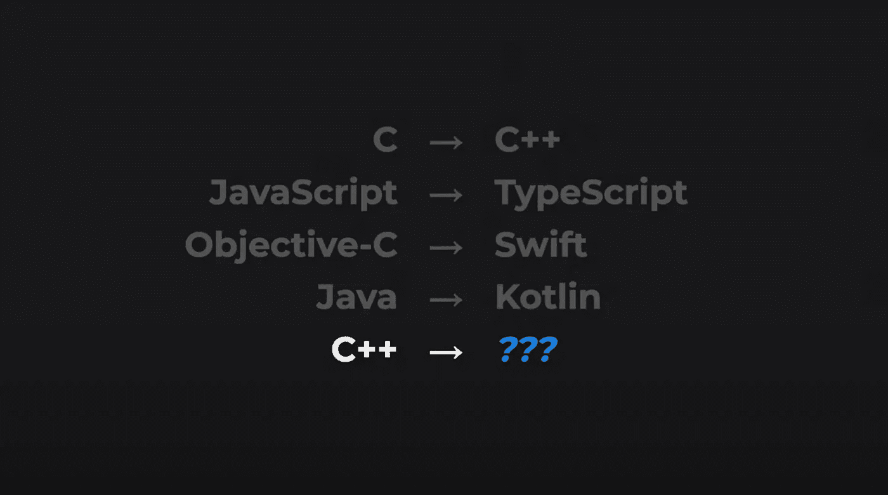
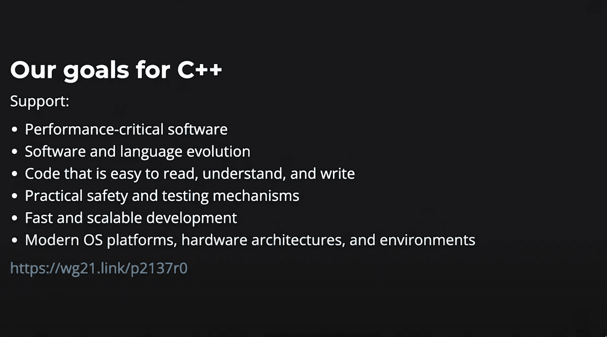
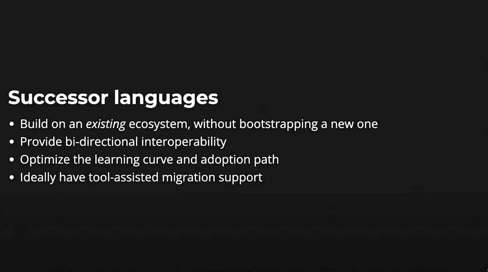
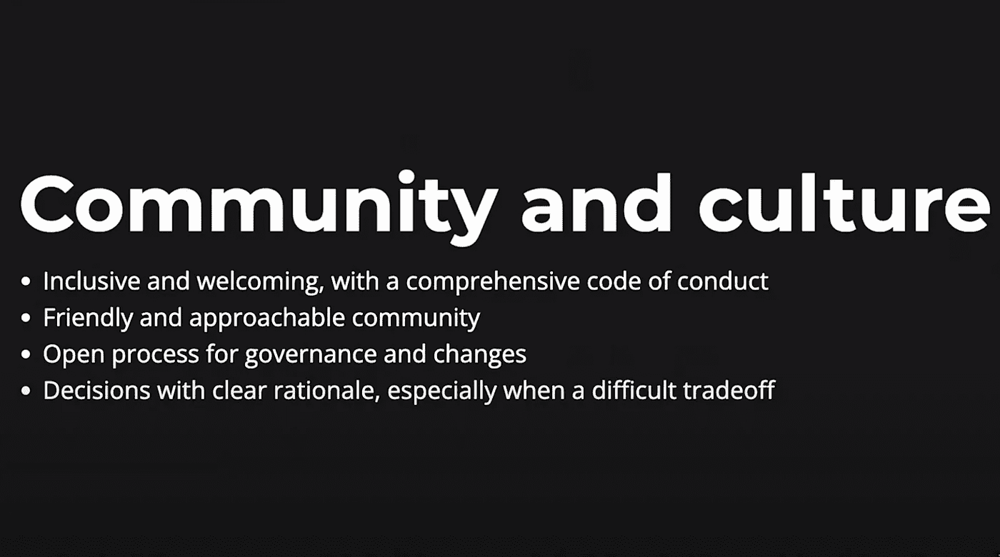

# 谷歌的碳语言可能会取代 C++

> 原文：<https://levelup.gitconnected.com/googles-carbon-might-replace-c-7b634b465f51>

## 碳语言:C++的实验性继承者

首先，这是现在真正发生的事情。



语言更新、改进、超集和扩展。北管道局。

谷歌开发者发布了一种全新的“实验性”开源语言，名为 Carbon。

Carbon 语言可以作为 C++的后继语言，它为开发人员提供了一个简单的起点来开发一种新的语言，解决当代的开发概念，如内存安全和泛型。

这将类似于微软如何构建 Typescript 来更新 JavaScript 和 Kotlin 来加强 Java 中的弱点。

这种语言最近由谷歌开发者 Chandler Carruth 在多伦多的 [CPP North](https://cppnorth.ca/) 会议上发布。

我将从会议中总结几点，并添加一些来自其他资源、评论、推文、文档等的味道。

你也可以阅读 [Carbon 编程语言教程](https://betterprogramming.pub/carbon-programming-language-tutorial-6d67b4cc16ae)。

如果你喜欢看视频和阅读我用的材料，这里有一些链接:

*   在 YouTube 上观看 1.5 小时长的[视频](https://www.youtube.com/watch?v=omrY53kbVoA&ab_channel=CppNorth)，
*   阅读 GitHub 上的[改进 C++的困难](https://github.com/carbon-language/carbon-lang/blob/trunk/docs/project/difficulties_improving_cpp.md)
*   阅读 GitHub 上的[Carbon Language:c++的实验性继承者](https://github.com/carbon-language/carbon-lang#carbon-language--an-experimental-successor-to-c)
*   阅读 GitHub 上的[项目常见问题解答](https://github.com/carbon-language/carbon-lang/blob/trunk/docs/project/faq.md#project-faq)

# C++怎么了？

用 [Carruth](https://github.com/carbon-language/carbon-lang/blob/trunk/docs/project/difficulties_improving_cpp.md) 的话说，“ *C++是我们的目标优先考虑的性能关键软件的主要编程语言。为这些用例及开发人员提供现代且优秀的开发人员体验的最直接方式是改进 C++。*

*改进 C++以交付开发人员期望从今天的编程语言中获得的那种体验是困难的。*

## C++的六个目标

正如下面这张来自 CPP North 的图片所总结的那样，C++的目标很明确，但是执行却有所欠缺。



卡鲁斯对 C++目标的看法

## 为什么增量进化 C++很难？

卡鲁斯提到的几点可以归纳为两个方面:语言和官僚作风

## **语言**

*   **技术债务**。让 C++变得伟大的必要选择正在成为一种负担。C++积累了几十年的技术债。
*   **向后兼容的优先级**。越来越多的功能被添加，而不是删除或替换。虽然向后兼容性很重要，但这是有代价的。它增加并阻止修复技术债务。

## **治理**

*   **流程**。改进 C++的过程经历了一个官僚委员会的方法，该方法将标准化置于设计之上。
*   **受限访问。**进入委员会和标准受限且昂贵。
*   **少数人的利益**。虽然一些国家和公司有代表，但许多其他利益攸关方没有。
*   **漫长的决策过程。决策可能需要数年时间，也可能无法得出任何明确的结论。**

你可以在 GitHub 页面上阅读更多关于改进 C++的困难。

话虽如此，其他的*垃圾收集语言*也曾被考虑过，但都没有达到特定用户和组织所要求的性能。

## 后继语言

Carbon 背后的团队花了一些时间考虑其他语言如何解决这些问题。

Rust 似乎是一个很好的解决方案，建议也很明确。

> 如果 Rust 今天对你有用，你应该使用它。
> 
> 但是让一个 C++生态系统生锈是很困难的。

Carbon 的目标是大型 C++代码库，这些代码库很难转换成 Rust。

此外，Carruth 花了一些关于其他语言的单词来观察每一种语言是如何为一个目的而设计的，并引入了后继语言的概念。



卡鲁斯对后继语言的定义

# Carbon 编程语言:C++的实验性继承者

在这种背景下，考虑一种新的目的驱动语言似乎是合理的，这种语言建立在 C++的六个目标之上，并增加了一个目标:

*   性能关键型软件
*   软件和语言进化
*   易于阅读、理解和编写的代码
*   实用的安全和测试机制
*   快速和可扩展的开发
*   现代操作系统平台、硬件架构和环境
*   **与现有 C++代码的互操作性和移植**

# 碳的承诺是什么？

从语言和治理中遇到的困难开始，Carbon 对这两个领域采用了不同的方法。

## 语言

Carbon 希望从零开始，包括:

*   现代仿制药系统，
*   模块化代码组织，
*   简单的语法。

Carbon 希望成为“一种后继语言[…]，而不是一种逐渐进化 C++”的尝试， [carbon-lang](https://github.com/carbon-language/carbon-lang/blob/trunk/docs/project/difficulties_improving_cpp.md) 。

出于这个原因，它放弃了透明的向后兼容性，同时保持了与 C++的互操作性和可移植性。

## 管理

Carbon 希望通过以下方式提高包容性:

*   基于开源原则、流程和工具。[投稿](https://github.com/carbon-language/carbon-lang/blob/trunk/CONTRIBUTING.md#contributing)更容易，更透明。
*   拥有清晰的[治理结构](https://github.com/carbon-language/carbon-lang/blob/trunk/docs/project/evolution.md#governance-structure)，能够在需要时快速做出决策。
*   通过提供丰富开发人员体验的工具(编译器、标准库、ide 工具)和基于工具的升级来扩展生态系统
*   用内置的包管理器填补 C++生态系统中的空白。

# 碳:语言

正如在[目标](https://github.com/carbon-language/carbon-lang/blob/trunk/docs/project/goals.md#overview)中所述，“Carbon 是一个探索 C++编程语言可能的、遥远的未来的实验，它是围绕一组特定的目标、优先级和用例而设计的”。

## 句法

在[呈现的特性](https://youtu.be/omrY53kbVoA?t=728)中，值得一提的是:

*   **介绍者关键字:** fn 为函数，var 为变量声明
*   **功能输入参数为只读值**
*   **指针**提供间接访问和变异
*   命名类型的表达式
*   根目录下的命名空间总是本地的
*   默认情况下是公共成员。推理似乎是因为你将主要在你的 API 中读取公共函数，公开它们是有意义的。
*   类型检查泛型

这个列表并不完整，但它给出了这种语言的一些特征的概述。

下面你可以从 GitHub 上的[示例代码中看到一个片段，还有我的一些简单评论。](https://github.com/carbon-language/carbon-lang/blob/trunk/docs/images/snippets.md#carbon)

```
// Carbon:package Geometry api; // local namespace
import Math; // library importclass Circle {
  var r: f32;
}fn PrintTotalArea(circles: Slice(Circle)) {
  var area: f32 = 0;
  for (c: Circle in circles) {
    area += Math.Pi * c.r * c.r;
  }
  Print("Total area: {0}", area);
}
```

## Carbon 编程语言浏览器

想试试吗？

Carbon Explorer 是“一个原型解释器演示，既可以运行孤立的例子，又可以给出 Carbon 的具体语义模型和抽象机器的详细分析”。[碳探索者](https://github.com/carbon-language/carbon-lang/blob/trunk/explorer)。

# 碳:治理

Carruth 在谈到文化和社区时详细阐述了治理。



围绕碳的社区和文化

此外，尽管谷歌首先资助了碳排放，但目标是在年底前将任何一家公司的贡献减少到 50%以下。

最终，他们希望将项目的所有权转移到一个非营利软件基金会，由志愿者开发。

# 开发商的情绪

这是开发者的感受、帖子、推文、评论等的集合。

*   开发商似乎大多对碳持乐观态度
*   大多数人喜欢与 C++的互操作性
*   有些人怀疑 Carbon *会取代* C++。一些人认为，碳会在某个领域表现出色，但不会被广泛采用
*   不可变声明的优势在于`let`，这可能会让来自 JavaScript 的开发人员感到困惑。然而，对于来自 Swift 的开发人员来说，这将是平稳的。
*   默认的公共成员似乎是有争议的。[推理](https://youtu.be/omrY53kbVoA?t=1041)似乎是因为你将主要在你的 API 中读取公共函数，公开它们是有意义的。
*   Rust 的支持者被告知:“如果 Rust 今天对你有用，你应该使用它。但让一个 C++生态系统生锈是很难的。”

# 结论

这篇文章想成为碳语言的概述。

现在下判断还为时过早，我也没有资格这么做。然而，看到一个新项目从零开始并迈出第一步是非常令人兴奋的。

如果你感兴趣，你可以做些贡献，成为几年后可能会变得非常大的东西的一部分。

你可以通过多种方式在 GitHub 上做出贡献。

如果你对实践教程感兴趣，可以看看 [Carbon 编程语言教程](https://betterprogramming.pub/carbon-programming-language-tutorial-6d67b4cc16ae)。

如果你觉得我忽略了一些相关的东西，请随时让我知道，我会添加它！

[](https://medium.com/@lorenzozar/membership) [## 通过我的推荐链接加入 Medium-Lorenzo Zarantonello

### 如果这个有价值，直接支持我！我的文章大多是免费的。考虑成为会员以示支持…

medium.com](https://medium.com/@lorenzozar/membership) 

# 分级编码

感谢您成为我们社区的一员！在你离开之前:

*   👏为故事鼓掌，跟着作者走👉
*   📰查看[级编码出版物](https://levelup.gitconnected.com/?utm_source=pub&utm_medium=post)中的更多内容
*   🔔关注我们:[推特](https://twitter.com/gitconnected) | [LinkedIn](https://www.linkedin.com/company/gitconnected) | [时事通讯](https://newsletter.levelup.dev)

🚀👉 [**软件工程师的顶级工作**](https://jobs.levelup.dev/jobs?utm_source=pub&utm_medium=post)