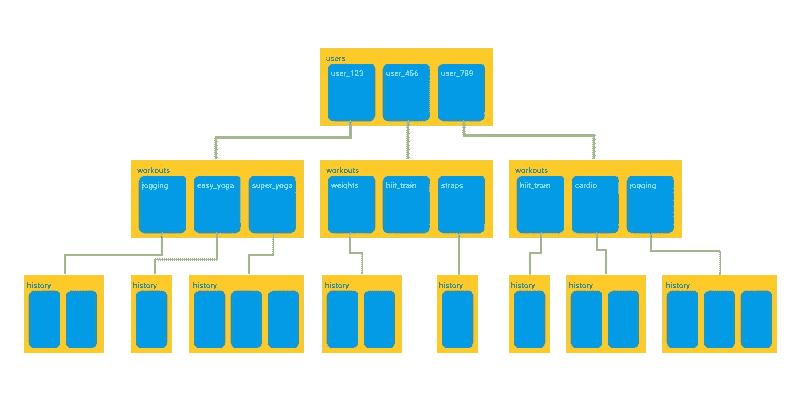
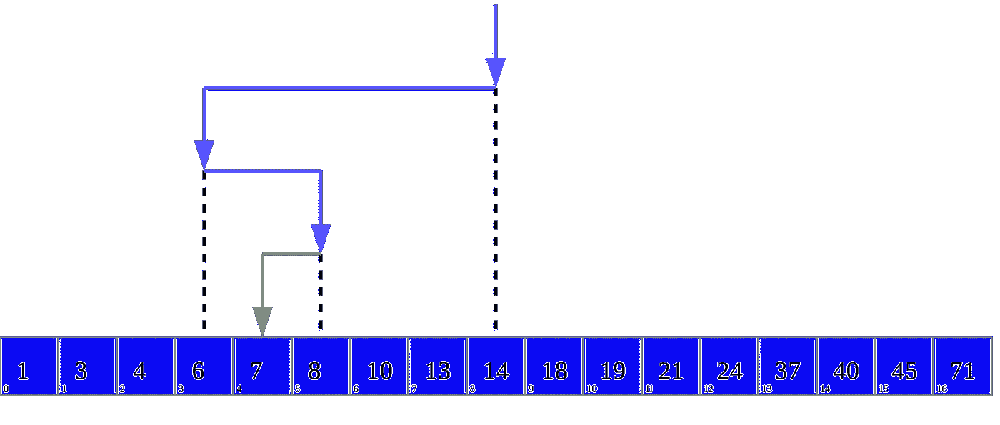
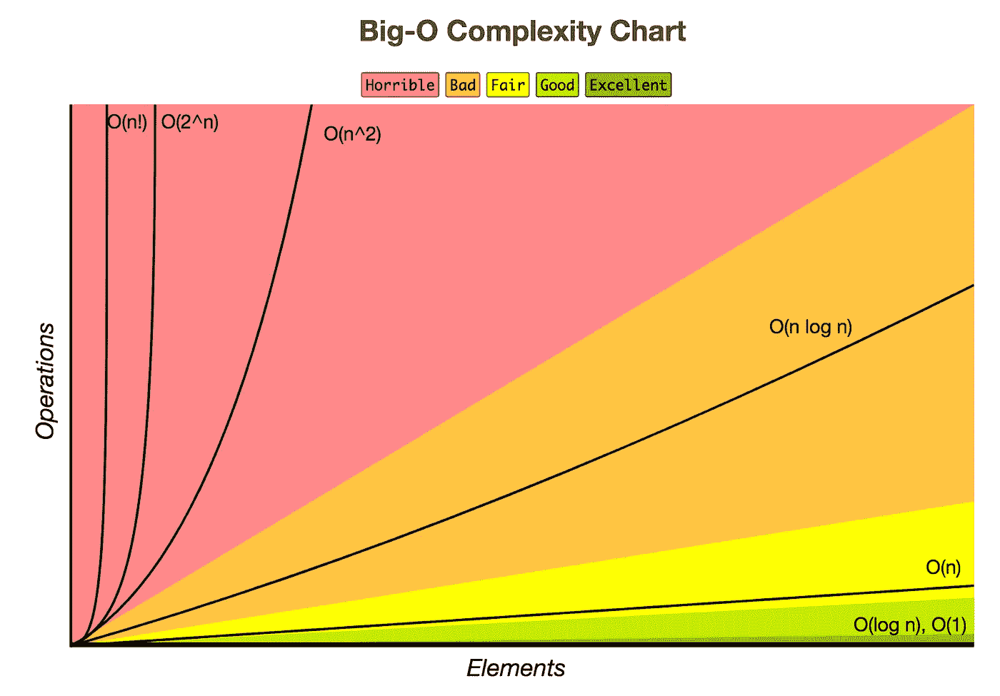

# 谷歌的云 Firestore 数据库:利用二分搜索法算法

> 原文：<https://levelup.gitconnected.com/googles-cloud-firestore-database-leveraging-the-binary-search-algorithm-13528776e90f>

照片由[法比奥](https://unsplash.com/@fabioha?utm_source=medium&utm_medium=referral)在 [Unsplash](https://unsplash.com?utm_source=medium&utm_medium=referral) 上拍摄

上周在工作中，我在调查谷歌的 Firebase 产品，特别是云 Firestore 数据库。因此，我决定深入研究文档页面。我学到了很多关于将数据库集成到应用程序、其数据模型、结构化数据的最佳实践以及如何使用可用的 SDK 创建查询的知识。当我在阅读关于如何在内部组织数据以优化查询的描述时，我无法停止思考谷歌这项令人敬畏的技术背后的基本概念。

我认为谷歌的云 Firestore 是一个很好的例子，它利用计算机科学中的一个基本概念来创建一个强大的软件产品。通常，任何问题最优雅的解决方案都是干净简单的。这成为这篇博文的灵感来源。

(*注:我没有以任何方式得到谷歌的赞助或支付:)*。

## 什么是云 Firestore？

Cloud Firestore 是一个高度可扩展的 NoSQL 文档数据库。它是谷歌 Firestore 移动和网络应用开发框架的一部分。此外，它允许我们在应用程序之间近乎实时地检索和共享数据。由于对原始 Firebase 实时数据库进行了多项增强，因此建议将其用于新的应用程序。

## 云 Firestore 中的数据是如何存储的？

首先，我们来谈谈 Cloud Firestore 在内部存储和组织我们的数据的方式。数据存储为文档并组织成集合，我们可以创建包含文档的集合和子集合的层次结构。作为一个 NoSQL 数据库，每个文档都是一个 JSON 对象(或者类似 JSON，因为它们支持其他数据类型的值)。集合包含一组逻辑上相关的文档。反过来，每个文档可以指向一个集合，创建一个集合和子集合的树形结构，其中包含我们的文档。下图显示了这种结构的一个示例。

**文档集合和子集合的结构**。(来源:[https://firebase . Google blog . com/2017/10/cloud-firestore-for-RTD b-developers . html](https://firebase.googleblog.com/2017/10/cloud-firestore-for-rtdb-developers.html))

作为一个要求，树的根将总是一个集合，即使它只包含一个文档。因此，访问文档的一般模式是*集合/文档/集合/文档*等等。每个文档都包含表示为键-值对的数据，称为字段和值。文档的大小限制为 1MB，文档中的字段数量限制为大约 20K 个字段。

## 为什么云 Firestore 这么快？

默认情况下，Cloud Firestore 为数据库中每个文档包含的每个字段保留两个排序索引列表。根据每个字段的值，一个列表按升序排列，另一个列表按降序排列。回想一下，在数据库系统中，索引指向记录的位置。这些列表是由 Cloud Firestore 自动创建的。

数据的这种排列有几个含义。首先，我们可以看到对数据库的写操作比读操作要慢。但是，正如我们所知，NoSQL 数据库一般更喜欢读而不是写。(在决定是否使用 NoSQL 数据库时，要考虑的一个重要因素是，在我们的应用程序中，读取是否比写入更频繁。)其次，更重要的是，当执行读取时，它允许 Cloud Firestore 使用二分搜索法查找记录的索引。这使得云 Firestore 查询在检索一个或一组记录时非常高效。

## 二分搜索法算法的力量

在云火石，*查询性能与你的结果集的大小成正比，而不是你的数据集。*这种是云 Firestore 高度可扩展的一部分。这种说法背后的原因是二分搜索法算法。现在让我们回忆一下二分搜索法是如何工作的。该算法的先决条件是我们要搜索的列表或集合是已排序的。回想一下，Cloud Firestore 保存了按文档中每个字段的值排序的索引列表，因此满足了这个先决条件。

我们的二分搜索法算法的输入是目标值(即我们希望从数据库中检索的记录)和包含该值的排序集合(我们还传递集合本身的起始和结束索引)。现在，让我们假设我们的集合按非降序排序。该算法从查看集合中的中间元素开始。如果该元素与我们的目标值匹配，我们就完成了，元素的位置被返回。否则，我们将目标值与中间元素的值进行比较。如果我们的目标值小于中间元素的值，我们将丢弃集合的右侧并查看左侧，再次从该侧的(新)中间元素开始(如果目标值更大，我们将丢弃左侧并查看右侧)。我们以这种方式递归地搜索目标值。这有效地将我们的搜索空间每次减半，直到我们找到匹配或者搜索失败，这意味着记录不在集合中。下图显示了这种情况。

**二分搜索法算法的可视化，其中 7 是目标值**。(By AlwaysAngry — Own work，CC BY-SA 4.0，【https://commons.wikimedia.org/w/index.php?curid=53687795】T2)

因为每次迭代后搜索空间减半，所以二分搜索法算法在一组 *N* 元素中的运行时复杂度为 *O(log N)* 。这意味着在一百万条记录的集合中查找一条记录只需要 20 次查找操作。如果集合的大小增加一倍，达到 200 万条记录，我们只需要一次额外的查找就可以找到我们的记录。换句话说，我们说我们的运行时复杂度以对数方式增加，这是算法中非常好的特性。这就是二分搜索法算法的力量。下图显示了常见算法复杂性的比较。

**常见算法复杂度:随着输入大小(元素个数)的增加，运算次数(运行时间)也随之增加。O(log n)的增长率仍然是“好的”**(来源:[https://I . pinimg . com/originals/d0/8d/d0/d 08 DD 0 f 4366 b5 b5 b5 F3 D1 AE bcc 09 def 0 f 8 . png](https://i.pinimg.com/originals/d0/8d/d0/d08dd0f4366b5b5f3d1aebcc09def0f8.png))

## 最后的想法

谷歌的云 Firestore 数据库可以实时检索数据。除了其他增强功能之外，这还可以通过保存索引列表来实现，这些索引按照数据文档中包含的每个字段的值进行排序。这反过来又使得利用二分搜索法进行非常高效的查询成为可能。和往常一样，这种方法也有一些缺点。例如，我们不能执行涉及*不等于(！idspnonenote)的查询。=)* 子句。在这种情况下，我们必须将查询拆分为一个小于(< ) 的*查询和一个大于(> )* 的*查询。*

在决定什么是满足我们应用需求的最佳解决方案时，总是要做出权衡。我认为在做决定之前了解和评估我们的选择是很重要的。在这种情况下，我们获得了极快的读取速度，代价是相对较慢的写入速度，并且在定义查询时可能会增加一些复杂性。

 [## 编写面试问题

### 一个完整的平台，在这里我会教你找到下一份工作所需的一切，以及…

技术开发](https://skilled.dev)