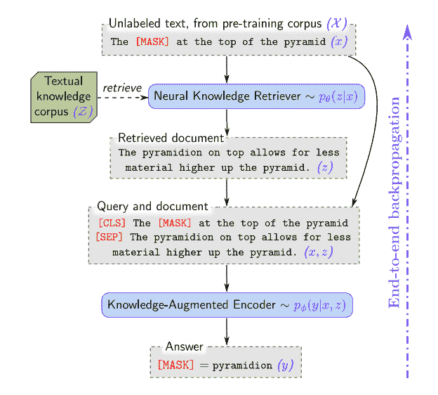

# 谷歌的领域——一个基于知识的扩充语言模型

> 原文：<https://levelup.gitconnected.com/googles-realm-a-knowledge-base-augmented-language-model-bc1a9c9b3d09>

谷歌公布了一种预训练语言模型的新方法，该语言模型使用知识检索机制进行增强，从外部维基百科语料库中查找现有知识。这使得经过训练的语言模型生成的输出更加基于事实和庞大。它使用掩蔽语言建模转换器进行训练，并学习从数百万维基文档中检索和参与。

本文分为五个部分:

*   [知识库介绍](#7e95)
*   [领域介绍](#e885)
*   [培训流程](#3dc2)
*   [详细知识检索](#7008)
*   [未来推测](#93c9)

最近 OpenAI 发布了 GPT-3，它使用 1750 亿个参数进行训练，产生了一些非常惊人的结果，你可以在这里阅读更多。此前，谷歌自己也发布了基于 transformer 的模型，如 Bert 和 [T5](https://ai.googleblog.com/2020/02/exploring-transfer-learning-with-t5.html) ，这些模型已被证明对各种任务都很有用。

我一直在玩[https://learnfromanyone.com/](https://learnfromanyone.com/)，这是一个正在开发和使用 GPT3 api 的应用程序。Mckay Wrigley 发布了一些用户与该应用程序的对话。例如，我从丹·卡林那里学到了武士的历史。(或者 GPT3 演员丹·卡林)这很有趣，因为我对日本历史了解不多，这是一种有趣而独特的学习方式，因为 GPT-3 才成为可能！但正如布雷迪在推特上评论的一个合理的担忧，GPT-3 所说的准确吗？。目前没有办法通过外部来源来核实 GPT-3 所说的是否准确。因此，任何对该主题有粗略了解的人都可以指出不准确之处，这是当前基于 GPT-3 的系统的一个缺陷。

在变形金刚和注意力机制被应用于深度学习/神经网络架构并使用反向传播方法进行训练之后，语言模型在过去几年里已经走过了漫长的道路。这些模型不仅可以理解人类语言的句法和语法，产生与人类书写的文章和对话没有区别的新闻文章和对话，而且当以简单的英语语言给出提示时，它们还可以理解大量的上下文，并展示元学习。它已经掌握了英语和其他几种语言，以及语言的一些特征，如结构、句法等。但是，只有当它能够理解与环境/世界相关的语言，并且能够生成对世界有意义的输出时，它才在实际应用中有用。因为仅仅理解语言的结构意味着它总是能输出古怪的胡言乱语和事实。但扩展这种语言模型表明，它也可以输出几乎任何主题的几个事实，因为它已经在从互联网和数百万本书籍中收集的海量数据集上进行训练。

**作为知识库的语言模型**

知识库对任何组织有效运作都很重要。当前的知识库是以关系方式设计的手工工程数据库，具有有限的基于图形的连接，允许工程师查询知识。但是设计这个数据库，写查询等等。需要大量的人工监督，花费大量的时间和资源，并且被设计为在一个领域内为特定的用例工作。例如，用于医院、植物基因组仓库或公司数据(工资单、法律等)的 EHR 系统。)所有这些数据都存储在不同的数据仓库中，通常很难在一个领域内共享知识，更不用说与来自其他领域的人共享了。

近年来，当前的 KBs 使用复杂的 NLP 操作从任何现有的文档中提取知识，例如*实体提取、共指解决方案、实体链接&关系提取。*这又是一项相当耗费资源的工作，需要高薪工程师的努力，目前只有少数公司使用。

如果语言模型或人工智能能够以简单的方式理解这些数据，只给它提供原始的、未经处理的信息，那不是很好吗？

这就是 GPT-3 用他们在一般互联网数据上训练的巨大模型所展示的，许多人将其视为智能系统的原始形式，尽管有些人持怀疑态度。尽管这种模型有一些局限性:

*   复杂程度:它们是巨大的模型，很难训练。需要大量的计算能力(金钱)、大量的数据集以及大量的时间和工程资源。尽管你只需要训练它一次，它就能很好地完成不同的任务。OpenAI 通过让 API 访问他们的大模型证明了这一点，许多开发人员正在用它来执行许多不同的任务。但是它被训练的数据并没有更新，所以这就像是在和一个只知道 2019 年(它拥有数据的最新时间点)之前的世界的人说话。正如你所知，自 2019 年以来发生了很多事情，随着时间的推移，一个适当的智能系统必须拥有关于世界的更新知识，并且需要经常更新。
*   *小语境:*你能提供的输入“提示”模型的语境真的很小，所以它的表现就像一个有短期记忆的人，如果你在和它对话，10 分钟前对它说的话都记不住。所以不要指望它能很快完成一部《权力的游戏》小说。
*   *常识推理*:虽然它可以进行某种推理，但它仍然非常随机和不一致，并没有真正表明它正在试图理解一些提示背后的逻辑。
*   *知识*:它可以吐槽关于任何话题的知识，没错，但是这些知识是以非常抽象的形式存储的(在模型的学习权重中)而且知识也是以压缩的形式存储的(3000 亿 params 还是不够！)来编码关于这个世界的每一点知识。此外，也没有办法促使网络了解它输出的知识存储在哪里以及如何存储，因此它不能用作任何需要基于事实的真实知识的应用程序的可靠模型。此外，可靠的知识库对于推理任务来说也是必要的，尤其是解决数学或物理问题等较难问题所需的推理。

谷歌的新模式领域似乎朝着正确的方向迈出了一步，解决了我刚才提到的一些问题。

**检索-增强语言表示模型预训练**

人类存储信息的能力也是有限的，大多数知识都存储在外部，我们只需使用正确的工具(谷歌！)通过简单的谷歌搜索就能获得这些信息。那么为什么不教语言模型做同样的事情呢！这就是谷歌创建了一个新的*知识检索*机制，与 transformer 模型一起工作。当试图生成输出时，该模型不仅利用其内部权重(像迄今为止的大多数变形金刚一样)，还利用外部文档库(维基百科语料库)来支持其预测，这使得输出比仅查看其自身的编码权重更加准确和可靠。

因此，在预训练阶段，这个模型并没有对内部知识进行编码，而是学习从外部存储库中搜索正确的文档。这种将知识检索外部化的过程有许多优点:

*   它不需要几十亿个参数来存储这个世界知识。他们已经证明，只有 3 亿个参数的模型的性能与早期 T5 语言模型中使用的 110 亿个参数一样好。
*   外部知识库异步工作，独立于语言模型。现在他们正在使用维基百科，但是将来他们可以使用他们的搜索引擎。所以 REALM 可以像我们一样用谷歌搜索来提供一个问题的答案。这也解决了保持模型最新的问题，而不需要一次又一次地重新训练大模型，节省了金钱和时间。
*   调试它从哪里得到答案要容易得多，因为模型现在可以提供它所引用的文档的索引，以支持它所提出的论点。这对于需要事实检查和更可靠的知识访问的应用程序来说是非常好的。

*结果*

REALM 的性能优于最大的 T5–11B 型号，但体积却小了 30 倍。他们在开放领域 QA 上测试模型，这是最难的基于知识的数据集，并且没有支持文档来支持所提出的问题，这是测试知识检索器能力的完美测试平台。它们在发烧事实验证数据集、危险琐事问题数据集和其他几个知识测试数据集上也表现良好。*(这只是发表在* [*论文*](https://arxiv.org/pdf/2005.11401.pdf) *)*

*模型架构*

*   ***神经知识检索器(KR)*** :这个模型也是一个神经网络，它和其他任何深度学习模型一样，以端到端的差分方式与变换器一起训练。该模型的工作是处理数百万个文档(维基百科)并选择将支持给定输入句子的最佳文档，并且从知识库中检索的这个“真实”事实句子被附加到输入句子。
*   **但是输入的上下文更大，因为它不仅要注意输入的句子，还要注意从维基文档中提取的句子。**

领域模型的预培训流程

*训练过程:*这是解释他们如何扩充语言模型的最简单方式。你需要一些关于如何训练[变形金刚](http://jalammar.github.io/illustrated-gpt2/)的知识来理解这一点。

*   第一步是从原始数据集(任何互联网语料库)中获取标记化的句子。然后随机屏蔽一个单词(或一段单词),并将这个标记化的句子(以嵌入向量的形式)和位置嵌入一起提供给领域模型。
*   REALM model 的任务是预测被屏蔽的标记应该是什么单词，它通过为词汇集中的所有单词分配概率来完成这一任务，最高概率是它选择的单词。更简单地说，模型被训练成*填空。*
*   基于输出和它与真实令牌的接近程度(掩蔽之前),计算损耗。该损失通过模型反向传播，并用于训练权重/参数，训练的目标是最小化该损失。
*   在经典的 transformer 模型中，我们只有一个 transformer，在参数中隐藏了很多层的语言和知识表示。这些层使用自我关注层(关注句子中的所有单词)一起工作，来预测模型认为应该预测的单词。事实上，如果您查看具有最高概率的前 10 个单词，基于输入句子，它们都有一定的意义，但是最高概率总是给定输入句子所选择的最佳单词。但是由于有限的参数和大量无限的知识可供参与和思考，经典变形金刚将无法给出你想要的确切单词，特别是对于特定的世界事实。
*   在 REALM 中，首先将输入的嵌入令牌交给 KR。KR 的工作是从数百万个文档中搜索与给定输入标记最匹配的文档。该文档首先使用神经网络权重进行预先计算，并被分配一个向量，该向量给出多维(128 维)空间中的位置和方向。所以这是一个很大的搜索索引，就像谷歌算法现在在他们的网站上搜索术语时使用的一样。
*   然后使用一种叫做*最大内积搜索(MIPS)的方法。* MIPS 计算*查询*向量和每个*目标*文档向量之间的内积。返回最大输出的向量具有选择的文档，该文档具有输入句子的最佳支持句子。
*   文档向量是预先计算的(这意味着大多数相关的文档被聚集在一起)，因此查询向量在向量空间中找到一个邻域，它最匹配它要寻找的内容。想象一下，你正在杂货店购物，寻找杏仁牛奶，你会去牛奶区，因为他们把所有出售的产品排列成一组。但是如果产品被随意地放在商店的任何地方，你将很难找到你想要的任何东西。
*   因此，在训练期间，KR 必须重新计算目标向量的这个*排列*,以便下一个查询向量更容易找到它想要的。它通过从变压器输出中获取损耗值并更新梯度来实现。
*   一旦我们获得了文档句子，我们就将文档文本和输入句子附加在一起，并将其提供给转换器。transformer 中的层在文本和支持文档文本之间执行丰富的*交叉注意力*，如果注意力权重学习正确，它将学习将文档文本与输入文本进行映射，并更准确地预测缺失的单词。但是，如果检索到的文档文本不能帮助它正确地预测单词，那么丢失信号将通过检索器传递，以便它学习更好地完成工作。
*   如果您有正确的配置和大小，并对此进行一段时间的训练，您将拥有一个模型，它不仅可以学习检索正确的文档，还可以正确预测输出序列。另外，您还可以从语料库中获得文档索引，用于调试目的。

这里的主要优点是转换器不必硬编码大量的一般事实，这项任务是卸载的。正如您稍后将看到的那样，这导致了一个具有更少参数的更轻的 Transformer 模型，但在知识密集型任务(如问答)上仍然表现良好。

在上面的例子中，原始输入句子将“pounds”作为屏蔽词。检索器开始检索与输入句子最匹配的 top-k (k 可以是基于转换器大小的任何数字)文档。因此，它可能会找到[白金汉宫](https://en.wikipedia.org/wiki/Buckingham_Palace)和[英国](https://en.wikipedia.org/wiki/England)的维基百科页面，然后从页面中给出支持输入句子的准确句子。这个提取的句子随后被用于预测屏蔽的标记，并且还输出它所使用的文档索引。你可以想象它可以让模型产生非常具体的世界事实和知识，而不需要它在自身内部编码如此多的世界知识。

*知识检索者培训*

本节将更详细地介绍 KR 内部的情况。使用 [*密集段落检索*](https://arxiv.org/abs/2004.04906) 技术对每个文档进行编码，该技术对每个文档中的文本进行双向编码。您可以将此视为某种形式的压缩编码，它为每个文档提供了一些重要的特征，您可以在超维空间中将这些特征与输入查询向量进行匹配。然后，上述 MIPS 技术使用神经网络权重进行最近邻搜索，以与目标文档匹配。

主要挑战是有数百万个文档要搜索，这带来了两个问题:首先，编码数百万个文档并将它们保存在存储器中需要大容量的存储器，然后，即使有最快的计算速度，为所有这些权重训练神经权重也要花费很长时间。谷歌通过以下方式解决了这个问题

*   一次仅用少量编码文档训练和匹配输入向量。
*   异步地重新计算文档编码(search index builder ),因此转换器将继续用知识库的快照进行训练，而知识库在后台更新自己。因为，重新计算数百万个文档需要时间。

因此在 KR 中有两个任务并行运行，一个是主要的*训练器*任务，它通过监听来自变压器的训练信号来更新每一步的嵌入参数。和基于嵌入参数索引文档的*索引生成器*。每一步的训练器都使用索引的快照，索引根据最新的模型参数花费自己的时间来重新索引，然后当它完成时，重新索引更新快照。

他们已经表明，即使索引构建发生在 500 步之后，transformer 的训练也不会影响性能。这意味着对于 500 步来说，训练者和转换者使用的是“陈旧的”知识库，但是它仍然足以让转换者给出准确的预测。

异步重新索引的另一个优点是，当模型最终投入生产时，知识语料库可以通过最新的事件和重新计算的文档向量保持最新，而无需更改模型或重新训练它。

**未来推测**

我最喜欢做的事情就是推测未来！有许多问题似乎无法解决，其中之一是如何应对网上传播的错误信息。许多公司都在努力解决这个问题，并承受着解决这个问题的压力。知识增强的智能人工智能系统将是解决这一错误信息问题的方法之一。如果我们有一个分散的不同知识库池，有自己的基于信任的系统和协议社区，并由全球每个人维护，会怎么样？然后，像 REALM 这样的人工智能系统可以接入这些不同的知识库，提取知识，并为您提出的任何问题提供答案。对使用人工智能系统的信任将取决于它所训练的知识库的可信度。

另一个主要障碍是当前的人工智能系统缺乏推理能力。加里·马库斯最近在他对 GPT-3 系统的*严厉的*批评中谈到了这一点。将记忆事实卸载到外部库是否有助于大型语言模型有效地使用参数来执行更好的推理？这还有待观察，我确信谷歌和其他公司一定在训练他们自己的 GPT-3 这样的大系统。如果有什么不同的话，拥有一个完美的知识库可能会让它更清楚地思考科学、哲学、治理等领域的复杂问题。

艾为*神谕*。关于使用人工智能，我最喜欢的想法是创建完美的预测系统，它可以预测复杂的事件，并成为真理和命运的先知。它能从提供给它的数据中学习并预测未来的事件吗？大型对冲基金会用它来创造一个最有效的、永远上涨的股市吗？它是否有助于更准确地预测自然灾害？它能预测个人的未来吗？这肯定是幻想的东西，但是推测起来很有趣。

与语言模型一样，我看到了三条不同的道路:

*   *封闭和不透明:*一种保持缩放模型(不使用外部知识模块)的途径，并且可能模型学会丢弃无关的、不需要的事实，并且仍然设法从编码的抽象权重中推断知识。这会是一个更“真实”的事实机器吗，因为它是从它吸收的世界知识中推断知识，而不是依赖于由人类和他们自己的偏见管理的知识库？OpenAI 已经向批评者证明了缩放模型确实会产生一些令人兴奋的事情，也许从十亿到万亿的参数缩放和增加数据集大小是你唯一需要的。[请阅读 Gwern 的这篇文章，他深入阐述了扩展的想法](https://www.gwern.net/newsletter/2020/05#gpt-3)，以及主要的人工智能公司是如何忽视这一点的。
*   *开放和分散*:这与让多方创建和维护他们自己的知识库的想法相吻合，一个分级系统出现了，在那里你得到你所支付的。这也可能对公司和特定领域有用，其中某些方面创建自己的知识库，并将其出售给拥有自己的人工智能系统的公司，例如医院中的 EHR 系统。
*   *“免费”和垄断:*这个世界只有一个“真理”，而这个真理就是谷歌提供给你的任何知识库。你只需要相信这些知识，因为谷歌会对一个事实出错吗？维基百科会不会搞错一个事实？你真的相信和信赖这种一个系统，一个规则的方法吗？我不是说谷歌希望这样，但这是一种可能性。

我开玩笑的！我没有！

让我们离开猜测的世界，跳回现实。下一步:还有很多工作要做。谷歌计划在更多推理密集型任务上测试这种模型架构。他们还希望探索检索图像和知识图，而不局限于文本领域。

虽然谷歌还没有向公众发布大型号，但他们已经发布了一个较小的版本和代码(感谢开发者！)这样研究人员就可以玩了。我试着运行代码，但是它使用了 Tensorflow 2 estimator 库，我不太熟悉。如果有人设法运行代码，请给我发消息。此外，如果有任何反馈，请给我发消息，因为我对写作很陌生，也喜欢批评。并请告诉我你自己的推测！我喜欢阅读推测！！！

在推特上找到我，地址是@swapp19902，或者发邮件给 swapp19902@gmail.com。让我们连接起来，让这个世界成为一个充满乐趣的地方。