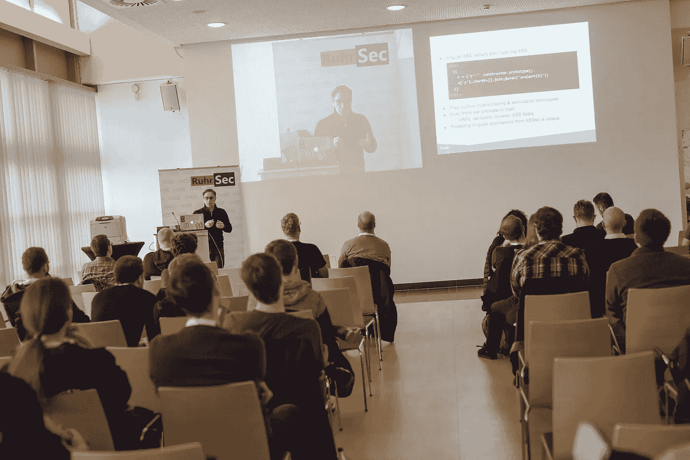

# 谷歌的网络安全研究员 Krzysztof Kotowicz:不安全的编码是默认的

> 原文：<https://levelup.gitconnected.com/googles-web-security-researcher-krzysztof-kotowicz-insecure-coding-is-the-default-413a144ce4cb>

鲁尔塞克的 Krzysztof Kotowicz

## 我们采访了 Krzysztof Kotowicz，他是一名黑客，pentester，也是来自谷歌信息安全工程团队的网络安全研究员

经验丰富的 pentester 和安全专家 Krzysztof Kotowicz 分享了他对寻找编码错误的巨大热情，讲述了他如何入选谷歌安全名人堂，然后加入谷歌最令人兴奋的团队的故事。在这次采访中，他还谈到了 web 安全的现状，关注隐私的 API 的最新发展，并预测了 pentesting 的未来。Krzysztof 将于 2019 年 6 月 6 日至 8 日在 [*JSNation 大会*](https://jsnation.com/) *上发表演讲。*

## ***你好 Krzysztof，欢迎来到 JS Nation 访谈！是什么让你选择了技术，然后是安全和测试？***

我从小就知道我想成为一名程序员。这一切都是从我父亲买了一台雅达利 800 XL，把它连接到我们的电视机上，并教我基础知识开始的。很快我就开始写小游戏、动画，甚至是一个用操纵杆控制的类似画笔的工具。后来，我开始为桌面和 web 编写商业应用程序，并注意到很容易编写不安全的代码——事实上，这是默认的。如果你学习一门新的语言并遵循常规的教程、书籍和文章，你最终会得到不安全的代码。这似乎是错误的，它让我进入安全。我找到了一个当地的 OWASP(开放 Web 应用安全项目)分会，并开始参加会议，在那里做报告，最终找到了一份 pentester 的工作。

## ***你在涉足谷歌之前是做什么的？***

我做过相当多的 PHP web 开发工作，包括自由职业和兼职。当我对网络安全产生兴趣时，我做了各种各样的事情——测试、安全咨询、运行安全培训、研究和编写安全工具。

## ***你做了什么才能入选谷歌安全名人堂，你是如何进入谷歌的？***

只有一个报告给谷歌 VRP 的 bug 让我上了头条，这甚至不是一个特别酷的 bug:)几年后，在一次会议上，谷歌安全团队的 [sirdarckcat@](https://twitter.com/sirdarckcat) 找到了我，我的谷歌之旅就这样开始了。爱德华多现在是我的经理，我们一起处理所有的事情；)

## 你能给那些想去谷歌(或脸书、苹果等)这样的大公司工作的人一些建议吗？)?

我不认为被一家公司雇用有什么秘诀。从基础做起，对自己的工作充满热情。找到你的定位，并努力发展这方面的专长。我建议你不要把注意力放在被 X 或 y 雇佣的目标上，而是专注于做你感到兴奋的事情和让你开心的事情，你名片上的标志真的不那么重要，尤其是在技术领域。

## ***您目前参与了哪些开源项目？***

不幸的是，现在不多了。当我偶然发现一个 bug 时，我会向随机项目发送补丁，但我不会定期提交任何东西。我现在的工作围绕着我们正在浏览器中构建的可信类型 API，作为它的一部分，我维护着 polyfill 库([https://github.com/WICG/trusted-types](https://github.com/WICG/trusted-types))。

## ***早在 2011 年，你就已经是国际 IT 和安全会议的公开发言人。你最后一次谈的是什么？***

这些年来，我做了各种各样的网络安全讲座，大多是关于攻击性安全技术的。我最自豪的是描述脚本小工具研究结果的谈话([https://github . com/google/security-research-pocs/tree/master/script-gadgets](https://github.com/google/security-research-pocs/tree/master/script-gadgets))，我们与来自 Google 和 SAP 的朋友一起做的。我的最后一次演讲是关于[可信类型](https://github.com/WICG/trusted-types)以及它如何帮助杀死多姆 XSS，这是一个完整的漏洞类别。

## ***作为一名安全专员和 pentester，是什么让你的工作如此激动人心？***

它会随着时间的推移而改变——例如，攻击性安全研究曾经是“我的事情”，但现在我最感兴趣的是防御方面，尤其是使编写安全代码变得容易的方法。令人不安的是，如果开发人员可用的 API 更好一些，那么许多漏洞都可以避免——我准备尽可能地改变这一点。

## 你是如何帮助谷歌团队实现针对跨站点脚本(XSS)的高安全性的？

谷歌的 XSS 预防工作完全是这样的:我们创建了库和 API，使得引入 XSS 漏洞几乎不可能。与此同时，我们阻止了对标准的、XSS 倾向的编码方式的访问。我们觉得只有这种方法可以大规模使用——给开发人员合适的工具，让它有用，这样你就不会拖他们的后腿，看着奇迹发生。基于这一经验，我们将这些 API 提供给所有的 web 开发人员——检查可信任的类型。

## 你对网络安全职业的未来有什么预测？

对于网络安全来说，这是一个有趣的时代。感觉我们已经解决了大部分长期存在的问题，并提出了解决方案——只是有些解决方案需要比最初预期的多做一些工作。有趣的是，一些工具将由 web 平台本身提供，web 应用程序只需要最小到中等程度的参与。

比如我们可以用[取元数据](https://mikewest.github.io/sec-metadata/)和[跨起源开启器策略](https://github.com/whatwg/html/issues/3740)，[可信类型](https://wicg.github.io/trusted-types/dist/spec/)地址 DOM XSS 修复 CSRF 等一些跨起源漏洞，用[交集观察者 v2](https://w3c.github.io/IntersectionObserver/v2/) 修复点击劫持。与此同时，我们也看到了新的威胁，其中 [XS 泄密](https://github.com/xsleaks/xsleaks)系列攻击似乎至少会困扰我们几年。关注隐私的 API 的最新发展也很有趣，因为其中一些引入了一系列重要的安全权衡。

## ***你上一篇博文的日期是 2016 年，你为什么不再写博了？***

我很少有足够的时间来写一篇冗长的博客，所以我转向了 Twitter，在那里我练习将我的想法提炼为 280 个字符长的片段。这很有挑战性，不精确，也很混乱——但至少它让我能够积极地与网络安全圈里的其他人接触。Twitter 是我所在领域的讨论发生的地方。

## T21 你在空闲时间做什么？

我以前经常跳舞，先是国标舞，然后是蓝调和摇摆舞。如今，我转向了更主流的爱好，最令人兴奋的是棋盘游戏和阅读书籍，尤其是更古老、经典的科幻小说。

## 对于今年即将在阿姆斯特丹举行的 JSNation 大会，你感到兴奋吗？

当然——我对此非常兴奋！实际上，这将是我第一次在非安全主题的会议上发言，所以这对我来说是全新的。我打算展示我们在 Google 中使用的方法，以确定成千上万的前端开发人员几乎不受阻碍地编写无 XSS 的 web 应用程序，并允许相对较小的安全团队只有效地审查他们项目中较小的安全敏感区域。

我将演示可信类型——我们正在开发的浏览器 API 是这种方法的实际扩展——并展示如何在您的代码库和流程中使用它来有效地消除 DOM XSS 风险，这是我们在现代 web 应用程序中观察到的最常见的安全漏洞。

 [## WICG/受信任类型

### 旨在防止现代 web 应用程序中基于 DOM 的跨站脚本的浏览器 API。-WICG/可信类型

github.com](https://github.com/WICG/trusted-types) 

> [参见克日什托夫在 JSNation](https://jsnation.com) 的演讲

*这次采访是在 Soshace.com**的文案玛丽娜·沃龙索娃的协助下准备的。Soshace 是一个面向 web 开发者的招聘平台:* [*招聘*](https://soshace.com/for-clients) *一个开发者或者* [*应聘*](https://soshace.com/for-developers) *一个远程工作。*