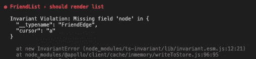

# 使用 React Apollo MockProvider 的陷阱

> 原文：<https://levelup.gitconnected.com/gotchas-using-react-apollo-mockprovider-ec2a22a07e76>


图片由[rawpixel.com](http://rawpixel.com/)

MockProvider 是模仿 Apollo 客户机的请求和结果的推荐方式。示例代码看起来很简单，但是在实际应用中，你可能会遇到一些障碍。尽管在 medium 上已经有一篇关于 MockProvider 使用技巧的很棒的[文章](https://medium.com/@jialhe85/testing-tips-for-apolloclient-with-react-b58373eebb96)，我仍然花了几个小时处理 MockProvier 的意外行为。在这篇文章中，我将在适当地模仿回答之前，先回顾一下我发现的一些问题。

仅供参考以下是我在本文中使用的环境:

```
@apollo/client: 3.2.0
react-native:0.62.2
jest: 24.9.0
react-native-testing-library: 2.1.1
```

# 1.直接从 hooks 包导入 useQuery

当您使用 MockProvider 运行第一个测试时，您可能会得到下面的错误消息:

```
TypeError: (0 , _client.useQuery) is not a function
    > 35 |   const { data } = useQuery(document, {
```


当您从`@apollo/client`导入`useQuery`时会发生这种情况。你需要直接从`@apollo/client/react/hooks/useQuery`进口

```
import { useQuery } from '[@apollo/client](http://twitter.com/apollo/client)/react/hooks/useQuery'
```

# 2.片段应该总是定义 __typename

我在上面分享的文章中已经提到了这一点，但我想再次强调，因为你很容易陷入这个陷阱。如果使用 Fragment，即使 gql 没有定义`__typename`，也应该始终将`__typename`添加到模拟响应中，否则 Apollo 将无法返回值。

这里有一个例子:

```
query currentUserFriends(
   {
  me {
    id
    friends {
      pageInfo {
        ...pageInfoFragment
      }
      ...
    }
  }
}fragment pageInfoFragment on PageInfo {
  endCursor
  hasNextPage
  hasPreviousPage
  startCursor
}
```

那么你的嘲笑应该是:

```
const mocks = [
      {
        request: {... },
        result: {
          data: {
            me: {
              id: '123',
              friends: {
                __typename: 'FriendConnection',
                pageInfo: {
                  __typename: 'PageInfo',
                  endCursor: '1',
                  hasNextPage: false,
                  hasPreviousPage: false,
                  startCursor: '2',
                }, ...
              },
              __typename: 'Me',
            },
          },
        },
      },
    ];
```

此外，您希望确保*模拟可选的字段。*假设一个`Friend`字段类型如下所示:

```
{|
  __typename: "Friend",
  id: string,
  name: string,
  age: ?number
|}
```

那么 mock 应该有`age`即使值可以是 null。

```
{
  __typename: "Friend",
  id: 3,
  name: "Buck",
  age: null
}
```

# 3.确保重新渲染组件以获得模拟结果

除非您显式触发 render 并执行更新，否则 MockProvider 不会给出模拟响应。如果您正在使用`react-native-testing-library`，那么`act`功能将更新组件。我创建了一个包装组件，如下所示:

```
const updateWrapper = async (wrapper, time = 10) => {
  await act(async () => {
    await new Promise(res => setTimeout(res, time));
  });
};
```

测试时，它看起来像这样:

```
const { getByText } = render(component);
await updateWrapper(component);
expect(getByText('[@Buck](http://twitter.com/Buck)'));
```

# 4.注入 InMemoryCache 以显示错误消息

这是模拟查询失败时您将收到的典型消息。

```
No instances found 96 |     const { getByText } = render(component);
   97 |     await updateWrapper(component);
>  98 |     expect(getByText('[@Buck](http://twitter.com/Buck)'));
```


老实说，这个信息对我们一点帮助也没有；我们不知道它为什么会失败。为了获得更精确的错误消息，我们添加 InMemoryCache 作为 MockProvider 的道具。

```
<MockedProvider
  mocks={mocks}
  addTypename
  cache={
    new InMemoryCache({
      possibleTypes,
    })
  }
>
  {component}
</MockedProvider>
```

在内部，Apollo 将尝试在缓存中写入结果。在这个过程中，当 InMemoryCache 发现查询有不变冲突时，它将抛出一个错误。

添加 InMemoryCache 后，您可能会看到下面的错误。

```
Invariant Violation: Missing field 'node' in {
     "__typename": "FriendEdge",
     "cursor": "a"
   }
```



错误消息更容易理解，对吗？现在您只需要添加错误中显示的缺失字段。

# 5.“不再有模拟响应”错误= >检查您的输入

我们经常看到的另一个错误是“不再有嘲笑的回答”。


如果您看到这个错误，通常是因为测试中的变量与实际的组件不匹配。在这种情况下，您应该彻底检查您的变量。

让我给你举一个例子。下面的组件将`{ first:10 }`作为输入。

```
const FriendList = (props: Props) => {
  const { data } = useQuery(document, { variables: { first: 10 }});
```

模拟应该是这样的

```
const mocks = [
  {
    request: { query: currentUserFriends, variables: { first: 10 } },
    result: { ... }
  }
]
```

# 6.如果测试多个查询或突变，请禁用缓存

有时禁用 MockProvider 的缓存是一个好主意，因为在处理多次运行的突变或查询时，这可能会导致意外的结果。

```
<MockedProvider
  mocks={mocks}
  addTypename
  defaultOptions={{
    watchQuery: { fetchPolicy: 'no-cache' },
    query: { fetchPolicy: 'no-cache' },
  }}
  cache={
    new InMemoryCache({
      possibleTypes,
    })
  }
>
  {component}
</MockedProvider>
```

感谢您一路看完底部！请❤ ️if 你认为这篇文章对你有用，它会激励我很多:)